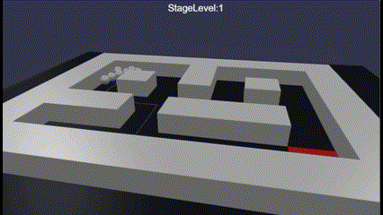
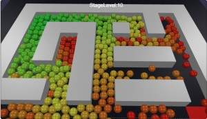
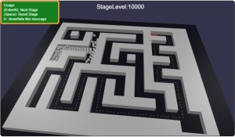
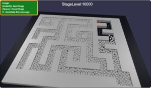
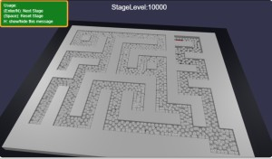

# Babylon.js で物理演算(havok)：密閉空間にボールを発生させてみるテスト

## この記事のスナップショット

16倍速  


ボールに色付き  
https://playground.babylonjs.com/full.html#6L80KK#1

（コードを見たい人はURLから `full.html` を消したURLを指定してください）

[ソース](079/)

- 079   .. 白色ボール  
- 079_2 .. ボールに色付き

ローカルで動かす場合、./js 以下のライブラリは 069/js を利用してください。

## 概要

迷路（壁と通路が同じ）にフタ、上から透明な板をおいた密閉空間を用意。
スタート地点でボールを無限に湧き出させて、ゴール地点まで到達できるかを見てみました。
ボールの移動は反発力と摩擦のみになります。

ゴールに到達しても何も起こらないので、手動で操作してください。

## やったこと

- ステージを作る
  - 迷路作成
  - 透明なフタをおく

- ボールを無限に沸かせる

- ボールの色を変化させてみる


### ステージを作る：迷路作成

迷路データは迷路モジュール（自作）を使って作成します。

```js
mapR = 7 + Math.floor(Math.log(stageLv+1));
mapC = 9 + Math.floor(Math.log(stageLv+1));
maze = new Maze.Maze1(mapR, mapC);
maze.create(21);
maze.resetStartGoal();
```

通路と壁が同じ大きさの迷路なので、壁の配置はフラグのあるところに配置します。

```js
// 壁
for (let iz = 0; iz < nz; ++iz) {
    z = (nz-iz)*wL+adjz;
    for (let ix = 0; ix < nx; ++ix) {
        x = ix*wL+adjx;
        if (maze.data_[iz][ix]) { // 壁
            let mesh = BABYLON.MeshBuilder.CreateBox("wallD", { width:wL, height:wH, depth:wL }, scene);
            mesh.position = new BABYLON.Vector3(x, y, z);
            let agg = new BABYLON.PhysicsAggregate(mesh, BABYLON.PhysicsShapeType.BOX, { mass: 0.0, restitution:0.05}, scene);
            ...
        }
    }
}
```

### ステージを作る：透明なフタをおく

ちょっと厚みのある板を迷路の上部に配置します。
板は透明(alpha=0.01)にしておきます。

```js
// 迷路の上のフタ（ボールが溢れないように
{
    let mesh = BABYLON.MeshBuilder.CreateBox("cover", { width:maze.ncol_*wL, height:wH, depth:maze.nrow_*wL }, scene);
    mesh.position = new BABYLON.Vector3(0, wH_*3, 0);
    mesh.material = new BABYLON.StandardMaterial('mat', scene);
    mesh.material.alpha = 0.01;
    let agg = new BABYLON.PhysicsAggregate(mesh, BABYLON.PhysicsShapeType.BOX, { mass: 0.0, restitution:0.05}, scene);
    ...
}
```

### ボールを無限に沸かせる

ボールをポップさせる関数を用意して、あとは render で遅延（クールタイム）させながらポップさせます。

```js
    // ボールをポップさせる
let popBubble = function() {
    let bubbleR = 0.5;
    let mesh = BABYLON.MeshBuilder.CreateSphere("bubble", { diameter: bubbleR}, scene);
    mesh.position = pStart.clone();
    mesh.position.x += Math.random()-0.5;
    mesh.position.y += (Math.random()-0.5)*0.1;
    mesh.position.z += Math.random()-0.5;
    let agg = new BABYLON.PhysicsAggregate(mesh, BABYLON.PhysicsShapeType.SPHERE, { mass: 0.1, restitution:0.05}, scene);
    ...
}

let icool = 0, ncool = 20; // クールタイム
scene.onBeforeRenderObservable.add(() => {
    // 時間差でポップさせる仕組み
    if (icool > 0) {
        --icool;
    } else {
        icool = ncool;
        popBubble();
    }
});
```

### ボールの色を変化させてみる

ポップさせるボールに色を付け、時間ごとに色を変化させれば、ボールの流れがわかるかな？

ということでボールの色を HSV で作成して、Hパラメータを循環させるようにしてみた。

```js
// 色付きボールをポップさせる
let popBubble2 = function(iH) {
    ...
    mesh.material = new BABYLON.StandardMaterial('mat', scene);
    mesh.material.diffuseColor = BABYLON.Color3.FromHSV(iH,1,1);
```




## まとめ・雑感

なんか地味ですまそ。

途中で固まって動くなるのかと予想したけど、意外と動くというか力が伝わるというか。
StageLevel=10,000とかでも時間をかければゴールまでたどり着けるっぽい。


開始数分後  


開始から約30分後  


開始から約45分後  


------------------------------------------------------------

前の記事：[Babylon.js ：凹凸のある道路をキャラクターコントローラーでCNSと競争する](078.md)

次の記事：..


目次：[目次](000.md)

この記事には関連記事がありません。

--
