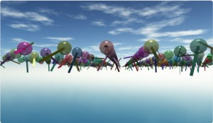
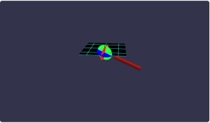
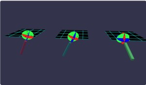

# Babylon.js で物理演算(havok)：BallAndSocketで風鈴

## この記事のスナップショット



風鈴祭り  
https://playground.babylonjs.com/full.html#KPMKYS#3

（コードを見たい人はURLから `full.html` を消したURLを指定してください）

[ソース](080/)

- 080_ballAndSocket_1 .. デモ用
- 080_ballAndSocket_2 .. 風鈴

ローカルで動かす場合、./js 以下のライブラリは 069/js を利用してください。

## 概要

物理エンジンhavokで
[Constraints](https://doc.babylonjs.com/features/featuresDeepDive/physics/constraints/)
にある
[BallAndSocketConstraint](https://doc.babylonjs.com/typedoc/classes/BABYLON.BallAndSocketConstraint)
を調べていたら風鈴っぽいものができたので、風鈴祭りっぽく仕上げてみました。

## やったこと

- BallAndSocketConstraint について
- Physics6DoFConstraint で同じ動作を
- モーターの機能で回してみる
- 風鈴をいっぱい並べる

### BallAndSocketConstraint について


公式の挿絵にあるように、２つのボディを回転可能なボールとソケットでつなぐものです。
球体関節といったほうが馴染みがあるのかな？

使い方は、接続するボディの位置(pivot)と軸(axis)を指定します。

```js
// ballAndSocket_B1
let mesh1 = BABYLON.MeshBuilder.CreateBox("m", { width: 3, height: 0.2, depth: 3 }, scene);
let agg1 = new BABYLON.PhysicsAggregate(mesh1, BABYLON.PhysicsShapeType.BOX, { mass: 0, restitution: 1 }, scene);
let mesh2 = BABYLON.MeshBuilder.CreateBox("m", { width: 2, height: 0.2, depth: 0.2 }, scene);
let agg2 = new BABYLON.PhysicsAggregate(mesh2, BABYLON.PhysicsShapeType.BOX, { mass: 1, restitution: 1 }, scene);

let joint = new BABYLON.BallAndSocketConstraint(
    new BABYLON.Vector3( 0  ,-0.3, 0  ),  // pivotA
    new BABYLON.Vector3(-1.8, 0, 0),      // pivotB
    new BABYLON.Vector3(0, 1, 0),         // axisA
    new BABYLON.Vector3(0, 1, 0),         // axisB
    scene
);

agg1.body.addConstraint(agg2.body, joint);
```




### Physics6DoFConstraint で同じ動作を

[Constraints](https://doc.babylonjs.com/features/featuresDeepDive/physics/constraints/)
で説明されている下記 Constraints のパーツは Physics6DoFConstraint を使っても表現できます。

- BallAndSocketConstraint
- DistanceConstraint
- HingeConstraint
- LockConstraint
- PrismaticConstraint
- SliderConstraint

たとえば、BallAndSocketConstraint は下記のように書けます。

```js
// BallAndSocketConstraint での結合(ballAndSocket_B1)：再掲
let joint = new BABYLON.BallAndSocketConstraint(
    new BABYLON.Vector3( 0  ,-0.3, 0  ),  // pivotA
    new BABYLON.Vector3(-1.8, 0, 0),      // pivotB
    new BABYLON.Vector3(0, 1, 0),         // axisA
    new BABYLON.Vector3(0, 1, 0),         // axisB
    scene
);
// ------------------------------------------------------------
// Physics6DoFConstraint での結合 (ballAndSocket_B2)
let joint = new BABYLON.Physics6DoFConstraint(
    { pivotA: new BABYLON.Vector3(0, -0.3, 0),
      pivotB: new BABYLON.Vector3(-1.8, 0, 0),
    },
    [{ axis: BABYLON.PhysicsConstraintAxis.LINEAR_DISTANCE, minLimit: 0, maxLimit: 0, },
    ],
    scene
);
```

Physics6DoFConstraint の方は自由度が高く、可動可能な距離や角度を指定できるのでより柔軟な指定ができます。
同じような挙動でも、「可動可能な角度を制限したい」となると、
Physics6DoFConstraint で可動域を制限することができます。

ちなみに同じような結合でも、形状や選んだ軸によって違う書き方ができます。

「違う書き方ができます」が、挙動が微妙に違うみたいです。

可動部分（棒）を水平にしてつなげた場合と
可動部分（棒）を垂直にしてつなげた場合で、
```js
// 可動部分（棒）を水平にしてつなげた場合(ballAndSocket_B2)
let box2 = BABYLON.MeshBuilder.CreateBox("m", { width: 2, height: 0.2, depth: 0.2 }, scene);
...
let joint = new BABYLON.Physics6DoFConstraint(
    { pivotA: new BABYLON.Vector3(0, -0.3, 0),
        pivotB: new BABYLON.Vector3(-1.8, 0, 0),
    },
    [{ axis: BABYLON.PhysicsConstraintAxis.LINEAR_DISTANCE, minLimit: 0, maxLimit: 0, },
    ],
    scene
);
// ----------------------------------------
// 可動部分（棒）を垂直にしてつなげた場合(ballAndSocket_B3)
let box2 = BABYLON.MeshBuilder.CreateBox("m", { width: 0.2, height: 2, depth: 0.2 }, scene);
let joint = new BABYLON.Physics6DoFConstraint(
    { pivotA: new BABYLON.Vector3(0, -0.3, 0),
        pivotB: new BABYLON.Vector3(0, 1.8, 0),
    },
    [{ axis: BABYLON.PhysicsConstraintAxis.LINEAR_DISTANCE, minLimit: 0, maxLimit: 0, },
    ],
    scene
);
```

で「水平な方」は長軸での回転が目立ちます。
一方で「垂直な方」は直軸での回転がほとんど見られない一方で、棒を振り回す（振り子の）動きが目立ちます。

左から(B1:BallAndSocket, B2:6DoF（水平で結合）, B3:6DoF（垂直で結合）)



https://playground.babylonjs.com/#KPMKYS


動きを下半分（南半球）に限ると、その違いはより顕著になるようです。
天板（グリッド表示された板）をクリックすると視点方向に力を加えます。

左から(C2:6DoF（水平で結合＆半球）, C3:6DoF（垂直で結合＆半球）)
https://playground.babylonjs.com/#KPMKYS#1

### モーターの機能で回してみる

Physics6DoFConstraint には「モーター」の機能があり、風車や車輪のように「永久に軸で回転」させることができます。


```js
// ballAndSocket_D2
// X軸で回転させるとき
joint.setAxisMotorType(BABYLON.PhysicsConstraintAxis.ANGULAR_X,
                        BABYLON.PhysicsConstraintMotorType.VELOCITY);
joint.setAxisMotorTarget(BABYLON.PhysicsConstraintAxis.ANGULAR_X, 1);
joint.setAxisMotorMaxForce(BABYLON.PhysicsConstraintAxis.ANGULAR_X, 5);
```

左から(C2:6DoF（水平で結合＆半球＆モーター）, C3:6DoF（垂直で結合＆半球＆モーター）
https://playground.babylonjs.com/#KPMKYS#2

回転軸は X,Y,Zのいずれかで、任意の軸での回転はできないようです。

## 風鈴をいっぱい並べる

さて、ここまで
BallAndSocketConstraintやPhysics6DoFConstraintの基礎調査を行ってきましたが、
その様子がさながら風鈴のようだったので、たくさんならべて「風鈴祭り」っぽくしてみました。

風鈴祭り  


https://playground.babylonjs.com/full.html#KPMKYS#3

## まとめ・雑感

目を細めて、遠目に見れば風鈴に見えなくもない？

美的なものを期待して訪れた方がいたら申し訳ないです。
（期待されても困るけど）

「風鈴祭り」といっておきながら風鈴の音も無いし。（笑


------------------------------------------------------------

前の記事：[Babylon.js で物理演算(havok)：密閉空間にボールを発生させてみるテスト](079.md)

次の記事：[Babylon.js で物理演算(havok)：SpringConstraintで太陽系](081.md)

目次：[目次](000.md)

この記事には関連記事がありません。

--
