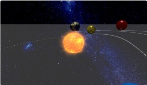
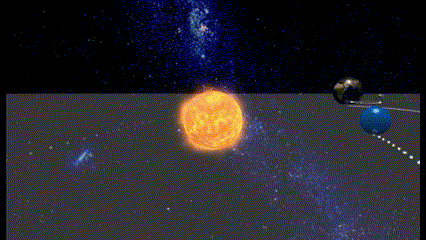
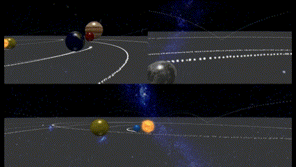
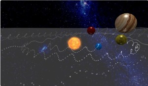
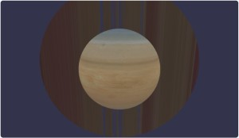
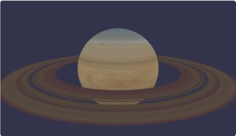
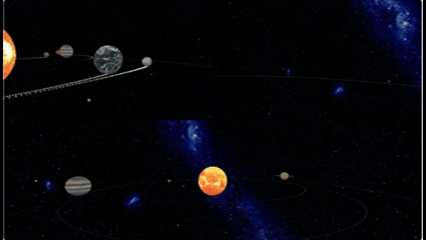

# Babylon.js で物理演算(havok)：SpringConstraintで太陽系

## この記事のスナップショット



重力あり・平板あり（木星まで、彗星あり）  
https://playground.babylonjs.com/full.html#KNRKJW#2

重力なし・平板なし（海王星まで、彗星なし）  
https://playground.babylonjs.com/full.html#KNRKJW#4

（コードを見たい人はURLから `full.html` を消したURLを指定してください）

[ソース](081/)

ローカルで動かす場合、./js 以下のライブラリは 069/js を利用してください。

## 概要

物理エンジンhavokで
[SpringConstraint](https://doc.babylonjs.com/typedoc/classes/BABYLON.SpringConstraint)
に「スプリング」と「モーター」の機能があることに着目して、
「なんちゃって太陽系」を作ってみました。

スプリングで公転軌道を、モーターで自転を表現します。（モーターの自転が公転にも寄与してそうな気がする）

２倍速  



Babylon.js Tips集には関連作品がいくつかありますが、これらとは違う視点で作ってます。
- Babylon.js Tips集リンク
  - [太陽系](https://scrapbox.io/babylonjs/%E5%A4%AA%E9%99%BD%E7%B3%BB)
  - [太陽系のシミュレーション](https://scrapbox.io/babylonjs/%E5%A4%AA%E9%99%BD%E7%B3%BB%E3%81%AE%E3%82%B7%E3%83%9F%E3%83%A5%E3%83%AC%E3%83%BC%E3%82%B7%E3%83%A7%E3%83%B3)
  - [地球を回してみる](https://scrapbox.io/babylonjs/%E5%9C%B0%E7%90%83%E3%82%92%E5%9B%9E%E3%81%97%E3%81%A6%E3%81%BF%E3%82%8B)
  - [地球の内部構造を表示させてみる](https://scrapbox.io/babylonjs/%E5%9C%B0%E7%90%83%E3%81%AE%E5%86%85%E9%83%A8%E6%A7%8B%E9%80%A0%E3%82%92%E8%A1%A8%E7%A4%BA%E3%81%95%E3%81%9B%E3%81%A6%E3%81%BF%E3%82%8B)
  - [ラグランジュ・ポイント](https://scrapbox.io/babylonjs/%E3%83%A9%E3%82%B0%E3%83%A9%E3%83%B3%E3%82%B8%E3%83%A5%E3%83%BB%E3%83%9D%E3%82%A4%E3%83%B3%E3%83%88)

- 公式のドキュメント[The Meshes Library](https://doc.babylonjs.com/toolsAndResources/assetLibraries/availableMeshes/)
  - [Solar System](https://playground.babylonjs.com/#KILIHT#22)

## やったこと

- SpringConstraintで惑星を配置する
- 複数カメラ
- 軌跡
- 彗星を配置する

### SpringConstraintで惑星を配置する

２つの球、「太陽」と「惑星」を SpringConstraint でつなぎます。

惑星の違いは、球の大きさ(diameter)とメッシュ間距離(minDistance/maxDistance)で表します。

```js
let sp1 = BABYLON.MeshBuilder.CreateSphere("m1", { diameter: 2, segments: 8 }, scene);
sp1.position.set(adjx, adjy, adjz);
let agg1 = new BABYLON.PhysicsAggregate(sp1, BABYLON.PhysicsShapeType.SPHERE, { mass: 0, restitution:1}, scene);

let sp2 = BABYLON.MeshBuilder.CreateSphere("m2", { diameter: diam, segments: 8 }, scene);
sp2.position.set(adjx+px, adjy, adjz);
let agg2 = new BABYLON.PhysicsAggregate(sp2, BABYLON.PhysicsShapeType.SPHERE, { mass: mass, restitution:1, friction:0.001}, scene);

let joint = new BABYLON.SpringConstraint(
    new BABYLON.Vector3(0, 0, 0),
    new BABYLON.Vector3(0, 0, 0),
    new BABYLON.Vector3(1, 0, 0),
    new BABYLON.Vector3(1, 0, 0),
    minDist, // minDistance,
    maxDist, // maxDistance,
    100, // stiffness,
    0.5, // damping,
    scene
);
agg1.body.addConstraint(agg2.body, joint);
joint.setAxisMotorType(BABYLON.PhysicsConstraintAxis.ANGULAR_Y,
                        BABYLON.PhysicsConstraintMotorType.VELOCITY);
joint.setAxisMotorTarget(BABYLON.PhysicsConstraintAxis.ANGULAR_Y  , motorTrg);
joint.setAxisMotorMaxForce(BABYLON.PhysicsConstraintAxis.ANGULAR_Y, motorMFo);
```

初期作品  
https://playground.babylonjs.com/#KNRKJW

ちなみに、惑星の場合は片方(上記のsp1)を「太陽」として配置すれば「恒星と惑星」に。
片方を「地球」にしてもう片方を「月」にした「惑星と衛星」も表現できます。

地球と月版  
https://playground.babylonjs.com/#KNRKJW#1

### 複数カメラ

どうせなら惑星の動きをカメラで追っかけたく機能追加します。

サブカメラで次の２つを実現させます。

- 惑星の後ろから「追っかけ」
- 「惑星視点」

「追っかけ」は
[Babylon.js で物理演算(havok)：パイプ内をボードで滑る](070.md)
や
[Babylon.js ：凹凸のある道路をキャラクターコントローラーでCNSと競争する](078.md)
で実装したカメラワークをそのまま使います。

FreeCameraを用意して、対象の惑星の座標とカメラの座標から、一定距離うしろの座標を求めてカメラ位置とします。
ただし今回は公転軌道をとるので、やや左を向くようクォータニオン(cam2quat)で角度を補正します。

```js
// カメラ(サブ１  .. 追跡用
let camera2a = new BABYLON.FreeCamera("Camera2a", new BABYLON.Vector3(2, 5, -10), scene);
camera2a.setTarget(BABYLON.Vector3.Zero());
camera2a.inputs.clear(); // カーソルキーでカメラ操作させないようにする
...

scene.onBeforeRenderObservable.add((scene) => {
    // カメラ2a用の更新
    if (camera2type > 0) {
        let trgMesh = planetMesh[iplanet];
        let vdir2 = camera2a.position.subtract(trgMesh.position).normalize().scale(cam2aL);
        vdir2 = vdir2.applyRotationQuaternion(cam2quat);
        vdir2.y = 1;
        camera2a.position = trgMesh.position.add(vdir2);
    }
});
```

「惑星視点」は FollowCamera で実現させます。
メッシュの内側にテクスチャを貼っていないため？内側からだとメッシュが消える特性を利用します。
カメラ位置（radius, heightOffset）およびカメラ移動速度(cameraAcceleration, maxCameraSpeed)は、
惑星から外れすぎず、ブレが少ないように配慮して決めました。
ただし、開始時は惑星の動きが激しすぎてパラメータがあってませんがご容赦を。

```js
// カメラ(サブ２  .. 惑星視点
const camera2b = new BABYLON.FollowCamera("FollowCam", new BABYLON.Vector3(0, 10, -10), scene);
camera2b.rotationOffset = 180;
camera2b.radius = 1;
camera2b.heightOffset = 0.1;
camera2b.cameraAcceleration = 0.2;
camera2b.maxCameraSpeed = 10;
camera2b.attachControl(canvas, true);
camera2b.inputs.clear(); // カーソルキーでカメラ操作させないようにする
```

２倍速　追っかけ：左上、惑星視点：右上、俯瞰：下  


### 軌跡

目印のない空間を公転軌道してもよくわからないので、軌跡をつけます。

軌跡をつける方法は２種類、TrailMesh か ParticleSystemがあります。

TrailMesh だと、メッシュ（この場合は惑星）の中心から軌跡がでるのでちょっと違和感。
惑星の真下に描画用のメッシュを配置するのが面倒だったので、
ParticleSystem で相対パスで球の下から軌跡を出すようにしました。
公転面に対して垂直に自転していれば球真下のところから軌跡がでてくれるけど、
自転軸がズレると軌跡が螺旋になってしまうことにあとから気がつきました。
まぁこれはこれで回転の様子がわかるからよいかな？

自転軸がズレて螺旋を描いている様子  


```js
// 惑星のメッシュを引数にとり、軌跡をつける
function addBubble(mesh, opt={}) {
    // 軌跡
    let py = typeof(opt.py) !== 'undefined' ? opt.py : 1;
    let life = typeof(opt.life) !== 'undefined' ? opt.life : 1;
    let particleSystem = new BABYLON.ParticleSystem("particles", 4000);
    particleSystem.particleTexture = new BABYLON.Texture("textures/flare3.png");
    particleSystem.emitter = mesh;
    particleSystem.minEmitBox = new BABYLON.Vector3(-0.02, -py, -0.02);
    particleSystem.maxEmitBox = new BABYLON.Vector3( 0.02, -py, 0.02);
    particleSystem.minScaleX = 0.10;
    particleSystem.maxScaleX = 0.12;
    particleSystem.minScaleY = 0.10;
    particleSystem.maxScaleY = 0.12;
    particleSystem.color1 = new BABYLON.Color4(1.0, 1.0, 1.0, 1.0);
    particleSystem.color2 = new BABYLON.Color4(1.0, 1.0, 1.0, 1.0);
    particleSystem.colorDead = new BABYLON.Color4(0.0, 0.0, 0.0, 0.0);
    particleSystem.emitRate = 1000;
    particleSystem.direction1 = new BABYLON.Vector3(-0.1, 0, -0.1);
    particleSystem.direction2 = new BABYLON.Vector3(0.1, 0, 0.1);
    particleSystem.updateSpeed = 0.002;
    particleSystem.minLifeTime = life*0.8;
    particleSystem.maxLifeTime = life;
    particleSystem.start();
    return particleSystem;
}
```

### 彗星を配置する

彗星（楕円軌道）を再現できるかなと、可動範囲(minDistance, maxDistance)をひろげ、バネをゆるゆる(stiffness=10)に、減衰しない(damping=0)ようにして
配置したものの、最初はそれっぽいうごきかと思えば時間がたつと円運動になる。これじゃない感（汗

彗星  
https://playground.babylonjs.com/full.html#KNRKJW#2


楕円にするにはバネを２つにすれば良いと思い、動かしてみると８の字に動く。（＠＿＠）
着想はよかったけど、力加減（パラメータ調整）が難しい。
あと焦点（バネの片方）を固定しているのも不自然な動きの原因な気がする。

バネを二つにした彗星  
https://playground.babylonjs.com/full.html#KNRKJW#3

## やったこと（２）

これで記事を公開！
次のネタを探して公式のドキュメント[The Meshes Library](https://doc.babylonjs.com/toolsAndResources/assetLibraries/availableMeshes/)を眺めていたら、[solar_system.glb](https://playground.babylonjs.com/#KILIHT#22)を見つけてしまった。on_

ということで延長戦（汗

solar_system.glbを使って、自分なりの太陽系を作ってみました。

- solar_system.glbを使う（リングのメッシュ）
- solar_system.glbを使う（惑星視点の修正）
- solar_system.glbを使う（微修正）

### solar_system.glbを使う（リングのメッシュ）

solar_system.glbからメッシュを取り出して使おうかと試行錯誤してみましたがよくわからないので、メッシュはこちらで用意して、テクスチャだけ利用することにしました。

ところが問題発生。惑星（土星や天王星）のリング、メッシュの作り方がわからない。
テクスチャが「しま模様」（メルカトル図法のように引き延ばされている）なので、
円柱(Cylinder)や円盤（Disc）に張り付けてもうまくいかない。

土星（Disc版：回転し忘れ）  



しばらく悩んだ結果、線分を回転（Lathe）させて円盤を作ればよいと気づきました。

土星（Lathe版）  


```js
// 惑星のリングのメッシュ作成
const myShape = [new BABYLON.Vector3(ringR1, 0, 0), new BABYLON.Vector3(ringR2, 0, 0),];
let mesh2 = BABYLON.MeshBuilder.CreateLathe("", {shape: myShape});
```

### solar_system.glbを使う（惑星視点の修正）

solar_system.glbのテクスチャを使うことで惑星視点で問題発生。

テクスチャが内側まで描画されているため、メッシュ内側にカメラが入り込むと内側のテクスチャが表示されてしまいます。
（かがみ合わせの反転したテクスチャになっている様子）
なので、FollowCamera で「惑星視点」ができません。

仕方ないので FreeCamera を使って、惑星の赤道上にカメラを配置、外側に視点が向くように調整します。

```js
// 惑星の赤道上からの視点
let camera2c = new BABYLON.FreeCamera("Camera2c", new BABYLON.Vector3(2, 5, -10), scene);

scene.onBeforeRenderObservable.add((scene) => {
    // 対象の惑星のクォータニオンから惑星の向きベクトル(v)を求める
    let v = new BABYLON.Vector3(0, 0, 1);
    v = v.applyRotationQuaternion(trgMesh.rotationQuaternion);
    camera2c.lockedTarget = trgMesh.position.add(v.scale(cam2aL));

    // カメラを一度惑星中心に持ってきてから赤道上に移動させる
    camera2c.position = trgMesh.position.clone();
    camera2c.position.addInPlace(v.scale(trgMesh._r));
});
```

２倍速  


右上のフレームのカメラになりますが、上記の FollowCamera とそん色ないことがわかります。
メッシュとの重なりが無い分、安定した見栄えかな。でも赤道上を移動している都合上、若干速く回転しているかな？

### solar_system.glbを使う（微修正）

せっかくなので、前述とは違う物理系にしてみます。

- 重力を０に、水平な板を排除
- 彗星を無くして、海王星まで作成

無重力でバネのみ  
https://playground.babylonjs.com/#KNRKJW#4

## まとめ・雑感

バネと万有引力では公式／方程式が違いすぎて別物になるかと思ったけど、意外とそれっぽくて興味深い。
雰囲気を感じるならありかな。

でも、天文学者に見られると鼻で笑われそう。

- 星の大きさが適当すぎる。距離も動きも。デフォルメにしたってこれは..な気もする。
- 月が地球の周りを回りきれてないので満ち欠けがない（大汗
- 惑星間の干渉をガン無視。スイングバイしない。
- 太陽のマテリアルを使ったら、惑星に隠れても前面に表示される。おぉぅ。
- 彗星の再現がむずかしい。上手くいったら「ほうき」のエフェクト、太陽と反対側に流すことをやるつもりだったのに。
- 自転軸がおかしい。特に土星や天王星のリングの向き。

あと今回初めて asset にチャレンジしてみましたが、散々だったのでもうちょっと勉強してきます。
（延長戦／ぶっつけで使うには少々ノウハウが足りなかった）

------------------------------------------------------------

前の記事：[Babylon.js で物理演算(havok)：BallAndSocketで風鈴](080.md)

次の記事：..


目次：[目次](000.md)

この記事には関連記事がありません。

--
