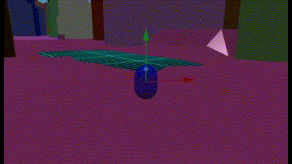

# Babylon.js で物理演算(havok)：渋谷の空を飛んでみる

## この記事のスナップショット

渋谷駅　ハチ公口　スクランブル交差点付近  


https://playground.babylonjs.com/full.html#CWXZW9

操作は (h)キーを押して確認。

（コードを見たい人はURLから `full.html` を消したURLを指定してください）

[ソース](082/)

ローカルで動かす場合、./js 以下のライブラリは 069/js を利用してください。

## 概要

PLATEAU [プラトー]より渋谷の3Dモデルを作成し、物理形状としての街並みを再現しました。
またキャラクターコントローラーで空中遊泳をできるようにしてみました。




PLATEAU [プラトー]に関してはこちらを参照。

- 国土交通省がゲーム開発などに使える日本都市の3Dモデルを無料配布。建築物のほか、その土地に関する細かなデータも収納
  - [https://www.famitsu.com/news/202303/01294513.html](https://www.famitsu.com/news/202303/01294513.html)

- 3D都市モデルデータを誰でも無料で利用できる　国土交通省の「PLATEAU」とは？
  - [https://techtrends.jp/keywords/plateau/](https://techtrends.jp/keywords/plateau/)


ちなみに、ちょっと情報が古いですが Babylon.js レシピ集vol.3 にも PLATEAU に関する記事があります。今となっては購入してまでの価値はちょっと少ないかな。

- 第８章　ＰＬＡＴＥＡＵデータを軽量化してブラウザで表示してみよう
- 第９章　ブラウザに表示したＰＬＡＴＥＡＵデータにオープンデータをマッピングしてみよう


## やったこと

- PLATEAUで3D都市モデルを作成する
- モデルを読み込んで物理形状とする
- キャラクターコントローラーで空中遊泳

### PLATEAUで3D都市モデルを作成する

Unity Hub, Unity をインストール、PLATEAU SDK for Unityを設定します。

- TOPIC 17｜PLATEAU SDKでの活用[1/2]｜PLATEAU SDK for Unityを活用する
  - [https://www.mlit.go.jp/plateau/learning/tpc17-1/#p17_1](https://www.mlit.go.jp/plateau/learning/tpc17-1/#p17_1)

- install
  - [https://project-plateau.github.io/PLATEAU-SDK-for-Unity/manual/Installation.html](https://project-plateau.github.io/PLATEAU-SDK-for-Unity/manual/Installation.html)

以上が前準備になります。

次に Unity 上で作成するエリアを選んでメッシュ出力します。

- 3D都市モデルのインポート
  - [https://project-plateau.github.io/PLATEAU-SDK-for-Unity/manual/ImportCityModels.html](https://project-plateau.github.io/PLATEAU-SDK-for-Unity/manual/ImportCityModels.html)

毎回、ネットから地図データを取得するのは面倒なので、
あらかじめ、[G空間情報センターにある渋谷区](https://test.geospatial.jp/ckan/dataset/plateau-13113-shibuya-ku-2023)のサイトから
CityGML(v4)のデータをダウンロードしておきました。

上記のインポートにある「3D都市モデルのエクスポート」の手順にしたがって出力します。

適当に出力すると400MBほどになります。激重です。

データ量を削減するのが重要になりますが、下記サイトが参考になります。

  - 3D都市モデルは処理負荷軽減が重要。頂点数やLODを扱う工夫 ～クリエイターの開発事例～【中編】
    - [https://www.mlit.go.jp/plateau/journal/j018_2/](https://www.mlit.go.jp/plateau/journal/j018_2/)

  - PLATEAU [プラトー]×Blender×PlayCanvasで街並みを再現する
    - [https://tech.gmogshd.com/plateau-3dbuilding/](https://tech.gmogshd.com/plateau-3dbuilding/)

テクスチャ（画像）が半分以上を占めるので今回は除外しました。
またメッシュについても LOD2（窓やドア）を除外、他にも天井や内装っぽいものは除外して出力すると 17MB になりました。

### モデルを読み込んで物理形状とする

3Dデータは BABYLON.ImportMeshAsync で読み込めましたが、このメッシュから物理形状(PhysicsAggregate)を作ろうとするとエラーが発生します。

```txt
Error: No valid mesh was provided for mesh or convex hull shape parameter. Please provide a mesh with valid geometry (number of vertices greater than 0).
```

エラーといっても最初のメッシュのみで発生するようなので、try catch で無視します。


```js
let files = ["./3d/shibuyaV2c/533935_dem_6697_op/533935_dem_6697_op.glb",
            "./3d/shibuyaV2c/53393585_bldg_6697_op/53393585_bldg_6697_op.glb",
            "./3d/shibuyaV2c/53393585_tran_6697_op/53393585_tran_6697_op.glb",
            "./3d/shibuyaV2c/53393586_bldg_6697_op/53393586_bldg_6697_op.glb",
            "./3d/shibuyaV2c/53393586_tran_6697_op/53393586_tran_6697_op.glb",
            "./3d/shibuyaV2c/53393595_bldg_6697_op/53393595_bldg_6697_op.glb",
            "./3d/shibuyaV2c/53393595_tran_6697_op/53393595_tran_6697_op.glb",
            "./3d/shibuyaV2c/53393596_bldg_6697_op/53393596_bldg_6697_op.glb",
            "./3d/shibuyaV2c/53393596_tran_6697_op/53393596_tran_6697_op.glb",
            ];
for (let file of files) {
    BABYLON.ImportMeshAsync(file, scene).then((result) => {
        for (let mesh of result.meshes) {
            try {  // 必ず、0 番目が下記エラーで失敗するっぽい
                let agg = new BABYLON.PhysicsAggregate(mesh, BABYLON.PhysicsShapeType.MESH, { mass: 0, restitution:0.01}, scene);
                let mat = new BABYLON.StandardMaterial('mat', scene);
                mat.diffuseColor = BABYLON.Color3.Random();
                mesh.material = mat;

            } catch(e) {
            }
        }
    })
}
```

テクスチャが無くシルエットになってますがご愛敬。


### キャラクターコントローラーで空中遊泳

キャラクターコントローラーに空中遊泳もどき（ゆっくり落ちる）は既に
[Babylon.js の基礎調査：森をつくってみる](073.md)
で着手してますが、今回はゆっくり上昇する改修を行います。
今回、ホバーだけでなく、上昇のベクトルを追加します。

```js
let characterRisingON = new BABYLON.Vector3(0, 25.00, 0); // 上昇
let characterRisingOFF = new BABYLON.Vector3(0, 0, 0);
let characterRising   = characterRisingOFF;
let characterHoverON  = new BABYLON.Vector3(0, 17.90, 0); // ホバー（滞空
let characterHoverOFF = new BABYLON.Vector3(0, 0, 0);
let characterHover = characterHoverON;
```

上昇時と下降時の挙動を変更します。
キー操作、ctrl押下時に keyAction.rise を ON として上昇させます。

```js
var getNextState = function(supportInfo) {
    if (state == "IN_AIR_UP") {
        if (characterController.getVelocity().y > 0) {
            if (keyAction.rise) {
                characterRising = characterRisingON;
                characterHover = characterHoverON;
            } else {
                characterRising = characterRisingOFF;
            }
            return "IN_AIR_UP";
        }
        characterHover = characterHoverON;
        return "IN_AIR";
    } else if (state == "IN_AIR") {
        if (characterController.getVelocity().y > 0) {
            if (keyAction.rise) {
                characterRising = characterRisingON;
                characterHover = characterRisingON;
            } else {
                characterRising = characterRisingOFF;
                characterHover = characterRisingOFF;
            }
            return "IN_AIR_UP";
        }
        if (keyAction.rise) {
            characterHover = characterRisingON;
        } else if (keyAction.down) {
            characterHover = characterHoverOFF;
        } else {
            characterHover = characterHoverON;
        }
        if (supportInfo.supportedState == BABYLON.CharacterSupportedState.SUPPORTED) {
            return "ON_GROUND";
        }
        return "IN_AIR";
    } else if (state == "ON_GROUND") {
```

## まとめ・雑感

メッシュを作って表示するだけなら１日で出来ました。

でもメッシュの加工、削減がテクニカルすぎて難しす。
部分的に強弱をつけるなんてプロすぎて、素人には手をだせないです。
ランドマーク（特徴的な建物）ぐらいテクスチャを貼りたい。

そしてメッシュデータが大きくてストレージがパンク寸前でツライ。

------------------------------------------------------------

前の記事：[Babylon.js で物理演算(havok)：SpringConstraintで太陽系](081.md)

次の記事：[Babylon.js で物理演算(havok)：RigidVehicleをつくってみたけど..](083.md)


目次：[目次](000.md)

この記事には次の関連記事があります。

- [Babylon.js の基礎調査：森をつくってみる](073.md)
- [Babylon.js で物理演算(havok)：渋谷の空を飛んでみる](082.md)

--
