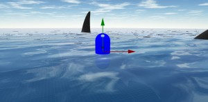
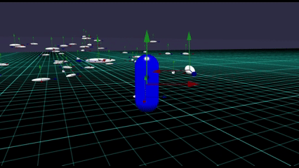
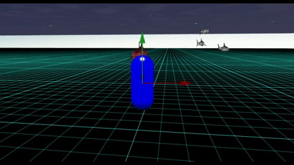
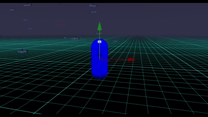
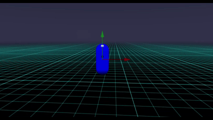
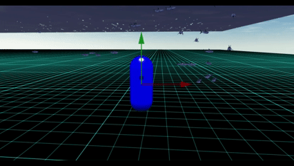

# Babylon.js で物理演算(havok)：魚群(boid)と海上移動のキャラクターコントローラー

## この記事のスナップショット

...  


サメでboid  
https://playground.babylonjs.com/full.html#0R63A9#1

操作は (h)キーを押して確認。

（コードを見たい人はURLから `full.html` を消したURLを指定してください）

[ソース](084/)
  - 084_boid1_draft .. boidアルゴリズムの様子
  - 084_boid2_shark .. サメでboid

ローカルで動かす場合、./js 以下のライブラリは 069/js を利用してください。

## 概要

物理演算で boid を実装してみました。

メッシュ製のboidなら下記で閲覧できます。
またメッシュのみの場合、メッシュの座標値と更に移動速度をメッシュに持たせておいて演算しています。

boid については [boidアルゴリズム](https://scrapbox.io/babylonjs/boid%E3%82%A2%E3%83%AB%E3%82%B4%E3%83%AA%E3%82%BA%E3%83%A0)の方に概説があります。

- 本家ドキュメント[Compute Boids](https://doc.babylonjs.com/features/featuresDeepDive/materials/shaders/computeShader/#compute-boids)
  - [Boids compute shader](https://playground.babylonjs.com/?webgpu#3URR7V#186)
- Babylon.js Tips集
  - [boidアルゴリズム](https://scrapbox.io/babylonjs/boid%E3%82%A2%E3%83%AB%E3%82%B4%E3%83%AA%E3%82%BA%E3%83%A0)
  - [boidアルゴリズム（その2）](https://scrapbox.io/babylonjs/boid%E3%82%A2%E3%83%AB%E3%82%B4%E3%83%AA%E3%82%BA%E3%83%A0%EF%BC%88%E3%81%9D%E3%81%AE2%EF%BC%89)
  - [魚を増やしてみるテスト（その３）](https://scrapbox.io/babylonjs/%E9%AD%9A%E3%82%92%E5%A2%97%E3%82%84%E3%81%97%E3%81%A6%E3%81%BF%E3%82%8B%E3%83%86%E3%82%B9%E3%83%88%EF%BC%88%E3%81%9D%E3%81%AE%EF%BC%93%EF%BC%89)
  - [WebGPU＋ComputeShader（その４）](https://scrapbox.io/babylonjs/WebGPU%EF%BC%8BComputeShader%EF%BC%88%E3%81%9D%E3%81%AE%EF%BC%94%EF%BC%89)
  - [WebGPU＋ComputeShader（その８）](https://scrapbox.io/babylonjs/WebGPU%EF%BC%8BComputeShader%EF%BC%88%E3%81%9D%E3%81%AE%EF%BC%98%EF%BC%89)

ここでのboidは、上述で実装されたアルゴリズムを参考にしつつ、独自に視点で実装しています。

結果、物理演算で、水中に魚を泳がせるところまで。

## やったこと

- メッシュの移動
- boidアルゴリズム
- シーンglbの読み込み
- 海上移動のキャラクターコントローラー
- 海中のfog

### メッシュの移動

メッシュの移動について、「座標／姿勢・クォータニオン」と「衝撃・インパクト」を使ってます。

- 位置(position)と姿勢・クォータニオン(rotationQuaternion)
  - 基本参照のみ
  - 周期的境界のための位置補正やひっくり返った姿勢の修正に直接していることもあり
- 直線移動のインパクト(applyImpulse)と回転のインパクト(applyAngularImpulse)
  - 移動の原動力。姿勢／向きの変える場合も同様に。
  - 慣性で滑りすぎないように減衰(setLinearDamping, setAngularDamping)を適度にかけます。
    キビキビした動きにしたければ「力」と「減衰」を強めにすればOK。

ただ上記を混在させて使ったためにちょっとした問題、位置補正や姿勢補正が効かない状態が発生し、
どこまでも突き進んでしまう、姿勢がひっくり返ったままになりました。
原因は、position/quaternion と applyImpulse を一緒に指定したために、
内部の物理演算で「先に指定した位置／姿勢が無効化されたっぽい」ということです。

正当な記述方法／解決方法があると思うのですが、暫定措置で「交互に処理する」、つまり
「位置・姿勢を制御するターン」「力で動かすターン」で動作を分けることにしました。
正直ぶかっこうですが、今はこれで良しとします。


ちなみに、重力の効果は無しにします。
全体的に 0 にすると影響が大きい／後で後悔しそうなので、メッシュ側で操作します。

```js
const hk = new BABYLON.HavokPlugin(false);
scene.enablePhysics(new BABYLON.Vector3(0, -9.8, 0), hk);

//メッシュをつくっているところで重力を０にする
mesh.physicsBody.setGravityFactor(0);   // 重力の効果
```

### boidアルゴリズム

boidアルゴリズムですが、以下のようにしました。

- 「結合（Cohesion）」
  - 一定距離内（一番離れた距離）にあるメッシュより座標の重心を取得。
  - この範囲にあるメッシュはその重心に向かって方向転換および進行方向に加速

- 「整列（Alignment）」
  - 一定距離内（中程度の距離）にあるメッシュは、該当するメッシュの速度ベクトルの平均をとり、群衆の向きとします。
  - この範囲にあるメッシュは「群衆の向き」に合わせて、クォータニオンの向きを合わせる方向に回転させます。

- 「分離（Separation）」
  - 一定距離内（近距離）にあるメッシュは、上記の「重心」を使って、重心とは逆向きの方向に回転させます。


パラメータを適当に調整すると下記のような感じになります。

boidアルゴリズムの様子（２倍速）  


https://playground.babylonjs.com/full.html#0R63A9

実装についての余談。

いきなりboidを実装するにはちょいハードルが高く感じたので、
メッシュの移動に関する確認から開始しました。

まずは「ランダムな目的地に移動させる」ことを第一目標に、
つぎに「boidで動かす」を目標としました。

結果、ランダムに移動させるだけでも上述（メッシュの移動）の知見が得られ、
更に位置／姿勢の補正といった機能をboid側にも流用できました。

また「リーダー」（他よりも影響を大きく）を設けて、群れを引っ張るような確認もできました。


### シーンglbの読み込み

アニメーションつきのシーンとして[The Meshes Library](https://doc.babylonjs.com/toolsAndResources/assetLibraries/availableMeshes/)にある[shark.glb](https://playground.babylonjs.com/#ISZ7Y2#99)を使ってみることにします。

glbの読み込み方法は
tipsの[glTF](https://scrapbox.io/babylonjs/glTF)を参考にしつつ下記のようにしました。

シーン１つのみではなく、複数のメッシュとして使いたいので instantiateModelsToScene で複製するようにしました。

```js
let loadMeshGLB_cntTask = function(scene, url, fname) {
    var assetsManager = new BABYLON.AssetsManager(scene);
    let instEnt,instEnt2;
    var contTask = assetsManager.addContainerTask("", null, url, fname);
    contTask.onSuccess = function(task) {
        meshlist = task.loadedMeshes;
        animeGrp = task.loadedAnimationGroups;
        if (1) {  // 通常サイズ
            instEnt = task.loadedContainer.instantiateModelsToScene(name=>name+"_clone", false);
            let scale=1;
            let mesh = instEnt.rootNodes[0];
            mesh.scaling = new BABYLON.Vector3(scale, scale, scale);
            mesh.position = new BABYLON.Vector3(0, -1.7, 0);
            mesh.rotation = new BABYLON.Vector3(0, 0, 0);
            instEnt.animationGroups[0].start(loop=true); // 泳ぐ
            instEntList.push(instEnt);
        }
        if (1) {  // メガロドン サイズ
            instEnt = task.loadedContainer.instantiateModelsToScene(name=>name+"_clone", false);
            let scale=5;
            let mesh = instEnt.rootNodes[0];
            mesh.scaling = new BABYLON.Vector3(scale, scale, scale);
            mesh.position = new BABYLON.Vector3(0, -9, 0);
            mesh.rotation = new BABYLON.Vector3(0, 0, 0);
            instEnt.animationGroups[0].start(loop=true, speedRatio=0.2); // 泳ぐ
            instEntList.push(instEnt);
        }
    }
    assetsManager.onFinish = function (task) {
        if (1) {
        // instEnt.animationGroups[0].start(loop=true); // 泳ぐ
        // instEnt.animationGroups[1].start(loop=true); // 円をえがく
        // instEnt.animationGroups[2].start(loop=true); // 嚙みつく
        }
    }
    assetsManager.load();
    return  meshlist;
}
let url = "https://assets.babylonjs.com/meshes/", fname = "shark.glb";
let ssmeshlist = loadMeshGLB_cntTask(scene, url, fname);
```

最終的には上記のシーン／メッシュを物理形状と結び付けます。
サメのメッシュをそのまま PhysicsAggregate() の引数に渡しても一見上手くいったように見えるのですが
移動・回転させるとおかしなことに（動きが飛び飛び）になることがあります。

サメのメッシュの parent に TransformNode を指定すると表示が安定しますが、
ここでは楕円形を使ってサメのサイズを模倣しておきます。それがそのまま物理形状になるので丁度よいかな。

```js
let mesh = BABYLON.MeshBuilder.CreateSphere("root", { diameterX: diaX, diameterY: diaY, diameterZ: diaZ, segments: 8 }, this.scene);
mesh.position.set(px, py, pz);
meshDisp.parent = mesh;
var agg = new BABYLON.PhysicsAggregate(mesh, BABYLON.PhysicsShapeType.BOX, { mass: mass, restitution:0.01}, this.scene);
```

上述のboidと組み合わせると以下のような感じに。

サメでboid（４倍速）  


https://playground.babylonjs.com/full.html#0R63A9#1

### 海上移動のキャラクターコントローラー

海上移動を意図したキャラクターコントローラーとして、以下の状態を考えます。

- 地上
  - 地上および海底の移動モード
- 空中（上昇）
  - 空中／水中の上昇時のモード
  - ジャンプ（スペース）や上昇（コントールキー）での動作
- 空中（下降）
  - 空中／水中の下降時のモード
  - ゆっくり下降やすばやく降下するときの動作
- 海上
  - 海面上に留まるモード .. 今回新規に設けたモード

海上に留まるといっても、ザックリと海面より下だったら上昇するように、海面より上だったら上昇をカットするようにしてます。
ただこの場合、登ったり沈んだりと振動を繰り返すのが難点です。適度なタイミングで上昇（コントロールキー）して軟着陸するような感じで海面に降りるのが理想的。ちょい操作が難しいけど。

```js
var getNextState = function(supportInfo) {
    if (keyAction.float) {
        // 海上モード
        if (characterController.getPosition().y < seaLevel1) {
            characterFloat = characterFloatON2;
        } else if (characterController.getPosition().y < seaLevel) {
            if (characterController.getVelocity().y < 0) {
                characterFloat = characterFloatON;
            } else {
                characterFloat = characterFloatIDLE;
            }
        } else if (characterController.getPosition().y < seaLevel2) {
            characterFloat = characterFloatIDLE;
        } else {
            characterFloat = characterFloatOFF;
        }
    } else {
        characterFloat = characterFloatOFF;
    }
    if (state == "IN_AIR_UP") {
        ...
```

### 海中のfog

透明度が高くて視界良好なことに違和感。

霧(fog)の効果をつけてみました。
なぜか紫色っぽい。

```js
    scene.onBeforeRenderObservable.add(() => {
        if (scene._fog) {
            let py = characterController.getPosition().y;
            if (py >= seaLevel_) {
                scene.fogMode = BABYLON.Scene.FOGMODE_NON;
            } else {
                scene.fogMode = BABYLON.Scene.FOGMODE_EXP2;
                scene.fogStart = 2;
                scene.fogEnd  = 300;
                scene.fogDensity = 0.01;
                fogColor = new BABYLON.Color3(0.0, 0.0, 0.0);
            }
        }
    });
```

海中の効果（fogで視界不良）  


こんな視界で遭遇すると、わかっていてもびっくりします。

偶発的遭遇（４倍速）  


## まとめ・雑感

サメを小さくしたらカツオっぽい（笑
boid がいい感じに魚群っぽさをだしてます。

小サメの群れ（４倍速）  


当初[Crowd Navigation System](https://doc.babylonjs.com/features/featuresDeepDive/crowdNavigation/)の機能で
実現できるのかと思ったのですが、「結合（Cohesion）」と「整列（Alignment）」はクリアしているとして、「分離（Separation）」が再現できないっぽいです。
Tipsにある[Navigation Mesh](https://scrapbox.io/babylonjs/Navigation_Mesh)の～バージョンを見ているとメッシュが重なっていることが確認できると思います。
あと、移動面が必要なこと／３次元的に空間を自由に動けないのがネックで、こちら（CNS）の使用は断念しました。

glb/glTFに関するコード、
WEB上にあるコードは旧来のコードが多く、アニメーションさせるにも呪文のようなコードでした。
APIが新しくなって、幾分わかりやくすなったような気がします。

------------------------------------------------------------

前の記事：[Babylon.js で物理演算(havok)：RigidVehicleをつくってみたけど..](083.md)

次の記事：..


目次：[目次](000.md)

この記事には関連記事がありません。

--
