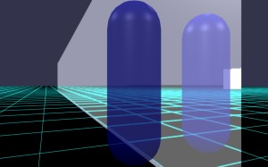
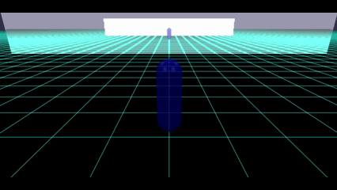
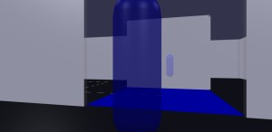

# Babylon.js：合わせ鏡とミラーハウス

## この記事のスナップショット

合わせ鏡
https://playground.babylonjs.com/#F5ASS1

ミラーハウス
https://playground.babylonjs.com/full.html#F5ASS1#1

操作は (h)キーを押して確認。

（コードを見たい人はURLから `full.html` を消したURLを指定してください）

[ソース](085/)

085_mirror1 .. 合わせ鏡
085_mirror2 .. ミラーハウス

ローカルで動かす場合、./js 以下のライブラリは 069/js を利用してください。

## 概要

MirrorTextureを使って「合わせ鏡」ができないかと思いましたがダメでした。
また、鏡つながりで「ミラーハウス」を作ってみました。

## やったこと

公式に[MirrorTexture](https://doc.babylonjs.com/features/featuresDeepDive/materials/using/reflectionTexture/#mirrortexture)というのが
あるので、興味本位で「合わせ鏡」をやってみました。

また、鏡つながりで「ミラーハウス」を、迷路モジュール（薄い壁）を使って作ってみました。

- 合わせ鏡
- ミラーハウス

なお、tips にあるミラー関連の作品は以下のとおり。

- Babylon.js Tips集
  - [Mirror Texture を使ってみる](https://scrapbox.io/babylonjs/Mirror_Texture_%E3%82%92%E4%BD%BF%E3%81%A3%E3%81%A6%E3%81%BF%E3%82%8B)

## 合わせ鏡

MirrorTextureの使い方は、下記を設定するだけなのですが、平面の向き(a, b, c)や切片位置(d)を間違えると何も映らないので、初めてだとちょっと戸惑うかも。

  - 反射面（平面の方程式の係数 a, b, c, d）を設定
  - 反射させたいメッシュの登録

合わせ鏡として、キャラクターコントローラーの前後に鏡を配置して、反射させるメッシュに（地面、キャラクターコントローラー、鏡）を追加しました。
結果、鏡が移りこんでいるけれど「真っ白」に。（＞＿＜）  
そう都合よくいかないものらしい。

合わせ鏡  

## ミラーハウス

薄い壁の迷路を応用してミラーハウスを作ります。
といっても壁の前後を MirrorTexture をつけた板ではさむだけですが。

ただし、MirrorTexture で気を付ける点として、鏡面の平面を登録させなくてはならないこと。
座標値ごとに MirrorTexture を用意する必要があります。

ちなみに「合わせ鏡」ができないことは確認済みなので、鏡面として登録するのは「地面」と「」キャラクターコントローラー」のみとします。（壁を登録しても白くなるだけだし）

ミラーハウス  

https://playground.babylonjs.com/full.html#F5ASS1#1

## まとめ・雑感

「合わせ鏡」ができたら計算量が大変なことになる、下手したら無限ループになりかねないので、今回のような挙動は仕方ないとは思いますがちょっと残念。

------------------------------------------------------------

前の記事：[Babylon.js で物理演算(havok)：魚群(boid)と海上移動のキャラクターコントローラー](084.md)

次の記事：..

目次：[目次](000.md)

この記事には関連記事がありません。

--
