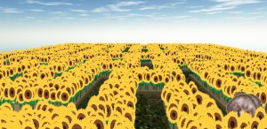
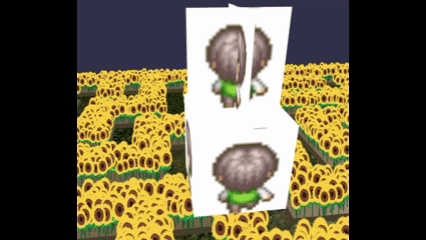
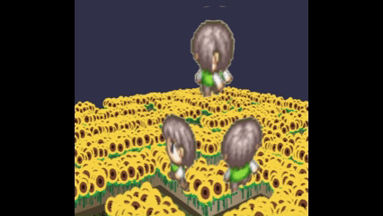
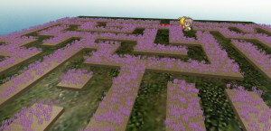
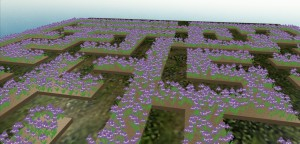
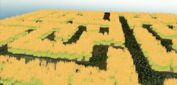
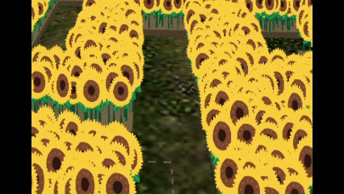

# Babylon.js：ひまわりの迷路

## この記事のスナップショット

ひまわりの迷路  
https://playground.babylonjs.com/full.html#00QD7S

（コードを見たい人はURLから `full.html` を消したURLを指定してください）

[ソース](086/)

ローカルで動かす場合、./js 以下のライブラリは 069/js を利用してください。

## 概要

「夏」といえば「ひまわり」。
「ひまわり」といえば「迷路」。
ということで、ひまわりの迷路を作ってみました。
おまけで迷路内に子供たちを走らせてます。

どうせなので、ラベンダーやアヤメ、麦のステージも用意しました。

## やったこと

- ひまわりの迷路をつくる
- 迷路内に子供を配置
- 他の植物のステージ

### ひまわりの迷路をつくる

迷路の作成には、以前作成した迷路モジュールを使います。
壁と通路が同じ大きさの迷路を使い、壁の部分を低くして、植物を植える畝（うね）の部分にします。

植物／ひまわりをたくさん配置するために、スプライト機能で１万本作成します。

ひまわりの迷路  

ちなみに植物の画像は[いらすとや](https://www.irasutoya.com/)さんから

### 迷路内に子供を配置

[ぴぽや倉庫](https://pipoya.net/blog/)からフリー素材、子供のキャラクターチップを使います。

立体にテクスチャを張ってもよいのですが、
透過画像（アルファチャンネル）を有効にすると「浮き出ている感」があります。
平面２枚を交差させて、テクスチャを張りつければ、３Ｄモデルっぽく見えるのでこの方法を採用します。
（できればこれにアニメーションしたかったけど...）

透過させないときの交差面（上）と立体（下）  

透過させたときの交差面（上）と立体（下）  

### 他の植物のステージ

「ひまわり」を他の植物に変えるには、スプライトで読み込む画像を別のファイルに差し替えます。
あと、植物によって高さを変えてます。

ラベンダー  

アヤメ  

麦  

## まとめ・雑感

ひまわりの隙間から見えるこどもの頭や、
また上手く曲がれずに行き過ぎるさまが「まよっているよう」でちょっとかわいい。

迷っている感（４倍速）  

------------------------------------------------------------

前の記事：[Babylon.js：合わせ鏡とミラーハウス](085.md)

次の記事：[Babylon.js：ミニチュアに挑戦](087.md)

目次：[目次](000.md)

この記事には次の関連記事があります。

- [Babylon.js の基礎調査：外部jsの読み込み方法](076.md)
- [Babylon.js ：Crowd Navigation Systemのエージェントとマイクロマウスの迷路で競争](075.md)
- [Babylon.js：合わせ鏡とミラーハウス](085.md)
- [Babylon.js：ひまわりの迷路](086.md)

--
