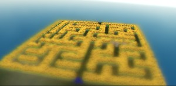

# Babylon.js：ミニチュアに挑戦

## この記事のスナップショット

ミニチュアなひまわり畑
https://playground.babylonjs.com/full.html#261L95

ミニチュアな渋谷
https://playground.babylonjs.com/full.html#261L95#1

(L)キーでレンズ効果（焦点距離、開口）を変更します。

（コードを見たい人はURLから `full.html` を消したURLを指定してください）

[ソース](087/)

ローカルで動かす場合、./js 以下のライブラリは 069/js を利用してください。

## 概要

ぼかし（blur）機能をシーンの上下にいれるとミニチュアっぽいものができるらしいと知って、
[Depth of Field and Other Lens Effects](https://doc.babylonjs.com/features/featuresDeepDive/postProcesses/dofLenseEffects)
にある LensRenderingPipeline をつかえば実現できそうなのでやってみました。

- 参考資料
  - [ミニチュア風写真を10年ほど研究して学んだポイント](https://note.com/fladdict/n/n7cb50ddc2650)
  - [ミニチュア風写真の作り方（インスタグラムでもできるよ！](https://bibinbaleo.hatenablog.com/entry/2019/02/15/203623)

## やったこと

- レンズ効果を確かめる
- モチーフをかえてみる

### レンズ効果を確かめる

ざっくりと焦点距離(dof_focus_distance)と開口(dof_aperture)をいじって、中央付近に焦点をあわせ、遠近にぼかしをいれるようにします。

焦点距離＝30、開口＝10の場合  

ちなみに、焦点距離を変更すれば、手前や奥に焦点をあわせることができます。

焦点距離＝22、開口＝10の場合  

焦点距離＝50、開口＝10の場合  

開口を変更すれば、ピントをあわせる範囲を広げたり、せばめたりできます。

焦点距離＝30、開口＝1の場合  

焦点距離＝30、開口＝100の場合  

焦点距離や開口は、被写体（ひまわり畑）とカメラの位置関係／距離に依存するので、シーンごとに調整する必要があります。

### モチーフをかえてみる

ひまわり畑だけとミニチュア感がいまいち出ないないので、過去に作った「渋谷の3Dモデル」を使ってみました。

ちょっとよくなったけど、人や車を配置しないとミニチュアっぽさが足りない。

## まとめ・雑感

ぼかし(LensRenderingPipeline)を使うには、距離の指定が難しかったです。

モチーフはクリア／詳細な方がよいみたい。ぼかしのかかった部分とクリアな部分が明確になっていないと「よくわからん」になってしまいます。

------------------------------------------------------------

前の記事：[Babylon.js：ひまわりの迷路](086.md)

次の記事：..

目次：[目次](000.md)

この記事には次の関連記事があります。

- [Babylon.js で物理演算(havok)：渋谷の空を飛んでみる](082.md)
- [Babylon.js：ひまわりの迷路](086.md)
- [Babylon.js：ミニチュアに挑戦](087.md)

--
