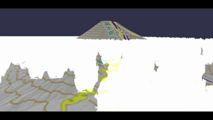
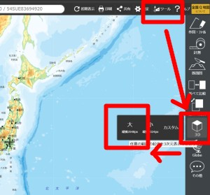
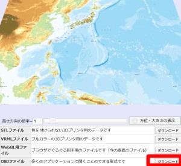
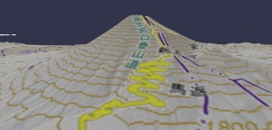
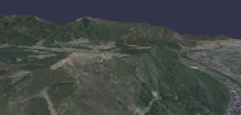
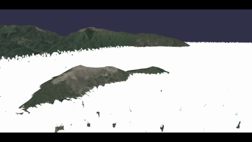

# Babylon.js：地形データと雲海

## この記事のスナップショット



富士の雲海  
https://playground.babylonjs.com/full.html#APZNH5

竹田城の雲海  
https://playground.babylonjs.com/full.html#APZNH5#1

（コードを見たい人はURLから `full.html` を消したURLを指定してください）

[ソース](088/)

- 088_cloud1FUJI .. 富士山
- 088_cloud2TAKEDA .. 竹田城

ローカルで動かす場合、./js 以下のライブラリは 069/js を利用してください。

## 概要

国土地理院の地形データ(*.obj)を使う例として、地形＋雲海を発生させてみました。

雲海は ParticleSystem で作成させます。

## やったこと

- 地形データを取得
- 地形データ(obj）を表示させる
- 雲海を発生させる１（富士山）
- 雲海を発生させる２（竹田城）

### 地形データを取得

国土地理院の[全国Q地図](https://maps.qchizu.xyz/)にアクセスし、所望の地点をズームして
3D形状を取得します。

所望の場所にたどり着いたら、メニュー右上から「ツール」―「３Ｄ」ー「大」を選びます。



３Ｄ形状が表示されるので、下段のメニューから「OBJファイル」の「ダウンロード」を選択、



「OBJファイル」、「MTLファイル」、「テクスチャ画像」をダウンロード、保存します。

ちなみに「全国Q地図」はREST APIになっているようで、
```
https://maps.qchizu.xyz/{ズーム倍率}/{緯度}/{経度}/{オプション}
```
の意味になってます。

## 地形データ(obj）を表示させる

objファイルを表示させるには、ImportMeshAsync() を使います。

ここでは、読み込んだメッシュをリサイズ(scaling)して、位置(position)を調整し、Z軸マイナス方向を向いているので１８０度回転させておきます。

```js
let file = "./3d/mtFUJI/dem.obj";
BABYLON.ImportMeshAsync(file, scene).then((result) => {
    let meshGeo = result.meshes[0];
    let s = 2, adjx=-50, adjz=-50;;
    meshGeo.scaling = new BABYLON.Vector3(s, s, s);
    meshGeo.position = new BABYLON.Vector3(100*s+adjx, -4.1*s, 100*s+adjz);
    meshGeo.rotation = new BABYLON.Vector3(0, R180, 0);
})
```

### 雲海を発生させる１（富士山）

雲のテクスチャに、アセットにある cloud.png を使いました。

雲のテクスチャ  


雲海とするために、広範囲に、lifetime を長く、西から東に流すようにしました。

地形（富士山）に対して、５合目ふきんにかかるようにしました。

富士山に雲海がかかる前  


富士山に雲海がかかった場合  


ちなみに、雲の動きがおそいので、上記のようになるには４～５分かかります。

### 雲海を発生させる２（竹田城）

雲海といえば天空の城、竹田城ということでこちらの地形でも雲海を適用させてみます。
地形だけで、建物がないので城跡っぽくなってます（汗

こちらの雲海は南西で発生させ、北東方向に流れるようにしています。

竹田城に雲海がかかる前  


竹田城に雲海がかかった場合  


## まとめ・雑感

雲っぽくない。
何が足りない？何かが足りない..


------------------------------------------------------------

前の記事：[Babylon.js：ミニチュアに挑戦](087.md)

次の記事：[Babylon.js：富士山の一日](089.md)

目次：[目次](000.md)

この記事には関連記事がありません。

--
