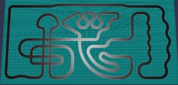

# Babylon.js：画像からコース作り（１／２）

## この記事のスナップショット

...  


[ソース](090/)

ローカルで動かす場合、./js 以下のライブラリは 069/js を利用してください。

## 概要

画像からコース情報を抜き出して、
[Crowd Navigation System](https://doc.babylonjs.com/features/featuresDeepDive/crowdNavigation/)
のエージェントがコース上を周回できるようにしました。

この記事はその第一部。コース作成までを説明します。（２部構成）

「画像からコース情報を抜き出す」といっても AIではありません。
手動で画像にマーカー、グレーな画像にカラーの点を打ち込んでおき、
画像のRGB値を読み取ってマーカーの座標を取得。
開始地点から順に最近傍の座標を順にえらぶことで線分情報、コースとします。
このままでは平面情報なので、高さ情報を加えればアップダウンのあるコース、立体交差も可能なコースになります。
コース情報／座標値の並びが取得できたので、これをスケーリングしてサイズを調整し、
さらに点列を補間してなめらかな曲線にした上でコースとして描画します。

## やったこと

（１部）
- 画像からコース情報を抜き出す
- 立体コース
  - 座標値の表示／可視化
  - 座標値の展開と位置補正

- コース例
  - アップダウンのあるコース
  - 立体交差のあるコース
  - マイクロマウスのロボトレース競技

（２部）
- エージェント操作
  - 周回させるために（複数のチェックポイント）
  - 進行方向を向く
  - 複数の走行ライン

- 応用
  - 血管内を周回する「はたらく細〇」
  - マイクロマウスのロボトレース競技
  - カーレース？

## 画像からコース情報を抜き出す

コースのサンプルとして、

[Circuits](https://strategywiki.org/wiki/Gran_Turismo_5/Circuits)
や
[マイクロマウスのロボトレース競技](https://www.ntf.or.jp/mouse/micromouse2024/maze.html)
を使います。

コースの画像をペイントツールで白黒化（グレー画像）にしたうえで、
スタート地点に「青」、ゴール地点に「赤」、その中間地点を「緑」の点を描画していきます。
マーカーは 1x1 ドットの点ですが、下記画像ではわかりやすく円形で表示させてます。

マーカーを配置した画像  


これを pythonスクリプト(test_pickup.py)で画像を読み取って、青、緑、赤の地点の座標(x,y)を取得します。
スクリプト内では開始始点（青）から順次近い点（緑）を選んで、終点（赤）まで繰り返して、座標値のリストを取得します。
このリストがコースになります。

```py
# 画像からコース情報を抜き出すpythonスクリプト
# 画像ファイルパスから読み込み
img = Image.open(filename)
picw = img.size[0]
pich = img.size[1]

# 画像から RGB をみて、R,G,B の座標を抜き出す
pstart = []
plist = []
pgoal = []
for iy in range(pich):
    depthline = []
    for ix in range(picw):
        rgb = img.getpixel((ix,iy))
        if (rgb[0] == 0) and (rgb[1] == 0) and (rgb[2] == 255):
            pstart = [ix, iy]
        elif (rgb[0] == 0) and (rgb[1] == 255) and (rgb[2] == 0):
            plist.append([ix, iy])
        elif (rgb[0] == 255) and (rgb[1] == 0) and (rgb[2] == 0):
            pgoal = [ix, iy]

# 開始地点から最近傍の点を選んでいく
plist2 = [pstart]
[px0,py0] = pstart
while (len(plist) > 1):
    imin = -1
    distmin = 0
    for i,[px1,py1] in enumerate(plist):
        dist = (px1-px0)**2 + (py1-py0)**2
        if imin < 0:
            imin = i
            distmin = dist
            continue
        if distmin > dist:
            imin = i
            distmin = dist
            continue
    assert(imin >= 0)
    [px0,py0] = plist.pop(imin)
    plist2.append([px0,py0])
    pass
plist2.append(plist.pop())
plist2.append(pgoal)
```

点の間隔と上手く調整することで交差するコースも上手く抜き出せます。

交差するコースのペイントした画像  


この点列を補間してなめらかにしたら、tube や extrude や ribbon でコースを表現します。

```js
// 上記で取得した点列を、スプラインで補間
// const catmullRom = BABYLON.Curve3.CreateCatmullRomSpline(plist, plist.length, true);
const catmullRom = BABYLON.Curve3.CreateCatmullRomSpline(plist, nbPoints, false);
const plist2 = catmullRom.getPoints();

if (stageType=='tube') {
    // チューブで表示
    // let mesh = BABYLON.MeshBuilder.CreateTube("tube", {path: plist2, radius: 2, sideOrientation: BABYLON.Mesh.DOUBLESIDE, tessellation: 16}, scene);
    let mesh = BABYLON.MeshBuilder.CreateTube("tube", {path: plist2, radius: 2}, scene);
    mesh.material = new BABYLON.StandardMaterial("mat", scene);
    mesh.material.emissiveColor = BABYLON.Color3.Blue();
    mesh.material.wireframe = true;
    let agg = new BABYLON.PhysicsAggregate(mesh, BABYLON.PhysicsShapeType.MESH, { mass: 0, restitution:0.01}, scene);
} else if (stageType=='extrude') {
    // 矩形（凹）で表示
    let gardW = typeof(metaStageInfo.gardW) !== 'undefined' ? metaStageInfo.gardW : 1.5;
    let gardH = typeof(metaStageInfo.gardH) !== 'undefined' ? metaStageInfo.gardH : 0.5;
    // let tubeW12 = 1.5;  // これでも大きすぎる(急な角度だとメッシュが重なる)
    // // let tubeH = 0.5, tubeW12 = 1.5;  // これでも大きすぎる(急な角度だとメッシュが重なる)
    // // let tubeH = 0.1, tubeW12 = 0.5;  // これでも大きすぎる(急な角度だとメッシュが重なる)
    // // // let tubeH = 0.02, tubeW12 = 0.1;
    const myShape = [
        new BABYLON.Vector3(-gardW,  gardH, 0),
        new BABYLON.Vector3(-gardW,  0    , 0),
        new BABYLON.Vector3( gardW,  0    , 0),
        new BABYLON.Vector3( gardW,  gardH, 0)
    ];
    let options = {shape: myShape,
                   path: plist2, // points,
                   sideOrientation: BABYLON.Mesh.DOUBLESIDE,
                   adjustFrame:true};
    let mesh = BABYLON.MeshBuilder.ExtrudeShape("extrude", options, scene);
    let agg = new BABYLON.PhysicsAggregate(mesh, BABYLON.PhysicsShapeType.MESH, { mass: 0, restitution:0.01}, scene);
} else if (stageType=='ribbon') {
    // 個々の点で進行方向ベクトルをもとめ、水平方向をもとめ、水平位置の右側／左側の座標を求める
    let sW = typeof(metaStageInfo.sW) !== 'undefined' ? metaStageInfo.sW : 3;
    let guideH = typeof(metaStageInfo.guideH) !== 'undefined' ? metaStageInfo.guideH : 0.25;
    let p1 = plist2[0], p2=p1, v, v1, vR, vL, vC, pR, pL;
    const sW_=sW/2;
    const qR = new BABYLON.Quaternion.RotationAxis(new BABYLON.Vector3(0, 1, 0), Math.PI/2);
    const qL = new BABYLON.Quaternion.RotationAxis(new BABYLON.Vector3(0, 1, 0), -Math.PI/2);
    v1 = BABYLON.Vector3.Zero;
    let plist3R = [], plist3L = [];
    for (let p of plist2) {
        v = p.subtract(p1).normalize();
        vR = v.applyRotationQuaternion(qR);
        pR = p.add(vR.scale(sW_));
        vL = v.applyRotationQuaternion(qL);
        pL = p.add(vL.scale(sW_));
        plist3R.push(pR);
        plist3L.push(pL);
        p2 = p1; p1 = p; v1 = v;
    }
    // 始点を捨てる
    plist3R.shift();
    plist3L.shift();
    // 周回するよう、始点を末尾に追加する
    let p3 = plist3R[0];
    plist3R.push(new BABYLON.Vector3(p3.x, p3.y, p3.z));
    p3 = plist3L[0];
    plist3L.push(new BABYLON.Vector3(p3.x, p3.y, p3.z));
    // 道の本体をribbonで作成する
    let mypath3 = [plist3R, plist3L];
    let mesh = BABYLON.MeshBuilder.CreateRibbon("ribbon", {pathArray: mypath3, sideOrientation: BABYLON.Mesh.DOUBLESIDE});
    let agg = new BABYLON.PhysicsAggregate(mesh, BABYLON.PhysicsShapeType.MESH, { mass: 0.0, restitution:0.05}, scene);
}
```

tubeで作ったコース  


extrudeで作ったコース  


ribbonで作ったコース＋1/4ごとにチェックポイントの球  


上述で取得した点列をスプライン補間で曲線としています。極端な間隔があると凹凸ができ、一定／等比の間隔で配置するとなめらかな曲線になるようです。一方でコースの道幅は、この補間した点列を中心としたラインから左右に広げた範囲を道幅としています。コースのスケールが小さかったり、道幅が大きいと、道の端が「からまった」ような感じになります。

からまった様子（つくばのヘアピン）  


このような場合、コース全体のスケールを大きくしたり、道幅を狭くして回避しました。これらの処理でも凹凸が大きいときは点の座標を調整しています。

スケールを大きくした場合  


道幅を小さくした場合  


補間の点の数を小さくした場合  


### 立体コース

上述で取得したコースデータは２次元です。これに高さ情報、地点ごとに標高をつければ
立体交差やヒルクライム・ダウンヒルも可能になります。

同じ高さで増分を付与すれば、コースの確認／デバッグ表示にはなりますが、周回コースには不向き（終点と始点が極端に離れる）なので、
手動で高さをつけることにします。

等差で高さをつけた場合  


手動で高さをつけた場合  


高さをつけると、補間の挙動が特に繊細になります。
乱暴な値、極端に変化する値をつけると、路面が波うったり、壁になったりします。

自動で高さを付けたとき：路面が壁になっている様子  


手動で高さを調整したとき：路面がなめらかになっている様子  


結果を先に見せましたが、ここに至るには下記操作を行ってます。

- 座標値の表示／可視化
- 座標値の展開と位置補正

### 立体コース：座標値の表示／可視化

座標値を調整するには、指定した座標値がどこに表示されているのかが重要になります。

補間操作をすると、引数で渡した点列(plist)に対して、２点間を nbPoints数で補間するので、
点列が nbPoints倍になります。
なので指定位置を確認するには、補間結果の点列(plist2)から nbPointsごとに取得すれば、指定した座標値が確認できます。

```js
// 上記で取得した点列を、スプラインで補間
const catmullRom = BABYLON.Curve3.CreateCatmullRomSpline(plist, nbPoints, false);
const plist2 = catmullRom.getPoints();
```

下記では、補間後の点を緑（小）と赤（大：10個ごと）で表示しています。


### 立体コース：座標値の展開と位置補正

上記のpythonスクリプトで抽出した座標値は、点ごとに [x, z]の座標値で出力しています。

```js
[[853, 597], [854, 630], [838, 667], ...]
```

なので、三番目に高さを指定して、3次元の座標値にします。

```js
[[853, 597, 1.2],
 [854, 630, 1],
 [838, 667, 1],
 [807, 682, 1],
 ...
```

すべての点を手動で指定して、凸凹を確認しながら再度座標値を修正...するのは正直大変です。
１回目ならなんとか気力で記入／修正できても、同じコースを２回するのはキツイです。
今は、高さの差分を指定できるようにして、すべてのを点を指定しなくてもよいようにしてます。

```js
[853, 403, 1, 0],
[853, 437, null, 0.1],
[853, 478, null, 0.2],
[853, 515, null, 0.4],
[853, 584, null, 1],
[853, 630],
[852, 641],
...
```

上記だと、３番目に｛高さ｝、４番目に｛高さの増分｝を指定するようにして、
高さの初期値１から、徐々に勾配が上がるように指定してます。
２番目以降の高さが null にしてますが、自動で計算することを示すフラグです。

なお、点（x,z）ごとに固定幅で高さ(y)を増減すると、点の間隔がバラバラなので等幅で高さを変えていくと波打ったようになります。
そこで、点ごとの距離に比例した高さを割り当てることで、点の位置によらず均一な増減（同じ傾き）を表現できます。

多少でこぼこがあったほうが「あじがある」けど、上記で見たような凸（壁）ができやすく、高さを修正する手間が多いです。

```text
点(x,y)の間隔が不均一なので高さを等幅で増やすとガタガタに
↑(y)
│　　　　　　　　　　　　　　×
│　　　　　　　　　　　　　／│
│　　　　　　　　　＿＿―×　│
│　　　　　＿＿――　　　│　│
│　　　×―　　　　　　　│　│
│　　／│　　　　　　　　│　│
│　×　│　　　　　　　　│　│
└────────────────→(x,z)

点(x,y)の間隔に合わせて高さを調整してなめらかに
↑(y)
│　　　　　　　　　　　　　＿×
│　　　　　　　　　　　＿―　│
│　　　　　　　　　＿―　×　│
│　　　　　　　＿―　　　│　│
│　　　×　＿―　　　　　│　│
│　　　＿―　　　　　　　│　│
│　×―│　　　　　　　　│　│
└────────────────→(x,z)
```


### コース例

今回作成したコースをいくつか紹介したいと思います。
中にはリアルなコースもありますが、高さをあらたに付与しているのでまったく別のコースになってます。
「こういったコースにもできますよ」ととらえていただければ。

#### アップダウンのあるコース

同コースでアップダウン違い  


別コース  


#### 立体交差のあるコース


#### マイクロマウスのロボトレース競技





## まとめ・雑感

画像から点列を抜き出すアルゴリズムの改修の見込みありそう。
最近傍の点を選び出すアルゴリズムの都合上、交差するコースの場合に優先するラインの点列がおおくなり部分的に密な箇所ができます。
結果、点列がおおくなったり、補間時のラインが乱れる原因になります。点が多いと３Ｄの高さをつけるのも大変なので、点列を上手く削減できるとデータ量も減って大助かりです。
改善案として、最近傍で選んでも点列に加えないマーカーを設ければよさげ。
余談ですが、自動判別で点を間引くことも考えましたが、残してほしい点まで削ってしまうことがあるので、自動化で点を間引くことは難しいかったです。（自動化で楽を狙うより、まずは手動で確実な挙動を目指すのが近道）

次回、CNSエージェントでコース上を周回させます。

------------------------------------------------------------

前の記事：[Babylon.js：富士山の一日](089.md)

次の記事：..


目次：[目次](000.md)

この記事には関連記事がありません。

--
