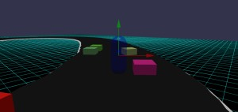
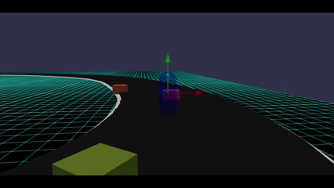

# Babylon.js：画像からコース作り（２／２）

## この記事のスナップショット



（２倍速）  


https://playground.babylonjs.com/full.html#3TDLC4

操作方法は (h)キーを押して確認してください。

（コードを見たい人はURLから `full.html` を消したURLを指定してください）

[ソース](091/)

ローカルで動かす場合、./js 以下のライブラリは 069/js を利用してください。

## 概要

画像からコース情報を抜き出して、
[Crowd Navigation System](https://doc.babylonjs.com/features/featuresDeepDive/crowdNavigation/)
のエージェントがコース上を周回できるようにしました。

この記事はその第二部。エージェントの走行について説明します。（２部構成）

コース上にCrowd Navigation System のエージェントを走らせます。
エージェントは最短経路で目的地に向かうので周回できません。
コース上を周回させるために複数の目的地をコース上に配置します。
最初の目的地に到達したら次の目的地に向かうように、目的地を再設定することで周回走を実現します。簡素な周回コースなら３，４等分した位置に目的地を配置します。ちなみに目的地の配置をうまく調整すれば、交差するコースでも意図した順でコースをなぞらえることができます。


## やったこと

（１部）
- 画像からコース情報を抜き出す
- 立体コース

（２部）
- エージェント操作
  - 周回させるために（複数のチェックポイント）
  - 複数の走行ライン
  - 進行方向を向く
- キャラクターコントローラーを車っぽく動かす
- 既知の不具合

### エージェント操作：周回させるために（複数のチェックポイント）

同じようなことは
[Babylon.js の基礎調査：Crowd Navigation Systemで避難訓練シミュレーション](074.md)
で既に実施済みですが、＋アルファで説明したいと思います。

今回はコース上の座標点を利用して、目的地／中継地とします。コース幅が広い＆エージェントの移動速度が速いと、目的地から離れて通り過ぎることがままあるので、このときはエージェントのパラメータ reachRadiusを道幅に合わせて大きくします。

目的地に到達するごとに onReachTargetObservable が呼ばれるので、そのタイミングで次の目的地を付け替えます。目的地（座標値）のリストは pQ に持たせておいて、またエージェントごとに、目的地のリストのindex値を crowd._ag2dest に持たせてます。

```js
// 目的地に到達ごとの処理
crowd.onReachTargetObservable.add((agentInfos) => {
    let agID = agentInfos.agentIndex;
    ...
    // 「ルート／目的地のリスト」が１つしかない場合
    let dest = crowd._ag2dest[agID];
    if (dest == pQ.length-1) {
        dest = 0;
    } else {
        ++dest;
    }
    // 次の目的地を設定
    crowd._ag2dest[agID] = dest;
    crowd.agentGoto(agID, navigationPlugin.getClosestPoint(pQ[dest]));
```

### エージェント操作：複数の走行ライン

デイトナのようなハイスピードな周回コースだと、すべてのエージェントが「内側にべったり張り付いたライン」を走ります。これでは正直つまらないので、エージェントごとに違う走行ラインを持たせるようにします。
やり方は簡単で、コース上に目的地を配置して走行ラインとします。違うラインは先ほどの点の位置とズレた位置になるよう配置していきます。こうして複数の走行ラインを準備しておきます。エージェントには、どれかをラインを選んで、どのラインを走るかはエージェントのメッシュに紐づけておきます。あとは、目的地に到達するごとに、それぞれの走行ラインの座標列から次の座標／目的地を再設定します。

```js
// 事前準備
// 選んだ走行ラインをメッシュに登録してておく
agentCube.route = Math.floor(Math.random()*pQQ.length);

// 目的地に到達ごとの処理
crowd.onReachTargetObservable.add((agentInfos) => {
    let agID = agentInfos.agentIndex;
    let agentCube = agentCubeList[agID];
    ...
    // 「ルート／目的地のリスト」が複数ある場合
    let pQ_ = pQQ[agentCube.route];
    let dest = crowd._ag2dest[agID];
    if (dest == pQ_.length-1) {
        dest = 0;
    } else {
        ++dest;
    }
    // 次の目的地を設定
    crowd._ag2dest[agID] = dest;
    crowd.agentGoto(agID, navigationPlugin.getClosestPoint(pQ_[dest]));
}
```

複数ラインのエージェント  
https://playground.babylonjs.com/full.html#3TDLC4

実際にやってみると、座標値がコースにあってないのか、ちがう走行ラインなのにどれも似通った感じになってます。
また、ラインの点の間隔が広いのかうごきがカクカクしてます。うーん、視点はわるくないと思うのですが詰めが甘い感じです。

### エージェント操作：進行方向を向く

[Shark + 海バージョン](https://playground.babylonjs.com/#DP2SDJ#21)
らで cx20さんがやってる方法、速度ベクトルを抜き出し、atanで方向を計算する」のが一番簡単だと思います。

```js
// エージェントの移動速度から向きを変更する
// 参考
// https://scrapbox.io/babylonjs/Navigation_Mesh
scene.onBeforeRenderObservable.add(() => {
    for (let i = 0; i < agentCubeList.length; i++) {
        const meshAgent = agentCubeList[i];
        // 移動方向と速度を取得
        const vel = crowd.getAgentVelocity(i);
        // 速度成分から角度をもとめ、方向とする
        meshAgent.rotation.y = Math.atan2(vel.x, vel.z);
    }
});
```

この方法は使い勝手がよくて、例えば今回の「レースゲーム」の場合で開始時に進行方向を向かせたい時。
コースのスタート地点と次の地点の座標から進行方向のベクトルが取得でき、そこから方向を計算させることができます。

### キャラクターコントローラーを車っぽく動かす

せっかくのレースコースなので、キャラクターコントローラーを車っぽく動かすことにします。
ここでは下記 機能を付与します。

- 加速キー（ArrowUp/W）押下でアクセルの動作のように徐々にスピードアップさせる
  - 簡単にエンジンぽい挙動にするため三角関数（sin）を使います。
    エンジンの回転数を角度、速度を sin() で表します。
    つまり、加速キー／アクセルを押下すれば角度を増やし、キー入力がないなら徐々に角度を小さくします。
    角度は [-PI/2, PI/2]の範囲とします。負の場合は後進になります。
  - 加速キーを押さないときは、慣性の法則にならって、現状をいじしつつも徐々に減速させます。
- 疑似ドリフト
  - 通常の旋回よりもクイックに曲がれるように、特定の条件・操作で旋回角を大きくします。
    ある程度のスピードがあり、左右に転進しながら後進キー（ArrowDown/S）を押下したときにクイックにターンさせます。
- ダッシュ
  - ダッシュボタン（Ctrl）を押下することで通常よりも速く移動できるようにします。

一方で、キャラクターコントローラーで改修していた「上昇する機能」や「浮上する機能」はカットします。

### 既知の不具合

未実装、つぶしきれていない不具合がいくつかあります。

- ゴールっぽいところを通過しても何もおこならない
  - ゴール判定は未実装です。ステージ切り替え（N/Pキー）を手動でお願いいたします。
- コースアウト／テーブルから落ちると復帰できない
  - (R)で位置をリセットしてください。
- (N)/(P)でステージを切り替えたときに、キャラクターコントローラーの位置がコースからはみ出ることがある
  - (R)で位置をリセットしてください。
- エージェントが速すぎ
  - ステージごとの速さの調整が未完のままです。ステージ情報metaStageInfoの各ステージでのエージェントのスピードcnsSpeedXを小さくしてください。
  - ストレートでダッシュ（Ctrlキー）するというのもアリ

## まとめ・雑感

画像からコースを抜き出して、アップダウンや立体交差なコースもつくる手順を確立しました。また、ＣＯＭカーの動きも決められたルートを走らせることができました。ロボトレースのように二次元的に交差するコースでも決まった順路を走れるようにできました。

キャラクターコントローラーを車っぽく実装してみました。が作りこみが甘々です。

------------------------------------------------------------

前の記事：[Babylon.js：画像からコース作り（１／２）](090.md)

次の記事：[Babylon.js：皇居ラン](092.md)


目次：[目次](000.md)

この記事には次の関連記事があります。

- [Babylon.js：画像からコース作り（１／２）](090.md)
- [Babylon.js：画像からコース作り（２／２）](091.md)

--
