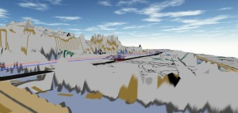

# Babylon.js：皇居ラン

## この記事のスナップショット

（１６倍速）  

https://playground.babylonjs.com/full.html#Q7VTIN

操作方法は (h)キーを押して確認してください。

（コードを見たい人はURLから `full.html` を消したURLを指定してください）

[ソース](092/)

ローカルで動かす場合、./js 以下のライブラリは 069/js を利用してください。

## 概要

約１年前に地形データの高さ、凸凹を整地してコース／道路を作りました。
[地図データの加工](023.md)
。

今回は地形データと道路をわけて、地形はそのまま、道路は地図上の点を抜き出し、手動で高さを与え、補間でコースを作成します。
（前回の記事
[Babylon.js：画像からコース作り（１／２）](090.md)
を参照。）今回の題材に「皇居ラン」を選びました。

高低差を強調するために高さのスケールを約７倍にいじってます。

## やったこと

- 国土地理院より地形データ（３Ｄ）および淡色地図（道路情報あり）を取得
- マラソンコースの作成
  - 淡色地図（画像）からコースのポイントを取得、高さを指定
- 地形データとコースの合わせこみ
  - 地形データと道路データのスケールと位置の調整
  - 道路データのアップダウン調整

## まとめ・雑感

以前（地形データをいじっていた頃）に比べると道路の整形は格段に楽になりました。一方でこんな苦労も。

- 地形データと道路のスケールがそもそも違うので調整が必須。
- 道路の凹凸の修正が思った以上にてこずる。
  - 地図上ではだいたい等間隔にマーキングしていても補間されると結構凹凸が目立つ。
  - 地形に合わせようとすると、道路が思いのほか凸凹したり、道幅の端で隙間ができたり、めり込んだり。

PLATEAUの道路情報を使えば、スマートにできるかもしれないけど、懸念もあり。

- 都市部の小規模地域ならまだしも、山間部の峠道（長距離）となると、道路データがあるのかあやしい。
  - 以前、ビーナスラインに着手したとき地図の倍率が変わると道路情報がズレまくりで手動で補正しまくった経緯あり。
- 地図が広範囲になって読み込めるか／動かせるかあやしい。
- ツールを十全に使いこなせないのでやりかたは今一つよくわからん

------------------------------------------------------------

前の記事：[Babylon.js：画像からコース作り（２／２）](091.md)

次の記事：..

目次：[目次](000.md)

この記事には次の関連記事があります。

- [地図データの加工](023.md)
- [Babylon.js：画像からコース作り（１／２）](090.md)
- [Babylon.js：画像からコース作り（２／２）](091.md)

--
