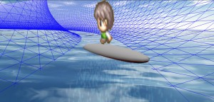
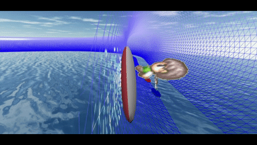
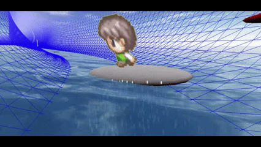
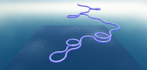
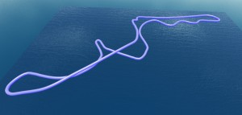
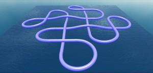
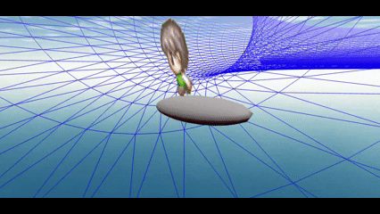
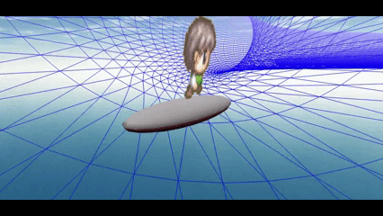
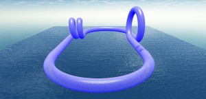
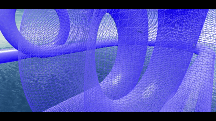

# Babylon.js で物理演算(havok)：パイプ内をボードで滑る（２）

## この記事のスナップショット

滑っている様子（４倍速）  

パイプ内を一回転（２倍速）  

https://playground.babylonjs.com/full.html#ZKAESB

操作方法は (h)キーを押して確認してください。

（コードを見たい人はURLから `full.html` を消したURLを指定してください）

[ソース](093/)

ローカルで動かす場合、./js 以下のライブラリは 069/js を利用してください。

## 概要

前々回あたりの記事でいろいろコースを作ったときに、このコースをパイプにして走ったら楽しいかも？！
という思い付きからコースとボードを用意しました。

「パイプ内のをボードで滑る」というのは
[Babylon.js で物理演算(havok)：パイプ内をボードで滑る](070.md)
で実施済みですが、今回はその手直し。

## やったこと

以前の「パイプ内をボードで滑る」からの差分としては次のとおり。

- ボードの上にキャラクター（平面の絵）を乗せてます。
- ボードの制御／コントロール変更
  - 推進力を付与（ArrowUP/W）
  - 左右同時押しでロール回転
  - Ctrl＋左／右で通常以上のヨー回転
- コースを増やしました（前回のコースを含む３９コース）
  - 全コースが気になる人は github の ./pic をのぞいてみてください。000.jpg ~ 038.jpgがコース図になってます。同じコースに見えるものは逆走です。
  - 前回の「パイプ内をボードで滑る」のコースもほぼそのまま掲載してます。
    ただ、ランダムでコースを作る場合、場外にいかないよう、中心からある程度離れたら中心に戻るよう乱数を調整しています。

    ランダムなコース    
    

  - [Babylon.js：画像からコース作り（１／２）](090.md)
    の一部のコースをそのままパイプにして追加

    リアルなコース    
    

  - [Babylon.js で物理演算(havok)：コーラム模様でローラーコースター](065.md)
    でつくったコースも改めて掲載しました。

    コーラム模様のコース    
    

  - コースをプログラミングして作れるよう関数化。サンプルとして新規にコースを追加

    自作のコース    
    

- ライバル／ＣＯＭとして
  [Crowd Navigation System(CNS)](https://doc.babylonjs.com/features/featuresDeepDive/crowdNavigation/)のエージェント
  を用意しました。
  - 自機と同様に、ボードにキャラクター（パネル）を乗せてます。
  - コースが長くなりすぎるとCNSが機能しないらしく、ソロプレイになってしまいます。
- 水っぽいギミック
  - 地面を海にしてみました。
  - コースによっては、ボードの下から泡／水滴がでてきます。

## まとめ・雑感

以前の「パイプ内をボードで滑る」は自由落下に任せてましたが、今回推進力を得たことで、某青いハリネズミのように壁や天井を走ることもできるようになりました。
そして操作が意外とムズイ。加速の上限がないからと加速しまくっても、壁にぶつかったり跳ねたり回転したりと思うように進まないこともしばしば。

しかし操作にクセがあるけど面白い。コーナーに対して、フロントを外側に向けて侵入するか、内側に向けて侵入するか、はたまた壁を駆け上り一周するかといろいろ攻略しがいがあります。下りと上りでも挙動が微妙にちがってくるのも興味深し。

フロントを外側に向けて侵入（４倍速）  

フロントを内側に向けて侵入（４倍速）  

地図から作ったコースを走った感想としては、「見た目以上に凸凹している」、「クランクがムズイ」、「小さなヘアピンの連続なんて無理ゲー」、「スピードをあげると跳ね上がって制御不能」と、ハードモードに爆上がりです。
自作コースは曲面がなめらかな分走りやすいですが、たまに接合部に凹凸ができていたりします。

お試しで作ったループで、ぎこちなくも垂直に登れるCNSエージェントがほほえましい。

ループのコース  

ループを走っている様子（２倍速）  

思ったよりも楽しめたのでゲームとしての完成度を上げるべく、クリア判定をいれたり、メニュー画面（コースセレクト）を作ってもよいかも。
ただ、ゲーム開始時に時間がかかる（１０秒～３０秒）のが難点ですかね。CNSのメッシュ処理に時間がかかっている模様。コースが小さければサクサクうごくんですけどね。

------------------------------------------------------------

前の記事：[Babylon.js：皇居ラン](092.md)

次の記事：[Babylon.js で物理演算(havok)：ホールゲームを作る](094.md)

目次：[目次](000.md)

この記事には関連記事がありません。

- [Babylon.js で物理演算(havok)：コーラム模様でローラーコースター](065.md)
- [Babylon.js で物理演算(havok)：パイプ内をボードで滑る](070.md)
- [Babylon.js：画像からコース作り（１／２）](090.md)

--
