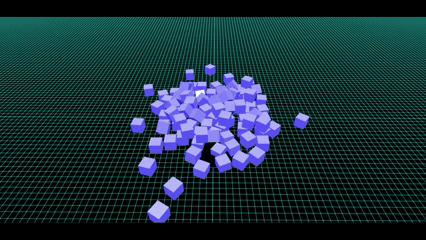
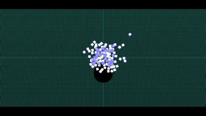
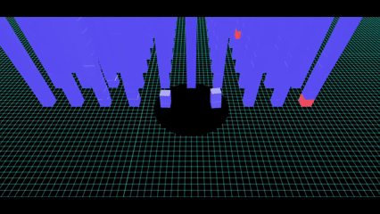
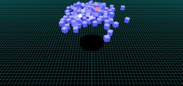
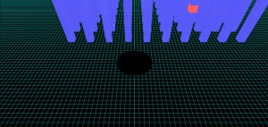

# Babylon.js で物理演算(havok)：ホールゲームを作る

## この記事のスナップショット

https://playground.babylonjs.com/full.html#UB1M9B#2

操作方法は (h)キーを押して確認してください。

（コードを見たい人はURLから `full.html` を消したURLを指定してください）

[ソース](094/)

- 094_hole_draft1 .. 施策1
- 094_hole_draft2 .. 施策2
- 094_hole .. 完成

ローカルで動かす場合、./js 以下のライブラリは 069/js を利用してください。

## 概要

穴／ホールを操作して、いろいろなモノを吸い込んで穴を大きくしていくゲーム
（hole.ioなど）をbabylon.jsで再現してみました。

機能的には下記を作りこみました。
- 地面に穴を作る／穴を操作して、モノを落とす
- 穴を大きくする／成長させる

## やったこと

- 地面に穴を作る／穴を操作して、モノを落とす
- 穴を大きくする／成長させる
- モノをひきつける
- ブラッシュアップ

### 地面に穴を作る／穴を操作して、モノを落とす

地面を直方体の平板で作成し、穴を掘るための円柱を作成したら、メッシュの引き算で穴を作成します。
技術的としては Constructive Solid Geometry（CSG）を使います。

公式ドキュメント[Merging Meshes](https://doc.babylonjs.com/features/featuresDeepDive/mesh/mergeMeshes#merging-meshes-with-constructive-solid-geometry)の例ではメッシュを一度きり作成するだけ、静的に作成する例ですが、
今回は穴を掘るための円柱を移動させて、随時メッシュを再構築します。

パフォーマンスは問題なさそうなのでこの方針で進めます。

穴を移動させる例（２倍速）  

https://playground.babylonjs.com/#UB1M9B

### 穴を大きくする／成長させる

穴を大きくするために、まず吸い込み／落下判定として、地面の下に判定用のメッシュを配置します。
穴に落としたつもりでも落ち切らずに戻ってしまう場合を考慮して、
「判定用のメッシュを抜け出た」とき、かつ「モノが地面より下」であれば、落下したものと判断します。

ここまでで「モノを落とす」という判定ができたので、モノを落とすたびに穴のサイズを大きくしてみます。

穴を大きくする／成長させる例  

https://playground.babylonjs.com/#UB1M9B#1

上記では落とした数に比例して大きくしています。
しかし急に成長しすぎるように感じます。最終的に落としたモノごとにスコアをつけて、スコアに対する log で大きさを制御しています。

### モノをひきつける

ゲームの演出として「モノをひきつける」機能を設けます。
といっても公式の[Physics Helper](https://doc.babylonjs.com/features/featuresDeepDive/physics/forces/#physics-helper)にあるサンプル[Gravitational Field](https://playground.babylonjs.com/#E5URLZ#20)をそのまま使います。

ステージに配置しているモノは、大きさの違いはあれど質量は１と軽めにしているので、弱い力でも十分に引き寄せられます。

使った感じ、発動までにタイムラグがあるように感じます。特に初回は数十秒近く時間がかかることがあります。全オブジェクトとの距離を見るために時間がかかっているのかも。

Gravitational Field（４倍速）  

### ブラッシュアップ

ゲームの完成度を上げるべく次の機能を設けています。

- 複数ステージを用意
  - ステージ例1：ランダムに配置  
    
  - ステージ例2：格子状にかつ積み上げ  
    

- ステージクリア判定を実装
  - ステージクリアとなる赤いブロック（複数の場合あり）を落とせばクリアとします。

## まとめ・雑感

ゲームの要所となるポイントは一応クリアできたかな？
改善するポイント、ブロックにテクスチャを張ったり、別のメッシュ形状を使ったり、スマフォでも操作できるようにとか考えられるけど今はここまでとしたいと思います。

このテーマは以前から取り組みたいと考えていたのですが、仕組みがよくわからずに放置してました。
運よく[Hole.ioみたいなゲームをつくろう！【GodotEngine】](https://www.youtube.com/watch?v=XNWQEgevCUE)を見つけて、「CSG機能」というキーワードで解決できました。
しかしこのゲームってずいぶん前からあったんですね...

------------------------------------------------------------

前の記事：[Babylon.js で物理演算(havok)：パイプ内をボードで滑る（２）](093.md)

次の記事：..

目次：[目次](000.md)

この記事には関連記事がありません。

--
