# Babylon.js で物理演算(havok)：パーリンノイズから渓谷を作ってみる

## この記事のスナップショット

（４倍速）  
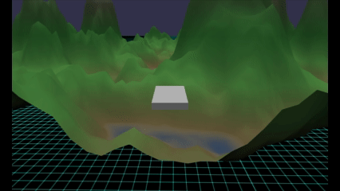

https://playground.babylonjs.com/full.html#QHOJU8

操作方法は (h)キーを押して確認してください。

（コードを見たい人はURLから `full.html` を消したURLを指定してください。上記はフル画面表示用です。）

[ソース](095/)

- 095_field
- 095_field_omake .. 材質を追加＋水面

ローカルで動かす場合、上記 git 内の 069/js を ./js に配置してください。

## 概要

以前、パーリンノイズを使った地形についての記事
[Babylon.js の基礎調査：perlinノイズを使ってみる](072.md)
をもうちょっと深堀します。

ここでは、パーリンノイズで作成した地形データを数式で変形して台地や渓谷っぽい地形に変形させました。
材質（material）に関して、ワイヤーフレーム、テクスチャ、グラデーションを用意しました。
またキャラクター視点でのカメラ操作も行いました。

これらの地形、材質、カメラに関しては動的に変更できるようにしています。

オリジナルデータ  


台地・渓谷っぽい形状  


材質：テクスチャ（砂画像）  


材質：グラデーション（多色）  


キャラクター視点  


Babylon.js Tips集に似たような記事がありますが、こちらはGPUで処理しており高速で動きます。

- [WebGPU＋ComputeShader（その14）](https://scrapbox.io/babylonjs/WebGPU%EF%BC%8BComputeShader%EF%BC%88%E3%81%9D%E3%81%AE14%EF%BC%89)

余談）本記事はCPUで処理するため大規模になると重くなるという欠点がありますが、他のプログラミング言語にも応用できます。

## やったこと

- 地形データを台地や渓谷っぽく変形させる
- 材質についての試行
- カメラコントロール

### 地形データを台地や渓谷っぽく変形させる

パーリンノイズで作成した地形データの凹凸を強調するために、関数を使います。

ここでは以下の関数を使います。

関数                  | 特徴
----------------------|------------------------------
ｎ次関数              | 上部がとがった形になりがち
tanh関数              | 上限と下限にかたより、谷底や台地ができやすい。
「上限・下限でカット」| tanhに近い形状。エッジが角張る。


二次関数(y=x^2)や三次関数(y=x^3)を使うと次のようになります。

オリジナル  


二次関数(y=x^2)の補正面  
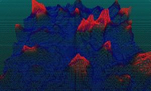

三次関数(y=x^3)の補正面  
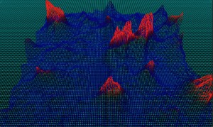

二次関数(y=x^2)の傾き、位置を変更した補正面  
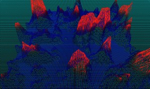


```js
// 二次関数(y=x^2)の補正処理
let fieldData2 = [];
for (let iz = 0; iz < fieldData.length; ++iz) {
    let path = []
    for (let ix = 0; ix < fieldData[0].length; ++ix) {
        let v = fieldData[iz][ix].clone();
        v.y = v.y**2;  // 二次関数(y=x^2)の補正
        v.y *= yratio;
        path.push(v);
    }
    fieldData2.push(path);
}
let trgMesh = BABYLON.MeshBuilder.CreateRibbon("ribbon", {pathArray: fieldData2, sideOrientation: BABYLON.Mesh.DOUBLESIDE});
```

一方で tanh（双曲線正接関数）を使った場合を示します。

- tanh のグラフは下図の青い線。
  - Wiki 双曲線関数より  
    

高さを tanhで変換すると[-1, 1]になるので適当にスケールを調整します。
tanhで変換する前に高さを定数倍することでエッジを利かせることができます。

高さを3倍後にtanhの補正面  
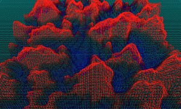

高さを5倍後にtanhの補正面  
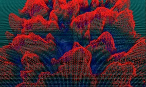

高さを10倍後にtanhの補正面  


```js
// 高さを3倍後にtanhの補正  
let fieldData2 = [];
for (let iz = 0; iz < fieldData.length; ++iz) {
    let path = []
    for (let ix = 0; ix < fieldData[0].length; ++ix) {
        let v = fieldData[iz][ix].clone();
        y2 = v.y;
        y2 = (y2-0.5)*3; // 高さを定数倍する
        expp = Math.exp(y2); expn = Math.exp(-y2);
        y3 = (expp-expn)/(expp+expn); // tanhの計算
        v.y = (y3+1.0)/2;
        v.y *= yratio;
        path.push(v);
    }
    fieldData2.push(path);
}
let trgMesh = BABYLON.MeshBuilder.CreateRibbon("ribbon", {pathArray: fieldData2, sideOrientation: BABYLON.Mesh.DOUBLESIDE});
```

同じようなことは高さを「上限・下限でカット」することで似たような形状を得ることができますが、
tanhに比べエッジが角張ってしまいます。

「上限・下限でカット」の補正  


```js
// 定数倍して、上限下限をカット
let fieldData2 = [];
for (let iz = 0; iz < fieldData.length; ++iz) {
    let path = []
    for (let ix = 0; ix < fieldData[0].length; ++ix) {
        let v = fieldData[iz][ix].clone();
        v.y = (v.y-0.5)*2+0.5;  // 定数倍、２倍にする
        if (v.y < 0) { v.y=0; } // 下限をカット
        if (v.y > 1) { v.y=1; } // 上限をカット
        v.y *= yratio;
        path.push(v);
    }
    fieldData2.push(path);
}
let trgMesh = BABYLON.MeshBuilder.CreateRibbon("ribbon", {pathArray: fieldData2, sideOrientation: BABYLON.Mesh.DOUBLESIDE});
```

おまけとして、ｎ次関数の面を上下（上は反転して配置）にすると洞窟っぽくなるかなとやってみた結果がこちらです。

二次関数の補正面（床）と三次関数の補正面（天井）  
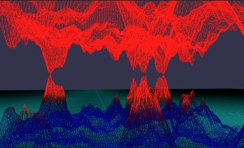


### 材質についての試行

せっかく地形っぽい形状なのでそれっぽく見えるように材質（material）をいじってみたいと思います。

ここでは下記４種類を試しました。

  - ワイヤーフレーム（２色）
  - テクスチャ（砂画像１枚）
  - テクスチャ（砂画像複数）
  - グラデーション（多色）

開発中は「ワイヤーフレーム（２色）」を用いました。
手っ取り早く形状を確認するには便利でした。が２色しか使えない上に、高さが変わるとパラメータ(smoothness,scale)の調整が必要になってくるので使い方にクセがあります。

材質：ワイヤーフレーム（２色）  
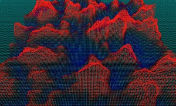

```js
let mat_ = new BABYLON.GradientMaterial("grad", scene);
mat_.topColor = new BABYLON.Color3(0.9, 0.2, 0.2);
mat_.bottomColor = new BABYLON.Color3(0.2, 0.2, 0.9);
mat_.smoothness = 5;
mat_.scale = 0.06;
mat_.wireframe = true;
```

次に、簡単試せる方法として画像（砂）を貼り付けてみました。

材質：テクスチャ（砂画像）  
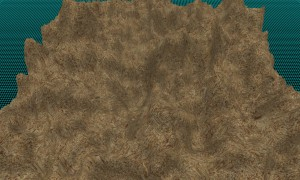

```js
const grndPath = "textures/sand.jpg";
let mat_ = new BABYLON.StandardMaterial("mat");
mat_.diffuseTexture = new BABYLON.Texture(grndPath, scene);
mat_.specularColor = new BABYLON.Color4(0, 0, 0);
matlist.push(mat_);
```

上記、曲面のサイズに対してテクスチャの画素が少ないと模様が間延びして残念な感じになります。
次のように tiling機能で並べてると砂山っぽくなります。

材質：テクスチャ（砂画像を並べる）  


```js
const grndPath = "textures/sand.jpg";
let mat_ = new BABYLON.StandardMaterial("mat");
mat_.diffuseTexture = new BABYLON.Texture(grndPath, scene);
mat_.diffuseTexture.uScale = 10; // 横に10個並べる
mat_.diffuseTexture.vScale = 10; // 縦に..
mat_.specularColor = new BABYLON.Color4(0, 0, 0);
matlist.push(mat_);
```

さて最初のワイヤーフレームのように高さでグラデーションをつけて、かつ多色にしたい場合はどするか？
公式のフォーラムに関連記事を見つけました。
[Generate materials with color gradients](https://forum.babylonjs.com/t/generate-materials-with-color-gradients/6032/4)
こちらの
[#MCJYB5#12](https://www.babylonjs-playground.com/#MCJYB5#12)
が参考になりそうです。こちらはＸ軸にグラデーションしているので、Ｙ軸に書き換えます。
配色は
[WebGPU＋ComputeShader（その14）](https://scrapbox.io/babylonjs/WebGPU%EF%BC%8BComputeShader%EF%BC%88%E3%81%9D%E3%81%AE14%EF%BC%89)
のcx20様のものを参考に６段階に色付けしてます。


材質：グラデーション（多色）  


```js
var nodeMaterial = new BABYLON.NodeMaterial(`node material`);
var position = new BABYLON.InputBlock("position");
position.setAsAttribute("position");
var worldPos = new BABYLON.TransformBlock("worldPos");
worldPos.complementZ = 0;
worldPos.complementW = 1;
position.output.connectTo(worldPos.vector);
var world = new BABYLON.InputBlock("world");
world.setAsSystemValue(BABYLON.NodeMaterialSystemValues.World);
var Transform = new BABYLON.TransformBlock("Transform");
Transform.complementZ = 0;
Transform.complementW = 1;
var normal = new BABYLON.InputBlock("normal");
normal.setAsAttribute("normal");
normal.output.connectTo(Transform.vector);
world.output.connectTo(Transform.transform);
var Lights = new BABYLON.LightBlock("Lights");
worldPos.output.connectTo(Lights.worldPosition);
Transform.output.connectTo(Lights.worldNormal);
var cameraPosition = new BABYLON.InputBlock("cameraPosition");
cameraPosition.setAsSystemValue(BABYLON.NodeMaterialSystemValues.CameraPosition);
cameraPosition.output.connectTo(Lights.cameraPosition);
var Multiply = new BABYLON.MultiplyBlock("Multiply");
var Gradient = new BABYLON.GradientBlock("Gradient");
Gradient.colorSteps.push(new BABYLON.GradientBlockColorStep(0, new BABYLON.Color3(0.15, 0.4, 0.8)));
Gradient.colorSteps.push(new BABYLON.GradientBlockColorStep(1, new BABYLON.Color3(0.6, 0.5, 0.3)));
Gradient.colorSteps.push(new BABYLON.GradientBlockColorStep(5, new BABYLON.Color3(0.4, 0.7, 0.3)));
Gradient.colorSteps.push(new BABYLON.GradientBlockColorStep(10, new BABYLON.Color3(0.2, 0.5, 0.2)));
Gradient.colorSteps.push(new BABYLON.GradientBlockColorStep(20, new BABYLON.Color3(0.4, 0.4, 0.3)));
Gradient.colorSteps.push(new BABYLON.GradientBlockColorStep(29, new BABYLON.Color3(0.90, 0.90, 0.95)));
var VectorSplitter = new BABYLON.VectorSplitterBlock("VectorSplitter");
position.output.connectTo(VectorSplitter.xyzIn);
VectorSplitter.y.connectTo(Gradient.gradient);
Gradient.output.connectTo(Multiply.left);
Lights.diffuseOutput.connectTo(Multiply.right);
var fragmentOutput = new BABYLON.FragmentOutputBlock("fragmentOutput");
Multiply.output.connectTo(fragmentOutput.rgb);
world.output.connectTo(worldPos.transform);
var worldPosviewProjectionTransform = new BABYLON.TransformBlock("worldPos * viewProjectionTransform");
worldPosviewProjectionTransform.complementZ = 0;
worldPosviewProjectionTransform.complementW = 1;
worldPos.output.connectTo(worldPosviewProjectionTransform.vector);
var viewProjection = new BABYLON.InputBlock("viewProjection");
viewProjection.setAsSystemValue(BABYLON.NodeMaterialSystemValues.ViewProjection);
viewProjection.output.connectTo(worldPosviewProjectionTransform.transform);
var vertexOutput = new BABYLON.VertexOutputBlock("vertexOutput");
worldPosviewProjectionTransform.output.connectTo(vertexOutput.vector);
nodeMaterial.addOutputNode(vertexOutput);
nodeMaterial.addOutputNode(fragmentOutput);
nodeMaterial.build();
```

### カメラコントロール

地形の確認に２つの視点を用意しました。

  - 俯瞰視点
  - キャラクター視点

「俯瞰視点」では、全体を眺められるように、
「キャラクター視点」では、ドローンのようにキャラクター（四角のボード上に平面なキャラ）を操作して、それを追跡するカメラになります。

俯瞰視点  
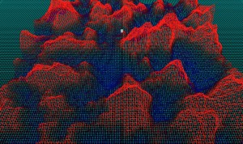

キャラクター視点  


```js
//カメラ切り替え
var changeCamera = function(icamera) {
    if (camera!=null) {camera.dispose();}
    if (icamera == 0) {
        // 俯瞰視点
        camera = new BABYLON.ArcRotateCamera("Camera", 0,0,0, new BABYLON.Vector3(0, 80,-60), scene);
        camera.setTarget(BABYLON.Vector3.Zero());
        camera.attachControl(canvas, true);
    }
    if (icamera == 1) {
        // キャラクター視点
        camera = new BABYLON.FollowCamera("FollowCam", new BABYLON.Vector3(0, 10, -10), scene);
        camera.rotationOffset = 180;
        camera.radius = 5;
        camera.heightOffset = 0.5;
        camera.cameraAcceleration = 0.05;
        camera.maxCameraSpeed = 30;
        camera.attachControl(canvas, true);
        camera.inputs.clear(); // カーソルキーでカメラ操作させないようにする
        camera.lockedTarget = myMesh;
    }
}
```

キャラクターの操作は
「ドローン操作の（モード２）」に準拠しています。
wsadで上昇下降・左右旋回、カーソルキーで前後移動・左右移動になります。

ドローン操作（２倍速）  


```js
//ドローン操作のためのキー処理
let map ={};
scene.actionManager = new BABYLON.ActionManager(scene);
scene.actionManager.registerAction(new BABYLON.ExecuteCodeAction(BABYLON.ActionManager.OnKeyDownTrigger, function (evt) {
    map[evt.sourceEvent.key] = evt.sourceEvent.type == "keydown";
}));
scene.actionManager.registerAction(new BABYLON.ExecuteCodeAction(BABYLON.ActionManager.OnKeyUpTrigger, function (evt) {
    map[evt.sourceEvent.key] = evt.sourceEvent.type == "keydown";
}));
const qYR = BABYLON.Quaternion.FromEulerAngles(0, 0.1, 0);
const qYL = BABYLON.Quaternion.FromEulerAngles(0, -0.1, 0);
let mvScale=0.2;
let cooltime_act = 0, cooltime_actIni = 10;
scene.registerAfterRender(function() {
    // ドローン（モード２）左：上昇下降・左右旋回　右スティック：前後移動・左右移動
    let quat = myMesh.rotationQuaternion;
    if (map["ArrowUp"]) {
        let vdir = BABYLON.Vector3.Forward().applyRotationQuaternion(quat);
        myMesh.position.addInPlace(vdir.scale(mvScale));
    }
    if (map["ArrowDown"]) {
        let vdir = BABYLON.Vector3.Backward().applyRotationQuaternion(quat);
        myMesh.position.addInPlace(vdir.scale(mvScale));
    }
    if (map["ArrowLeft"]) {
        let vdir = BABYLON.Vector3.Left().applyRotationQuaternion(quat);
        myMesh.position.addInPlace(vdir.scale(mvScale));
    }
    if (map["ArrowRight"]) {
        let vdir = BABYLON.Vector3.Right().applyRotationQuaternion(quat);
        myMesh.position.addInPlace(vdir.scale(mvScale));
    }

    if (map["w"]) {
        let vdir = BABYLON.Vector3.Up().applyRotationQuaternion(quat);
        myMesh.position.addInPlace(vdir.scale(mvScale));
    }
    if (map["s"]) {
        let vdir = BABYLON.Vector3.Down().applyRotationQuaternion(quat);
        myMesh.position.addInPlace(vdir.scale(mvScale));
    }
    if (map["a"]) {
        quat.multiplyInPlace(qYL);
    }
    if (map["d"]) {
        quat.multiplyInPlace(qYR);
    }

    if (map[" "]) {
        // 姿勢をリセット
        let eular = myMesh.rotationQuaternion.toEulerAngles()
        let quat = BABYLON.Quaternion.RotationYawPitchRoll(eular.y, 0, 0);
        myMesh.rotationQuaternion = quat;
        myMesh.physicsBody.setAngularVelocity(new BABYLON.Vector3(0, 0, 0)); // 回転を止める
        myMesh.physicsBody.setLinearVelocity(new BABYLON.Vector3(0, 0, 0)); // 慣性を止める
    }
    ...
```

## まとめ・雑感

地下洞窟の映像を見て、どうやればできるだろうかと悩んでました。
地形をとがらせて上下に配置すればそれっぽくなりましたが、結果、地下の大空間ぽい。
閉空間ぽくするにはもうひと工夫が必要そうです。

今回、ランダムな地形（パーリンノイズ）で渓谷を作りましたが運任せなので、恣意的に山や谷底を作りたいところ。
[WebGPU＋ComputeShader（その14）](https://scrapbox.io/babylonjs/WebGPU%EF%BC%8BComputeShader%EF%BC%88%E3%81%9D%E3%81%AE14%EF%BC%89)の「グラウンドキャニオンモード」のようにあらかじめ地形をＶ字に切れ込みをいれてパーリンノイズで表面に凹凸をつければなんとかなりそうかな？

後日ジオラマの水辺っぽくできないかな？と、材質を１つ追加、多色のグラデーションをいじってwater materialの組み合わせてみましたが今一つな出来に。
ほんと今のCGはレベル高すぎ。

追加した材質  
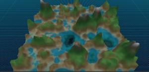

095_field_omake  
https://playground.babylonjs.com/full.html#QHOJU8#1


------------------------------------------------------------

前の記事：[Babylon.js で物理演算(havok)：ホールゲームを作る](094.md)


次の記事：..


目次：[目次](000.md)

この記事には次の関連記事があります。

- [Babylon.js の基礎調査：perlinノイズを使ってみる](072.md)

--
