# Babylon.js：アニメーション機能でモーションをつくる

## この記事のスナップショット

テニスラケットのスイング  
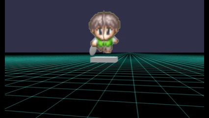

衝撃波を飛ばす  
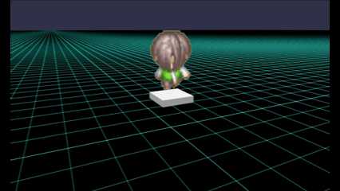

https://playground.babylonjs.com/full.html#04IUJF

操作方法は (h)キーを押して確認してください。

（コードを見たい人はURLから `full.html` を消したURLを指定してください。上記はフル画面表示用です。）

[ソース](096/)

ローカルで動かす場合、上記 git 内の 069/js を ./js に配置してください。

## 概要

公式の
[Animation](https://doc.babylonjs.com/features/featuresDeepDive/animation/)
の機能を使って、オブジェクトをスイング（振り回す）したり、衝撃波を飛ばすことをやってみました。

公式の例
[Basic Sliding Box Animation](https://playground.babylonjs.com/#7V0Y1I)
、
[Slide and Rotate Animation](https://playground.babylonjs.com/#9WUJN#12)
では移動させたり、回転させたりとシンプルなものです。
これらをより複雑に組み合わせ、さらに大きさ（スケール）も加えることで所望のモーションを作ります。

今回、下記モーションを作成しました。

- 周回
  - 自機のまわりを周回

    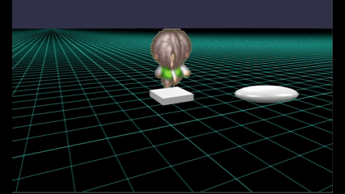

  - フライングディスク

    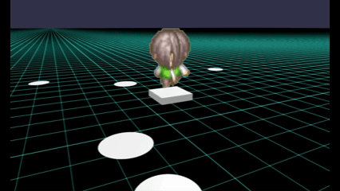

- スイング
  - 横なぎ

    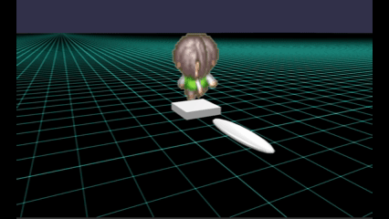

  - バットスイング

    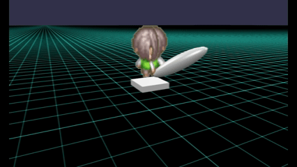

  - テニスラケットスイング（フォア、バック、スマッシュ）

    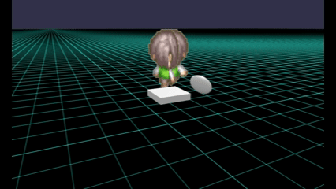

- 直線・放出
  - パンチ

    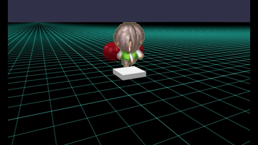

  - ナックルボール

    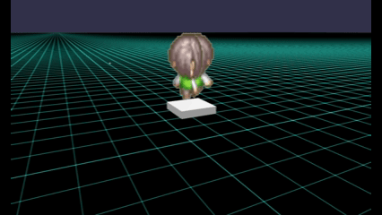

  - 衝撃波

    

  - 斬撃

    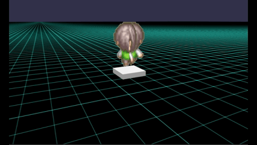


正直、「周回」させる動作などは animation を使わなくても ～render～ の関数に追加するだけでも同様な動きはできます。
ひとによってはこちらのほうが楽だったりするのかな？
ですが animationで動作をつくることで１回だけ動作させたり、任意のタイミングで繰り返し動作させたりできます。

## やったこと

- 周回：自機のまわりを周回
- 周回：フライングディスク
- スイング：横なぎ
- スイング：バットスイング
- スイング：テニスラケットスイング（フォア、バック、スマッシュ）
- 直線・放出：パンチ
- 直線・放出：ナックルボール
- 直線・放出：衝撃波
- 直線・放出：斬撃


### 周回：自機のまわりを周回

自機の周りを周回させる場合、フレームごとの座標値(x,z)をもとめるだけで十分です。
ここでは回転に合わせてメッシュ（楕円）の向きを変更するためにY軸の回転（rotation.y）も一緒に変更します。

```js
// 周回する楕円
let wpDx=1,wpDy=0.5,wpDz=2;
wpMesh = BABYLON.MeshBuilder.CreateSphere("weapon", { diameterX:wpDx, diameterY:wpDy, diameterZ:wpDz, segments: 8 }, scene);
wpMesh.position.z = wpDz;
let frameRate=10;
let xSlide = new BABYLON.Animation("xSlide", "position.x", frameRate, BABYLON.Animation.ANIMATIONTYPE_FLOAT, BABYLON.Animation.ANIMATIONLOOPMODE_CYCLE);
let zSlide = new BABYLON.Animation("zSlide", "position.z", frameRate, BABYLON.Animation.ANIMATIONTYPE_FLOAT, BABYLON.Animation.ANIMATIONLOOPMODE_CYCLE);
let yRot = new BABYLON.Animation("yRot", "rotation.y", frameRate, BABYLON.Animation.ANIMATIONTYPE_FLOAT, BABYLON.Animation.ANIMATIONLOOPMODE_CYCLE);
let keyFramesPx = [];
let keyFramesPz = [];
let keyFramesR = [], radRate=R180/frameRate, r = 3; 
for (let i = 0; i <= 2*frameRate; ++i) {
    let rad = i*radRate;
    let px = r*Math.cos(rad), pz = r*Math.sin(rad)
    keyFramesPx.push({frame:i, value:px});
    keyFramesPz.push({frame:i, value:pz});
    keyFramesR.push({frame: i, value: -rad+R90});
}
xSlide.setKeys(keyFramesPx);
zSlide.setKeys(keyFramesPz);
yRot.setKeys(keyFramesR);
scene.beginDirectAnimation(wpMesh, [yRot,xSlide,zSlide], 0, 2*frameRate, true);
wpMesh.parent = myMesh;
```

自機のまわりを周回  


### 周回：フライングディスク

こちらでは、円盤をリサージュ曲線を描くように動かし、また円盤の半径、高さ、位相を変えて複数描きます。

```js
let nwp=6;
for (let iwp=0; iwp<nwp; ++iwp) {
    let wpm = BABYLON.MeshBuilder.CreateDisc("weapon", { radius:0.4 });
    wpm.position.set(0.5, 0.7+(Math.random()-0.5)/1, 0);
    wpm.rotation.x = R90;
    wpm.parent=myMesh;
    {
        // リサージュ曲線
        let nframe=40, framePerSec=10, nframe_=nframe/2;
        let rads=R360/nframe, wr=2+Math.random()+iwp, rad0=R360*iwp/nwp;;
        let xSlide = new BABYLON.Animation("xSlide", "position.x", framePerSec, BABYLON.Animation.ANIMATIONTYPE_FLOAT, BABYLON.Animation.ANIMATIONLOOPMODE_CYCLE);
        let ySlide = new BABYLON.Animation("ySlide", "position.y", framePerSec, BABYLON.Animation.ANIMATIONTYPE_FLOAT, BABYLON.Animation.ANIMATIONLOOPMODE_CYCLE);
        let zSlide = new BABYLON.Animation("zSlide", "position.z", framePerSec, BABYLON.Animation.ANIMATIONTYPE_FLOAT, BABYLON.Animation.ANIMATIONLOOPMODE_CYCLE);
        let keyPx=[],keyPy=[],keyPz=[];
        for (let i=0; i<=nframe;++i) {
            let rad=i*rads+rad0;
            keyPx.push({frame:i, value:wr*Math.sin(2*rad)});
            keyPz.push({frame:i, value:wr*Math.sin(3*rad)});
        }
        keyPy.push({frame:0, value:0});
        keyPy.push({frame:nframe, value:Math.random()-0.5});
        xSlide.setKeys(keyPx);
        ySlide.setKeys(keyPy);
        zSlide.setKeys(keyPz);
        wpm._anima = [xSlide,ySlide,zSlide];
        wpm._nframe = nframe;
    }
    wpMeshList.push(wpm);
    scene.beginDirectAnimation(wpm, wpm._anima, 0, wpm._nframe, true);
}
```

フライングディスク  


### スイング：横なぎ

円運動（周回）ではなく、円軌道で角度を制限してさらに一回のみの動作にすると「棒を振る」動作になります。
ここでは水平に２７０度回転させてみます。

動作の終わり（最終フレーム）が振りぬいた状態で止まるとちょっと変なので、最終フレームでは初期位置に戻すことにします。

作成したアニメーションはメッシュ（wpMesh）に持たせておき、キーイベント（スペースキー押下）があれば関数 actMyMesh() を呼び出してアニメーションさせます。

```js
// 横なぎ  （２７０度回転）
let wpDx=0.5,wpDy=0.2,wpDz=2;
wpMesh = BABYLON.MeshBuilder.CreateSphere("weapon", { diameterX:wpDx, diameterY:wpDy, diameterZ:wpDz, segments: 8 }, scene);
wpMesh.position.z = wpDz;
let nframe=20, framePerSec=40;
let xSlide = new BABYLON.Animation("xSlide", "position.x", framePerSec,
                                   BABYLON.Animation.ANIMATIONTYPE_FLOAT, // animationType=0
                                   BABYLON.Animation.ANIMATIONLOOPMODE_CYCLE); // 1:Cycle Loop Mode
let zSlide = new BABYLON.Animation("zSlide", "position.z", framePerSec, BABYLON.Animation.ANIMATIONTYPE_FLOAT, BABYLON.Animation.ANIMATIONLOOPMODE_CYCLE);
let yRot = new BABYLON.Animation("yRot", "rotation.y", framePerSec, BABYLON.Animation.ANIMATIONTYPE_FLOAT, BABYLON.Animation.ANIMATIONLOOPMODE_CYCLE);
let keyFramesPx = [];
let keyFramesPz = [];
let keyFramesR = [], radRate=R270/nframe, r = 2; 
for (let i = 0; i < nframe; ++i) {
    let j = (i==nframe-1) ? 0 : i;
    let rad = -j*radRate-R90;
    let px = r*Math.cos(rad), pz = r*Math.sin(rad)
    keyFramesPx.push({frame:i, value:px});
    keyFramesPz.push({frame:i, value:pz});
    keyFramesR.push({frame: i, value: -rad+R90});
}
xSlide.setKeys(keyFramesPx);
zSlide.setKeys(keyFramesPz);
yRot.setKeys(keyFramesR);
wpMesh._anima = [yRot,xSlide,zSlide];
wpMesh._nframe = nframe;
wpMesh.parent = myMesh;
actMyMesh = function() {
    scene.beginDirectAnimation(wpMesh, wpMesh._anima, 0, wpMesh._nframe, false);
}
```

横なぎ  


### スイング：バットスイング

ここでは野球のバットスイングに挑戦します。
最初（構え）ではバット先が上がった状態で、スイング中は水平に、振り終わりで再びバット先を上げるように角度を調整してみます。

スイング動作に関して、ゲーム的にはボタン／キー押下中で振る動作、ボタン／キーを離したときに戻す動作にすべきかもしれませんが、動作アニメーションが２つ必要になります。
ここでは簡単に振る動作だけにして最終フレーム時に初期位置に元すようにします。

```js
// バットのスイングアニメーション
let wpDx=0.5,wpDy=0.5,wpDz=2;
wpMesh = BABYLON.MeshBuilder.CreateSphere("weapon", { diameterX:wpDx, diameterY:wpDy, diameterZ:wpDz, segments: 8 }, scene);
wpMesh.position.y = 0.8; // 0.5;
wpMesh.position.z = wpDz;
wpMesh.rotation.z = R45;
wpMesh.parent = myMesh;
let nframe=20, framePerSec=40, nframe_=nframe/2;
let xSlide = new BABYLON.Animation("xSlide", "position.x", framePerSec, BABYLON.Animation.ANIMATIONTYPE_FLOAT, BABYLON.Animation.ANIMATIONLOOPMODE_CYCLE);
let zSlide = new BABYLON.Animation("zSlide", "position.z", framePerSec, BABYLON.Animation.ANIMATIONTYPE_FLOAT, BABYLON.Animation.ANIMATIONLOOPMODE_CYCLE);
let yRot = new BABYLON.Animation("yRot", "rotation.y", framePerSec, BABYLON.Animation.ANIMATIONTYPE_FLOAT, BABYLON.Animation.ANIMATIONLOOPMODE_CYCLE);
let xRot = new BABYLON.Animation("xRot", "rotation.x", framePerSec, BABYLON.Animation.ANIMATIONTYPE_FLOAT, BABYLON.Animation.ANIMATIONLOOPMODE_CYCLE);
let keyFramesPx = [], keyFramesPz = [];
let keyFramesRy = [], keyFramesRx = [];
// 振りぬき後のタメ（静止）に末尾近くフレームで動作を止める
let radRate=R180/(nframe-3), r=1, radRate2=R30/nframe*2; 
for (let i = 0; i <= nframe; ++i) {
    let j;
    if (i==nframe) {
        j=0
    } else if (i>=nframe-3) {
        j=nframe-3;
    } else {
        j=i;
    }
    let rad = j*radRate-R45;
    let px = r*Math.cos(rad), pz = r*Math.sin(rad)
    keyFramesPx.push({frame:i, value:px});
    keyFramesPz.push({frame:i, value:pz});
    keyFramesRy.push({frame:i, value:-rad+R90});
    // バット先を　上げて、下げて、上げる　動作に
    let rad2 = -Math.abs(i-nframe_)*radRate2;
    keyFramesRx.push({frame:i, value:rad2});
}
xSlide.setKeys(keyFramesPx);
zSlide.setKeys(keyFramesPz);
yRot.setKeys(keyFramesRy);
xRot.setKeys(keyFramesRx);
wpMesh._anima = [yRot,xRot,xSlide,zSlide];
wpMesh._nframe = nframe;
scene.beginDirectAnimation(wpMesh, wpMesh._anima, 0, wpMesh._nframe, false);
actMyMesh = function() {
    scene.beginDirectAnimation(wpMesh, wpMesh._anima, 0, wpMesh._nframe, false);
}
```

バットスイング  


スイング動作をみていると違和感を感じるかもしれません。
バット先を上げたり下げたりするためにX軸回転のみで表現してみましたが、
よりリアルに動かすには他の回転軸や位置も調整しないとダメかもしれません。
そうなるとモーションキャプチャーで動きをトレースしないと、、、そんなの個人開発では無理（ぐぬぬ。

### スイング：テニスラケットスイング（フォア、バック、スマッシュ）

ここではテニスラケットのスイング（３種類）で動かしてみます。
下記３種類のアニメーションを用意して、キー入力で動作を切り替えます。
アクション動作（スペースキー）時に方向キー（カーソル）の入力に合わせて切り替えます。

各動作で必要な変数（位置、角度）は違いますが、アニメーションを切り替えて動作させたときに以前のパラメータを継承するみたいで位置や角度がずれたモーションになることがありました。そこで使わない変数も初期値（固定値）を設定してます。このため６変数を使ったアニメーションになってます。

```js
// テニスラケットの動作アニメーション
let wpDx=0.5,wpDy=0.1,wpDz=0.7;
wpMesh = BABYLON.MeshBuilder.CreateSphere("weapon", { diameterX:wpDx, diameterY:wpDy, diameterZ:wpDz, segments: 8 }, scene);
wpMesh.position.y = 0.8;
wpMesh.position.z = wpDz;
wpMesh.rotation.z = R90;
wpMesh.parent = myMesh;
let nframe=20, framePerSec=40, nframe_=nframe/2;

{
    // 右下後方から左上前方へ（右利きのフォアハンド
    let xSlide = new BABYLON.Animation("xSlide", "position.x", framePerSec,BABYLON.Animation.ANIMATIONTYPE_FLOAT, BABYLON.Animation.ANIMATIONLOOPMODE_CYCLE);
    let zSlide = new BABYLON.Animation("zSlide", "position.z", framePerSec,BABYLON.Animation.ANIMATIONTYPE_FLOAT, BABYLON.Animation.ANIMATIONLOOPMODE_CYCLE);
    let ySlide = new BABYLON.Animation("ySlide", "position.y", framePerSec,BABYLON.Animation.ANIMATIONTYPE_FLOAT, BABYLON.Animation.ANIMATIONLOOPMODE_CYCLE);
    let yRot = new BABYLON.Animation("yRot", "rotation.y", framePerSec, BABYLON.Animation.ANIMATIONTYPE_FLOAT, BABYLON.Animation.ANIMATIONLOOPMODE_CYCLE);
    let xRot = new BABYLON.Animation("xRot", "rotation.x", framePerSec, BABYLON.Animation.ANIMATIONTYPE_FLOAT, BABYLON.Animation.ANIMATIONLOOPMODE_CYCLE);
    let zRot = new BABYLON.Animation("xRot", "rotation.z", framePerSec, BABYLON.Animation.ANIMATIONTYPE_FLOAT, BABYLON.Animation.ANIMATIONLOOPMODE_CYCLE);
    let keyFramesPx = [], keyFramesPz = [], keyFramesPy = [];
    let keyFramesRy = [], keyFramesRx = [], keyFramesRz = [];
    // 振りぬき後のタメ（静止）に末尾近くフレームで動作を止める
    let radRate=R180/(nframe-3), r=1, radRate2=R30/nframe*2; 
    for (let i = 0; i <= nframe; ++i) {
        let j;
        if (i==0 || i==nframe) {
            j=0; // j=12;//正面のつもりだったけど
        } else if (i>=nframe-3) {
            j=nframe-3;
        } else {
            j=i;
        }
        let rad = j*radRate-R45;
        let px = r*Math.cos(rad), pz = r*Math.sin(rad), py=j*0.05+0.4;
        keyFramesPx.push({frame:i, value:px});
        keyFramesPz.push({frame:i, value:pz});
        keyFramesPy.push({frame:i, value:py});
        keyFramesRy.push({frame:i, value:-rad+R90});
        let rad2 = -j*radRate2+R30;
        keyFramesRx.push({frame:i, value:rad2});
        keyFramesRz.push({frame:i, value:R90});
    }
    xSlide.setKeys(keyFramesPx);
    zSlide.setKeys(keyFramesPz);
    ySlide.setKeys(keyFramesPy);
    yRot.setKeys(keyFramesRy);
    xRot.setKeys(keyFramesRx);
    zRot.setKeys(keyFramesRz);
    wpMesh._anima = [yRot,xRot,zRot,xSlide,zSlide,ySlide];
    wpMesh._nframe = nframe;
    wpMesh._act = 0;
}

{
    // 左下後方から右上前方へ（右利きのバックハンド
    let xSlide = new BABYLON.Animation("xSlide", "position.x", framePerSec,BABYLON.Animation.ANIMATIONTYPE_FLOAT, BABYLON.Animation.ANIMATIONLOOPMODE_CYCLE);
    let zSlide = new BABYLON.Animation("zSlide", "position.z", framePerSec,BABYLON.Animation.ANIMATIONTYPE_FLOAT, BABYLON.Animation.ANIMATIONLOOPMODE_CYCLE);
    let ySlide = new BABYLON.Animation("ySlide", "position.y", framePerSec,BABYLON.Animation.ANIMATIONTYPE_FLOAT, BABYLON.Animation.ANIMATIONLOOPMODE_CYCLE);
    let yRot = new BABYLON.Animation("yRot", "rotation.y", framePerSec, BABYLON.Animation.ANIMATIONTYPE_FLOAT, BABYLON.Animation.ANIMATIONLOOPMODE_CYCLE);
    let xRot = new BABYLON.Animation("xRot", "rotation.x", framePerSec, BABYLON.Animation.ANIMATIONTYPE_FLOAT, BABYLON.Animation.ANIMATIONLOOPMODE_CYCLE);
    let zRot = new BABYLON.Animation("xRot", "rotation.z", framePerSec, BABYLON.Animation.ANIMATIONTYPE_FLOAT, BABYLON.Animation.ANIMATIONLOOPMODE_CYCLE);
    let keyFramesPx = [], keyFramesPz = [], keyFramesPy = [];
    let keyFramesRy = [], keyFramesRx = [], keyFramesRz = [];
    // 振りぬき後のタメ（静止）に末尾近くフレームで動作を止める
    let radRate=R180/(nframe-3), r=1, radRate2=R30/nframe*2; 
    for (let i = 0; i <= nframe; ++i) {
        let j;
        if (i==0 || i==nframe) {
            j=0;
        } else if (i>=nframe-3) {
            j=nframe-3;
        } else {
            j=i;
        }
        let rad = R225-j*radRate;
        let px = r*Math.cos(rad), pz = r*Math.sin(rad), py=j*0.05+0.4;
        keyFramesPx.push({frame:i, value:px});
        keyFramesPz.push({frame:i, value:pz});
        keyFramesPy.push({frame:i, value:py});
        keyFramesRy.push({frame:i, value:-rad+R90});
        let rad2 = -j*radRate2+R30;
        keyFramesRx.push({frame:i, value:rad2});
        keyFramesRz.push({frame:i, value:R90});
    }
    xSlide.setKeys(keyFramesPx);
    zSlide.setKeys(keyFramesPz);
    ySlide.setKeys(keyFramesPy);
    yRot.setKeys(keyFramesRy);
    xRot.setKeys(keyFramesRx);
    zRot.setKeys(keyFramesRz);
    wpMesh._anima2 = [yRot,xRot,zRot,xSlide,zSlide,ySlide];
    wpMesh._nframe2 = nframe;
}

{
    // スマッシュ
    let xSlide = new BABYLON.Animation("xSlide", "position.x", framePerSec,BABYLON.Animation.ANIMATIONTYPE_FLOAT, BABYLON.Animation.ANIMATIONLOOPMODE_CYCLE);
    let zSlide = new BABYLON.Animation("zSlide", "position.z", framePerSec,BABYLON.Animation.ANIMATIONTYPE_FLOAT, BABYLON.Animation.ANIMATIONLOOPMODE_CYCLE);
    let ySlide = new BABYLON.Animation("ySlide", "position.y", framePerSec,BABYLON.Animation.ANIMATIONTYPE_FLOAT, BABYLON.Animation.ANIMATIONLOOPMODE_CYCLE);
    let xRot = new BABYLON.Animation("xRot", "rotation.x", framePerSec, BABYLON.Animation.ANIMATIONTYPE_FLOAT, BABYLON.Animation.ANIMATIONLOOPMODE_CYCLE);
    let zRot = new BABYLON.Animation("xRot", "rotation.z", framePerSec, BABYLON.Animation.ANIMATIONTYPE_FLOAT, BABYLON.Animation.ANIMATIONLOOPMODE_CYCLE);
    let yRot = new BABYLON.Animation("yRot", "rotation.y", framePerSec, BABYLON.Animation.ANIMATIONTYPE_FLOAT, BABYLON.Animation.ANIMATIONLOOPMODE_CYCLE);
    let keyFramesPx = [], keyFramesPz = [], keyFramesPy = [];
    let keyFramesRy = [], keyFramesRx = [], keyFramesRz = [];
    // 振りぬき後のタメ（静止）に末尾近くフレームで動作を止める
    let radRate=R180/(nframe-3), r=1.1, radRate2=R30/nframe*2; 
    for (let i = 0; i <= nframe; ++i) {
        let j;
        if (i==0 || i==nframe) {
            j=0;
        } else if (i>=nframe-3) {
            j=nframe-3;
        } else {
            j=i;
        }
        let rad = R180-j*radRate, rad2 = j*radRate;
        let pz = r*Math.cos(rad), py = r*Math.sin(rad)+1.1;
        keyFramesPz.push({frame:i, value:pz});
        keyFramesPy.push({frame:i, value:py});
        keyFramesPx.push({frame:i, value:0});
        keyFramesRx.push({frame:i, value:rad2});
        keyFramesRz.push({frame:i, value:0});
        keyFramesRy.push({frame:i, value:0});
    }
    zSlide.setKeys(keyFramesPz);
    ySlide.setKeys(keyFramesPy);
    xSlide.setKeys(keyFramesPx);
    xRot.setKeys(keyFramesRx);
    zRot.setKeys(keyFramesRz);
    yRot.setKeys(keyFramesRy);
    wpMesh._anima3 = [xRot,zRot,yRot,zSlide,ySlide,xSlide];
    wpMesh._nframe3 = nframe;
}

actMyMesh = function() {
    if (wpMesh._act==0) {
         scene.beginDirectAnimation(wpMesh, wpMesh._anima, 0, wpMesh._nframe, false);
    } else if (wpMesh._act==1) {
        scene.beginDirectAnimation(wpMesh, wpMesh._anima2, 0, wpMesh._nframe2, false);
    } else {
        scene.beginDirectAnimation(wpMesh, wpMesh._anima3, 0, wpMesh._nframe3, false);
    }
}
```

テニスラケットスイング（フォア、バック、スマッシュ）  


### 直線・放出：パンチ

パンチの動作は、前方に動かすだけの簡単なアニメーションで実現できます。

ここでは２つの動作、右パンチ、左パンチを用意して、動作をカウントし、
「ジャブ」「ジャブ」「ストレート」
の動作にチャレンジしてみましたが、上手く動作しない..

セマフォなりロックなり仕込まないと安定しないのかも？

```js
// 武器：パンチ
let wpD=0.8, wpD_=0.5, wpMesh1, wpMesh2;
// パンチ(右)
wpMesh1 = BABYLON.MeshBuilder.CreateSphere("weapon", { diameter:wpD, segments: 8 }, scene);
wpMesh1.position.x = wpD_;
wpMesh1.position.y = 0.8;
wpMesh1.position.z = 0.5;
wpMesh1.material = new BABYLON.StandardMaterial("mat", scene);
wpMesh1.material.diffuseColor = BABYLON.Color3.Red();
wpMesh1.material.alpha = 0.7;
// パンチ(左)
wpMesh2 = BABYLON.MeshBuilder.CreateSphere("weapon", { diameter:wpD, segments: 8 }, scene);
wpMesh2.position.x = -wpD_;
wpMesh2.position.y = 0.8;
wpMesh2.position.z = 0.5;
wpMesh2.material = new BABYLON.StandardMaterial("mat", scene);
wpMesh2.material.diffuseColor = BABYLON.Color3.Red();
wpMesh2.material.alpha = 0.7;
let nframe=20, framePerSec=80;
let zSlide = new BABYLON.Animation("zSlide", "position.z", framePerSec, BABYLON.Animation.ANIMATIONTYPE_FLOAT, BABYLON.Animation.ANIMATIONLOOPMODE_CYCLE);
let keyFramesPz = [];
{
    keyFramesPz.push({frame:0, value:0.5});
    keyFramesPz.push({frame:nframe/2, value:2});
    keyFramesPz.push({frame:nframe, value:0.5});
}
zSlide.setKeys(keyFramesPz);
wpMesh1._act = 0;
wpMesh1._i = 0;
wpMesh1._anima = [zSlide];
wpMesh1._nframe = nframe;
wpMeshList.push(wpMesh1);
wpMeshList.push(wpMesh2);
wpMesh1.parent = myMesh;
wpMesh2.parent = myMesh;
let _onAnimationEnd = function(){ wpMeshList[0]._act=0; }
actMyMesh = function() {
    // ジャブ、ジャブ、ストレート　のつもりだが上手く動作しないｗ
    ++(wpMeshList[0]._i);
    if (wpMeshList[0]._i >= 3 &&wpMeshList[0]._act==0) {
        // ストレート
        wpMeshList[0]._i = 0;
        wpMeshList[0]._act=2;
        let anim = scene.beginDirectAnimation(wpMeshList[0], wpMeshList[0]._anima, 0, wpMeshList[0]._nframe, false);
        anim.onAnimationEnd = _onAnimationEnd;
    } else if (wpMeshList[0]._act<=1) {
        // ジャブ
        wpMeshList[0]._act=1;
        let anim = scene.beginDirectAnimation(wpMeshList[1], wpMeshList[0]._anima, 0, wpMeshList[0]._nframe, false);
        anim.onAnimationEnd = _onAnimationEnd;
    }
}
```

パンチ  
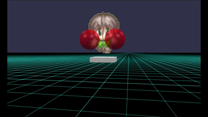

### 直線・放出：ナックルボール

前方に向かって直線的に放出するのは簡単ですが動きが単調です。
そこで不規則な動きをするように上下左右に揺らぎをいれて、且つ複数のパターンを用意します。

下記では同時に２０個まで表示できるようにしています。
アニメーション動作を配列に格納して循環させ使います。

同時に表示できる個数が少ない場合、アクション動作を連発するとアニメーションが途切れて新たなアニメーションとして開始されます。
結果、連射するものの射程が短くなるようです。

```js
// 武器：ナックルボール（ランダムで揺れる）
let nwp=20, wpr=0.1;
for (let iwp=0; iwp<nwp; ++iwp) {
    let wpm = BABYLON.MeshBuilder.CreateSphere("weapon", { diameter: wpr });
    wpm.position.set(0.5, 0.7, 0);
    wpm.parent=myMesh;
    {
        let nframe=20, framePerSec=40, nframe_=nframe/2;
        let nframe1=6,nframe2=13,nframe3=19;
        let zSlide = new BABYLON.Animation("zSlide", "position.z", framePerSec, BABYLON.Animation.ANIMATIONTYPE_FLOAT, BABYLON.Animation.ANIMATIONLOOPMODE_CYCLE);
        let xSlide = new BABYLON.Animation("xSlide", "position.x", framePerSec, BABYLON.Animation.ANIMATIONTYPE_FLOAT, BABYLON.Animation.ANIMATIONLOOPMODE_CYCLE);
        let ySlide = new BABYLON.Animation("ySlide", "position.y", framePerSec, BABYLON.Animation.ANIMATIONTYPE_FLOAT, BABYLON.Animation.ANIMATIONLOOPMODE_CYCLE);
        let keyPz=[],keyPx=[],keyPy=[];
        keyPz.push({frame:0, value:0});
        keyPz.push({frame:nframe-1, value:10});
        keyPz.push({frame:nframe, value:0});
        keyPx.push({frame:0, value:0});
        keyPx.push({frame:nframe1, value:Math.random()-0.5});
        keyPx.push({frame:nframe2, value:Math.random()-0.5});
        keyPx.push({frame:nframe3, value:Math.random()-0.5});
        keyPx.push({frame:nframe, value:0});
        keyPy.push({frame:0, value:0});
        keyPy.push({frame:nframe1, value:Math.random()-0.5});
        keyPy.push({frame:nframe2, value:Math.random()-0.5});
        keyPy.push({frame:nframe3, value:Math.random()-0.5});
        keyPy.push({frame:nframe, value:0});
        zSlide.setKeys(keyPz);
        xSlide.setKeys(keyPx);
        ySlide.setKeys(keyPy);
        wpm._anima = [zSlide,xSlide,ySlide];
        wpm._nframe = nframe;
    }
    wpMeshList.push(wpm);
}
actMyMesh = function() {
    let wpm = wpMeshList.shift();
    wpMeshList.push(wpm);
    scene.beginDirectAnimation(wpm, wpm._anima, 0, wpm._nframe, false);
}
```

ナックルボール  


### 直線・放出：衝撃波

衝撃波（半球）を飛ばす場合、座標だけでなくサイズも変更します。

```js
// 衝撃波：球をslice（ランダムで揺らす）
let nwp=20, wpr=1.1, wps=0.4, wpsrate=6;
for (let iwp=0; iwp<nwp; ++iwp) {
    let wpm = BABYLON.MeshBuilder.CreateSphere("weapon", {diameter: wpr, slice:wps, sideOrientation: BABYLON.Mesh.DOUBLESIDE});
    let px=0.5, py=0.7;
    wpm.position.set(px, py, 0);
    wpm.rotation.x = R90;
    wpm.scaling.set(0,0,0);
    wpm.material = new BABYLON.StandardMaterial("mat", scene);
    wpm.material.diffuseColor = BABYLON.Color3.Red();
    wpm.material.alpha = 0.5;
    wpm.parent=myMesh;
    {
        let nframe=20, framePerSec=40, nframe_=nframe/2;
        let nframe1=6,nframe2=13,nframe3=19;
        let zSlide = new BABYLON.Animation("zSlide", "position.z", framePerSec, BABYLON.Animation.ANIMATIONTYPE_FLOAT, BABYLON.Animation.ANIMATIONLOOPMODE_CYCLE);
        let xSlide = new BABYLON.Animation("xSlide", "position.x", framePerSec, BABYLON.Animation.ANIMATIONTYPE_FLOAT, BABYLON.Animation.ANIMATIONLOOPMODE_CYCLE);
        let ySlide = new BABYLON.Animation("ySlide", "position.y", framePerSec, BABYLON.Animation.ANIMATIONTYPE_FLOAT, BABYLON.Animation.ANIMATIONLOOPMODE_CYCLE);
        let xScale = new BABYLON.Animation("xSlide", "scaling.x", framePerSec, BABYLON.Animation.ANIMATIONTYPE_FLOAT, BABYLON.Animation.ANIMATIONLOOPMODE_CYCLE);
        let yScale = new BABYLON.Animation("ySlide", "scaling.y", framePerSec, BABYLON.Animation.ANIMATIONTYPE_FLOAT, BABYLON.Animation.ANIMATIONLOOPMODE_CYCLE);
        let zScale = new BABYLON.Animation("zSlide", "scaling.z", framePerSec, BABYLON.Animation.ANIMATIONTYPE_FLOAT, BABYLON.Animation.ANIMATIONLOOPMODE_CYCLE);
        let keyPz=[],keyPx=[],keyPy=[];
        let keySx=[],keySy=[],keySz=[];
        keyPz.push({frame:0, value:0});
        keyPz.push({frame:nframe-1, value:10});
        keyPz.push({frame:nframe, value:0});
        keyPx.push({frame:0, value:px});
        keyPx.push({frame:nframe, value:px});
        keyPy.push({frame:0, value:py});
        keyPy.push({frame:nframe, value:py});
        keySx.push({frame:0, value:0});
        keySx.push({frame:nframe-1, value:wpsrate});
        keySx.push({frame:nframe, value:0});
        keySy.push({frame:0, value:0});
        keySy.push({frame:nframe-1, value:wpsrate });
        keySy.push({frame:nframe, value:0});
        keySz.push({frame:0, value:0});
        keySz.push({frame:nframe-1, value:wpsrate });
        keySz.push({frame:nframe, value:0});
        zSlide.setKeys(keyPz);
        xSlide.setKeys(keyPx);
        ySlide.setKeys(keyPy);
        xScale.setKeys(keySx);
        yScale.setKeys(keySy);
        zScale.setKeys(keySz);
        wpm._anima = [zSlide,xSlide,ySlide,xScale,yScale,zScale];
        wpm._nframe = nframe;
    }
    wpMeshList.push(wpm);
}
actMyMesh = function() {
    let wpm = wpMeshList.shift();
    wpMeshList.push(wpm);
    scene.beginDirectAnimation(wpm, wpm._anima, 0, wpm._nframe, false);
}
```

衝撃波  


### 直線・放出：斬撃

斬撃（線分）をランダムに傾けて飛ばす場合、衝撃波のときと同様に座標、サイズを変更しつつ、さらに角度（姿勢）を考慮する必要があります。
斬撃のメッシュを傾き（初期の姿勢）として、クォータニオンからオイラー角を取得し、その角度を固定してアニメーションさせます。

```js
// ショートケーキ型／くさび型
let nwp=20, wpL=20, wpSMax=10;
for (let iwp=0; iwp<nwp; ++iwp) {
    let wpm = BABYLON.MeshBuilder.CreateCylinder("weapon", {arc: 0.1, enclose:true, height:0.02 });
    let px=0.0, py=0.7;
    wpm.position.set(px, py, 0);
    wpm.rotation.y = R90-0.3;
    wpm.parent=myMesh;
    {
        let nframe=20, framePerSec=80, nframe_=nframe/2;
        let nframe1=6,nframe2=13,nframe3=19;
        let zSlide = new BABYLON.Animation("zPos", "position.z", framePerSec, BABYLON.Animation.ANIMATIONTYPE_FLOAT, BABYLON.Animation.ANIMATIONLOOPMODE_CYCLE);
        let xSlide = new BABYLON.Animation("xPos", "position.x", framePerSec, BABYLON.Animation.ANIMATIONTYPE_FLOAT, BABYLON.Animation.ANIMATIONLOOPMODE_CYCLE);
        let ySlide = new BABYLON.Animation("yPos", "position.y", framePerSec, BABYLON.Animation.ANIMATIONTYPE_FLOAT, BABYLON.Animation.ANIMATIONLOOPMODE_CYCLE);
        let xScale = new BABYLON.Animation("xSld", "scaling.x", framePerSec, BABYLON.Animation.ANIMATIONTYPE_FLOAT, BABYLON.Animation.ANIMATIONLOOPMODE_CYCLE);
        let yScale = new BABYLON.Animation("ySld", "scaling.y", framePerSec, BABYLON.Animation.ANIMATIONTYPE_FLOAT, BABYLON.Animation.ANIMATIONLOOPMODE_CYCLE);
        let zScale = new BABYLON.Animation("zSld", "scaling.z", framePerSec, BABYLON.Animation.ANIMATIONTYPE_FLOAT, BABYLON.Animation.ANIMATIONLOOPMODE_CYCLE);
        let xRot = new BABYLON.Animation("xRot", "rotation.x", framePerSec, BABYLON.Animation.ANIMATIONTYPE_FLOAT, BABYLON.Animation.ANIMATIONLOOPMODE_CYCLE);
        let yRot = new BABYLON.Animation("yRot", "rotation.y", framePerSec, BABYLON.Animation.ANIMATIONTYPE_FLOAT, BABYLON.Animation.ANIMATIONLOOPMODE_CYCLE);
        let zRot = new BABYLON.Animation("zRot", "rotation.z", framePerSec, BABYLON.Animation.ANIMATIONTYPE_FLOAT, BABYLON.Animation.ANIMATIONLOOPMODE_CYCLE);
        let keyPz=[],keyPx=[],keyPy=[];
        let keySx=[],keySy=[],keySz=[];
        let keyRx=[],keyRy=[],keyRz=[];
        let wpmQ=BABYLON.Quaternion.FromEulerAngles(0, R90-0.3, 0);
        // 進行方向を回転軸としてランダムな角度でロールさせる
        wpmQ=BABYLON.Quaternion.FromEulerAngles(0, 0, R180*Math.random()).multiply(wpmQ);
        let wpmEA = wpmQ.toEulerAngles();
        keyPz.push({frame:0, value:0});
        keyPz.push({frame:nframe-1, value:wpL});
        keyPz.push({frame:nframe, value:0});
        keyPx.push({frame:0, value:px});
        keyPx.push({frame:nframe3, value:px});
        keyPx.push({frame:nframe, value:px});
        keyPy.push({frame:0, value:py});
        keyPy.push({frame:nframe3, value:py});
        keyPy.push({frame:nframe, value:py});
        keySx.push({frame:0, value:0});
        keySx.push({frame:nframe-1, value:wpSMax});
        keySx.push({frame:nframe, value:0});
        keySy.push({frame:0, value:0});
        keySy.push({frame:nframe-1, value:wpSMax });
        keySy.push({frame:nframe, value:0});
        keySz.push({frame:0, value:0});
        keySz.push({frame:nframe-1, value:wpSMax });
        keySz.push({frame:nframe, value:0});
        keyRx.push({frame:0, value:wpmEA.x});
        keyRx.push({frame:nframe, value:wpmEA.x});
        keyRy.push({frame:0, value:wpmEA.y});
        keyRy.push({frame:nframe, value:wpmEA.y});
        keyRz.push({frame:0, value:wpmEA.z});
        keyRz.push({frame:nframe, value:wpmEA.z});
        zSlide.setKeys(keyPz);
        xSlide.setKeys(keyPx);
        ySlide.setKeys(keyPy);
        xScale.setKeys(keySx);
        yScale.setKeys(keySy);
        zScale.setKeys(keySz);
        xRot.setKeys(keyRx);
        yRot.setKeys(keyRy);
        zRot.setKeys(keyRz);
        wpm._anima = [zSlide,xSlide,ySlide,xScale,yScale,zScale,xRot,yRot,zRot];
        wpm._nframe = nframe;
    }
    wpMeshList.push(wpm);
}
actMyMesh = function() {
    let wpm = wpMeshList.shift();
    wpMeshList.push(wpm);
    scene.beginDirectAnimation(wpm, wpm._anima, 0, wpm._nframe, false);
}
```

斬撃  


## まとめ・雑感

お詫び。アニメーション動作に注力したかったのでメッシュは超手抜きです。
バットもテニスラケットも基本メッシュの中で代用できそうなものを使いました。

「直線・放出」をいろいろと試しているとすぐに気づきますが、
方向転換しながら放出すると放出したメッシュも引きずられて進行方向が変わります。
アニメーションさせる mesh のparent に自機を登録しているためですが、これを外すと世界座標系で固定されるようで、移動や方向転換してもアニメーション動作が置いてけぼりに。
最悪、自機の位置ごとにアニメーションを計算、再登録すれば良さげなんですが、自前で毎回レンダリングするときと変わらなくなって残念なことに。
何か解決策がありそうな気もしますが今のこのままで。
というか「放出系で使わなければ良い」ということに落ち着くのかな？

衝撃波も一緒に回転する（位置がずれている）様子  
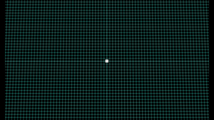

後日談

[Arc Rotate Camera](https://doc.babylonjs.com/features/featuresDeepDive/cameras/camera_introduction#arc-rotate-camera)
にある[ArcRotateCamera Offset Demo](https://playground.babylonjs.com/#3B5W22#29)
を見ていたら、アニメーションの変数に Vector3 を使えたり、alpha値にも適用できることがわかりました。
これを知っていたらもっとすっきりとコードをかけたのに。
こういったサンプルはAnimationの方にも欲しいです。

前の記事：[Babylon.js で物理演算(havok)：パーリンノイズから渓谷を作ってみる](095.md)

次の記事：..


目次：[目次](000.md)

この記事には関連記事がありません。

--
