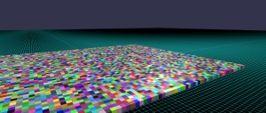
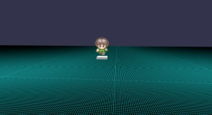
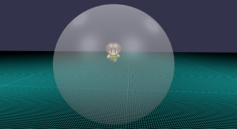
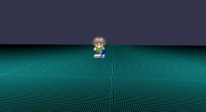
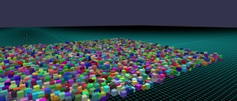
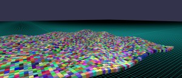
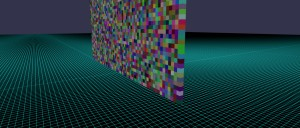
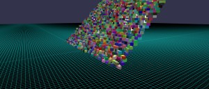
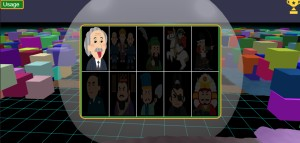

# Babylon.js：ブロック消しゲーム

## この記事のスナップショット



https://playground.babylonjs.com/full.html#19A71P

操作方法は (h)キーを押して確認してください。

（コードを見たい人はURLから `full.html` を消したURLを指定してください。上記はフル画面表示用です。）

[ソース](097/)

ローカルで動かす場合、上記 git 内の 069/js を ./js に配置してください。

## 概要

前回の記事
[Babylon.js：アニメーション機能でモーションをつくる](096.md)
のアニメーション動作のメッシュの衝突の様子を確認したく、ただそのままだとあまりに味気ないので、ゲーム風に仕上げて、ブロックを消すゲームとしてみました。

まぁ、昔作った
[車で吹っ飛ばし／ラッセル車](053.md)
の亜種になります。

自機やアニメーション動作のメッシュがぶつかったら障害物を消すようにして、かつ障害物を消すことで隠されたパネルを表示するようにしました。
「障害物を消す」だけという単調な作業になりがちなので、収集癖をくすぐるようにクリア／収集したパネルを確認できるようにしました。

放射系のモーションには追尾機能がないので、ゲーム内の使い勝手は悪いです。
また、自機の操作はドローンのモード２です。

## やったこと

- 自機／モーション
- ステージ（障害物配置）
- クリアパネルの確認

### 自機／モーション

比較用に自機に動きのないメッシュを用意しました。

- 台座のみ  

  

- 巨大球体  

  

- ランス（円すい）  

  


また、前回の記事からの引用で、動きのあるモーションは以下の通りです。
（詳細は割愛）

- 周回する楕円
- よこなぎ
- パンチ
- バッド
- テニスラケット
- ナックルボール
- フライングディスク
- 衝撃波
- 斬撃

### ステージ（障害物配置）

パネルを隠すように障害物（キューブ）を配置します。
パネルは水平に配置するだけでなく、立てたり、斜めにした状態で、パネルを覆い隠すように障害物を配置しています。

- ノーマルな配置  

  

- ランダムな配置  

  

- ウェーブ状に配置  

  

- 縦に配置  

  

- 斜めに配置  

  


障害物は SolidParticleSystem で管理してみたのですが、残数のカウントが上手くいかないのか、
いくつか残った状態でクリア判定（残数０）になることが多々あります。
レンダリングの合間に setParticles() / updateParticle() で衝突判定しているのがまずいんですかね？
たまに null 吐いてエラーになるので try catch で強引に無視しないと処理が止まってしまうし、よくわからんまま動かしてます。

今回のようにカメラ位置が変わる場合、配置したブロックがすべて消えることがありました。
なぜだろうと悩んだ結果、下記操作をすればよいとわかりました。
ちなみに公式のドキュメント
[Troubleshooting Solid Particle System Visibility Issues](https://doc.babylonjs.com/features/featuresDeepDive/particles/solid_particle_system/sps_visibility/)
にもしっかり書かれてました（汗

```js
// カメラが移動するとSPSの全メッシュが消えることがあるので下記を実施
SPS.isAlwaysVisible = true;
SPS.computeBoundingBox = true;
```

### クリアパネルの確認

スクリーン上にトロフィーアイコンを配置して、ここをクリックするとクリア／獲得したパネルを確認できるようにしています。

GUI機能でウィンドウを作り、画像（未クリア状態ではalpha=0.2）を埋め込んだボタンを配置しています。

```js
// 画面右上。トロフィーボタン
var guiIconTrophy = new BABYLON.GUI.Image("ctrl", iconTrophyPath);
{
    guiIconTrophy.width = "60px";
    guiIconTrophy.height = "60px";
    guiIconTrophy.autoScale = false
    guiIconTrophy.stretch = BABYLON.GUI.Image.STRETCH_NONE;
    guiIconTrophy.verticalAlignment = BABYLON.GUI.Control.VERTICAL_ALIGNMENT_TOP;
    guiIconTrophy.horizontalAlignment = BABYLON.GUI.Control.HORIZONTAL_ALIGNMENT_RIGHT;
    guiIconTrophy.onPointerUpObservable.add(function() {
        showTrophyRect();
    });
    advancedTexture.addControl(guiIconTrophy);   
}

let guiTrophyRect = new BABYLON.GUI.Rectangle(); 
let trophyBtnList=[];
let clearStageList=[];
{
    // クリアステージ確認GUI
    guiTrophyRect.width = "600px";
    guiTrophyRect.height = "400px";
    guiTrophyRect.cornerRadius = 20;
    guiTrophyRect.color = "Orange";
    guiTrophyRect.thickness = 4;
    guiTrophyRect.background = "green";
    guiTrophyRect.isVisible = false;
    guiTrophyRect._obj=[];
    advancedTexture.addControl(guiTrophyRect);
    let grid = new BABYLON.GUI.Grid();
    grid.background = "black";
    grid.width = 0.98;
    grid.height = 0.98;
    for (let ii=0; ii<5; ++ii) {
        grid.addColumnDefinition(0.2);
    }
    grid.addRowDefinition(0.5);
    grid.addRowDefinition(0.5);
    guiTrophyRect.addControl(grid); 
    for (let ii=0; ii<10;++ii) {
        let ic = ii%5, ir=Math.floor(ii/5);
        let fpath = pathPanelList[ii][2];
        let button = BABYLON.GUI.Button.CreateImageOnlyButton("p"+ii, fpath);
        button.onPointerUpObservable.add(function() {
            istage = ii;
            createStage(istage);
            showTrophyRect();
        });
        grid.addControl(button, ir, ic);
        trophyBtnList.push(button);
        clearStageList.push(false);
    }
}

var showTrophyRect = function() {
    if (guiTrophyRect.isVisible) {
        guiTrophyRect.isVisible = false;
    } else {
        for (let ii=0; ii <trophyBtnList.length; ++ii) {
            let obj = trophyBtnList[ii];
            if (clearStageList[ii]) {
                obj.image.alpha=1;
            } else {
                obj.image.alpha=0.2;
            }
        }
        guiTrophyRect.isVisible = true;
    }
}
```

クリアパネル（ステージ１をクリアしたところ）  


上記、自機の巨大球が背景になって、ちょっとしたエフェクト（球の一部がパネルのように見える）になってしまいました。

## まとめ・雑感

モーションの動きを見るだけのものに色気を出してゲームっぽくしたものの、
結局、動かない「巨大球体」がゲーム的に使いやすかったりします。
ドローン操作しながらアクションするのは無理ゲーでした。

ゲームっぽくせず、ただの動作確認にしておけばよかったかな（汗）

------------------------------------------------------------

前の記事：[Babylon.js：アニメーション機能でモーションをつくる](096.md)

次の記事：[Babylon.js：GUI機能で設定画面をつくる](098.md)


目次：[目次](000.md)

この記事には次の関連記事があります。

- [車で吹っ飛ばし／ラッセル車](053.md)
- [Babylon.js：アニメーション機能でモーションをつくる](096.md)


--
