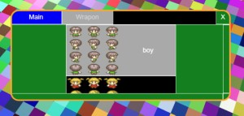
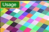
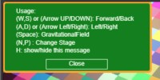
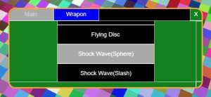

# Babylon.js：GUI機能で設定画面をつくる

## この記事のスナップショット

キャラ選択画面  


https://playground.babylonjs.com/full.html#XQ3JBU

操作方法は (h)キーを押して確認してください。

（コードを見たい人はURLから `full.html` を消したURLを指定してください。上記はフル画面表示用です。）

[ソース](098/)

ローカルで動かす場合、上記ソースと別途 git 内の 069/js を追加して ./js に配置してください。

## 概要

キーボード入力以外のインターフェースとして、スクリーン上のボタンを操作で「使い方（usage）」や「キャラ選択」をGUI機能で作ってみました。

## やったこと

- ダイアログ風「使い方(usage)」ウィンドウ

- タブシート風設定ウィンドウ

### ダイアログ風「使い方(usage)」ウィンドウ

画面上の「Usage」ボタンを押下すると、固定のメッセージを表示、「Close」ボタンでウィンドウを閉じます。

まず、画面左上に「Usageボタン」を配置します。

usageボタン  



```js
// GUI作成用のオブジェクト（最初に1回だけ呼び出し）
let advancedTexture = BABYLON.GUI.AdvancedDynamicTexture.CreateFullscreenUI("UI");

// 画面左上、Usageボタン（アイコン代わりにテキスト表示）
var guiIconUsage = new BABYLON.GUI.Rectangle();
{
    guiIconUsage.adaptWidthToChildren = true;
    guiIconUsage.height = "40px";
    guiIconUsage.cornerRadius = 5;
    guiIconUsage.color = "Orange";
    guiIconUsage.thickness = 4;
    guiIconUsage.background = "green";
    guiIconUsage.horizontalAlignment = BABYLON.GUI.Control.HORIZONTAL_ALIGNMENT_LEFT;
    guiIconUsage.verticalAlignment = BABYLON.GUI.Control.VERTICAL_ALIGNMENT_TOP;
    advancedTexture.addControl(guiIconUsage);    
    let text1 = new BABYLON.GUI.TextBlock();
    text1.text = "Usage";
    text1.color = "white";
    text1.width = "100px";
    //text1.height = "40px";
    text1.fontSize = 24;
    text1.textWrapping = BABYLON.GUI.TextWrapping.WordWrap;
    text1.textHorizontalAlignment = BABYLON.GUI.TextBlock.HORIZONTAL_ALIGNMENT_LEFT;
    text1.paddingLeft = 12;
    guiIconUsage.onPointerUpObservable.add(function() {
        guiUsageRect.isVisible = true;
    });
    guiIconUsage.addControl(text1);    
}
```

usage のウィンドウの構成はざっくりと以下のような感じです。

ウィンドウ代わりに Rectangle を root として、
その中に Grid で２段のレイアウトを作り、それぞれに TextBlock（本文） と Button（ウィンドウを閉じるためのボタン）を配置します。

```plain
+-- guiUsageRect Rectangle ----------------------+
| +-- grid Grid ----------------------+          |
| | +-- text1 TextBlock ---+          |          |
| | |     "Usage:"         |          |          |
| | |     "..."            |          |          |
| | +----------------------+          |          |
| +-----------------------------------+          |
| | +-- button Button -----+          |          |
| | |     "Close"          |          |          |
| | +----------------------+          |          |
| +-----------------------------------+          |
+------------------------------------------------+
```

usageウィンドウ  


```js
// 左上に使い方（操作方法）を表示
let guiUsageRect = new BABYLON.GUI.Rectangle();
{
    guiUsageRect.adaptWidthToChildren = true;
    guiUsageRect.width = "290px";
    guiUsageRect.height = "140px";
    guiUsageRect.cornerRadius = 5;
    guiUsageRect.color = "Orange";
    guiUsageRect.thickness = 4;
    guiUsageRect.background = "green";
    guiUsageRect.horizontalAlignment = BABYLON.GUI.Control.HORIZONTAL_ALIGNMENT_LEFT;
    guiUsageRect.verticalAlignment = BABYLON.GUI.Control.VERTICAL_ALIGNMENT_TOP;
    advancedTexture.addControl(guiUsageRect);    
    let grid = new BABYLON.GUI.Grid();
    grid.width = 0.98;
    grid.height = 0.98;
    grid.addRowDefinition(1);
    grid.addRowDefinition(22, true);
    guiUsageRect.addControl(grid); 
    // グリッド内の要素の登録
    {
        let text1 = new BABYLON.GUI.TextBlock();
        text1.text = "Usage:\n"
            +"(W,S) or (Arrow UP/DOWN): Forward/Back\n"
            +"(A,D) or (Arrow Left/Right): Left/Right\n"
            +"(Space): GravitationalField\n"
            +"(N,P) : Change Stage\n"
            +"H: show/hide this message";
        text1.color = "white";
        text1.width = "260px";
        text1.fontSize = 12;
        text1.textWrapping = BABYLON.GUI.TextWrapping.WordWrap;
        text1.textHorizontalAlignment = BABYLON.GUI.TextBlock.HORIZONTAL_ALIGNMENT_LEFT;
        text1.paddingLeft = 12;
        grid.addControl(text1, 0, 0);
    }
    {
        let button = BABYLON.GUI.Button.CreateSimpleButton("but1", "Close");
        button.width = "120px";
        button.height = "20px";
        button.color = "white";
        button.fontSize = 12;
        button.background = "green";
        button.onPointerUpObservable.add(function() {
            guiUsageRect.isVisible = false;
        });
        grid.addControl(button, 1, 0);
    }
    guiUsageRect.isVisible = false;
}
```

Usageウィンドウの表示は isVisible の true/false で切り替えます。
なので、画面上のボタンのアクションでは `isVisible = true` に、
ウィンドウを閉じるボタンのアクションでは `isVisible = false` とします。

### タブシート風設定ウィンドウ

タブシートのウィジェットは標準機能にはないので、同じレイアウトの、同じ大きさのウィンドウを２つ用意して切り替えて表示します。

トリガーとなるアイコンを、画面右上に配置します。

設定アイコン  


```js
// 画面右上。歯車ボタン
var guiIconCtrl = new BABYLON.GUI.Image("ctrl", "textures/icons/GearIcon.png");
{
    guiIconCtrl.width = "60px";
    guiIconCtrl.height = "60px";
    guiIconCtrl.autoScale = false
    guiIconCtrl.stretch = BABYLON.GUI.Image.STRETCH_NONE;
    guiIconCtrl.verticalAlignment = BABYLON.GUI.Control.VERTICAL_ALIGNMENT_TOP;
    guiIconCtrl.horizontalAlignment = BABYLON.GUI.Control.HORIZONTAL_ALIGNMENT_RIGHT;
    guiIconCtrl.onPointerUpObservable.add(function() {
        if (itab==0) {
            showCtrlChooseChara();
        } else {
            showCtrlChooseWeapon();
        }
    });
    advancedTexture.addControl(guiIconCtrl);   
}
```

タブシート風設定ウィンドウの構成はざっくりと以下のような感じです。

ウィンドウの上部にタブシートの切り替えタブもどきのボタンを配置します。
２段目には ScrollViewer を配置して、画像とテキストのボタン／テキストのボタンを配置します。

```plain
（１枚目：キャラ選択）
+-- guiCharaRect Rectangle ---------------------------------------------------------------------------------------------+
| +-- rootPanel StackPanel ----------------------------------------------------------------------------------+          |
| | +-- r1panel StackPanel --------------------------------------------------------------------------+       |          |
| | | +-- button Button --+ +-- button Button --+ +-- rectSpace Rectangle --+ +-- button Button --+  |       |          |
| | | |    "Main"         | |    "Weapon"       | |    {空白}               | |    "X"            |  |       |          |
| | | +-------------------+ +-------------------+ +-------------------------+ +-------------------+  |       |          |
| | +------------------------------------------------------------------------------------------------+       |          |
| +----------------------------------------------------------------------------------------------------------+          |
| | +-- r2panelSV ScrollViewer -------------------------------------------------------------------+          |          |
| | | +-- n_... Button -------------------------------------+                                     |          |          |
| | | | +-- n_.._icon Image --+ +-- n_.._button --+         |                                     |          |          |
| | | | |                     | |    " ..."       |         |                                     |          |          |
| | | | +---------------------+ +-----------------+         |                                     |          |          |
| | | +-----------------------------------------------------+                                     |          |          |
| | |  ...                                                                                        |          |          |
| | | +-- n_... Button -------------------------------------+                                     |          |          |
| | | | +-- n_.._icon Image --+ +-- n_.._button --+         |                                     |          |          |
| | | | |                     | |    " ..."       |         |                                     |          |          |
| | | | +---------------------+ +-----------------+         |                                     |          |          |
| | | +-----------------------------------------------------+                                     |          |          |
| | +---------------------------------------------------------------------------------------------+          |          |
| +----------------------------------------------------------------------------------------------------------+          |
+-----------------------------------------------------------------------------------------------------------------------+

（２枚目：武装選択）
+-- guiCharaRect Rectangle ---------------------------------------------------------------------------------------------+
| +-- rootPanel StackPanel ----------------------------------------------------------------------------------+          |
| | +-- r1panel StackPanel --------------------------------------------------------------------------+       |          |
| | | +-- button Button --+ +-- button Button --+ +-- rectSpace Rectangle --+ +-- button Button --+  |       |          |
| | | |    "Main"         | |    "Weapon"       | |    {空白}               | |    "X"            |  |       |          |
| | | +-------------------+ +-------------------+ +-------------------------+ +-------------------+  |       |          |
| | +------------------------------------------------------------------------------------------------+       |          |
| +----------------------------------------------------------------------------------------------------------+          |
| | +-- r2panelSV ScrollViewer -------------------------------------------------------------------+          |          |
| | | +-- n_... Button -------------------------------------+                                     |          |          |
| | | |     " ..."                                          |                                     |          |          |
| | | +-----------------------------------------------------+                                     |          |          |
| | |  ...                                                                                        |          |          |
| | | +-- n_... Button -------------------------------------+                                     |          |          |
| | | |     " ..."                                          |                                     |          |          |
| | | +-----------------------------------------------------+                                     |          |          |
| | +---------------------------------------------------------------------------------------------+          |          |
| +----------------------------------------------------------------------------------------------------------+          |
+-----------------------------------------------------------------------------------------------------------------------+
```

タブシート風設定ウィンドウ（１枚目：キャラ選択）  


タブシート風設定ウィンドウ（２枚目：武装選択）  


```js
let itab = 0; // 0:キャラクター選択 / 1:武装選択
// キャラクター選択
let ichar = 0;
let charaBtnList=[];
let guiCharaRect = new BABYLON.GUI.Rectangle(); 
{
    // キャラクター選択GUI作成
    guiCharaRect.width = "600px";
    guiCharaRect.height = "250px";
    guiCharaRect.cornerRadius = 20;
    guiCharaRect.color = "Orange";
    guiCharaRect.thickness = 4;
    guiCharaRect.background = "green";
    guiCharaRect.isVisible = false;
    guiCharaRect._obj=[];
    advancedTexture.addControl(guiCharaRect);
    //
    let rootPanel = new BABYLON.GUI.StackPanel();
    rootPanel.width = "600px";
    rootPanel.height="250px";
    guiCharaRect.addControl(rootPanel);
    let r1panel = new BABYLON.GUI.StackPanel();
    r1panel.width = "600px";
    r1panel.height="40px";
    r1panel.isVertical=false;
    rootPanel.addControl(r1panel);
    {
        let button = BABYLON.GUI.Button.CreateSimpleButton("b1", "Main");
        button.width = "140px";
        button.height = "40px";
        button.color = "white";
        button.background = "blue";
        r1panel.addControl(button);  
    }
    {
        let button = BABYLON.GUI.Button.CreateSimpleButton("b2", "Weapon");
        button.width = "140px";
        button.height = "40px";
        button.color = "LightGray";
        button.background = "DarkGray";
        r1panel.addControl(button);  
        button.onPointerUpObservable.add(function() {
            itab = 1;
            showCtrlChooseChara();
            showCtrlChooseWeapon();
        });
    }
    {
        var rectSpace = new BABYLON.GUI.Rectangle(); //spacer
        rectSpace.width = "280px";
        rectSpace.height = "40px";
        rectSpace.color = "black";
        rectSpace.background = "black";
        r1panel.addControl(rectSpace);
    }
    {
        let button = BABYLON.GUI.Button.CreateSimpleButton("b3", "X"); //cancel
        button.width = "40px";
        button.height = "40px";
        button.color = "white";
        r1panel.addControl(button);
        button.onPointerUpObservable.add(function() {
            guiCharaRect.isVisible = false;
        });
    }

    let r2panelSV = new BABYLON.GUI.ScrollViewer(null, true);
    r2panelSV.width = "600px";
    r2panelSV.height = "210px";
    rootPanel.addControl(r2panelSV);
    let r2panel = new BABYLON.GUI.StackPanel();
    r2panel.width = "600px";
    r2panel.height="840px";
    r2panelSV.addControl(r2panel);
    BABYLON.GUI.Button.CreateMyCustomButton = function (name, text, imageUrl) {
        const result = new BABYLON.GUI.Button(name);
        // Adding text
        const textBlock = new BABYLON.GUI.TextBlock(name + "_button", text);
        textBlock.textWrapping = true;
        textBlock.textHorizontalAlignment = BABYLON.GUI.Control.HORIZONTAL_ALIGNMENT_CENTER;
        textBlock.paddingLeft = "50%";
        result.addControl(textBlock);
        // Adding image
        const iconImage = new BABYLON.GUI.Image(name + "_icon", imageUrl);
        iconImage.width = "50%";// "20%";
        iconImage.stretch = BABYLON.GUI.Image.STRETCH_NONE;
        iconImage.horizontalAlignment = BABYLON.GUI.Control.HORIZONTAL_ALIGNMENT_LEFT;
        result.addControl(iconImage);
        return result;
    };
    for (let ii=0; ii<charPathList.length;++ii) {
        let fpath = charPathList[ii];
        let label = charNameList[ii];
        let button = BABYLON.GUI.Button.CreateMyCustomButton("n_"+label, label, fpath);
        button.width = "300px";
        button.height = "140px";
        button.color = "white";
        button.background = "black";
        button.onPointerUpObservable.add(function() {
            ichar=ii;
            myTextPath=charPathList[ii]
            createMyMesh(imesh);
            guiCharaRect.isVisible = false;
        });
        r2panel.addControl(button);
        charaBtnList.push(button)
    }
}
var showCtrlChooseChara = function() {
    if (guiCharaRect.isVisible) {
        guiCharaRect.isVisible = false;
    } else {
        for (let obj of charaBtnList) {
            obj.background = "black";
        }
        charaBtnList[ichar].background = "DarkGray";
        guiCharaRect.isVisible = true;
    }
}

// 武装選択
let guiWeaponRect = new BABYLON.GUI.Rectangle();
let weaponBtnList=[];
{
    // 武装選択GUI作成
    guiWeaponRect.width = "600px";
    guiWeaponRect.height = "250px";
    guiWeaponRect.cornerRadius = 20;
    guiWeaponRect.color = "Orange";
    guiWeaponRect.thickness = 4;
    guiWeaponRect.background = "green"; // "black";
    guiWeaponRect.isVisible = false;
    guiWeaponRect._obj=[];
    advancedTexture.addControl(guiWeaponRect);
    //
    let rootPanel = new BABYLON.GUI.StackPanel();    
    rootPanel.width = "600px";
    rootPanel.height="250px";
    guiWeaponRect.addControl(rootPanel);
    //guiWeaponRect._obj=[];
    let r1panel = new BABYLON.GUI.StackPanel();
    r1panel.width = "600px";
    r1panel.height="40px";
    r1panel.isVertical=false;
    rootPanel.addControl(r1panel);
    {
        let button = BABYLON.GUI.Button.CreateSimpleButton("b1", "Main");
        button.width = "140px";
        button.height = "40px";
        button.color = "LightGray"; // "white";
        button.background = "DarkGray"; // "blue";
        r1panel.addControl(button);  
        button.onPointerUpObservable.add(function() {
            itab = 0;
            showCtrlChooseChara();
            showCtrlChooseWeapon();
        });
    }
    {
        let button = BABYLON.GUI.Button.CreateSimpleButton("b2", "Weapon");
        button.width = "140px";
        button.height = "40px";
        button.color = "white";
        button.background = "blue";
        r1panel.addControl(button);  
    }
    {
        var rectSpace = new BABYLON.GUI.Rectangle(); //spacer
        rectSpace.width = "280px"; // 0.9;
        rectSpace.height = "40px";
        rectSpace.color = "black";
        rectSpace.background = "black";
        r1panel.addControl(rectSpace);
    }
    {
        let button = BABYLON.GUI.Button.CreateSimpleButton("b3", "X"); //cancel
        button.width = "40px";
        button.height = "40px";
        button.color = "white";
        r1panel.addControl(button);
        button.onPointerUpObservable.add(function() {
            guiWeaponRect.isVisible = false;
        });
    }

    let r2panelSV = new BABYLON.GUI.ScrollViewer(null, true);
    r2panelSV.width = "600px";
    r2panelSV.height = "210px";
    rootPanel.addControl(r2panelSV);
    let r2panel = new BABYLON.GUI.StackPanel();
    r2panel.width = "600px";
    r2panel.height="720px";
    r2panelSV.addControl(r2panel);
    for (let ii=0; ii<weaponLabel.length;++ii) {
        let label = weaponLabel[ii];
        let button = BABYLON.GUI.Button.CreateSimpleButton("n_"+label, label);
        button.width = "300px";
        button.height = "60px";
        button.color = "white";
        button.background = "black";
        button.onPointerUpObservable.add(function() {
            imesh=ii;
            createMyMesh(imesh);
            guiWeaponRect.isVisible = false;
        });
        r2panel.addControl(button);
        weaponBtnList.push(button)
    }
}
var showCtrlChooseWeapon = function() {
    if (guiWeaponRect.isVisible) {
        guiWeaponRect.isVisible = false;
    } else {
        for (let obj of weaponBtnList) {
            obj.background = "black";
        }
        charaBtnList[ichar].background = "DarkGray";
        guiWeaponRect.isVisible = true;
    }
}
```

タブシート風設定ウィンドウのウィンドウ切り替えは、各ウィンドウの isVisible の true/false を切り替えます。
また表示しているシート／ウィンドウを（itabに）記録しておき、再度ウィンドウを表示するときカレントのシートを表示します。


## まとめ・雑感

スクリーン上だけで操作できるユーザインタフェースとして、babylon.js の GUI機能を使って２種類のウィンドウを作成しました。

ウィンドウの外をクリック／タッチしたときに閉じるように、もしくはウィンドウの外を操作できないようにロックしたいけど未対応です。

正直、とりあえず作ってみました感（素人感）がぬぐえないですが、そのうち良くなっていく予定です。たぶん（汗）


前の記事：[Babylon.js：ブロック消しゲーム](097.md)

次の記事：..


目次：[目次](000.md)

この記事には関連記事がありません。


--
