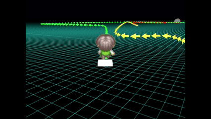
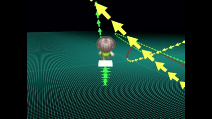
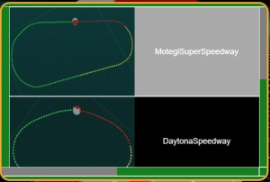
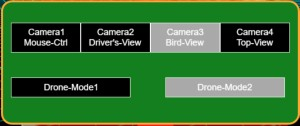

# Babylon.js：Navigation path をドローン操作でトレース＋ゲームパッド／VirtualStick対応

## この記事のスナップショット

Navigation path上を走る様子  


https://playground.babylonjs.com/full.html#F4E23N#1

操作方法は (h)キーを押して確認してください。

（コードを見たい人はURLから `full.html` を消したURLを指定してください。上記はフル画面表示用です。）

[ソース](099/)

ローカルで動かす場合、上記ソースと別途 git 内の 069/js を追加して ./js に配置してください。

## 概要

ドローン操作の練習でなにか作ろうと思っていたところ、公式にある[greased_line_advanced](https://doc.babylonjs.com/features/featuresDeepDive/mesh/creation/param/greased_line/greased_line_advanced/#navigation-path-line-or-displaying-windocean-currents)のデモ[Navigation path or Displaying currents](https://playground.babylonjs.com/#F2M8GA#5)をみて、ドローンで追跡させてみたらよいかも！と作ってみました。
しかし、試走してみたところアップダウンがキツくて激ムズでした。

激ムズなコース  


高さを抑えても急旋回がいくつもでてくるのでやっぱりムズいです。

高さを抑えた場合  


結果、過去に作成したコース
[Babylon.js：画像からコース作り（１／２）](090.md)
からコースをもってきて飛んでみたらなんとか周回できました。

そもそもキーボードで操作するから無理がある！と思い、ゲームパッドのスティックでも操作しできるよう対応してみました。
ついでにタッチパネル（iPad）での利用を考慮して VirtualStick にも対応させてみました。

VirtualStick対応にした都合で、いつもなら簡単にキーボード操作で済ましてしまうところの設定やステージ選択といったものをGUIとして用意しました。

ステージ選択ウィンドウ  


ちなみにドローンは触ったことも操作したこともないので、リアルのドローンの挙動と乖離していたら申し訳ないです。

## やったこと

- ナビゲーションパスのカスタマイズ
- ゲームパッド対応
- VirtualStick対応
  - 設定ウィンドウ／ステージ選択ウィンドウ

### ナビゲーションパスのカスタマイズ

デモ[Navigation path or Displaying currents](https://playground.babylonjs.com/#F2M8GA#5)のサンプルコードを完コピするのはちょっと気が引けるので、少しカスタマイズしました。

- 矢印の色付けができるよう、テクスチャの画像を白に
- 距離に応じて色を3色に（0~50%：緑、50~80%：黄色、80~100%：赤）

### ゲームパッド対応

ゲームパッドの実装には公式の[Gamepads](https://doc.babylonjs.com/features/featuresDeepDive/input/gamepads/)を参考にしています。

キーボードの入力処理と
ゲームパッド（特にスティックのアナログ値）の入力処理では勝手が違います。

そこでキーボード／ゲームパッドのデバイスからの入力値を、自機への状態変数／移動量に置き換え、
レンダリング時にこの移動量から自機への位置／姿勢に反映させます。

具体的には、キー／ボタン押下時には移動量を１、リリース時には０とします。
スティックからのアナログ値は [0, 1] の範囲の値とします。
レンダリング時には移動量を定数倍して、位置を動かしたり、回転させたりします。このとき移動量が０なら停止を意味します。
リアルさを突き詰めるなら、移動量（速度）ではなく加速度にすべきかもしれませんが、操作が格段に難しくなるのでこのまま「移動量」としておきます。

ちなみにスティック動作に合わせて、前後で１つの変数、左右でも１つの変数を割り当てます。
スティックの動作を十字キーやボタンでも同様に操作、かつ簡単にするために同じ変数を使います。

キーボードでも同様に操作できるようにしますが、同じ変数を使う都合上、どのデバイスからの入力かを内部的に判別させてます。
これを行わないと、キーやボタンのオン／オフを正しく判別できなくなります。
更にドローンの操作ではモード１／モード２に対応できるように同じデバイスからの入力であっても動作を切り替えられるようにします。

```js
var gamepadManager = new BABYLON.GamepadManager();

gamepadManager.onGamepadConnectedObservable.add((gamepad, state)=>{
    // 以下、BABYLON.GenericPad の前提で実装

    gamepad.onButtonDownObservable.add((button, state)=>{
        if (idevice<=1){
            idevice+=2;
        } else if (idevice>=4){
            idevice-=2;
        }
        if (0) {
        } else if (button == 4) { // LB/5
            cooltime_act = cooltime_actIni;
            icamera = (icamera+ncamera-1)%ncamera;
            changeCamera(icamera);
        } else if (button == 5) { // RB/6
            cooltime_act = cooltime_actIni;
            icamera = (icamera+1)%ncamera;
            changeCamera(icamera);

        } else if (button == 6) { // LT/6
            cooltime_act = cooltime_actIni;
            istage = (istage+nstage-1)%nstage;
            createStage(istage);
        } else if (button == 7) { // RT/7
            cooltime_act = cooltime_actIni;
            istage = (istage+1)%nstage;
            createStage(istage);

        } else if (button == 8) { // back
            idevice = ((idevice+1)%2)+2;
            if (idevice==2) {
                console.log("gamepad-mode1");
            } else if (idevice==3) {
                console.log("gamepad-mode2");
            }
        } else if (button == 9) { // start
            cooltime_act = cooltime_actIni;
            // help表示のON/OFF
            changeUsageView();
        }

        if (idevice==2){
            // ドローン（モード１）左：前後移動・左右旋回　右スティック：上昇下降・左右移動
            if ((button==3) || (button==0)) {
                act.mud=(button==3)-(button==0); // Y-A
            }
            if ((button==1) || (button==2)) {
                act.mrl=(button==1)-(button==2); // B-X
            }
            if ((button==12) || (button==13)) {
                act.mfb=(button==12)-(button==13); // Up-Down
            }
            if ((button==14) || (button==15)) {
                act.rrl=(button==14)-(button==15); // Right-Left
            }
        } else if (idevice==3){
            // ドローン（モード２）左：上昇下降・左右旋回  右スティック：前後移動・左右移動
            if ((button==3) || (button==0)) {
                act.mfb=(button==3)-(button==0); // Y-A
            }
            if ((button==1) || (button==2)) {
                act.mrl=(button==1)-(button==2); // B-X
            }
            if ((button==12) || (button==13)) {
                act.mud=(button==12)-(button==13); // Up-Down
            }
            if ((button==14) || (button==15)) {
                act.rrl=(button==14)-(button==15); // Right-Left
            }
        }
    })

    gamepad.onButtonUpObservable.add((button, state)=>{
        // console.log("   press=", button);
        if (idevice==2){
            // // ドローン（モード１）左：前後移動・左右旋回　右スティック：上昇下降・左右移動
            if ((button==3) || (button==0)) {
                act.mud=0; // Y-A
            }
            if ((button==1) || (button==2)) {
                act.mrl=0; // B-X
            }
            if ((button==12) || (button==13)) {
                act.mfb=0; // Up-Down
            }
            if ((button==14) || (button==15)) {
                act.rrl=0; // Right-Left
            }
        } else if (idevice==3){
            // ドローン（モード２）左：上昇下降・左右旋回  右スティック：前後移動・左右移動
            if ((button==3) || (button==0)) { // Y-A
                act.mfb=0;
            }
            if ((button==1) || (button==2)) { // B-X
                act.mrl=0;
            }
            if ((button==12) || (button==13)) { // Up-Down
                act.mud=0;
            }
            if ((button==14) || (button==15)) { // Right-Left
                act.rrl=0;
            }
        }
    })

    //Stick events
    gamepad.onleftstickchanged((values)=>{
        if (idevice==2){
            // ドローン（モード１）左：前後移動・左右旋回　右スティック：上昇下降・左右移動
            act.rrl = -values.x;
            act.mfb = -values.y;
        } else if (idevice==3){
            // ドローン（モード２）左スティック：上昇下降・左右旋回
            act.rrl = -values.x;
            act.mud = -values.y;
        }
    });

    gamepad.onrightstickchanged((values)=>{
        if (idevice==2){
            // ドローン（モード１）左：前後移動・左右旋回　右スティック：上昇下降・左右移動
            act.mrl = values.x;
            act.mud = -values.y;
        } else if (idevice==3){
            // ドローン（モード２）右スティック：前後移動・左右移動
            act.mrl = values.x;
            act.mfb = -values.y;
        }
    });

})
```

ちなみに当方の環境（Win11にUSBでゲームパッドを接続）BABYLON.GenericPad での動作確認しかできていないです。


### VirtualStick対応

公式の資料
[VirtualJoystick](https://doc.babylonjs.com/features/featuresDeepDive/input/virtualJoysticks/)
や
サンプル
[VirtualJoystick Example](https://playground.babylonjs.com/#PRQU53#7)
を見ると簡単に実装できそうなので VirtualStick にも対応させてみました。
サンプルの出来が素晴らしいのでそのまま流用します。

ウィンドウの右下に「Enable/Disable Virtual-Joystick」のラベルが表示されるようになるのですが、これは非常に重要な UI です。普段 zIndex なんて気にしないのですが、VirtualStickを使うとなるとスクリーン上をタッチする都合上、画面配置をきちんと考える必要がでてきます。
さもないと、アイコンや設定ウィンドウが操作できなくなってしまいます。今回は実装の手間を簡単にするために、右下のオン／オフで回避します。プレイヤーの操作を考えると、ボタンやウィンドウの操作のためにオン／オフするのは面倒なので、本来なら該当するすべてのボタンやウィンドウの zIndex を考慮・設定するべきでしょう。

```js
var leftJoystick = new BABYLON.VirtualJoystick(true);
var rightJoystick = new BABYLON.VirtualJoystick(false);
BABYLON.VirtualJoystick.Canvas.style.zIndex = "-1";

var movespeed = 20;
scene.onBeforeRenderObservable.add(()=>{
    if(leftJoystick.pressed){
        if (idevice<=1){
            idevice+=4;
        } else if (idevice<=3){
            idevice+=2;
        }
        let vx = leftJoystick.deltaPosition.x * (engine.getDeltaTime()/1000)*movespeed;
        let vy = leftJoystick.deltaPosition.y * (engine.getDeltaTime()/1000)*movespeed;
        if (idevice==4){
            // ドローン（モード１）左：前後移動・左右旋回　右スティック：上昇下降・左右移動
            act.rrl = -vx;
            act.mfb = -vy;
        } else if (idevice==5){
            // ドローン（モード２）左スティック：上昇下降・左右旋回
            act.rrl = -vx;
            act.mud = vy;
        }
    } else {
        if (idevice==4){
            act.rrl = 0;
            act.mfb = 0;
        } else if (idevice==5){
            act.rrl = 0;
            act.mud = 0;
        }
    }
    if(rightJoystick.pressed){
        let vx = rightJoystick.deltaPosition.x * (engine.getDeltaTime()/1000)*movespeed;
        let vy = rightJoystick.deltaPosition.y * (engine.getDeltaTime()/1000)*movespeed;
        if (idevice==4){
            // ドローン（モード１）左：前後移動・左右旋回　右スティック：上昇下降・左右移動
            act.mrl = vx;
            act.mud = -vy;
        } else if (idevice==5){
            // ドローン（モード２）右スティック：前後移動・左右移動
            act.mrl = vx;
            act.mfb = vy;
        }
    } else {
        if (idevice==4){
            act.mrl = 0;
            act.mud = 0;
        } else if (idevice==5){
            act.mrl = 0;
            act.mfb = 0;
        }
    }
})

// 安全のために右下に Virtual-Joystick の切り替えボタンを配置
var btn = document.createElement("button")
btn.innerText = "Enable/Disable Virtual-Joystick"
btn.style.zIndex = 10;
btn.style.position = "absolute"
btn.style.bottom = "10px"
btn.style.right = "0px"
document.body.appendChild(btn)
// Button toggle logic
btn.onclick = ()=>{
    if(BABYLON.VirtualJoystick.Canvas.style.zIndex == "-1"){
        // -> ON
        BABYLON.VirtualJoystick.Canvas.style.zIndex = "4";
        if (idevice<=1){
            idevice+=4;
        } else if (idevice<=3){
            idevice+=2;
        }
        // 有効を示すようにスタイルを変更しておく
        btn.style.color="red";
        btn.style.background="yellow";
    }else{
        // -> OFF
        BABYLON.VirtualJoystick.Canvas.style.zIndex = "-1";
        // 無効を示すようにスタイルを戻しておく
        btn.style.color="black";
        btn.style.background="white";
    }
}

// Dispose button on rerun
scene.onDisposeObservable.add(()=>{
    BABYLON.VirtualJoystick.Canvas.style.zIndex = "-1";
    document.body.removeChild(btn)
})
```


### VirtualStick対応：設定ウィンドウ／ステージ選択ウィンドウ

もともと設定ウィンドウやステージ選択ウィンドウ（下記）なんてあれば便利な程度に考え、キーボードやゲームパッドのボタンで機能を代用してきました。ところが VirtualStick に対応するためにこれら GUI の実装が必須になりました。

「ステージ選択ウィンドウ」では、任意のステージ（１０種類）に切り替えられるように、「設定ウィンドウ」では、カメラ視点（４種類）とドローン操作を切り替えられるようにしています。

ステージ選択ウィンドウ  


設定ウィンドウ  


更に、ウィンドウを開くためのアイコンを画面上に配置しています。

ヘルプアイコン（画面左上）  


設定アイコンおよびステージ選択アイコン（画面右上）  


ちなみにアイコン画像は[ICOOON MONO](https://icooon-mono.com/)様から。

## まとめ・雑感

前々回（ブロック消しゲーム）の操作が激ムズだったので、ドローン操作練習用に考えて作り直しました。ゲームっぽくライン上にモノをおいて回収させたり、タイム計測したり、ゴースト表示してゲーム性を出せば、操作の習熟が上手くなるかな？

今回、色気を出して余計なモノ（色々なデバイス入力対応）にまで手をだした感が否めないです。
でもまぁ（ゲームパッド対応、VirtualStick対応）はいつかやりたかったことなのでこの機に乗じてやってしまいました。作りこみが甘いところはご容赦。

しかし「Navigation path」はいいですね。他にも使えないかな？

------------------------------

前の記事：[Babylon.js：GUI機能で設定画面をつくる](098.md)

次の記事：..


目次：[目次](000.md)

この記事には次の関連記事があります。

- [Babylon.js：画像からコース作り（１／２）](090.md)

--
