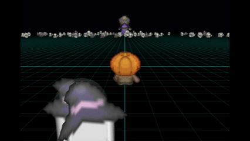
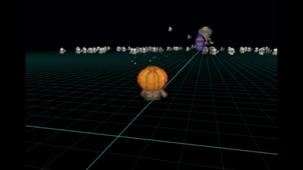

# Babylon.js：パンプキンFPS

## この記事のスナップショット

キャラの成長  

攻撃の様子  

https://playground.babylonjs.com/#D4ZN83

操作方法は (h)キーを押して確認してください。

[ソース](100/)

ローカルで動かす場合、上記ソースと別途 git 内の 069/js を追加して ./js に配置してください。

## 概要

ハロウィンが近いので、かぼちゃを使った何かを作りたいと考え、かぼちゃマンのFPS（First-Person Shooter）をつくりました。

コンセプトとしては

- 味方と合体して大きく成長（スケールアップ）。RPGな要素も。
- 雑魚キャラを蹴散らしつつ、ボスキャラ（3m級や80m級）を倒す。

ゆうれいさんと合体してパワーアップ、ゾンビやガイコツをけちらし、サタンを倒そう!!

## やったこと

- キャラクターコントローラーで操作
- 味方（ゆうれい）と合体してスケールアップ
  - スケールアップは scale で、移動を調整
  - リポップした味方のサイズを調整
- 味方・敵（雑魚）は範囲外、自機から遠くはなれたらリポップ
- ステージを広めに（同じステージに最終ボスまで配置）
- 攻撃手段
  - 散弾を散らばるよう放出

(ここでタイムアップ)

- 未実装
  - ラスボスを倒す（場外）ときの判定がない＝ゲームの終わりがわからない

- 既知のバグ
  - 成長させると弾を発射しにくくなる？
  - 敵のリポップ時、自機が成長していると、敵が半分埋もれた感じで出てくる？大きくするたびに重くしているので半分沈んでいるのかも？

## まとめ・雑感

とりあえず、シーズンものにのっかってかぼちゃを使ったFPSを作成しました。ゲームCMに影響を受けすぎている感は否めないです。各ボスからの攻撃も実装するつもりでしたがタイムアップで断念。お試しプレイする中でこのままでも悪くないのかなと思い、今の形に落ち着きました。

思ったよりも雑魚キャラをぶっ飛ばすのが爽快。あと、開始時のカメラワークがお気に入り。期せずしてかっこよくなった（笑

開始時のシーン  

------------------------------

前の記事：[Babylon.js：Navigation path をドローン操作でトレース＋ゲームパッド／VirtualStick対応](099.md)

次の記事：..

目次：[目次](000.md)

この記事には関連記事がありません。

--
