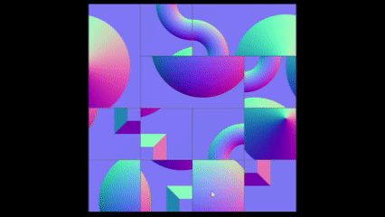
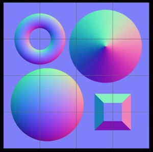
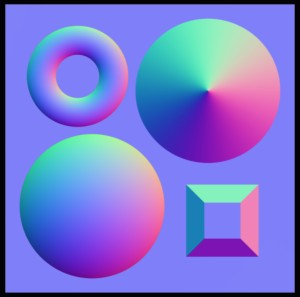
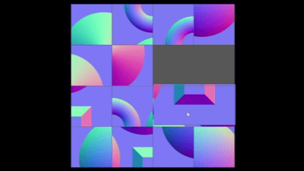
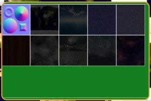

# Babylon.js：パネルゲーム

## この記事のスナップショット

プレイ画面（４倍速）  


https://playground.babylonjs.com/full.html#7F3RH1

（コードを見たい人はURLから `full.html` を削除したURLを指定してください。上記はフル画面表示用です。コードを表示する場合でもツールバーの歯車マークから「EDITOR」のチェックを外せば画面いっぱいになります。）

[ソース](102/)

ローカルで動かす場合、上記ソースに加え、別途 git 内の 069/js を追加して ./js に配置してください。

## 概要

パネル（分割された一枚絵）を並び変えるゲームを3D上で作成しました。
3D空間なので拡大・縮小や平行移動ができます。それができてもあまり嬉しくないけど。

## やったこと

- パネルを選択・選ぶ（ピックしてドラッグ）
- ドラッグ操作
  - スケール・倍率／ウィンドウサイズによらず、マウスカーソルの移動分で移動させるには
- パネルを結合する
  - 個々のパネルの外枠を表示
  - 合体して枠を消す
- パネルをまとめて動かす
  - 交換では×
  - まとめて動かすアルゴリズム
- トロフィー、クリアおよびステージ選択
- クリア後のエフェクト
  - とりま、メッセージ表示
  - メッセージ（フレーム）が邪魔をして選択できない、パネル操作の誤動作（間違えてこちらを選択）の原因に

### パネルを選択・選ぶ（ピックしてドラッグ）

マウスのクリック・リリース時にヒットしているメッシュを選びます。
パネル１枚のみを交換する場合、ここで検出したメッシュの座標を交換します。

```js
scene.onPointerObservable.add((pointerInfo) => {
    let bfin=false;
    if (pointerInfo.pickInfo.hit && pointerInfo.type === BABYLON.PointerEventTypes.POINTERDOWN) {
        if (pointerInfo.event.button == 0) { // 左クリック .. from側
            meshf = pointerInfo.pickInfo.pickedMesh;
            ...
    } else if (pointerInfo.pickInfo.hit && pointerInfo.type === BABYLON.PointerEventTypes.POINTERUP) {
        // ドラッグ（終了時）にクリック時のパネルを戻す操作
        if (pointerInfo.event.button == 0) { // 左クリック .. to側
            mesht = pointerInfo.pickInfo.pickedMesh;
            ...
```

### ドラッグ操作

マウスのドラッグ操作中にパネルを表示させたくなります。
しかし、ここでちょっとした問題が発生。
3D空間上のメッシュを動かす際に、（2Dの）マウスの移動量がかみ合わなくなります。
3Dだとカメラの位置によって移動量を調整する必要がでてきます。

解決策としては、レイキャスト（3D空間内で光線を飛ばし、交差するオブジェクトを検出する技術）で、
カメラから飛ばした光線がパネルのどの位置にヒットするか、ヒットした座標をもとにメッシュを移動させます。
公式のドキュメント
[Detect the first mesh touched by the ray](https://doc.babylonjs.com/features/featuresDeepDive/mesh/interactions/picking_collisions#detect-the-first-mesh-touched-by-the-ray)
にちょうどよいサンプル
[Get First Mesh Hit By Ray](https://playground.babylonjs.com/#KNE0O#1327)
があります。

```js
let pickResult = scene.pick(scene.pointerX, scene.pointerY);
if (pickResult.hit) {
    let p = pickResult.pickedPoint
    fltmesh._iniX = p.x;
    fltmesh._iniY = p.y;
}
```

正直、前述の「パネルを選択・選ぶ（ピックしてドラッグ）」と機能がダブっている気がしてまとめられないのかなと思うのですが、よくわからないので、今は同じような機能を２つ混在させて運用しています。

### パネルを結合する

パネルを１枚ずつ移動させるのは面倒です。
特に隣接するパネルを見つけて、隣においてもつながらず、
再度移動させるときに１個ずつ動かすのは非常にストレスです。

なので、隣接するパネルを隣に配置したら、パネルを枠を消してつながったように見せます。

パネルがバラバラな状態  


パネルがつながった状態（枠が消える）  


このためには、パネルを格子状に配置する位置に合わせて、メッシュを配列に持たせます。
またメッシュの格子位置(x,y)を記録しておきます。

```js
//隣を確認して、隣接していたら枠を消す
let connectNextPanel = function() {
    // 一度表示をリセット(枠の表示を戻す／表示)
    ...
    // 隣接していたら枠の表示を消す
    for (let i = 0; i < panelMesh.length; ++i) {
        let meshi = panelMesh[i];
        let ix=i%nx, iy=Math.floor(i/nx)
        if (ix<nx_) {
            // 右側の連結を確認
            let j = i+1
            let meshj = panelMesh[j];
            if ((meshi._ix+1==meshj._ix) && (meshi._iy==meshj._iy)) {
                // 隣接を確認 .. パネル間のフレームを隠す
                meshi._capR.material.alpha=0;
                meshj._capL.material.alpha=0;
                ...
            }
        }
        if (iy<ny_) {
            // 上側の連結を確認
            let j = i+nx;
            let meshj = panelMesh[j];
            if ((meshi._ix==meshj._ix) && (meshi._iy+1==meshj._iy)) {
                // 隣接を確認 .. パネル間のフレームを隠す
                meshi._capU.material.alpha=0;
                meshj._capD.material.alpha=0;
                ...
            }
        }
    }
    ...
```

もう一つ。
マウスドラックの操作で、結合したパネルの１つをクリックしたら関連するパネルをまとめて移動させる必要があります。そこで、結合したパネルグループを情報(panelSet)としてもたせます。この情報は、パネルを移動させるときに用い、パネルを移動させたあとで再構築します。

```js
// 正しく結合した隣接パネルの情報
// - 隣接したパネルのidxのリストを配列としてもつ
// -ex)  [[0,1,2],
//        [5,6]]
let panelSet = [];

// パネルのグループ情報を構築する関数（隣接するとわかったindexの組i,jを引数にとり、panelSet にマージする
let addPanelSet = function(i,j) {
    let iblock=-1, jblock=-1;
    for (let ii=0; ii < panelSet.length; ++ii) {
        let tlist=panelSet[ii];
        if (tlist.includes(i)) {
            iblock=ii;
        }
        if (tlist.includes(j)) {
            jblock=ii;
        }
    }
    if (iblock >= 0) {
        if (iblock==jblock) {
            // 両方同じところに登録済み
            return
        } else if (jblock >= 0) {
            // それぞれ別の要素に登録済み .. 各要素を結合
            //let itmp=panelSet[iblock];
            let jtmp=panelSet[jblock];
            for (let v of jtmp) {
                if (!panelSet[iblock].includes(v)) {
                    panelSet[iblock].push(v)
                }
            }
            panelSet.splice(jblock, 1)
        } else {
            // i は登録ずみだが、jは未登録 .. iblockにjを追加
            panelSet[iblock].push(j)
        }
    } else if (jblock >= 0) {
        // j は登録ずみだが、i は未登録 .. jblockにiを追加
        panelSet[jblock].push(i)
    } else {
        // 両方未登録.. i,jを新規追加
        panelSet.push([i,j])
    }
}

// index=iを持つグループのindexリストを返す
let getPanelSetMember=function(i) {
    for (let ii=0; ii < panelSet.length; ++ii) {
        let tlist=panelSet[ii];
        if (tlist.includes(i)) {
            return tlist;
        }
    }
    return [i];
}
```


### パネルをまとめて動かす

上述「パネルを結合する」でパネルを結合することにしましたが、結合したパネルを移動させるときには１つテクニックが必要になります。単純に移動元と移動先を相対位置でずらして、パネルを１枚ずつ交換すると、思ったような配置になりません。具体的には移動元と移動先の位置が重なっていると、重なっている箇所で２回交換操作が行われます。そこで移動のアルゴリズムは次の３ステップで移動させます。

1. 選択したパネル群を周期的境界条件で移動させる
2. 「ステップ１」の移動元・移動先ではない箇所を位置を変えずにそのまま移動させる
3. 残ったパネルは移動元・移動先で重なったパネル。これらは空いている箇所に適当に詰める。

```js
let idiff = mesht._idx - meshf._idx // from から to への差分
let panelMesh_ = new Array(panelMesh.length).fill(null); // 移動先の配列
// まず選択したパネル(ids)を移動
for (let ii of ids) {
    let jj = ii+idiff
    if (jj < 0) {
        jj += panelMesh.length;
    } else if (jj >= panelMesh.length) {
        jj -= panelMesh.length;
    }
    let mesh_ = panelMesh[ii];
    panelMesh[ii] = null;
    mesh_._idx = jj
    let xy = idx2xy(jj)
    mesh_.position.x = xy[0];
    mesh_.position.y = xy[1];
    panelMesh_[jj] = mesh_;
}
// 移動先(panelMesh_[ii])が null で
// 移動元(panelMesh[ii])が null 以外なら移動
for (let ii=0; ii < panelMesh.length; ++ii) {
    if (panelMesh_[ii]==null && panelMesh[ii]!=null) {
        panelMesh_[ii] = panelMesh[ii];
        panelMesh[ii] = null;
    }
}
// 残りを空いた場所に移動させる
let jj = 0;
for (let ii=0; ii < panelMesh.length; ++ii) {
    if (panelMesh[ii]==null) {
        continue;
    }
    while(jj < panelMesh_.length && panelMesh_[jj]!=null) {++jj;}
    if (jj == panelMesh_.length) {break;}
    panelMesh_[jj] = panelMesh[ii];
    panelMesh_[jj]._idx =jj;
    let xy = idx2xy(jj)
    panelMesh_[jj].position.x = xy[0];
    panelMesh_[jj].position.y = xy[1];
    panelMesh[ii] = null;
}
panelMesh=panelMesh_;
```

複数のパネルをまとめて動かす様子  



### トロフィー、クリアおよびステージ選択

クリアしたパネルがわかるように、また別のパネルを選べるウィンドウ（GUI）です。

こちらは
[Babylon.js：ブロック消しゲーム](097.md)
で実施した「クリアパネルの確認」と同じになります。
ただ、こちらでは静止画が増えても対応できるようにスクロールパネルを使ってます。

トロフィーパネル  



### クリア後のエフェクト

パネルを結合するアルゴリズムをいれたこと、枠線が消えることで、終了したかどうかはわかるようになっています。
一方でクリアした瞬間に新しいパネルを切り替えると、達成した余韻を味わえないので、クリア後のエフェクトを入れることにします。といっても、お手軽で見栄えのある演出が思いつかなかったのでメッセージを出すだけです。

```js
// クリア時の処理(呼び出し側)
text1.zIndex = 1; // 前面で表示する位置に
text1.text = "Clear!!";
guiStageRect._clear[istage]=true
setTimeout(nextStage, 3000);

// ３秒後に実行される nextStageの中身
let nextStage = function () {
    text1.zIndex = -9; // 背面に隠しておく
    text1.text = "";
    istage = (istage+1)%nstage
    createStage(istage)
}

```

上述で zIndexをいじってますが、何もしないと、メッセージ用のパネルが中央トップに配置されたままになっており、パネル操作の邪魔（パネルを操作できない）になります。なので、必要ないときはメッセージパネル(text1)を後ろに隠して、クリア時のみ表にもってきます。

## まとめ・雑感

画像（一枚絵）や写真をつかったものをつくりたくて、結果、パネルゲームに落ち着きました。

当初、パネルを交換するだけで簡単に作れるだろうと始めたら、色々と考えることがありました。たかがパネルゲームとあなどるなかれです。

------------------------------

前の記事：[Babylon.js：ストラテジーゲームの基礎をつくる](101.md)

次の記事：[Babylon.js で物理演算(havok)：タワーディフェンスのゲームをつくる](103.md)


目次：[目次](000.md)

この記事には次の関連記事があります。

- [Babylon.js：ブロック消しゲーム](097.md)

--
