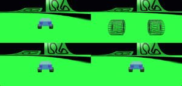
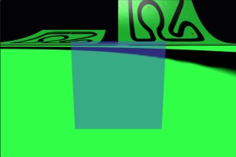
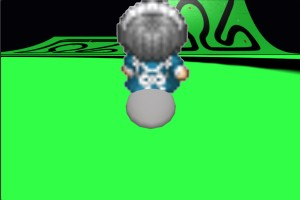
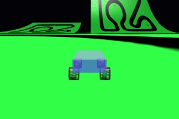
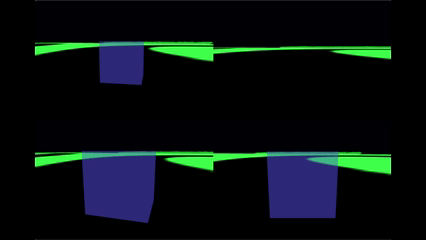
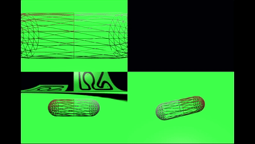
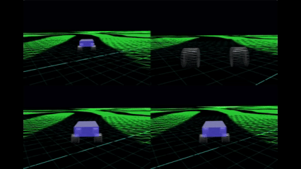

# Babylon.js で物理演算(havok)：移動体とカメラ

１## この記事のスナップショット



https://playground.babylonjs.com/?inspectorv2=true?BabylonToolkit#BVSVQM

（ツールバーの歯車マークから「EDITOR」のチェックを外せば画面いっぱいになります。）

[ソース](106/)

ローカルで動かす場合、上記ソースに加え、別途 git 内の 104/js を ./js として配置してください。

## 概要

車モデルに代わる移動体を模索していくつかの移動体を用意し、
またこれらを追跡するカメラを用意してみました。

移動体には以下を用意しました。
- 立方体（滑らせる）
- カプセル（転がす）
- ボード（楕円）にエンジン（加速度）とソリの概念をいれる
- 車モデル

一方で、移動体を追跡するためのカメラには以下を用意しました。


項目         | カメラ１     | カメラ２     | カメラ３   | カメラ４
-------------|--------------|--------------|------------|------------
ベースカメラ | FollowCamera | FollowCamera | FreeCamera | FreeCamera
視点         | バードビュー | ドライバーズビュー | バードビュー | バードビュー
動作         | （自動）     | （自動）     | メッシュの座標から一定距離 | メッシュの向きとカメラの向きを同じに

個々のカメラとは別に、画面を４分割してカメラの違いがわかりやすくしたカメラも用意しました。

画面４分割  


ステージには、平面（コースのテクスチャ）と曲面（正面奥）、および凹凸（右手）に配置しています。

## やったこと

### 移動体１：立方体

立方体  


ローカルなZ軸方向にapplyImpulse() で前進・後進させ、
ローカルなY軸方向に対してでapplyAngularImpulse()で方向転換させます。
他との比較用に設けました。

### 移動体２：カプセル

カプセル  


カプセルの長軸を回転軸として前進・後進させます。
方向転換はメッシュの姿勢（クォータニオン）から真上方向の軸を回転軸にしてapplyAngularImpulse()で回転させます。
回転が高速になってくると、この方法での方向転換では軸がぶれるようで挙動が不安定になります。
少々強引ですが他に良い手が思いつかず。

物体自体を回転させるものとしては球が一番に思いつきます。
しかし自由に移動可能とすると回転軸を決める方法がなく、少なくともカメラの視線がないと進行方向がきめられないので球を使うのはやめました。

### 移動体３：ボード（楕円）

ボード（楕円）  


楕円形を使うのは既に
[Babylon.js で物理演算(havok)：パイプ内をボードで滑る](070.md)
[Babylon.js で物理演算(havok)：パイプ内をボードで滑る（２）](093.md)
で実施済みですが、こららに手を加えて、エンジン（アクセル／加速度）の概念を入れます。
つまりオンにしても徐々にスピードアップ、オフにしてもすぐに停止させずに徐々に減速させます。
結果、車（ドリフト）っぽい挙動になります。

### 移動体４：車モデル

車モデル  


前の記事
[Babylon.js で物理演算(havok)：車モデル](105.md)
で利用した車モデル（改造版）を流用します。

### カメラ１：FollowCamera (バードビュー)

フォローカメラでメッシュの後方から追跡します。

簡単なパラメータ指定で追跡が実現できますが、
メッシュの姿勢に依存しているので、回転するメッシュの場合には不向きです。

- 利点
  - 簡単なパラメータ指定で追跡が実現できます。

- 欠点
  - メッシュの姿勢に依存しているので、回転するメッシュの場合には不向きです。
  - 地面に傾斜があると地面の下にもぐりこんでしまうことがあります。

```js
// フローカメラを使ったバードビュー
camera = new BABYLON.FollowCamera("FollowCam", new BABYLON.Vector3(0, 10, -10), scene);
camera.rotationOffset = 180;
camera.radius = 5;
camera.heightOffset = 1;
camera.cameraAcceleration = 0.05;
camera.maxCameraSpeed = 30;
camera.attachControl(canvas, true);
camera.inputs.clear(); // カーソルキーでカメラ操作させないようにする
```

### カメラ２：FollowCamera (ドライバーズビュー)

フォローカメラでメッシュの中心上部に配置して、ドライバー目線にします。

- 利点
  - 簡単なパラメータ指定で追跡が実現できます。

- 欠点
  - メッシュの姿勢に依存しているので、回転するメッシュの場合には不向きです。

```js
// フローカメラを使ったドライバーズビュー
camera = new BABYLON.FollowCamera("FollowCam", new BABYLON.Vector3(0, 10, -10), scene);
camera.rotationOffset = 180;
camera.radius = 0.5;
camera.heightOffset = 0.1;
camera.cameraAcceleration = 0.2;
camera.maxCameraSpeed = 30;
camera.attachControl(canvas, true);
camera.inputs.clear(); // カーソルキーでカメラ操作させないようにする
```

### カメラ３：FreeCamera (バードビュー)

フリーカメラを使い、メッシュとカメラの位置だけを常に確認して、メッシュの後方に居続けるように位置を修正します。
別途、追跡する挙動を実装する必要があります。

- 利点
  - 位置しか確認しないのでメッシュが回転しても安定して追跡します。

- 欠点
  - メッシュの進行方向とカメラの向きがずれます。
    特に初期位置が正反対だと収束（後方に位置）するまである程度移動する必要があります。
  - 地面に傾斜があると地面の下にもぐりこんでしまうことがあります。

```js
// -- 宣言時 ----------
// 対象(myMesh)とカメラの位置関係から、後方にカメラを配置(高さが絶対位置）
camera = new BABYLON.FreeCamera("Camera", new BABYLON.Vector3(0, 4, -10), scene);
camera.setTarget(BABYLON.Vector3.Zero());
camera.attachControl(canvas, true);
camera.inputs.clear(); // カーソルキーでカメラ操作させないようにする


// -- レンダリング時 ----------
let vdir = camera.position.subtract(myMesh.position).normalize().scale(5);
vdir.y = 1;
camera.position = myMesh.position.add(vdir);
```

### カメラ４：FreeCamera (バードビュー)

フリーカメラを使い、メッシュの姿勢から後方の「固定」位置にカメラを配置します。

- 利点
  - タイムラグなしにメッシュの進行方向とカメラの視線が一致します。

- 欠点
  - 別途、追跡する挙動を実装する必要があります。
  - 地面に凹凸があると風景が上下します（車酔いするかも）。


```js
// -- 宣言時 ----------
// 車体とカメラを固定（進行軸が同じ）して地形が変化（斜面でも地面にカメラが埋まらない）
camera = new BABYLON.FreeCamera("Camera", new BABYLON.Vector3(0, 4, -10), scene);
camera.setTarget(BABYLON.Vector3.Zero());
camera.attachControl(canvas, true);
camera.inputs.clear(); // カーソルキーでカメラ操作させないようにする

// -- レンダリング時 ----------
let quat = myMesh.rotationQuaternion;
let vdir = new BABYLON.Vector3(0, 1, -5);
vdir = vdir.applyRotationQuaternion(quat);
camera.position = myMesh.position.add(vdir);
```

### カメラまとめ

項目         | カメラ１     | カメラ２     | カメラ３   | カメラ４
-------------|--------------|--------------|------------|------------
ベースカメラ | FollowCamera | FollowCamera | FreeCamera | FreeCamera
視点         | バードビュー | ドライバーズビュー | バードビュー | バードビュー
実装方法     | 宣言時で完結 | 宣言時で完結 | 別途追跡の作り込みが必要 | 別途追跡の作り込みが必要
地面（傾斜）の対応 | ×     | 〇           | ×         | 〇
メッシュの回転     | ×     | ×           | 〇         | ×
進行方向のわかり易さ| ×    | △           | ×         | 〇
メッシュの縦揺れ | メッシュが移動 | メッシュが移動 | メッシュが移動 | 地面が移動

画面分割の凡例
```
|----------|----------|
| カメラ１ | カメラ２ |
|----------|----------|
| カメラ３ | カメラ４ |
|----------|----------|
```

立方体（４カメラ）：2倍速  


カプセル（４カメラ）：2倍速  


車／斜面（４カメラ）：2倍速  


車／凹凸（４カメラ）：2倍速  



## まとめ・雑感

「立方体」については、案の定、まっ平な地面ならスムーズですが、凹凸はもちろんカーブですらひっかりまくりでダメです。

「カプセル」の動き、旋回時に傾くのは興味深かったです。挙動が滑りまくりで今一つでした。次回深掘りしてみます。

「球」に関してはカメラ位置が重要になるのでやるにしてももう少し熟考してからですかね。

「ボード」は車っぽい挙動を簡単に実現できるかなと期待していました。凸凹な地面でももうちょっとなんとかなるかなと思ったのですが、曲面でひっかり、シビアに凹凸を拾ってしまうようで残念です。やはり凸凹な地面には「車」のようにraycastを使うのがベストアンサーな気がします。

カメラについては、フォローカメラがお手軽です。しかし、メッシュが回転する場合や、レースゲームで攻めた走り（ラインどり）をするためには、それ専用にカメラを用意すれば良さげなことが見えてきました。でもフォローカメラのようにメッシュの動きが見えるほうがゲーム性がある場合もあるので、結局、適材適所ということになりそうです。


------------------------------


前の記事：[Babylon.js で物理演算(havok)：車モデル](105.md)

次の記事：[Babylon.js で物理演算(havok)：カプセルを転がす](107.md)


目次：[目次](000.md)

この記事には次の関連記事があります。

[Babylon.js で物理演算(havok)：パイプ内をボードで滑る](070.md)
[Babylon.js で物理演算(havok)：パイプ内をボードで滑る（２）](093.md)
[Babylon.js で物理演算(havok)：車モデル](105.md)

--
