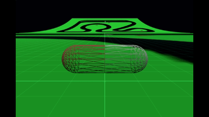

# Babylon.js で物理演算(havok)：カプセルを転がす

## この記事のスナップショット

https://playground.babylonjs.com/?BabylonToolkit#790XCE

（ツールバーの歯車マークから「EDITOR」のチェックを外せば画面いっぱいになります。）

[ソース](107/)

ローカルで動かす場合、上記ソースに加え、別途 git 内の 104/js を ./js として配置してください。

## 概要

前回の記事
[Babylon.js で物理演算(havok)：移動体とカメラ](106.md)
でカプセルの動きが興味深かったので、今回深掘りしていきます。

## やったこと

- とりあえず転がしみる
- そこそこの摩擦で転がしみる

### とりあえず転がしみる

コーナリングでカプセル傾いてちょっと楽しいのです。
しかし傾いたままだと大周りになってしまいます。

傾いたまま大周りしている様子（２倍速）  

### そこそこの摩擦で転がしみる

上記、摩擦の問題かと思い、床とカプセルの摩擦を大きく(1→100)にして転がしてみます。
摩擦が大きくなった分、加える力を大きくしてます。

今度はカプセルが急に傾き、さらに傾いた姿勢が安定せずに回転軸がブレた不規則な動きをとります。

傾いた姿勢が崩れる様子  

摩擦を大きくした結果、最大静止摩擦力っぽい閾値を超えると、急に傾く（斜めに立ち上がる）ように感じます。

## まとめ・雑感

傾いた挙動が「車の片輪走行」っぽくて面白いと思い、カプセルの挙動を深掘りしてみました。よくよく考えたら斜めに浮き上がることで地面との接地が小さくなるので、余計に滑りやすくなるのは当然かもしれません。

横Ｇに比例して傾くようにしつつドリフトっぽく横滑りしてもグリップさせるようにするには、荷重移動をシミュレートしつつも見せ方を変えればよいのかも。

------------------------------

前の記事：前の記事：[Babylon.js で物理演算(havok)：移動体とカメラ](106.md)

次の記事：[Babylon.js で物理演算(havok)：RaycastVehicleでカプセルを転がす](108.md)

目次：[目次](000.md)

この記事には次の関連記事があります。

- [Babylon.js で物理演算(havok)：移動体とカメラ](106.md)

--
