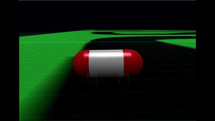
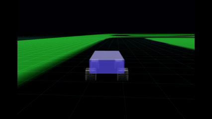
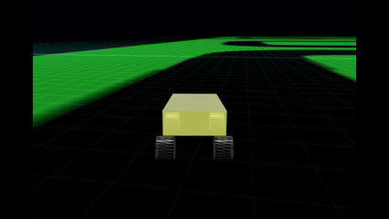
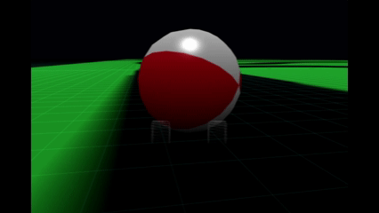

# Babylon.js で物理演算(havok)：RaycastVehicleでカプセルを転がす

## この記事のスナップショット

カプセルの移動（２倍速）  


https://playground.babylonjs.com/?inspectorv2=true?BabylonToolkit#QH0IGO


（ツールバーの歯車マークから「EDITOR」のチェックを外せば画面いっぱいになります。）

[ソース](108/)

ローカルで動かす場合、上記ソースに加え、別途 git 内の 104/js を ./js として配置してください。

## 概要

前回の記事
[Babylon.js で物理演算(havok)：カプセルを転がす](107.md)
[Babylon.js で物理演算(havok)：カプセルを転がす](https://zenn.dev/fnamuoo/articles/72aa4b37011760)

で、カプセルを転がしてみましたが、思ったように転がってくれませんでした。

ここでいう「思った動き」とは下記動作になります。

- 回転で転がっているように見せるため、移動スピードに応じて回転させる
- カプセルの場合はコーナリングで傾く（片方が浮き上がる）ようにする
- 車のように比較的操作しやすいと尚よい

これを実現するために、内部の物理モデルと見た目（カプセル／ボール）を分けることで、思った動きになるかチャレンジしてみました。

物理モデルにはRaycastVehicle（車モデル）
[Babylon.js で物理演算(havok)：車モデル](105.md)
[Babylon.js で物理演算(havok)：車モデル](https://zenn.dev/fnamuoo/articles/1c8813d74bbad5)

を使います。サスペンションを弱く、可動域をやや広くすることで、荷重移動で傾きやすくなるようにします。
振り子っぽい動きになりますが、それでカプセルが傾くような挙動になるかを見てみます。

結果、うんまぁ、及第点でしょうか。

## やったこと

- 荷重移動がわかりやすいRaycastVehicleを用意
- 見た目を球にする
- 見た目をカプセルにする

### 荷重移動がわかりやすいRaycastVehicleを用意

デフォルトの車モデルだと足回しががっちりしているので、パラメータを調整してゆるゆるのサスペンションにします。
実際にいじってみると、パラメータが繊細で少々試行錯誤しました。


```js
//デフォルト（サスペンションが固め）
const wheelConfig = {
    positionLocal:new BABYLON.Vector3(0.49, 0, -0.7),//Local connection point on the chassis
    suspensionRestLength:0.6,                //Rest length when suspension is fully decompressed
    suspensionForce:15000,                   //Max force to apply to the suspension/spring 
    suspensionDamping:0.15,                  //[0-1] Damper force in percentage of suspensionForce
```

```js
//荷重移動しやすくした版（サスペンションがやわらかめ）
const wheelConfig = {
    positionLocal:new BABYLON.Vector3(wpx, 0, -wpz),//Local connection point on the chassis
    suspensionRestLength:0.83,               //Rest length when suspension is fully decompressed
    suspensionForce:9000,                    //Max force to apply to the suspension/spring 
    suspensionDamping:0.14,                  //[0-1] Damper force in percentage of suspensionForce
```


デフォルト時の挙動（２倍速）  


荷重移動しやすい時の挙動（２倍速）  



### 見た目を球にする

車モデルはそのままに表示をオフ（alpha=0）にします。
完全に消してしまうとデバッグしにくくなるのでホイールは薄く表示しています。

まずは、簡素なメッシュの球で挙動を確認します。

リアホイールのクォータニオンをそのまま球のクォータニオンに適用すればよいかと思ったのですが、
スピードに応じた回転になっているようで加速や減速の動きとマッチしません。
また座標系が異なるようで、回転軸がずれています。

```js
// ホイールのクォータニオンをそのまま適用した場合
myMesh._meshView.rotationQuaternion = myMesh._vehicle._wheelMeshes[0].rotationQuaternion;
```

そこで、自前で回転処理します。アクセル操作に応じた回転角を保持し、メッシュの回転に適用させることにします。また、ステアリング操作に応じて回転軸をずらします。

```js
let w = myMesh._vehicle.wheels[0]; // リアホイール
if (w.brake != 0) {
    // ブレーキ
    // 何もしない、回転を固定／回転させない
} else {
     // 車のスピード（移動速度）、アクセルを 現在の位相に加える
    myMesh._meshView._rad += myMesh._vehicle.speed*(0.02+Math.sign(w.force)*0.03);
    myMesh._meshView.rotationQuaternion = BABYLON.Quaternion.FromEulerAngles(myMesh._meshView._rad, 0, 0);
}
let w2 = myMesh._vehicle.wheels[2]; // フロントホイール
if (w2.steering != 0) {
    // ステアリングの角度を誇張（2.5倍）して軸をずらす
    let qrot = BABYLON.Quaternion.FromEulerAngles(0, w2.steering*2.5, 0);
    myMesh._meshView.rotationQuaternion = qrot.multiply(myMesh._meshView.rotationQuaternion);
}
```

球の移動（２倍速）  



### 見た目をカプセルにする

カプセルの場合、デフォルトで縦な状態なので、９０度回転させて横にします。
つまり、この姿勢を起点に回転を施します。

球と違い、カプセルの場合は半径が小さく長軸方向に長くなるので、カプセルの回転を多めに回転させ、ステアリングの舵角をやや弱めて表示しています。

```js
// レンダリングの様子
let w = myMesh._vehicle.wheels[0]; // リアホイール
let q = BABYLON.Quaternion.FromEulerAngles(0, 0, -R90);

if (w.brake != 0) {
    // ブレーキ
    // 何もしない、回転を固定／回転させない
} else {
     // 車のスピード（移動速度）、アクセルを 現在の位相に加える
    myMesh._meshView._rad += myMesh._vehicle.speed*(0.03+Math.sign(w.force)*0.05);
    myMesh._meshView.rotationQuaternion = q.multiply(BABYLON.Quaternion.FromEulerAngles(0, myMesh._meshView._rad, 0));
}
let w2 = myMesh._vehicle.wheels[2]; // フロントホイール
if (w2.steering != 0) {
    // ステアリングの角度を誇張（1.3倍）して軸をずらす
    let qrot = BABYLON.Quaternion.FromEulerAngles(0, w2.steering*1.3, 0);
    myMesh._meshView.rotationQuaternion = qrot.multiply(myMesh._meshView.rotationQuaternion);
}
```

カプセルの移動（２倍速）  


## まとめ・雑感

カプセルやボールでもレース場を周回できるようになりました。カメラがちょっと低い／メッシュが大きかったのか、コース・進行方向がわかりにくいです。
またプレイしているとカプセルを操っているのか、車を操っているのかわからなくなってきます。そのせいか微妙に違和感（これじゃない感）も感じます。

モデルと見た目を分けるというアイデアは悪くはないと思うのですが、今回は微妙だったということでしょうか。次回、別の適用例をご紹介します。

個人的には、カプセルよりも荷重移動の車の方が面白かった。

------------------------------

前の記事：[Babylon.js で物理演算(havok)：カプセルを転がす](107.md)

次の記事：..

目次：[目次](000.md)

この記事には次の関連記事があります。

- [Babylon.js で物理演算(havok)：車モデル](105.md)
- [Babylon.js で物理演算(havok)：カプセルを転がす](107.md)


--
