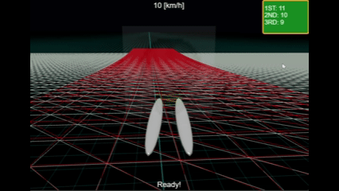
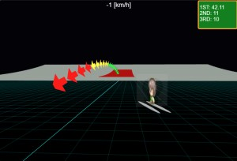
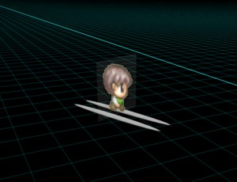
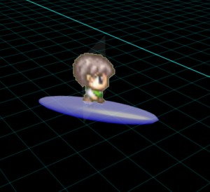
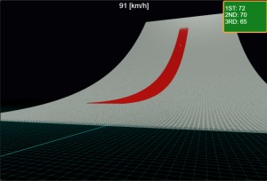

# Babylon.js で物理演算(havok)：スキージャンプ

## この記事のスナップショット

ジャンプの様子（４倍速）  


https://playground.babylonjs.com/?inspectorv2=true?BabylonToolkit#TDM2S8

（ツールバーの歯車マークから「EDITOR」のチェックを外せば画面いっぱいになります。）

[ソース](109/)

ローカルで動かす場合、上記ソースに加え、別途 git 内の 104/js を ./js として配置してください。

## 概要

車モデルをつかって、スキーのジャンプ、傾斜を滑り降りて、ジャンプ台から飛んでみます。

またジャンプ台には高さ／長さのちがう３種類の坂を用意しました。

更にジャンプの軌跡をラインで示したり、ハイスコアを表示するようにしました。

ジャンプの軌跡  


## やったこと

- 車モデルをスキージャンパーにする
- コースを作成
- ジャンプの軌跡を表示

### 車モデルをスキージャンパーにする

車モデルをつかっているとはいえ、車のまま斜面をすべるのは違和感を感じるので見た目を変更します。
１つはスキージャンパー版、もう１つスノボ―ジャンパー版を用意しました。

スキージャンパー版では、シャーシ（車のボディ）を消してスキー板代わりの sphere を細長くして２つ下に配置、
その上に人物（ドット絵）のパネルを配置します。ホイールは消して(alpha=0)おきます。

スキージャンパー  


スノボ―ジャンパー版では、シャーシをボードにして、その上に人物のパネルを配置します。
こちらのホイールも同様に消しておきます。

スノボ―ジャンパー  



### コースを作成

コース、ジャンプ台には高さ／長さのちがう３種類の坂（大中小）を用意します。

メッシュには ribbon を使い、２次関数で傾斜をつけます。
地形とジャンプ台で二種類のパラメータを用意し、スタート付近で交差するようにしています。

```js
// ジャンプ台（小）
let rootPath = [];
let nxmin = -5, nxmax = 5, nzmin = 0, nzmax = 51, gridsize = 1;
for (let iz = nzmin; iz < nzmax; ++iz) {
    let z = iz*gridsize;
    let path = []
    for (let ix = nxmin; ix < nxmax; ++ix) {
        let x = ix*gridsize;
        let y = ((iz-nzmin)**2)*0.00099; // 頂上で交差するように調整
        if (y < 0) y = 0;
        y += 1;
        path.push(new BABYLON.Vector3(x, y, z));
    }
    rootPath.push(path);
}
let trgMesh = BABYLON.MeshBuilder.CreateRibbon("ground_ribbon_1", {pathArray: rootPath, sideOrientation: BABYLON.Mesh.DOUBLESIDE});
let mat = new BABYLON.StandardMaterial("");
mat.diffuseColor = BABYLON.Color3.Red();
mat.wireframe = true;
trgMesh.material = mat;
let trgAgg = new BABYLON.PhysicsAggregate(trgMesh, BABYLON.PhysicsShapeType.MESH, { mass: 0.0, friction:0.01, restitution:0.01}, scene);
trgMesh.physicsBody.disablePreStep = true;
trgMesh.position.y += 0.01;
trgMesh.physicsBody.disablePreStep = false;
meshAggInfo.push([trgMesh,trgAgg]);
```

ジャンプ台（大）  


### ジャンプの軌跡を表示

１つ前のジャンプ時の軌跡をラインで表示させています。
ライン表示は
[Babylon.js：Navigation path をドローン操作でトレース＋ゲームパッド／VirtualStick対応](099.md)

で使った時と同じ、Navigation path を使います。


## まとめ・雑感

「正直面白いのかな？」「とりあえず作ってみるか」で始めたら、
シンプルではあるものの意外と楽しめるかもと思っているところです。

斜面を滑り落ちるには「車モデル」をつかうのがよいと思って採用してみましたが上手くハマった感じがします。

ジャンプのだいご味はジャンプ後の滑空かもしれませんが、そこまで気が回らずただ飛び出すだけになってます。
地形も平地のまま。今回こちらまで気が回っていませんでしたが、飛行機モデルなら実現できたのかな？（そんなモデルは用意して無いけれど）

------------------------------

前の記事：[Babylon.js で物理演算(havok)：RaycastVehicleでカプセルを転がす](108.md)

次の記事：..


目次：[目次](000.md)

この記事には次の関連記事があります。

- ]Babylon.js で物理演算(havok)：車モデル](105.md)


--
