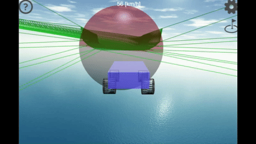
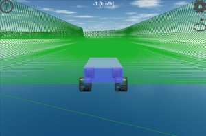
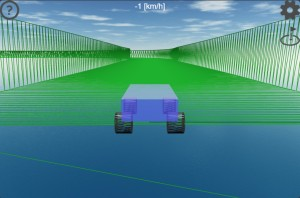
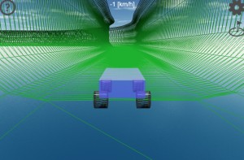
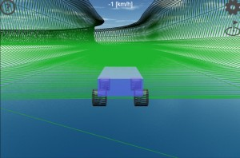
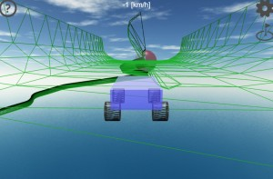
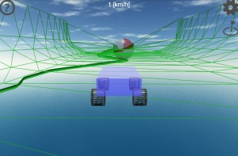
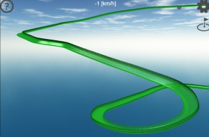

# Babylon.js で物理演算(havok)：extrudeのねじれたコースを走る

## この記事のスナップショット

左コーナー・クライムヒル様子（４倍速）  

https://playground.babylonjs.com/?inspectorv2=true?BabylonToolkit#XHJ4DG

（ツールバーの歯車マークから「EDITOR」のチェックを外せば画面いっぱいになります。）

[ソース](111/)

ローカルで動かす場合、上記ソースに加え、別途 git 内の 104/js を ./js として配置してください。

## 概要

[extrude](https://doc.babylonjs.com/features/featuresDeepDive/mesh/creation/param/extrude_shape/)でコースを作る場合、x-z平面内であれば問題ありませんが、高さ方向(Y軸)に変化をつけると、ロールした（ねじれた）面になってしまいます。

ねじれた状態を解消するには
[Babylon.js で物理演算(havok)：コーラム模様でローラーコースター](065.md)

のように、コースをこまぎれにするか、

[Babylon.js で物理演算(havok)：パイプ内をボードで滑る（２）](093.md)

のようにチューブ状にするしかないです。

ここでは上記のような加工や形状の変更なしに extrude で生成したときの傾きのままで走行してみます。といっても極端にねじれたコースは排除しています。また周回コースの場合は開始地点と終了地点の傾きがそろうように微調整（回転）をかけてます。

上記のコースを、raycast のボード（前回の記事で作成した移動体）と RaycastVehicle（車モデル） で走ってみます。

入力はキーボードのみです。ゲームコントローラーや仮想スティックには未対応です。

## やったこと

- コースを作成
- コースの微調整(回転でねじれを抑制)

### コースを作成

コースは
[Babylon.js で物理演算(havok)：パイプ内をボードで滑る（２）](093.md)
のものをそのまま利用します。

車モデルでも走れそうなコースを選んで再掲載しました。
ただし、コースは extrude で作成する都合上、極端にねじれるものは避けてます。

また、断面はチューブ状ではなく、平たい形状をいくつか作成してみました。

丸い底（初級者向け）  

かど底（中級・上級者向け）  

チューブにちかい形状（高速コース向け）  

チューブにちかい形状（低速コース向け）  

「チューブにちかい形状」は長距離コースを完走しやすいように用意しました。もともとコースアウトすると復帰できないレイアウトなので出来るだけ落ちないようするための措置です。コース復帰できるような仕組みを考えるべきとは思いますが、なかなか良いアイデアが思いつかず...

## コースの微調整(回転でねじれを抑制)

extrudeには全体に回転（ねじれ）を一律に付与できる機能(rotate)を使ってねじれ具合を調整します。

未調整の場合のらせん（スタート付近からゴール地点を振り返り）  

調整後のらせん  

これをつかって、周回コースの始点と終点の傾きのずれを調整してなめらかに接合します。ただ、この機能は全体に対し一律な回転のため、局所的に斜めな箇所が生じてしまうことが避けられません。

局所的な傾き（オータムリンクの後半)  

[custom extrusion](https://doc.babylonjs.com/features/featuresDeepDive/mesh/creation/param/custom_extrude/)によると
関数で回転・傾きを指定できるようですが、勉強不足のため今回は見送ります。

## まとめ・雑感

コーラム模様のコースが思ったより走りやすくなって嬉しい限りです。

走ってみていくつか気づいた点があります。

- ボード
  - 想定どおり、斜めでも問題なく走れる。
  - 縦ループだとぶつかりまくり。

- 車
  - 意外と傾斜があっても走れる。でも垂直に近いとコースアウト。
  - 高速になると直進が難しくなる。車モデル固有の問題っぽい。ドリフト寄りの挙動にした為かも。何とかしたいけど、どうしたものか...

コースについては

- 高低差がマイルドなら、それほどひどくはねじれが発生しない様子。
- やっぱりコーナーは内側を低く、外側を高くしたいので、custom extrusionの勉強は頑張ろう。

------------------------------

前の記事：[Babylon.js で物理演算(havok)：raycastで浮かせたボードを作成する](110.md)

次の記事：..

目次：[目次](000.md)

この記事には関連記事がありません。

- [Babylon.js で物理演算(havok)：コーラム模様でローラーコースター](065.md)
- [Babylon.js で物理演算(havok)：パイプ内をボードで滑る（２）](093.md)

--
