# Babylon.js で物理演算(havok)：コースに部分的バンクをつけて試走

## この記事のスナップショット

高速コーナー（MotegiSuperSpeedway＋バンク）（２倍速）  
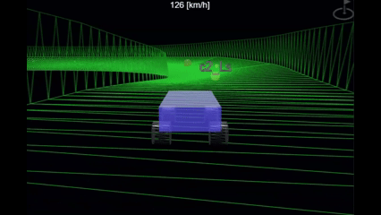

https://playground.babylonjs.com/?inspectorv2=true?BabylonToolkit#GJONXG

（ツールバーの歯車マークから「EDITOR」のチェックを外せば画面いっぱいになります。）

[ソース](112/)

ローカルで動かす場合、上記ソースに加え、別途 git 内の [104/js](https://github.com/fnamuoo/webgl/tree/main/104/js) を ./js として配置してください。

## 概要

前回の記事

[Babylon.js で物理演算(havok)：extrudeのねじれたコースを走る](111.md)


で触れた extrude について 部分的な回転が可能な 
[Custom Extrusion](https://doc.babylonjs.com/features/featuresDeepDive/mesh/creation/param/custom_extrude/)
を試してみて、コースにバンク（傾斜）をつけてみました。
また、そのコースを車モデルで走ってもみました。

ExtrudeShape を使ったメッシュの場合、水平面上（x-z）の点であれば問題ないのですが、カーブに高さが加わるとコースがねじれてしまいます。
都合よく内側に向くようにねじれるとよいのですが、外側に向くようなねじれの場合もあります。

カーブで外側に向くようなねじれ  
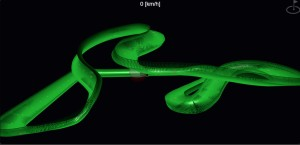

ねじれを部分的に修正したコース  
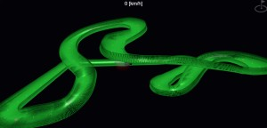

結果、バンクをつけやすい点の配置やCustom Extrusionのクセっぽいものも見えてきました。

ちなみに Custom Extrusion では、角度だけでなくサイズも変化させることができるようですが、今回は角度（ひねり）だけを操作します。

今回は試行錯誤している都合上、ソースコードが取っ散らかってます。コースの画像がなかったりします。予めご承知おきください。

## やったこと

- コースの点列を作る：生成AIにコース情報を作らせてみる
- コースの点列を作る：手作業でつくる
- コースデータの可視化(マーカーやラベルの配置)
- コースにバンクだけをつけてみる
- 断面形状の位置の検証
- コースに高低差だけをつけて捻り具合をみる
- コースに高低差＋バンクをつけてみる
- 別のコースＢ（点列が不均一な場合）
- 別のコースＣ（片道に）

### コースの点列を作る：生成AIにコース情報を作らせてみる

生成ＡＩに画像処理させれば手間がへって最高かもとおもってやらせてみました。

コース画像  
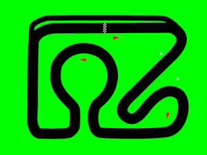

を渡して、センターラインを描かせて、一定の間隔で点を配置まではできました！

「test_生成AI」  
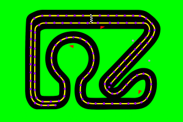

と思ったらサイズが違う。ブラウザのサイズに合わせるかのようにリサイズしてくる。
点のサイズ（1pixel四方）を指定してもなんかうまくいきませんでした。しかも勝手に大きく表示する始末です。

ならばと、点の座標を抜き出して JavaScript の配列形式で出力させてみると、今度は並び順が崩れています。形状も違っているように見えます。

抽出した点列でコースを作成した場合  
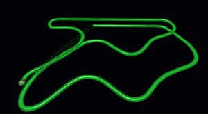

別の生成ＡＩではまったく上手くいかないケースもあります。

生成ＡＩに点を打たせたところ（別の生成AIでの失敗例）  
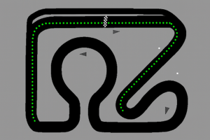

補足になります。
生成ＡＩを使った点列の取得ですが、レビューと改善を繰り返したらワンチャンありかもです。
下記では、点の間隔が「約30ピクセルごとの等間隔」にはなっていませんが、それ以外はうまくできているようです。

プロンプト

```
添付画像のサイズを変更せずに次の操作を上書きして描画してください。
操作１．太い黒い線にそって、中心部分に線、センターラインを引いて。センターラインは１ピクセルの白色で示して。黒い線が交差するときは直進して。
操作２．センターライン上に、約30ピクセルごとの等間隔に、サイズ２ピクセルの緑色の点を配置して。
上記の操作について、レビューと改善を３回繰り返して。
「第3版」を描画して。
```

入力  
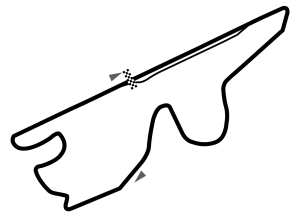

結果（部分的に抜粋）  
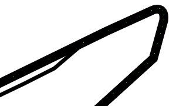

参考）[AI出力の品質が悪い？「レビューと改善を3回繰り返して」だけで圧倒的に品質が上がる](https://zenn.dev/loglass/articles/c356dbc3062137)

### コースの点列を作る：手作業でつくる

生成ＡＩに画像処理させると上手くいかなかったので、手作業で点を打ち直します。

手作業でコース情報をつくることは

[Babylon.js：画像からコース作り（１／２）](090.md)

でも紹介しましたが、今回はなるべく等間隔で点を抜き出すことにします。その方が高低差をつけるときにコントロールしやすくなります。

さて手動で等間隔に点を打つ場合どうするか。
ここではコースの画像上に２つのレイヤーを重ね、円を打っていきます。
円を半分ずらして重ねていくことは比較的かんたんなので、円を打つごとにレイヤーを交互に切り替えます。

手作業で円を打った様子  
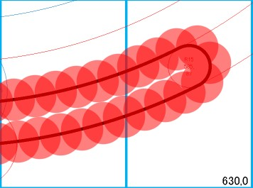

ほどよく等間隔の目印ができたので、更にレイヤーを重ねてコースの中心部分に点を打っていきます。

点だけのレイヤー  
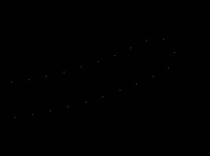

点だけのレイヤーから画像を作成したら、

[Babylon.js：画像からコース作り（１／２）](090.md)

で紹介した画像から点の座標を抜き出すpythonスクリプトでデータを生成します。

作成した座標データを描画  
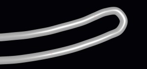

### コースデータの可視化(マーカーやラベルの配置)

座標値のデータからコースをつくっているだけなので、どの座標がコーナーかわかりません。以前は座標値の位置にボールを配置してました。

ボールが配置されたコース  
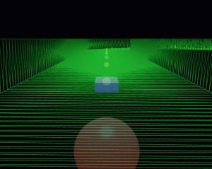

これだけでは特定の場所を見つけるのが難しいので、データにラベル情報を持たせ、コース上に表示できるようにしました。

```js
// ラベルありのコースデータ
      xz2: [
[213, 39],
[230, 39, "Label1"],
[248, 39],
[266, 39, "Label2"],
[283, 39],
```

ラベル付きのコース  
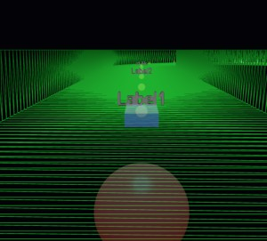

これでデータの並びと表示（ラベル）を同期させることができ、任意の場所に高低差をつけたり、バンクをつけたりということがやりやすくなりました。

便利なフレームワークや高機能な描画ツールならマウスクリックで指定の箇所を直感的に操作できるものがあるのかもしれませんが、そんな高機能なユーザインタフェースは作り込んでいません。データをただ表示しているに過ぎないので、データ操作は一方通所、データを加工しては表示で確認といった具合です。マーカとなるボールやラベルがない時はあたりをつけて数値をいじるという超面倒くさい／時間がかかるものだったのですが、ラベル表示をするように作り込んだことでかなり時間の短縮につながりました。データ加工で便利な３Ｄツールがありそうな気もしますが、とんと疎くて難儀してます。

### コースにバンクだけをつけてみる

コースに高さをつけてしまうとねじれてしまうので、x-z平面上にコースを配置したまま、バンクをつけてみます。バンクのつけ方はこのように。

```js
// 関数を定義
//   事前に点の位置(index)に応じた回転を mZRot に格納しておく
const myRotation = (index, distance) => {
    if (index in mZRot) {
        return mZRot[index];
    }
    return 0;
};
options.updatable = true;
options.rotationFunction = myRotation;

// extrudeCustomを呼び出す
mesh = BABYLON.MeshBuilder.ExtrudeShapeCustom("extrude", options, scene);
```

関数内の mZRot はコースの座標、点の位置に応じた角度をもたせた連想配列です。

例えば第１コーナーで右にカーブするところ、カーブの前で傾きをつけある程度傾いたところで固定（角度を０に）します。
カーブの終わりでは傾きを戻すように逆向きの角度をつけ、水平に戻ったところで固定（角度を０に）します。

第１コーナー（４倍速）  
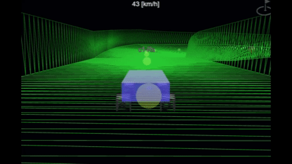

```js
// 第１コーナー周辺のコースデータ
// バンクよわめ＋ラベル（５番目が角度、６番目がラベルを示す）
      xzRR_wk: [
[213, 39, 0, 0, 0],
[230, 39],
[248, 39],
[266, 39],
[283, 39],
[301, 39, null, 0, -R04, "c1-Rs"],
[318, 39],
[332, 42, null, 0, 0],
[345, 53],
[352, 70, null, 0, R04],
[349, 86],
[340, 100, null, 0, 0, "c1-Re"],
[329, 112],
```

ちなみに高速コーナーを意識してバンクのあるコースを走ってみると、コントロールが難しく、また思ったよりもスピードが乗りません。
またバンクの入り口・出口で角度のつけ方が荒いのか、路面がざらざらした（ガタガタではないが滑らかでもない）感じがします。下記gifアニメだと全然伝わりませんが（大汗

高速コーナー（MotegiSuperSpeedway＋バンク）（２倍速）  


### 断面形状の位置の検証

extrude を使う場合、断面形状を指定します。この断面が原点で回転することを考えると、原点との位置関係が重要になりそうです。
そこで、下記の場合を見てみます。

- 原点を通る場合
- 原点の上に配置した場合
- 原点の下に配置した場合
- 左端を原点に配置した場合
- まとめ

#### 原点を通る場合

原点を通るように道路（断面の線分）を配置します。

<!--
```fig
// 01:原点を通るように断面形状を作った場合
　　　　　　↑Ｙ
　　■　　　│　　　■
　　■　　　│　　　■
──■■■■■■■■■─→Ｘ
　　　　　　│
```
-->
01:原点を通るように断面形状を作った場合  
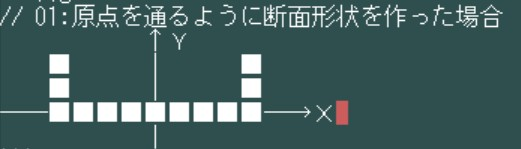

この場合、バンクの内側が下がり、外側が上がったようになります。

下記において「コーナーへの侵入付近」は「上空」からの俯瞰において一番上の直線から右側を見た、右へ曲がるコーナー付近になります。

コーナーへの侵入付近で撮影  
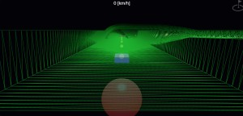

コース全体を上空から見た場合  
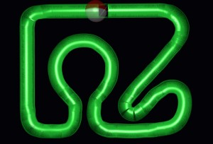

わかり易くするために強調しているとはいえ、両端が凸凹しています。次節以降で、形状の配置する位置を変えることで、より滑らかにできないか試行錯誤しました。

#### 原点の上に配置した場合

原点の上部に道路（断面の線分）を配置します。

<!--
```fig
// 02:原点の上部に断面形状を作った場合
　　　　　　↑Ｙ
　　■　　　│　　　■
　　■　　　│　　　■
　　■■■■■■■■■
　　　　　　│
　　　　　　│
────────────→Ｘ
　　　　　　│
```
-->
02:原点の上部に断面形状を作った場合  
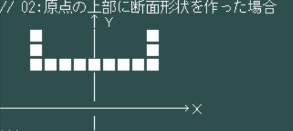

この場合バンクの内側の下がり具合がより強調され、それ以上にコースが内側にスライドしています。

コーナーへの侵入付近で撮影(バンク強＋UP)  
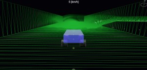

コース全体を上空から見た場合(バンク強＋UP)  
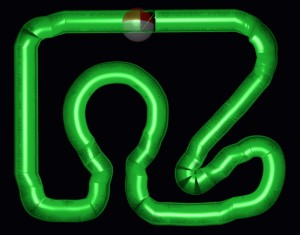

より原点から離れた配置することで、水平方向によりズレてます。

コース全体を上空から見た場合(バンク強＋UPx2)  
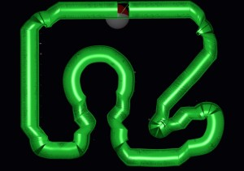


#### 原点の下に配置した場合

原点の下部に道路（断面の線分）を配置します。

<!--

```fig
// 03:原点の下部に断面形状を作った場合
　　　　　↑Ｙ
──────────→Ｘ
　　　　　│
　　　　　│
　■　　　│　　　■
　■　　　│　　　■
　■■■■■■■■■
　　　　　│
```
-->
03:原点の下部に断面形状を作った場合  
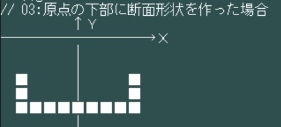

この場合、バンクの外側の上がり具合がより強調され、それ以上にコースが外側にスライドしたかのようになります。


コーナーへの侵入付近で撮影(バンク強＋DOWN)  
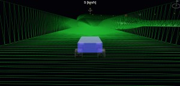

コース全体を上空から見た場合(バンク強＋DOWN)  
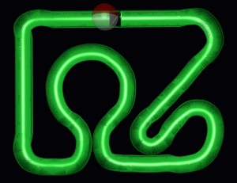

コース全体を上空から見た場合(バンク強＋DOWNx2)  
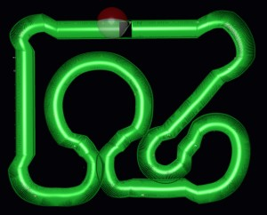

#### 左端を原点に配置した場合

道路（断面の線分）の左端を原点に配置します。

<!--
```fig
// 04:道路（断面の線分）の端を原点に配置した場合
　　↑Ｙ
　　■　　　　　　　■
　　■　　　　　　　■
──■■■■■■■■■─→Ｘ
　　│
```
-->
04:道路（断面の線分）の端を原点に配置した場合  
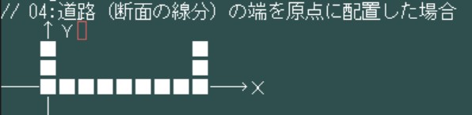

この場合、右カーブで内側（右端）が下がり、左カーブの場合に外側（右端）が上がります。回転軸が端によっている分、高さの変化が大きくなったように感じます。
またこれら以上にセンターラインがズレてしまいます。

コーナーへの侵入付近で撮影(バンク強＋RIGHT)  


コース全体を上空から見た場合(バンク強＋RIGHT)  
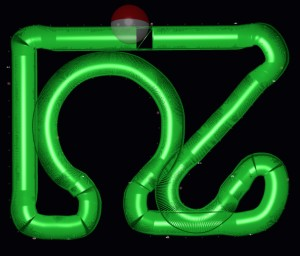


道路（断面の線分）の右端を原点に配置した場合は、バンクの付き方が対称になり、こちらでも同様にセンターラインがズレます。

コーナーへの侵入付近で撮影(バンク強＋LEFT)  
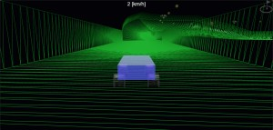

コース全体を上空から見た場合(バンク強＋LEFT)  
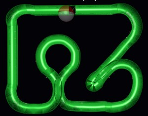

#### 断面形状の位置の検証まとめ

上記より以下のことが見えてきました。

- 断面形状はどこに配置しても傾斜する角度は変わらない。
- 原点との相対位置によって配置される位置（上下左右）が大きく変わる。特に原点から離れるほどコースが大きく変わる。

結果、最初の「原点を通る形状」が一番無難ということがわかりました。
当初の『形状の配置する位置を変えることで、より滑らかにできないか試行錯誤』は失敗ということになります。

正直「原点の下に配置」はなめらかにバンクできるかと期待していたのですがダメでした。
バンクをつけるとコースが外にそれ、逆にバンクを戻すと内側に寄ります。結果、アウト・イン・アウトのラインを走ろうとするとコーナーの最後で壁が想定外にせまってきて激突します。

### コースに高低差だけをつけてねじり具合をみる

高低差をつけるとコースがねじれると言ってきましたが、具体的にどれぐらいねじれるかは高低差によります。

「test_高低差（激）のみ」（スタート付近からゴール付近を見たところ）  
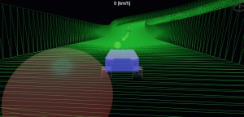

「test_高低差（激）のみ」（全体像）  
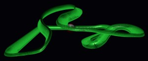

「test_高低差（ゆる）」（スタート付近からゴール付近を見たところ）  
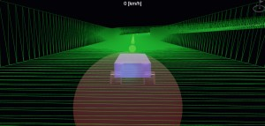

「test_高低差（ゆる）」（全体像）  
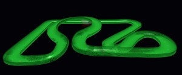

周回コースの場合、スタート地点で大した差がなくても、コース途中でひっくり返っていたということもあります。

### コースに高低差＋バンクをつけてみる

上述で作った高低差のあるコースの傾き（バンク）を補正して走りやすくしてみます。

「test_高低差（激）＋バンク調整」（全体像）  
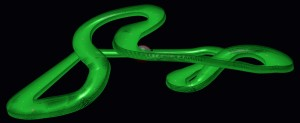

「test_高低差（ゆる）＋バンク調整」（全体像）  
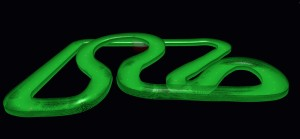


### 別のコースＢ（点列が不均一な場合）

以前に作成したコースについてバンクを調整してみました。点の間隔が不均一なので思ったように変形させしずらく調整に苦労しました。

「AutumnRing」（全体像）  
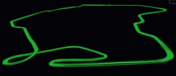


### 別のコースＣ（片道に）

ここでは周回コースではなく、一本道についてバンクをつけてみました。

結果、失敗でした。第１コーナーを補正したあと、第２コーナーの出口で傾斜がきつくなるので、バンク調整したらなぜが全体がねじれました。結果第１コーナーがもっと傾くことになりました。理由がまったくわかっていません。片道でもうまくいくケースがあるのかもしれませんが、深掘りせずにここまでとします。

「✕*2」（スタート付近）  
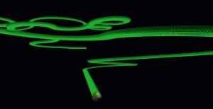

## まとめ・雑感

部分的なバンクのつけ方や、バンクをつけたコースがどのようになるのか試走して体験できました。高速コース（MotegiSuperSpeedwayとか）のバンクとか雰囲気はでてるかなと思ってます。急こう配なバンクは走りにくいですが、緩やかなバンクならアリかもと思ってます。ちなみにドリフトを楽しむならバンクのない平坦なコースが一番スムーズに滑ります。

コースを構成する点の配置は等間隔が良さげです。直線やカーブで粗密をつけたくなりますが、高低差を付けたりバンクをつける段になると段差ができたり思うように角度を付けられなかったりします。

部分的にバンクをつける際、コーナーの前後にストレートがあると簡単なのですが、コーナーが連続するとバンクをつけにくくなります。特にアップ／ダウン中のコーナーにバンクをつけることができないのか、指定した位置よりズレて傾くということもありました。基本は「水平にすること」に注力するのが良さげです。下手にスラローム（左右のカーブが連続するところ）でバンクをつけようものなら収拾がつかなくなり、外側に滑り落ちるような変なバンクになりかねないです（実体験）。内向きのバンクをつける場合は角度が足りないくらいがいい感じに収まる気がします。きついバンクを付けたいときは、バンクの直前・直後の傾斜がジャンプ台にならないように、ゆるやかな角度の調整が必要で適用できる箇所は限られそうです。

断面形状の位置については、原点から離れるほど扱いが難しく、原点対称に配置する形状が無難でした。限られたコース（周回するだけのすり鉢のような場合）なら離れた形状でも可能性がありそうですが、「下手な考え休むに似たり」になりかねないので取り扱い注意です。記事にまとめているときに「ひょっとしたら」と思って追跡調査したのですがまったくの空振りでした。

結局、緩い高低差なら一律でrotate（extrudeのrotateオプション）するのがコスパよくベストアンサーな気がします。
局所的にバンクをつけるのは楽しいですが、試走してみると角度変化が凹凸になって車が跳ねるし、走りにくくなったと思うことが多々ありました。高低差が激しい場合は今回の方法でも対処できない難しいケースがあり、今後の課題です。正直「ribbonで曲面を作ればいけるかも」と思わなくもないですが、それはそれで曲面／座標の計算が大変そうです。

今回、生成ＡＩを使った検証も行いましたが、後日あらためて実施すると上手くいくかもしれません。閲覧時には執筆時より改善されているかもしれないので執筆当時の結果として受け取っていただけると幸いです。

------------------------------

前の記事：[Babylon.js で物理演算(havok)：extrudeのねじれたコースを走る](111.md)

次の記事：..


目次：[目次](000.md)

この記事には関連記事がありません。

- [Babylon.js：画像からコース作り（１／２）](090.md)
- [Babylon.js で物理演算(havok)：extrudeのねじれたコースを走る](111.md)


--
