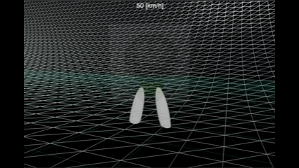
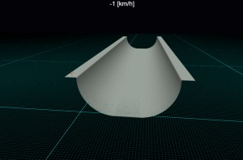
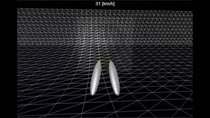
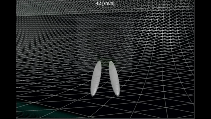
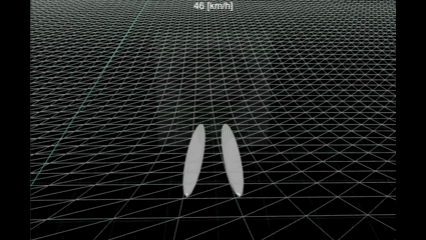

# Babylon.js で物理演算(havok)：ハーフパイプ

## この記事のスナップショット

720（４倍速）  


https://playground.babylonjs.com/?inspectorv2=true?BabylonToolkit#1KW1LG

操作方法は (h)キーを押して確認してください。

（ツールバーの歯車マークから「EDITOR」のチェックを外せば画面いっぱいになります。）

[ソース](113/)

ローカルで動かす場合、上記ソースに加え、別途 git 内の [104/js](https://github.com/fnamuoo/webgl/tree/main/104/js) を ./js として配置してください。

## 概要

[Babylon.js で物理演算(havok)：スキージャンプ](109.md)
の応用として、ハーフパイプのステージを作ってみました。

お試しで作ってみました。操作が難しくゲームとしては微妙な感じだったので簡素なつくりのまま作り込んでいません。途中で開発を凍結しました。

## やったこと

- ハーフパイプを作る
- ジャンパーを調整する
- 技に挑戦

### ハーフパイプを作る

[Wikiハーフパイプ](https://ja.wikipedia.org/wiki/%E3%83%8F%E3%83%BC%E3%83%95%E3%83%91%E3%82%A4%E3%83%97)
を参考にステージを作ります。

まず断面形状にそって点列を作成します。

```js
// プログラムに応じて点列を作成
let createShape = function(actList) {
    let  plist=[], p, s;
    for (let act of actList) {
        if (act.type == "ini") {
            p = new BABYLON.Vector2(act.p[0], act.p[1]);
            plist.push(new BABYLON.Vector3(p.x, p.y, 0));
        } else if ((act.type == "str") || (act.type == "straight")) {
            s = new BABYLON.Vector2(act.v[0], act.v[1]);
            for (let i=0; i < act.n; ++i) {
                p.addInPlace(s);
                plist.push(new BABYLON.Vector3(p.x, p.y, 0));
            }
        } else if (act.type == "arc") {
            s = new BABYLON.Vector2(act.v[0], act.v[1]);
            for (let i=0; i < act.n; ++i) {
                s = s.rotate(act.rstep);
                p.addInPlace(s);
                plist.push(new BABYLON.Vector3(p.x, p.y, 0));
            }
        } else {
            console.log("act=", act);
            console.assert(0);
        }
    }
    return plist;
}

// ハーフパイプ断面をプログラム
let h=16.7;
let plist = [];
let actList = [{type:"ini", p:[-5, h],},
               {type:"str", v:[0.5, 0], n:10},  // deck(L)
               {type:"str", v:[0, -0.5], n:2}, // vert(L)
               {type:"arc", v:[0, -0.5], rstep:R90/50, n:50}, // transition(L)
               {type:"str", v:[0.5, 0], n:20}, // flat bottom
               {type:"arc", v:[0.5, 0], rstep:R90/50, n:50}, // transition(R)
               {type:"str", v:[0, 0.5], n:2},  // vert(R)
               {type:"str", v:[0.5, 0], n:10},  // deck(R)
              ];
let myShape = createShape(actList);
```

あとは ExtrudeShape で作成します。

```js
let options = {shape: myShape,
               path: plist2, // points,
               sideOrientation: BABYLON.Mesh.DOUBLESIDE,
               adjustFrame:true};
let trgMesh = BABYLON.MeshBuilder.ExtrudeShape("extrude", options, scene);
```

ハーフパイプ  


## ジャンパーを調整する

RaycastVehicle で前輪だけに舵角をつけてましたが、回転しやすくするため後輪にも舵角を付けます。

```js
vehicle.wheels[2].steering = vehicle._steerValue
vehicle.wheels[3].steering = vehicle._steerValue
vehicle.wheels[0].steering = -vehicle._steerValue
vehicle.wheels[1].steering = -vehicle._steerValue
```

RaycastVehicleが気になる方は以下を参照してください。

- [Babylon.js で物理演算(havok)：車モデル](105.md)
- [Babylon.js で物理演算(havok)：スキージャンプ](109.md)


### 技に挑戦

ハーフパイプの技を調べてみるといろいろな技があるようですが、ここで再現できるのは回転技になります。
180, 360, 540 くらいまではなんとか出来ました。720（２回転）はCtrl押しながらの急旋回ならいける感じです。

180（４倍速）  


360（４倍速）  


540（４倍速）  


720（４倍速）  


## まとめ・雑感

操作が難しいです。回転が安定しないし着地が毎回運任せです。あらためてプロのアスリートってすごいなぁと思います。あとスタート地点を「デッキ」（ハーフパイプの端の上）にしてますが、ここから斜面を滑り降りれた試しがありません。大抵頭から落下してしまいます。[Enter]による姿勢リセットが必須ですが悪しからず。

物理演算で再現しようとすると無理ゲーになる類だったかもしれません。でも、前輪後輪に舵角をつけると回転しやすくなるとわかったのは収穫でした。


------------------------------

前の記事：[Babylon.js で物理演算(havok)：コースに部分的バンクをつけて試走](112.md)

次の記事：[Babylon.js で物理演算(havok)：アルペンスキー](114.md)


目次：[目次](000.md)

この記事には次の関連記事があります。

- [Babylon.js で物理演算(havok)：車モデル](105.md)
- [Babylon.js で物理演算(havok)：スキージャンプ](109.md)


--
