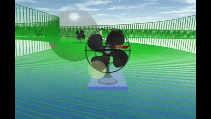
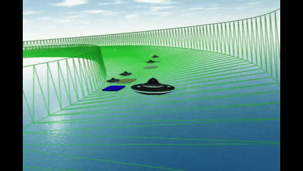
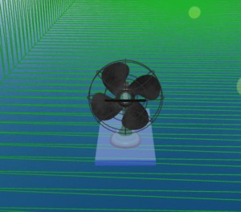
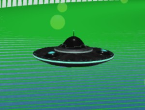
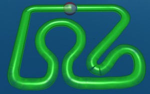
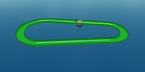
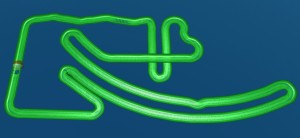
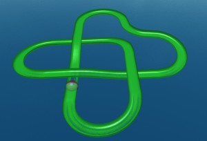
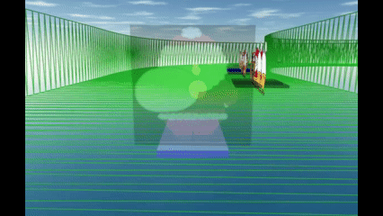

# Babylon.js で物理演算(havok)：扇風機／UFOでレース

## この記事のスナップショット

扇風機（２倍速）  


ＵＦＯ（２倍速）  


https://playground.babylonjs.com/?inspectorv2=true?BabylonToolkit#8PB1WW

（ツールバーの歯車マークから「EDITOR」のチェックを外せば画面いっぱいになります。）

[ソース](115/)

  - 115_fan_ufo .. 扇風機／UFO バージョン
  - 115_santa  .. サンタバージョン

ローカルで動かす場合、上記ソースに加え、別途 git 内の [104/js](https://github.com/fnamuoo/webgl/tree/main/104/js) を ./js として配置してください。

## 概要

RaycastVehicleモデルと扇風機メッシュを使ったレース、および自作RaycastモデルとUFOメッシュを使ったレースを作成しました。

## やったこと

- プレイヤー（自機）にアニメーションするメッシュを貼り付ける
- ライバル（敵）を走らせる
- コース

### プレイヤー（自機）にアニメーションするメッシュを貼り付ける

自機については

- [Babylon.js で物理演算(havok)：車モデル](105.md)
- [Babylon.js で物理演算(havok)：raycastで浮かせたボードを作成する](110.md)


の移動モデル（RaycastVehicleや自作Raycast）を使います。
一方でアニメーションするメッシュを貼り付ける処理

- [Babylon.js で物理演算(havok)：魚群(boid)と海上移動のキャラクターコントローラー](084.md)
- [Babylon.js で物理演算(havok)：タワーディフェンスのゲームをつくる](103.md)

を流用します。といってもbabylon.js のバージョンが違っているのであちこち手をいれます。

メッシュは
公式[The Meshes Library](https://doc.babylonjs.com/toolsAndResources/assetLibraries/availableMeshes/)
にある
[扇風機](https://playground.babylonjs.com/?inspectorv2=true#YBEKDT#17)、
[ＵＦＯ](https://playground.babylonjs.com/?inspectorv2=true#058SEW#3)
を用います。

扇風機  


ＵＦＯ  


外部メッシュを読み込んでから自分のコードを動かしたいのですが、非同期処理が前提なため await をかけて同期させます。

```js
// 外部メッシュを読み込む処理に await で待ちを発生させる
await loadMeshGLB_cntTask(scene);
...

// 扇風機の処理に時間がかかるため更に待ちを発生させる
await wait(1);
...
```

動的にメッシュの複製を作りたいので、複製元（オリジナル）を原点に放置してます。気にしないでください。
複製は Mesh.clone() で作成し、自機やライバルに利用します。
ただ、「扇風機」については複数メッシュを組み合わせているようで、個別のメッシュをコピーして１つにまとめるようコピー用の関数を用意してます。ＵＦＯは .clone() で複製できるのでこのような手間は不要です。

```js
let meshFan_clone = function(name) {
    let meshRoot = new BABYLON.TransformNode();
    // コピー元のmeshFan の _elem に各パーツ（mesh）を格納、これらをcloneでコピーする
    for (let m of meshFan._elem) {
        let m2 = m.clone(name);
        m2.parent = meshRoot;
    }
    return meshRoot;
}
```

余談ですが、
- [Babylon.js で物理演算(havok)：魚群(boid)と海上移動のキャラクターコントローラー](084.md)

で「サメ」に色付けしたように、直接メッシュに色付けしたかったのですが、上手くいかず断念しました。
代わりにメッシュ下のプレートに色付けしてます。

### ライバル（敵）を走らせる

ライバルを走らせるために
[Crowd Navigation System](https://doc.babylonjs.com/features/featuresDeepDive/crowdNavigation/)
を使うことは今までもやってきました。

- [Babylon.js：画像からコース作り（２／２）](091.md)

上記から、以下のエッセンスについて流用します。

- エージェントに特定のメッシュを貼り付ける
  - 自機のメッシュに合わせたメッシュにします。自機が「扇風機」ならライバルも「扇風機」といった具合に。
- エージェントごとに速度（初期値）調整
  - プレイヤーより極端に速く・遅くならないように
  - 適度にばらけるように値域を調整
- エージェントにコースを周回させる
  - 目的地を複数配置して、巡回させる処理はそのまま利用

### コース

- [Babylon.js で物理演算(havok)：コースに部分的バンクをつけて試走](112.md)

で作ったコースを流用します。

走りやすいコースのみを抜粋して採用します。その一部を紹介します。

- test／test_高低差（ゆる）＋バンク調整
  - 

- MotegiSuperSpeedway＋バンク
  - 

- マイクロマウス2024学生
  - 

- コーラム模様:4101
  - 


### 既知の不具合

- スタートやゴールの機能を実装していません。勝手に始まり、ゴールしても何も起こらないです。永遠に周回します。

- 自機を変更したときに、ライバルが変更しないことがあります。ライバルはコースの作成時に作り直す実装なので、気になる方は自機変更時に、コースも一度変更してコースを戻してください。
- キーボードで自機やコースの切り替えで、shiftキー同時押しで逆順にするとき、キーを押下してないのに勝手に切り替わることがあります。この時は Ctrl-R でリセット（再読み込み）してください。


## まとめ・雑感

扇風機のレースを俯瞰して見ていると、某番組の魔改造された家電っぽくて楽しいです（笑。
またＵＦＯについては自作Raycastモデルの動き（ゆらゆらと不安定なさま）が思いのほかピッタリはまったように思います。
サンプルのメッシュとはいえ、やっぱりよいですね。無骨な基本メッシュ（直方体）よりクオリティがぐっと上がった感じがします。
しかし扇風機は高さがあってコースが見づらいです（笑

ライバルのスピード調整（加速と最大速度）には苦労させられました。自分のベストな走りより８割～９割でも勝てる程度に調整しました。
この辺もっと動的に、プレイヤーの動きに合わせて調整できたらと思ってますがまだ構想段階です。

にしても、正式な車モデルを待ち焦がれる今日この頃です。


サンタバージョン（２倍速）  


https://playground.babylonjs.com/?inspectorv2=true?BabylonToolkit#8PB1WW#1

------------------------------

前の記事：[Babylon.js で物理演算(havok)：アルペンスキー](114.md)

次の記事：..

目次：[目次](000.md)

この記事には次の関連記事があります。

- [Babylon.js で物理演算(havok)：車モデル](105.md)
- [Babylon.js で物理演算(havok)：raycastで浮かせたボードを作成する](110.md)
- [Babylon.js で物理演算(havok)：魚群(boid)と海上移動のキャラクターコントローラー](084.md)
- [Babylon.js で物理演算(havok)：タワーディフェンスのゲームをつくる](103.md)
- [Babylon.js：画像からコース作り（２／２）](091.md)
- [Babylon.js で物理演算(havok)：コースに部分的バンクをつけて試走](112.md)

--
