# Babylon.js で物理演算(havok)：カートレース

## この記事のスナップショット

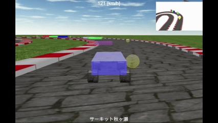  
*プレイ画像（２倍速）*

https://playground.babylonjs.com/?inspectorv2=true?BabylonToolkit#07233Z

（上記のURLにおいて、ツールバーの歯車マークから「EDITOR」のチェックを外せばウィンドウいっぱいに、歯車マークから「FULLSCREEN」を選べば画面いっぱいになります。）

[ソース](116/)

ローカルで動かす場合、上記ソースに加え、別途 git 内の [104/js](https://github.com/fnamuoo/webgl/tree/main/104/js) を ./js として配置してください。

## はじめに

[Babylon.js](https://doc.babylonjs.com/) の基本操作（Mesh / Camera / Physics）の知見を有していればより理解が深まりますが、そんな知識がなくてもディープな説明はないので大丈夫です。
初めての方でもデモプレイ（上記リンク）を遊んでいただいて興味を持っていただけると幸いです。

## 概要

実際のカートコースを模したレースゲームを作成しました。作成時のポイントを解説しますが、過去の記事で紹介した部分は割愛し、目新しい部分のみに焦点を当てています。
検索から有名どころと思われるカートコースをピックアップしてコースを作成してみました。コースマップ（図）からコースをおこしているので結果、似て非なるものに仕上がってますが、雰囲気は味わえるかと思います。
順路がわからないものは適当に決めてます。知っている方がいたら教えてほしいです。
検索しているときにドリフトのコースも見つけてしまったので、おまけとして追加しました。

車モデルは 
[Babylon.js で物理演算(havok)：車モデル](105.md) 
で使ったものを利用します。パラメータを調整して、ドリフト仕様とグリップ仕様を用意しました。

コースの作り方はおおむね、こちらの手順
[Babylon.js：画像からコース作り（１／２）](090.md)
のとおりですが、最初の画像処理（コースのセンターライン上に一定間隔で点を配置）を生成AIにやらせてます。

コースに交差や高低差がある場合は、部分的にバンクを付けます。
バンクのつけ方は
[Babylon.js で物理演算(havok)：コースに部分的バンクをつけて試走](112.md)
のノウハウを流用します。

今回は、更に次の作り込みを行ってます。

- コースにテクスチャを張ってリアルっぽさを出す
- ライバルカー（COMカー）との並走
- 画面右上にワイプ画面（バードビュー）を配置
- ラップタイムを計測・表示
- ライバルカー（COMカー）の難度の自動調整
- ゲームパッド対応

## やったこと

- コース作り
- コースにテクスチャを張る
- CNS によるライバルカー（COMカー）との並走
- ワイプ画面
  - ワイプ表示のGUI操作
  - ワイプのカメラ
- ラップタイムを計測
- ライバルカー（COMカー）の難度の自動調整
- ステージクリアの追加
- ゲームパッド対応

### コース作り

- コース画像を用意します
  - 末尾のリンクにある画像を参考にさせていただきました
- コース画像のコースライン（センターライン）上に一定間隔で点を打ちます
  - ここを生成ＡＩで実施します。上手く点が配置できたらなそのまま利用し、できてなくてもセンターライン情報を利用して、点を打ち直します。

    ```text
    // プロンプト
    添付画像のサイズを変更せずに次の操作を上書きして描画してください。
    操作１．太い黒い線にそって、中心部分に線、センターラインを引いて。センターラインは１ピクセルの白色で示して。黒い線が交差するときは直進して。
    操作２．センターライン上に、30ピクセルごとの等間隔に、サイズ２ピクセルの緑色の点を配置して。
    上記の操作について、レビューと修正を３回繰り返して。
    ３回目の画像を表示。
    ```

- 点を打った画像から、点の座標をぬきだします。
  - [python script](py/pickup3.py)
 で画像から座標位置を抜き出し JavaScriptの配列形式で出力。
  - CourseData3.js に追記。

- Babylon/extrudeでコースを表示して確認
  - 順路が崩れていたら、点を打ち直して再度コース情報を取得
  - コースに「重なり」ができていれば、点の位置をずらしたり、追加したり、削ったりでＲが緩くなるよう調整したり、コース幅（断面形状）を小さくしたり、コース全体のスケールを大きくしたりします。

下記では、断面を変更したときのコース形状を示しています。

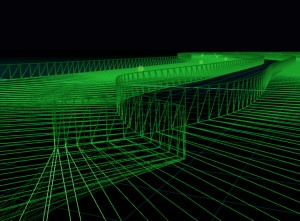  
*幅広の断面で「重なり」が発生*  

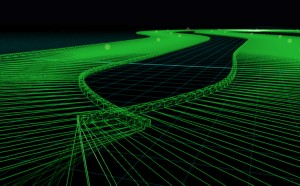  
*中間の幅の断面でも「重なり」が発生*

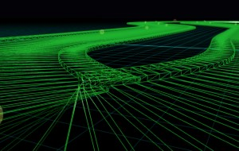  
*幅狭の断面で「重なり」を解消*


### コースにテクスチャを張る

コースにテクスチャを張ってリアルっぽさを出します。

そのまま貼り付けていしまうと間延びしてしまいますが、縦方向に数百並べることでそれっぽく見えます。

```js
mesh.material.diffuseTexture = new BABYLON.Texture(floorPath2, scene);
mesh.material.diffuseTexture.uScale = 1;
mesh.material.diffuseTexture.vScale = 200;
mesh.material.specularColor = new BABYLON.Color4(0, 0, 0);
```

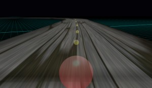  
*画像が間延びした様子*

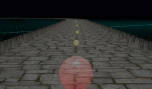  
*画像を繰り返した様子（vScale=100）*

更に画像に一工夫します。壁・縁石・グラベル部分に相当するエリアを色付けして、リアルっぽさを出します。


  
*幅広の断面・壁のテクスチャ画像*

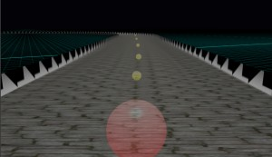  
*幅広の断面・壁のコース*

  
*中間の幅の断面・縁石のテクスチャ画像*

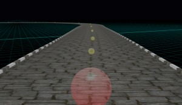  
*中間の幅の断面・縁石のコース*

  
*幅狭の断面・グラベルのテクスチャ画像*

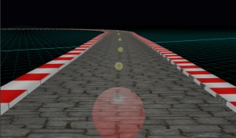  
*幅狭の断面・グラベルのコース*


### CNS によるライバルカー（COMカー）との並走

Crowd Navigation System(CNS)を使って、エージェントをライバルカーとして走らせます。

既に前回の記事
[Babylon.js で物理演算(havok)：扇風機／UFOでレース](115.md)
で紹介済みですが、ここでは改めて簡単に紹介します。

- エージェントごとに速度調整を行う
  - エージェント作成時に、maxSpeed と maxAcceleration に程よい値を設定します。実際に何度か試走して、がんばれば追い抜ける程度に調整しておきます。
  - コースによってはこの固定値ではハードモードな場合もありますが、後述の「ライバルカー（COMカー）の難度の自動調整」で調整します。
- エージェントにコースを周回させる
  - エージェントは目的地に向かって移動するだけの機能しかありません。
  - コースを巡回させるには、コース上に複数の目的地を配置して、最初の目的地に到達したら次の目的地を再度設定するということを繰り返します。
  - 目的地はゴールも含め３箇所あれば十分と思われますが、コース上の点座標の偏りを考慮して４箇所とします。

```js
// 目的地に到着したら次の目的地を設定する
crowd.onReachTargetObservable.add((agentInfos) => {
    let agID = agentInfos.agentIndex;
    let meshAgent = meshAgentList[agID];
    let dest = crowd._ag2dest[agID];
    if (dest == pQ.length-1) {
        dest = 0;
    } else {
        ++dest;
    }
    // 次の目的地を設定
    crowd._ag2dest[agID] = dest;
    crowd.agentGoto(agID, navigationPlugin.getClosestPoint(pQ[dest]));
});
```

### ワイプ画面を配置

画面の右上にワイプ画面（小さなスクリーン）を作り、そこにコースを表示させます。

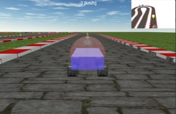  
*ワイプ画面・バードビュー（全体）*

ここでは
[Layer Masks and Multi-Cam Textures](https://doc.babylonjs.com/features/featuresDeepDive/cameras/layerMasksAndMultiCam/)
の技術を使って、
同じシーンに複数のメッシュを重ね、カメラ・メッシュのレイヤーを分けることで複数のビューを実現させます。

メインカメラにはレイヤーマスク(layerMask)に 0x10000000 を割り当て、
ワイプカメラには 0x20000000 を割り当ててます。

メインカメラのみに映すにはメッシュのレイヤーマスクに 0x10000000 を割り当て、
ワイプカメラのみならメッシュのレイヤーマスクに 0x20000000 を、
両方に映すなら 0x30000000 を割り当てます。

例えば、プレイヤーの場合、メインに映すシャーシ・ホイールに 0x10000000 を、ワイプ用のマーカーに 0x20000000 を割り当てます。

```js
// プレイヤーのメッシュ
// シャーシ：本体のメッシュ
let chassisMesh = BABYLON.MeshBuilder.CreateBox("Chassis", {width:1, height:0.4, depth:2})
chassisMesh.layerMask = 0x10000000;

// ホイールのメッシュ
let wheelMesh = BABYLON.MeshBuilder.CreateCylinder("WheelMesh", {height:0.3, diameter:0.4})
wheelMeshes = [wheelMesh, wheelMesh.createInstance(1), wheelMesh.createInstance(2), wheelMesh.createInstance(3)]
wheelMeshes.forEach(mesh => {
    mesh.layerMask = 0x10000000;
})

// --------------------
// camera2用メッシュ
let meshMy4c2 = new BABYLON.MeshBuilder.CreateCapsule("capsule", {radius:0.1, height:7.5, radiusTop:2.5});
meshMy4c2.layerMask = 0x20000000;
meshMy4c2.parent = chassisMesh;
```

コースのメッシュは、メイン・ワイプの両方に同じものを表示させたいので 0x30000000 を割り当ててます。

```js
mesh = BABYLON.MeshBuilder.ExtrudeShape("extrude", options, scene);
mesh.layerMask = 0x30000000;
```

地面（グランド）については、メイン用（草のテクスチャ）とワイプ用（白）の２つを配置してます。

```js
// 地面のメッシュ
// 地面
let meshGrnd = BABYLON.MeshBuilder.CreateGround("ground", { width:grndW, height:grndH }, scene);
meshGrnd.position.y += -0.01;
meshGrnd.material = new BABYLON.StandardMaterial("mat", scene);
meshGrnd.material.diffuseTexture = new BABYLON.Texture(grndPath, scene);
meshGrnd.material.diffuseTexture.uScale = Math.ceil(grndW/4);
meshGrnd.material.diffuseTexture.vScale = Math.ceil(grndH/4);
meshGrnd.material.specularColor = new BABYLON.Color4(0, 0, 0);
meshGrnd.layerMask = 0x10000000;

// camera2用の地面
let meshGrnd2 = BABYLON.MeshBuilder.CreateGround("ground", { width:grndW*2, height:grndH*2 }, scene);
meshGrnd2.layerMask = 0x20000000;
meshGrnd2.material = new BABYLON.StandardMaterial("mat", scene);
meshGrnd2.material.emissiveColor = BABYLON.Color3.White();
```

尚、GUI（スピードやメッセージ、使い方ウィンドウ、ステージ選択ウィンドウ）については layer 属性のレイヤーマスクに設定します。

```js
let advancedTexture = BABYLON.GUI.AdvancedDynamicTexture.CreateFullscreenUI("UI");
advancedTexture.layer.layerMask = 0x10000000;
```

#### ワイプ表示のGUI操作

ステージ選択用のアイコン／ＧＵＩを用意しています。

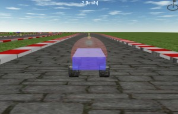  
*ステージ選択用のアイコン（画面右上）*

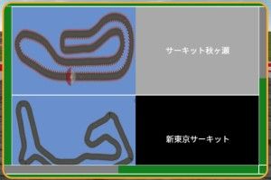  
*ステージ選択用のGUI*

ワイプ表示を消していると普通に操作できるのですが、ワイプを表示している場合、なぜかメイン画面上のアイコンをクリックしても反応しません。
しかしワイプ画面上でアイコン位置をクリックするとＧＵＩを表示してくれます。何かしらの解決案がありそうなのですが、すぐには見つからなかったので、小細工をろうします。

アイコンは、ワイプと重ねて右上としておき、アイコン箇所をクリックしたら、ワイプを一時的に消してＧＵＩ（ステージ選択のウィンドウ）を表示、ＧＵＩを消すときはワイプの表示を戻します。
アイコンとワイプを重ねているときは、ワイプ上でのアイコン範囲（小さくなった範囲）が反応する範囲になるので、ワイプを表示しているときはアイコンを大きなサイズにしています。

#### ワイプのカメラ

ワイプカメラも、メインカメラと同様に設定を変更することでトップビューやバードビューにすることができます。

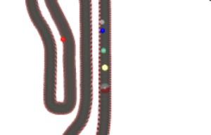  
*ワイプ画面・トップビュー*

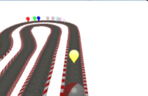  
*ワイプ画面・バードビュー*

ワイプでバードビューにする場合、メインカメラでの設定をそのまま使うと、視点が低く、広範囲を見渡せません。
そこで、高い位置の視点の為に見えないメッシュ(alpha=0)を配置して、車のメッシュに紐づけ(parent指定)しておきます。

```js
// カメラの視点用
let mesh4c2view = BABYLON.MeshBuilder.CreateBox("", {size:1});
mesh4c2view.position.y += 10;
mesh4c2view.material = new BABYLON.StandardMaterial("mat", scene);
mesh4c2view.alpha = 0;
mesh4c2view.parent = chassisMesh;
```

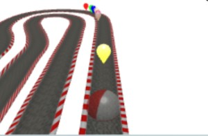  
*ワイプ画面・バードビュー（視線の方向が低い場合）*

視線の方向が低い（車をlockedTargetにした）場合、自機の位置が中央になり、前方の視線（画面上部）が狭く感じます。
視点用のメッシュを配置しそれに対してlockedTargetとすることで、カメラ内の自機の位置が下に下がり、前方（上部）の空間が広くなっていることがわかると思います。

ちなみに、ワイプカメラの切り替えは(v)キーで行えます。メインカメラの切り替えは(c)キーです。

### ラップタイムを計測

ラップタイムを計測するには、基本、コントロールライン／フィニッシュラインに交差判定用のメッシュを配置して、時間計測を行うだけ十分ですが、
今回は複数個所にチェックポイントを配置してラインの通過も確認します。

タイム計測／メッシュの交差判定のやりかたは
[Babylon.js で物理演算(havok)：アルペンスキー](114.md)
と同じように次のチェックポイントと自機／ライバルカーとの交差判定を行います。
この記事の違いは、チェックポイントごとに周回情報（何週目か）と時間計測（performance.now()の値）を持たせていることです。

コントールラインのメッシュと交差したときに、前回とのタイム差でラップタイムを計算し、各チェックポイントが同じ周回情報を持っているかで有効なコースレコードか判断しています。

ちなみにチェックポイントのメッシュはコース幅よりやや大き目に作成し、透明(alpha=0)にしています。


### ライバルカー（COMカー）の難度の自動調整

上述で、プレイヤーやライバルカーのラップタイムが取れるようになったことから、タイム差がわかります。
このタイム差を使って、ライバルカーを遅くしたり、速くしたりすることで、ゲームの難度を自動的に調整します。

ここでは、チェックポイントに接触したタイミングで、ある程度（５秒）の差があるときに、時間差に応じたスピード調整を行います。

スピード調整は maxSpeed および maxAcceleration を変更します。すべてのエージェントに対し、初期値で設定した値を等倍して変更します。
少々雑な調整で、増加・減少が急だったり、遅延して反応している感じがあります。
しかし細かくバランス調整しなくてもプレイヤーに合わせてゲーム難度を自動で調整してくれる点は非常に大助かりです。

```js
// チェックポイント側での判定・スピード調整の呼び出し
if (passCPMElist[imeshCPnextME] == passCPCOMlist[imeshCPnextME]) {
    // プレイヤー遅れ（COM先行）
    let tdiff = Math.floor(ctCOMlist[imeshCPnextME] - ctMElist[imeshCPnextME])/1000;
    if (tdiff < -5) {
        console.log("遅れ=", tdiff, "敵down");
        changeAgntSpeed(tdiff*0.01); // 10秒で0.1下げる割合
    } else {
        console.log("遅れ=", tdiff, "そのまま");
    }
}

// ライバルカー（エージェント）のスピード調整
let changeAgntSpeed = function (spdRateStep) {
    crowd._spdRate += spdRateStep;
    crowd._accRate += spdRateStep*0.2;
    console.log("changeAgntSpeed() spdRate=", crowd._spdRate);
    for (let meshAgent of meshAgentList) {
        let idx = meshAgent._idx;
        let agentParams = agentParamList[idx];
        agentParams.maxSpeed = meshAgent._spd * crowd._spdRate;
        agentParams.maxSpeed = Math.max(agentParams.maxSpeed, 8); // 下限を8とする
        agentParams.maxAcceleration = meshAgent._acc * crowd._accRate;
        agentParams.maxAcceleration = Math.max(agentParams.maxAcceleration, 4); // 下限を4とする
        crowd.updateAgentParameters(idx, agentParams);
    }
}
```

### ステージクリアの追加

全ステージは最初から解放済みで、好きなステージを選べますが、ステージクリアで次のステージに切り替わるようにしています。

ステージクリアの条件は以下のとおりです。

- ベストラップがライバルカーより 10秒以上速いこと。もしくは周回時に２回トップ通過（連続でなくてよい）すること

条件の秒数や周回数はパラメータにしているので、ここをいじればレベル調整できます。大きくすれば難しくなりますし、小さく（秒数はマイナス、周回は１に）すれば簡単にクリアできるようになります。

```js
// 勝利条件１：周回でN回トップ通過
const winCond1 = 2;
// 勝利条件２：ベストラップでX秒以上速い
const winCond2 = 10;
```

### ゲームパッド対応

キーボードでの操作のみでは少々つらいので、ゲームパッドでも動かせるようにしました。

処理方法は、
[Babylon.js：Navigation path をドローン操作でトレース＋ゲームパッド／VirtualStick対応](099.md)
と同様になります。
この時はドローン操作でしたが、今回は車の操作にあわせてボタン・スティックの取得を変更しています。

## 既知の不具合

- スタート時のカウントダウンはありません。突然始まります。
- 対応していないゲームパッドがあるかもしれません。
- ゲームパッドの操作では未対応の機能（位置リセットやジャンプ）があります。予めご承知おきください。
- 利用しているマシン・通信状況によっては、十分に表示されない（バグって表示される）かもしれません。
  - 当方の開発環境は Win11, Intel Core 7, 16 GB-MEM になります。

## まとめ・雑感

今持てる技術を総動員してみました。本格的なドライブシミュレータと比べるべくもありませんが、少しでも楽しめたら幸いです。

今までもレースゲームは作ってきましたが、年末の区切りにあわせて、今までの集大成＋手を付けていなかった課題（テクスチャ張りやラップタイム、ゲーム難度の自動調整など）にもチャレンジしてみました。車のメッシュが矩形のままでダサいですが、自作するセンスは無いので、フリーで使える軽量でかっこいメッシュがあればと願うばかりです。

「コースを全て（壁や縁石ではなく）グラベルにすれば」と思う方がいるかもしれません。試しに試走してみると、コースが狭くなりライン取りが難しくなり、ライバルに抜かれまくりで止めました。（壁）から（縁石）はありですがコースアウトしやすくなるのでご注意です。（グラベル・縁石）から（壁）へはヘアピンのインサイドに壁ができるのでお勧めしません。

あと関係者の方が見ていたら申し訳ないです。名称は拝借していますが別物になっていると思います。
ＮＧの指摘をうけたら予告なく内容の変更・修正をいたします。

## 参考：コース情報のリンク

勝手にリンクを張らせていただいてます。問題がありましたらご連絡ください。
また閲覧するタイミングによってはリンク切れの恐れもあります。その際は公式サイトから辿ってください。

- サーキット秋ヶ瀬
  - http://akigase.co.jp/wordpress/wp-content/themes/akigase/img/kart/zu.pdf

- 新東京サーキット
  - https://www.n-tokyo.co.jp/access

- 大井松田カートランド
  - https://www.kartland.co.jp/%E3%82%B3%E3%83%BC%E3%82%B9%E3%81%AE%E3%81%94%E6%A1%88%E5%86%85/
  - https://www.kartland.co.jp/imgs/course/new-corse.pdf
  - https://www.kartland.co.jp/imgs/course/new-corse-line.pdf

- シティカート
  - https://city-circuit.com/private/
  - https://city-circuit.com/wp-content/themes/city-circuit/assets/img/private/private-img01.jpg

- ハーバーサーキット幕張新都心
  - https://d15fc562-1b77-4ef4-9e06-4d280ded41d7.filesusr.com/ugd/3249f2_398d1e14db7f4166977cfe9c76b82e15.pdf
  - https://d15fc562-1b77-4ef4-9e06-4d280ded41d7.filesusr.com/ugd/3249f2_821d6a8f0bbd4507a62fc2e1954a7620.pdf

- ハーバーサーキット木更津
  - https://d15fc562-1b77-4ef4-9e06-4d280ded41d7.filesusr.com/ugd/3249f2_38a47ec9715d4f95af701a0d4d87d085.pdf
  - https://d15fc562-1b77-4ef4-9e06-4d280ded41d7.filesusr.com/ugd/3249f2_5bec7cdc97214cd5932afa340df23791.pdf

- Fドリーム平塚
  https://www.f-dream.jp/guide/

- ツインリンクもてぎ
  - https://www.mr-motegi.jp/course_m/
  - https://www.mr-motegi.jp/course_m/pdf/south_course.pdf
  - https://www.mr-motegi.jp/course_m/pdf/north_short_course.pdf

- ツインリンクもてぎ(モビリティリゾート)
  - https://www.mr-motegi.jp/park/attractions/racingkart/
  - https://www.mr-motegi.jp/park/assets/images/racingkart/map.jpg

- 石野サーキット
  - https://ishino-circuit.com/home/course/
  - https://ishino-circuit.com/wp-content/uploads/2023/08/newcourse_large13.jpg
  - https://ishino-circuit.com/wp-content/uploads/2023/08/brakepoint.jpg

- 琵琶湖スポーツランド
  - https://peter-pan.co.jp/pages/53/
  - https://www.google.com/maps/place/%E7%90%B5%E7%90%B6%E6%B9%96%E3%82%B9%E3%83%9D%E3%83%BC%E3%83%84%E3%83%A9%E3%83%B3%E3%83%89/@35.151901,135.8885538,160m/data=!3m1!1e3!4m6!3m5!1s0x6001a1c93eeb68df:0x9346eb85c000528e!8m2!3d35.1519767!4d135.8887284!16s%2Fg%2F1tgpy32q!5m1!1e2?hl=ja&entry=ttu&g_ep=EgoyMDI1MTIwOS4wIKXMDSoASAFQAw%3D%3D

- 茂原ツインサーキット
  - http://www.mobara-tc.com/1/1-1.html
  - http://www.mobara-tc.com/_src/52916633/mtc_drift_land.jpg?v=1678158822722

- ハイブリッドゴーカートコース（クイック潮来 ）
  - https://919.ms/information/?p=331

- 榛名モータースポーツランド
  - https://haruna-motor.sports.coocan.jp/
  - https://haruna-motor.sports.coocan.jp/cource_layout_shimmyLLC_240315.pdf

- オートパラダイス御殿場
  - https://apg-gotemba.com/about-apg/#course-info
  - https://apg-gotemba.com/wp-content/uploads/2024/03/highspeed-course.pdf
  - https://apg-gotemba.com/wp-content/uploads/2024/03/technical-course.pdf

- 井頭モータースポーツ
  - https://www.linson.co.jp/p1/

- ISK前橋店
  - https://maebashi.sportskart.com/shop_access.html
  - https://maebashi.sportskart.com/pdf/course_maebashi.pdf

- 富士スピードウェイ／マルチパーパスドライビングコース(旧ドリフトコース)
  - https://www.fsw.tv/guide/facility/drift.html

- エビスサーキット
  - https://www.ebisu-circuit.com/course.html
  - https://www.ebisu-circuit.com/c-images/higashi.pdf
  - https://www.ebisu-circuit.com/c-images/nishi.pdf
  - https://www.ebisu-circuit.com/c-images/minami.pdf
  - https://www.ebisu-circuit.com/c-images/kita.pdf
  - https://www.ebisu-circuit.com/c-images/touge1.jpg

- 鈴鹿ツインサーキット
  - https://twincircuit.co.jp/guide/course/


------------------------------

前の記事：[Babylon.js で物理演算(havok)：扇風機／UFOでレース](115.md)

次の記事：[Babylon.js：ご来光／ダイヤモンド富士](117.md)


目次：[目次](000.md)

この記事には次の関連記事があります。

- [Babylon.js で物理演算(havok)：車モデル](105.md)
- [Babylon.js：画像からコース作り（１／２）](090.md)
- [Babylon.js で物理演算(havok)：コースに部分的バンクをつけて試走](112.md)
- [Babylon.js で物理演算(havok)：扇風機／UFOでレース](115.md)
- [Babylon.js で物理演算(havok)：アルペンスキー](114.md)
- [Babylon.js：Navigation path をドローン操作でトレース＋ゲームパッド／VirtualStick対応](099.md)

--
