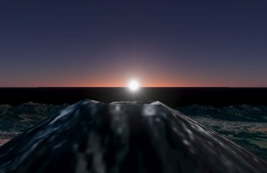
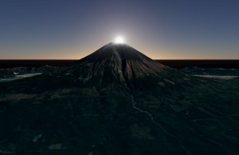
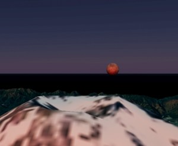

# Babylon.js：ご来光／ダイヤモンド富士

## この記事のスナップショット

  
*ご来光*

  
*ダイヤモンド富士*

https://playground.babylonjs.com/?inspectorv2=true?BabylonToolkit#04SKXF

（上記のURLにおいて、ツールバーの歯車マークから「EDITOR」のチェックを外せばウィンドウいっぱいに、歯車マークから「FULLSCREEN」を選べば画面いっぱいになります。）

[ソース](117/)

ローカルで動かす場合、上記ソースに加え、別途 git 内の [104/js](https://github.com/fnamuoo/webgl/tree/main/104/js) を ./js として配置してください。

## 概要

[Volumetric Light Scattering Post Process](https://doc.babylonjs.com/features/featuresDeepDive/lights/volumetricLightScattering/) を使うと天使の階段（エンジェルラダー、ゴッドレイとも）が再現できると知り、ダイヤモンド富士を見たくて作ってみました。せっかくなので [Atmosphere](https://doc.babylonjs.com/addons/atmosphere/) を使って大気散乱による空気感をつけます。
富士山の地形は
[Babylon.js：富士山の一日](089.md)
で使ったメッシュを流用します。

せっかく、富士山、太陽とシーンがそろっているので、ご来光も作りました。

なお、天体的な位置関係、サイズは無視してますので、実際の見え方とは違う点をご承知おきください。

## やったこと

- 富士山のメッシュを読み込む
- Volumetric Light Scattering を使う
- Atmosphere を使う
- 太陽、カメラ位置を切り替え

### 富士山のメッシュを読み込む

メッシュは
[Babylon.js：地形データと雲海](088.md)
で説明していますが、国土地理院の[全国Q地図](https://maps.qchizu.xyz/)から取得しています。メッシュデータは ImportMeshAsync() で読み込みますが、適当にサイズを調整し、Z軸正が北になるよう180度回転させます。

```js
// 富士山のメッシュを読み込む
let files = [
    "https://raw.githubusercontent.com/fnamuoo/webgl/main/089/mtFUJI/dem.obj",
];
for (let file of files) {
    BABYLON.ImportMeshAsync(file, scene).then((result) => {
        let meshGeo = result.meshes[0];
        let s = 2, adjx=-50, adjz=-50;;
        meshGeo.scaling = new BABYLON.Vector3(s, s, s);
        meshGeo.position = new BABYLON.Vector3(100*s+adjx, -4.1*s, 100*s+adjz);
        meshGeo.rotation = new BABYLON.Vector3(0, R180, 0);
    })
}
```

メッシュの配置位置は、富士山頂上が Z軸上付近(x≒0, y≒0)にあるようにしてます。

### Volumetric Light Scattering を使う

光散乱を使うといっても、 [Volumetric Light Scattering Post Process](https://doc.babylonjs.com/features/featuresDeepDive/lights/volumetricLightScattering/) にある サンプル [Basic Example](https://playground.babylonjs.com/?inspectorv2=true#AU5641) のコードを改修して使います。

光源は後述の Atmosphere の都合で DirectionalLight に置き換えます。
VolumetricLightScatteringPostProcess() に関するところは、光源メッシュのサイズを適当に調整(scale=100)し、他はそのまま使います。

```js
// 光散乱の設定
const light = new BABYLON.DirectionalLight("Sun", new BABYLON.Vector3(0, -0.5, 1).normalize(), scene);
light.intensity = Math.PI;

var godrays = new BABYLON.VolumetricLightScatteringPostProcess(
    'godrays', 1.0, camera, null, 100, BABYLON.Texture.BILINEAR_SAMPLINGMODE, engine, false);
godrays.mesh.material.diffuseTexture = new BABYLON.Texture(fpathSUN, scene, true, false, BABYLON.Texture.BILINEAR_SAMPLINGMODE);
godrays.mesh.material.diffuseTexture.hasAlpha = true;
godrays.mesh.position = pSun;
let vscale = 100;
godrays.mesh.scaling = new BABYLON.Vector3(vscale, vscale, vscale);
light.position = godrays.mesh.position;
```

### Atmosphere を使う

大気散乱を使う設定のもろもろは [Atmosphere](https://doc.babylonjs.com/addons/atmosphere/) にあるサンプルの [Full Ray Marching](https://playground.babylonjs.com/?inspectorv2=true#K1Y1Q8#37) を参考にしました。

```js
// 大気散乱の設定
const defaultRenderingPipeline = new BABYLON.DefaultRenderingPipeline("Default");
defaultRenderingPipeline.imageProcessingEnabled = true;
defaultRenderingPipeline.imageProcessing.ditheringEnabled = true;
defaultRenderingPipeline.imageProcessing.toneMappingEnabled = true;
defaultRenderingPipeline.imageProcessing.toneMappingType = 1; // ACES
defaultRenderingPipeline.imageProcessing.exposure = 1.5;
const atmosphere = new ADDONS.Atmosphere("Atmosphere", scene, [ light ]);
atmosphere.additionalDiffuseIlluminanceIntensity = 0.01;
atmosphere.minimumMultiScatteringIntensity = 0.1;
atmosphere.isLinearSpaceComposition = true;
atmosphere.isLinearSpaceLight = true;
atmosphere.isAerialPerspectiveLutEnabled = false;
atmosphere.isSkyViewLutEnabled = false;
```

太陽の位置に応じて大気の色を変えるには ドキュメント [Time of Day](https://doc.babylonjs.com/addons/atmosphere/#time-of-day) によると

```js
light.direction = new Vector3(0, -1, 0); // Day
light.direction = new Vector3(0,  1, 0); // Night
light.direction = new Vector3(1,  0, 0); // Sunrise/Sunset
```
とのことなので、太陽（光源）の座標位置をもとに、光源から富士山（原点）へのベクトル（座標位置pSunの逆向き）を正規化して割り当てます。

```js
light.direction = pSun.negate().normalize();
```

### 太陽、カメラ位置を切り替え

複数の太陽およびカメラの位置情報を用意し、日の出シーンやダイヤモンド富士のシーンを切り替えられるようにしました。
といっても、キー入力を拾ってはシーンのindexを変更して、indexに対応する座標値のセットを光源やカメラに適用するだけです。

```js
// シーンの切り替え

let istage = 0, nstage = 4;
// val=[光源：太陽の位置、
//      カメラの焦点位置、
//      カメラの位置]
const i2para = {0:[new BABYLON.Vector3(1900, 30, 0), // 日の出
                   new BABYLON.Vector3(0, 20, 0),
                   new BABYLON.Vector3(-10, 20, 0)],

                1:[new BABYLON.Vector3(1900, 200, 0),
                   new BABYLON.Vector3(0, 10, 0),
                   new BABYLON.Vector3(-50, 15, 0)],

                2:[new BABYLON.Vector3(1900, 300, 0),  // 日の出から１時間後位？
                   new BABYLON.Vector3(0, 20, 0),
                   new BABYLON.Vector3(-50, 12, 0)],

                3:[new BABYLON.Vector3(1900, 600, 0),
                   new BABYLON.Vector3(0, 20, 0),
                   new BABYLON.Vector3(-50, 6, 0)],
               };

// シーン／ステージ切り替え
var setStage = function(istage_) {
    [pSun, pTrg, pCam] = i2para[istage_];

    // 大気層の色変化のために light.direction を設定
    light.direction = pSun.negate().normalize();
    // 太陽の座標を反映
    godrays.mesh.position = pSun;
    light.position = godrays.mesh.position;
    // ターゲットの座標を反映
    camera.setTarget(pTrg);
    // カメラの座標を反映
    camera.position = pCam;
    // 南北を面対象として月を配置
    meshMoon.position.set(-pSun.x, Math.max(pSun.y, 50), pSun.z);
}

// キー入力処理
scene.onKeyboardObservable.add((kbInfo) => {
    switch (kbInfo.type) {
    case BABYLON.KeyboardEventTypes.KEYDOWN:
        if (kbInfo.event.key == ' ') {
            istage = (istage+1) % nstage;
            setStage(istage);

        } else if (kbInfo.event.key == 'Enter') {
            istage = (istage+nstage-1) % nstage;
            setStage(istage);
        }
        console.log("istage=",istage);
    }
});
```


## まとめ・雑感

ダイヤモンド富士というには、写真で見かける四方八方に光線が広がる感じが無いです。

レンズフレア [Lens Flares](https://doc.babylonjs.com/features/featuresDeepDive/environment/lenseFlare/)
を付与した方が良かったかもですが、使い方が難しい（光源、カメラ、対象の位置関係を条件付きで適用しないと不自然さが増す）ので今回は見送りです。

Volumetric Light Scatteringの効果のみでも、かなりそれっぽく見えていると満足してます。


太陽と反対側に月を配置したら、赤く色づいていてちょっと感動しました。

  
*赤い月*

太陽が少し上った時の地平線の色合いが、日の出前の白み始めた空の感じでちょっと違和感がありますがまぁ良しとします。

ちなみに、Babylon.js Tips集に類似作品があります。（ご紹介のみ）

- [富士山にシェーダを投影してみる](https://scrapbox.io/babylonjs/%E5%AF%8C%E5%A3%AB%E5%B1%B1%E3%81%AB%E3%82%B7%E3%82%A7%E3%83%BC%E3%83%80%E3%82%92%E6%8A%95%E5%BD%B1%E3%81%97%E3%81%A6%E3%81%BF%E3%82%8B)

------------------------------

前の記事：[Babylon.js で物理演算(havok)：カートレース](116.md)

次の記事：..


目次：[目次](000.md)

この記事には次の関連記事があります。

- [Babylon.js：地形データと雲海](088.md)
- [Babylon.js：富士山の一日](089.md)

--
