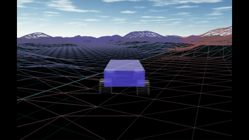

# Babylon.js で物理演算(havok)：無限に広がった地形を作る（暫定版）

## この記事のスナップショット


*ブロックの境界をまたぐ様子：非同期（２倍速）*

https://playground.babylonjs.com/?inspectorv2=true?BabylonToolkit#7922CU

（上記のURLにおいて、ツールバーの歯車マークから「EDITOR」のチェックを外せばウィンドウいっぱいに、歯車マークから「FULLSCREEN」を選べば画面いっぱいになります。）

ソース

https://github.com/fnamuoo/webgl/blob/main/119

- 119_inf_field .. 非同期
- 119_inf_field_sync .. 同期

ローカルで動かす場合、上記ソースに加え、別途 git 内の [104/js](https://github.com/fnamuoo/webgl/tree/main/104/js) を ./js として配置してください。

## 概要

広大な領域を表示する方法を模索します。ベストアンサーにはほど遠いので暫定版となっています。

無限の領域を表現するために、有限の領域（ブロック）を 3x3 で並べて、中央のブロックからはみ出たら１ブロック分ずらして表示することで無限の領域を表現します。
マップを分割して表示することは [マップ分割（３）３Ｄデータ](https://zenn.dev/fnamuoo/articles/c4d107b150c244) （Three.js+Cannon.js）で実施してますが、改めて babylon.js 環境でマップの分割を行います。

対象とする形状は [Babylon.js で物理演算(havok)：パーリンノイズから渓谷を作ってみる](https://zenn.dev/fnamuoo/articles/0c980a69002d9d) で示したような物理形状をもった凹凸(ribbon)とします。領域の更新（遅延）が気になったので、非同期での更新にもチャレンジしました。

『非同期』と呼称していますが、正確には「イベントループ分割」であり、疑似的な非同期になります。真の並列処理ではないことにご注意ください。

尚、地形の作成にはパーリンノイズで作成します。
パーリンノイズなら次の特性を持ちます。

- 座標値による再現性（同じ形状を作り出せる）
- 空間的な連続性（なだらかに変化）
- 空間的な特徴（単一や周期的な形状ではなく、局所的な凹凸をもつ）

作り方の詳細については [Babylon.js で物理演算(havok)：パーリンノイズから渓谷を作ってみる](https://zenn.dev/fnamuoo/articles/0c980a69002d9d) を参照してください。

::::details パーリンノイズの使い方（概要）
```js
// パーリンノイズの使い方（概要）
let nb = new BABYLON.NoiseBlock();
const nbvzero = new BABYLON.Vector3(0,0,0);
let gridratio = 1, nbscale = 0.05/gridratio;
for (let iz = 0; iz < blockDivP; ++iz) {
    for (let ix = 0; ix < blockDivP; ++ix) {
        pp.set(ix,iz,0);
        // パーリンノイズで(ix,iz,0)位置の高さYを求める
        let y = nb.noise(8, 0.5, pp, nbvzero, nbscale);
```
::::

## やったこと

- 領域を 3x3 のブロックに分割
- 非同期でブロックを更新

### 領域を 3x3 のブロックに分割

１ブロックあたり 101x101の点でグリッドを構成し、ribbon で凹凸を作成します。
これを縦と横 3x3 にブロックを並べて、つながるように配置します。


*3x3のブロックの様子（全景）*

自機が移動可能な範囲を中央のブロックのみとし、はみ出たらその位置が中央に来るようにスライドさせ、はみ出たブロックを削除（dispose）、空いた領域に新規にブロックを作成します。もちろん自機もブロックサイズ分、平行移動させます。


*上のブロックに移動したときの様子（全景）*


*ブロックの境界をまたぐ様子：同期（２倍速）*

ブロックをまたぐときに一瞬止まったような感じになります。そこで、非同期にブロックを削除・新規作成します。

### 非同期でブロックを更新

暫定で `setTimeout()` 内に処理ブロックを記述しています。

ここでは以下の処理を行っています。

- 旧パネルのメッシュ・物理agg の削除
- 新パネルの形状、101x101点の(x,y,z)の作成
- 新パネルのメッシュ(ribbon)・物理agg の作成
- パネル管理変数(meshAggInfo)への登録

::::details 非同期でパネルを更新
```js
// 非同期でパネルを更新
let asyncUpdateBlock = async function(padx, padz, jbx, jbz, delMesh, delAgg, ima) {
    // setTimeout() でイベントループ分割
    setTimeout(() => {
        delMesh.dispose();
        delAgg.dispose();
        let fdata = createBlockOrg(jbx, jbz);
        let trgMesh = BABYLON.MeshBuilder.CreateRibbon("", {pathArray: fdata, sideOrientation: BABYLON.Mesh.DOUBLESIDE});
        trgMesh.position.set(padx, 0, padz);
        trgMesh.material = new BABYLON.StandardMaterial("mat", scene);
        trgMesh.material.diffuseColor = Color3_Random();
        trgMesh.material.wireframe = true;
        let trgAgg = new BABYLON.PhysicsAggregate(trgMesh, BABYLON.PhysicsShapeType.MESH, { mass: 0.0, restitution:0.05}, scene);
        trgMesh.physicsBody.disablePreStep = false;
        meshAggInfo[ima] = [trgMesh, trgAgg];
    }, 0);
}
```
::::


*同期処理でパネルを更新している様子（一瞬止まる）*


*非同期処理でパネルを更新している様子*

同期処理より非同期の方が、マップ切り替わり時の待ちが若干短くなったように感じます。

これらを実装して動かしてみると、いくつかの問題点が見つかります。

- 問題１. パネル（地形）と自機の移動のタイミングがズレており、平面な境界をまたいだ時でも地形にぶつかったような挙動になることがある。
- 問題２. FollowCamera にしているときに、境界をまたいだ時に、カメラが逆向きになったような（一瞬後ろを振り向いたような）挙動をしめす。

（問題１）は、パネルの移動と自機の移動の処理が離れていると起きる現象です。９パネル分の処理（処理のトリガーをキック）してから自機を行うだけでも誤差が生じるようです。なので自機の移動と該当パネルの移動をできるだけ近くにして処理することで改善されます。それでも極まれにメッシュの残像が見えたり、存在しないはずの凹凸にぶつかるような挙動をとることがあります。
どうしても気になる場合は、同期処理で処理時間を犠牲にしても安定性を取るべきかもしれません。

  

*フラットな境界またぎで存在しない何かにぶつかる様子*

（問題２）は、FollowCameraの場合のみ発生し、固定のカメラなら発生しません。自機とカメラを同時に移動させたつもりでも、カメラの内部ではコンマ数秒の処理が進むのか、（移動させる前の自機の位置を見るかのように）カメラが振り返るしぐさをみせます。
そこで、FollowCamera だけを先に移動させたあとに自機を移動させ、更にFollowCameraは余分に（ブロックサイズの1.1倍）移動させることにします。この余分な移動は経験的に決めてます。小さいと「振り返るような挙動」になり、大きすぎると「一瞬離れた位置から近づくような挙動」になります。
ブロックをまたぐ度にカメラが動くことが気になる方は、相対位置固定で追っかけるカメラを使う（FollowCameraは使わない）のがよさそうです。

  
*調整前（ブロックサイズ分の移動）：カメラが逆向きになる様子*

  
*調整後（ブロックサイズ1.1倍の移動）：ほぼスムーズなカメラモーションの様子*

## まとめ・雑感

無限に広がった地形を作ってみました。
以前の記事 [マップ分割（３）３Ｄデータ](https://zenn.dev/fnamuoo/articles/c4d107b150c244) と同じ手法を用い、babylon.js であらためて検証してみました。

メッシュだけなら[Dynamic Terrain](https://doc.babylonjs.com/communityExtensions/dynamicTerrains/)といった方法もあるようですが、ここでは物理形状を扱いたいので、自前の手法で対応しました。領域を 3x3 のブロックに分割して、自機の動きにあわせてブロックをスライドさせました。

同期した地形の更新だけでなく、非同期の更新にもチャレンジしました。
その経過でいくつかの問題点も見つかりましたが、処理のタイミングを近くにすることで問題を小さく、もしくは回避策をみつけることができました。

非同期の処理で進めていくのが正道とは思いますが、予期しない「形状との衝突」を回避するために、待ち時間を犠牲にして同期処理を選択することも「あり」な気はします。

まだまだ課題が山積みですが、今回はここまで。


