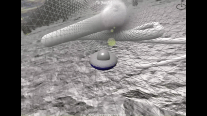
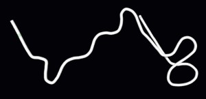
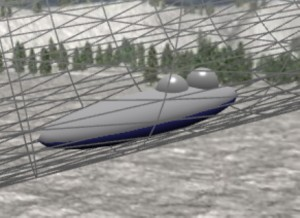
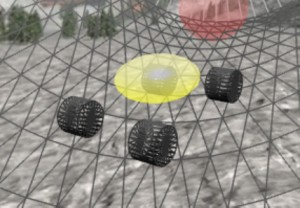
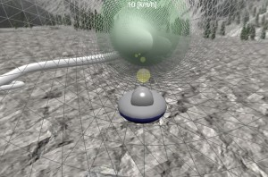
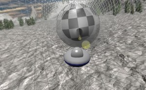

# Babylon.js で物理演算(havok)：ボブスレー

## この記事のスナップショット

  
*プレイ動画（２倍速）*

https://playground.babylonjs.com/?BabylonToolkit#42GMUI

（上記のURLにおいて、ツールバーの歯車マークから「EDITOR」のチェックを外せばウィンドウいっぱいに、歯車マークから「FULLSCREEN」を選べば画面いっぱいになります。）

[ソース](123/)

ローカルで動かす場合、上記ソースに加え、別途 git 内の [104/js](https://github.com/fnamuoo/webgl/tree/main/104/js) を ./js として配置してください。

## 概要

ミラノ・コルティナ2026冬季オリンピックのボブスレーに日本チームが出場できなくなったと聞いて、気分だけでもと思いボブスレーを作ってみました。

  
*コース・コルティナ*

基本的には
[Babylon.js で物理演算(havok)：パイプ内をボードで滑る（２）](093.md)
と同じですが、
今回は下記変更をおこなってます
- ダウンヒルのみ
- ソリっぽく、横滑りを抑制

## やったこと

- コース作成
- プレイヤー／自機
- タイム計測

### コース作成

コースは
[Cortina d'Ampezzo](https://www.ibsf.org/en/tracks#cortinadampezzo)にある LEARN MOREをみてもGoogleMapしかないので、
地図からなんとなくコースを読み取って

[Babylon.js：画像からコース作り（１／２）](090.md)
の方法でコースデータを作ります。
一定間隔でサンプリングするので厳密な再現ではありませんが、大まかにはトレースできていると思います。
バンクをつけるのは大変／時間がかかるので tube で代用します。
傾斜は適当に一律に傾けます（リアルでは部分的に緩急がありますが、面倒なので割愛します）。
また加速しなくても滑降だけで滑り降りれるようやや傾斜を大き目にしています。
結果、短時間でコースを再現できました。

また、他のコースについても下記から取得できる地図データ、全１７コースを掲載しています。コース掲載の順番は個人的な走り易さの順番で並べています。どのコースもそれなりに難しいのですが、「コルティナ」のコースは特に難しくて末尾に置いています。

- 参考資料
  - [長野市ボブスレー・リュージュパーク（スパイラル）のご案内](https://www.city.nagano.nagano.jp/n155400/contents/p003105.html)
  - [IBSF/Tracks](https://www.ibsf.org/en/tracks)
  - [世界のスケルトンコース](http://www.skeletonnavi.com/product/track_skeleton.html)

### プレイヤー／自機

プレイヤー／自機には
[Babylon.js で物理演算(havok)：パイプ内をボードで滑る（２）](093.md)
のボードをそのまま使ってもよかったのですが横滑りが酷くて、パイプをすぐにせり上がってしまいます。
方向転換の仕方も回転角に力を加える方法でした。

今回はこれに手を加えてソリっぽい動きにします。
速度ベクトルを進行方向と横方向に分解し、横方向に比例した力を逆向きに加えます。

```js
            //前後方向のみに動きやすいよう、横方向には逆向きの力を加える
            // ..結果、横滑り（ドリフト）せずにグリップ走行になる
            {
                let vec = myMesh._agg.body.getLinearVelocity();
                // 右方向のベクトルを求める
                let quat = myMesh.rotationQuaternion;
                let vdirR = BABYLON.Vector3.Right().applyRotationQuaternion(quat);
                // 内積より寄与分をもとめる
                let v = vdirR.dot(vec);
                // 逆向きの力とする
                // let amp=-0.9; // アンダーステアっぽい
                let amp=-0.1;
                // let amp=-0.01; // ドリフトっぽい
                vdirR.scaleInPlace(v*amp);
                myMesh._agg.body.applyImpulse(vdirR, myMesh.absolutePosition);
            }
```

ちなみに外形／メッシュは球／楕円で表現しています。

  
*ボブスレー*


コースを車で走る動画があったので、車モデルも追加してます。
ただし今までの車モデルだと壁（tube）にぶつかりやすいので、サイズをやや小さく、楕円形にしています。
デフォルトだと体積から重量が決まるので明示的に重量（mass）を指定しています。

```js
//車のシャーシ
// mass指定
            // RaycastVehicle  楕円ボディ
            // ----------------------------------------
            // シャーシ：本体のメッシュ
            const chassisMesh = BABYLON.MeshBuilder.CreateSphere("Chassis", { diameterX: 1.0, diameterY: 0.5, diameterZ: 1.0, segments: 8 }, scene);
            ...
            const chassisPhysicsShape = new BABYLON.PhysicsShapeConvexHull(chassisMesh, scene);
            const chassisPhysicsBody = new BABYLON.PhysicsBody(chassisMesh, BABYLON.PhysicsMotionType.DYNAMIC, false, scene);
            chassisPhysicsBody.shape = chassisPhysicsShape
            chassisPhysicsBody.setMassProperties({
                centerOfMass: new BABYLON.Vector3(0, -0.5, 0),
                mass: 1000,
            })
```

  
*車*


ちなみに、横滑りするボードの挙動が気になる方・楽しみたい方は
[こちら](https://playground.babylonjs.com/?BabylonToolkit#42GMUI#1)
からどうぞ。低速で楽しむ分には十分ですが、攻めた走りをするとすぐにひっくり返ります。

### タイム計測

スタート地点（半透明な緑の球）からゴール地点（チェッカーフラッグの球）を通過する間のタイム計測を行っています。

  
*スタート地点*

  
*ゴール地点*

すべてのコースで、コースレコードをハードコードしていますが、１位のレコードは加速あり、３位のレコードは途中の加速なし（スタート地点まで加速）になっています。
また、コースを４分割して、ベストレコードとのタイム差を表示するようにしています。

## まとめ・雑感

ボブスレーに関する記事／情報を見ていると「時速140km/h」にもなるとか見かけるのですが、
この物理シミュレータだと加速なしの滑降だとせいぜい 50~60km/hぐらいにしかなりません。
加速してやっと140km/hに到達するかどうかです。
自分のライン取りがつたないのは仕方ないとして、さらにコースがtubeということも関係してそうです。
tubeを使うとヘリが凹凸になって、スラローム／左右へのジグザグのようなコースではかなり減速してしまいます。
壁にぶつかったり、急な方向転換で減速するので「減速しないこと」が非常に難しいです。

当初は「バンクを付けたコースで」と考えていたのですが、コース作成に時間がかかる上に、試走してみるとスピードが乗らない／バンクに擦りまくって逆に大きく減速する結果になってしまいました。
公開するにしても別の機会に。


------------------------------

前の記事：[Babylon.js：セルオートマトン（ライフゲーム）／WebGPU・ComputeShaderingで実装する](122.md)

次の記事：[Babylon.js：サンプルを生成ＡＩで幻想的にしてみる](124.md)


目次：[目次](000.md)

この記事には次の関連記事があります。

- [Babylon.js：画像からコース作り（１／２）](090.md)
- [Babylon.js で物理演算(havok)：パイプ内をボードで滑る（２）](093.md)

--
