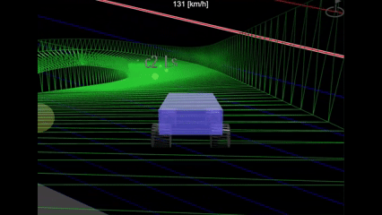
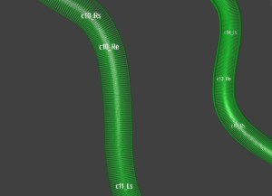
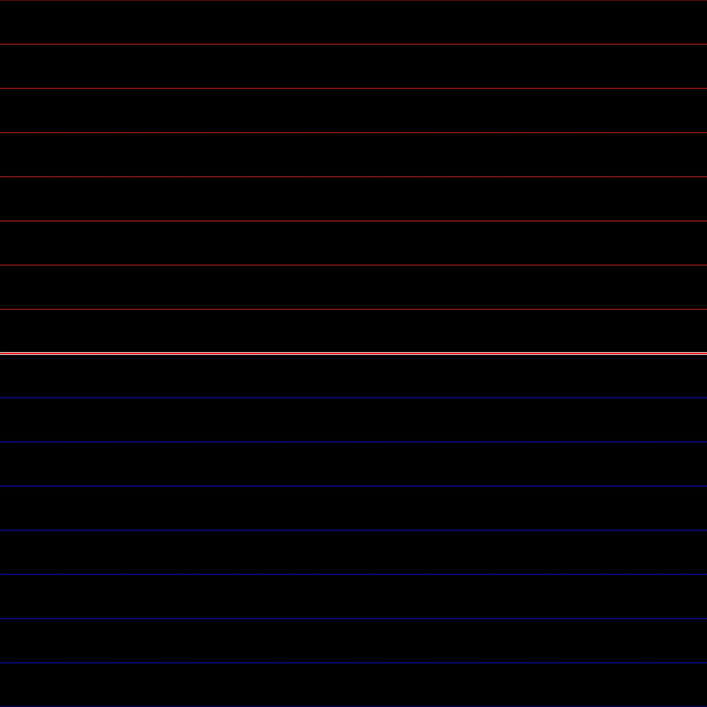
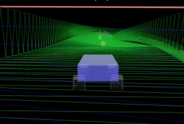

# Babylon.js で物理演算(havok)：ダウンヒルにバンクをつける

## この記事のスナップショット

  
*ダウンヒル（２倍速）*

https://playground.babylonjs.com/?BabylonToolkit#EXI254

（上記のURLにおいて、ツールバーの歯車マークから「EDITOR」のチェックを外せばウィンドウいっぱいに、歯車マークから「FULLSCREEN」を選べば画面いっぱいになります。）

[ソース](125/)

ローカルで動かす場合、上記ソースに加え、別途 git 内の [104/js](https://github.com/fnamuoo/webgl/tree/main/104/js) を ./js として配置してください。

## 概要

以前、
[Babylon.js で物理演算(havok)：コースに部分的バンクをつけて試走](112.md)
[Babylon.js で物理演算(havok)：コースに部分的バンクをつけて試走](https://zenn.dev/fnamuoo/articles/2bdc098520d0b8)
で、コースにバンク（傾き）をつけることにチャレンジしていますが、
今回は下り坂／ダウンヒル（一本道）にがっつりチャレンジしてみました。

対象とするコースは
[Babylon.js で物理演算(havok)：ボブスレー](123.md)
[Babylon.js で物理演算(havok)：ボブスレー](https://zenn.dev/fnamuoo/articles/xxxxx)
です。

コースによっては荒っぽいものもありますが、おおむね満足いく出来になりました。
また１７コースすべてにバンクをつけて力尽きたため、コースデータを作るまでで、ゲームとしての作り込み／装飾やゲームシステム作りは出来ていません。

ということで今回は「レース用のコースをこんな感じで作りました」というお話になります。

## やったこと

手順は
[Babylon.js で物理演算(havok)：コースに部分的バンクをつけて試走](112.md)
[Babylon.js で物理演算(havok)：コースに部分的バンクをつけて試走](https://zenn.dev/fnamuoo/articles/2bdc098520d0b8)
で説明したときと同じです。
より効率的に作業するポイントに限って説明していきます。

- 環境づくり
  - コーナーにラベルをつける
  - 背景に水平線を表示
- 試走しながらバンクをつけていく

### 環境づくり：コーナーにラベルをつける

最初にコース内のコーナー（カーブ）に目印となるラベルとつけていきます。

俯瞰（全体像を映す）のカメラを使います。

  
*俯瞰*

ラベルを付ける位置や文字列は、自分なりにして良いのですが自分は次のようにしました。
- ラベルの書式は "c"+{カーブの番号}_{左右を示す文字}{開始・終了を示す文字}
- スタート位置から順に「カーブの番号」を割り振る
- 右に曲がる場合は "R"、左に曲がる場合は "L"を「左右を示す文字」に割り当てる
- カーブの侵入位置には "s"、脱出位置には "e" を「開始・終了を示す文字」に割り当てる
  - 大きなカーブの場合、ラベルは "c05_Rs", "c05_Re"といった具合に
  - 小さなカーブ（急カーブやスラローム）の場合、ラベルは "c06_Rse"といった具合に

ちなみに、俯瞰・遠方からでも識別できるよう、
[Babylon.js で物理演算(havok)：コースに部分的バンクをつけて試走](112.md)
[Babylon.js で物理演算(havok)：コースに部分的バンクをつけて試走](https://zenn.dev/fnamuoo/articles/2bdc098520d0b8)
のときより、サイズを大きくしています。

ここで付けるラベルはバンクを付ける際の目印でしかないので、多少ずれても問題ありません。

```js
//データにラベルを付けた様子
        xzL: [
[101,676],
[96,646],
[92,615],
[87,584],
[82,554],
[78,524],
[74,493],
[72,463,"c1_Rs"],
[83,433],
[110,418],
[139,430],
[157,455,"c1_Re"],
[170,484],
...
```

```js
// データからラベルを抜き出す
let xzLbl = {};
let ii=-1;
for (let tmp of metaStageInfo.data) {
    ++ii;
    // 末尾にラベルがあれば切り取る
    let vE = tmp[tmp.length-1];
    if (typeof(vE) == "string") {
        xzLbl[ii] = vE;
        let tmp2 = tmp.slice(0, tmp.length-1);
        tmp = tmp2;
    }
}
```

```js
// ラベルの表示
j = Math.floor(i / nbPoints);
if (j in xzLbl) {
    let setTextMesh = function(mesh,text) {
        let dynamicTexture = new BABYLON.DynamicTexture("DynamicTexture", {width:80, height:60}, scene);
        let font = "16px Arial";
        dynamicTexture.hasAlpha = true;
        dynamicTexture.drawText(text, null, null, font, "white", "transparent");
        let mat = new BABYLON.StandardMaterial("mat", scene);
        mat.diffuseTexture = dynamicTexture;
        mesh.material = mat;
    }
    let meshLbl = BABYLON.MeshBuilder.CreatePlane("mLbl"+j, {size:12, sideOrientation: BABYLON.Mesh.DOUBLESIDE});
    meshLbl.billboardMode = BABYLON.Mesh.BILLBOARDMODE_ALL;   
    meshLbl.position.y += 0.5;
    meshLbl.parent = mesh;
    let lbltext = xzLbl[j];
    setTextMesh(meshLbl, lbltext)
}
```

### 環境づくり：背景に水平線を表示

この後の処理にも関係しますが、試走していると傾きがわからなくなるときがあります。
水平な傾きを俯瞰的に確認する方法として、簡易的に「水平線の画像」を背景（skybox）にします。
飛行機のフライトシミュレーターにある姿勢を示す指標／インジケーターの代わりです。

  
*「水平線の画像」*

  
*車目線（上部に水平線（赤）が確認できる））*

### 試走しながらバンクをつけていく

バンクの付け方としては以下の点に気を付けながら作業していきました。以前の記事でも同じようなことを言っているかも（笑

- コーナーはフラットもしくは内側がやや下がる程度が理想
- コーナーのイン（内側）が盛り上がって見えるところは修正対象
- 左右のコーナーが連続するところはフラットに近づけると走りやすい
  - 逆に下手にバンクを付けると急な勾配が必要になり長くなるほど破綻しやすくなる
- ときに背景を確認する
  - 水平に見えても傾いていることがある
- バンクはコーナーの入り口で急角度をつけるより、手前から緩やかな角度をつける方が走りやすい
  - 急な凹凸はジャンプ台になりかねない／床とこすれて減速してしまう
- （「急カーブで深いバンクを付けなくてはならないとき」は模索中）
- 大きな角度をつけるより、距離をとり角度を抑えるほうが、角度を戻す際の調整がしやすい
- 大きな角度を戻す際は、コーナーの出口付近で逆向きの強いバンクをかけて、続けて弱めた逆向きのバンクをかけると違和感が薄い
- コースの中盤から終盤に向けて、ラベル位置にバンクを付けても後ろにズレて反応するようになる
  - 早め早めにバンクをつける
  - 場合によっては１０数地点手前からバンクをつけることも

## まとめ・雑感

１０数コースとバンクをつけたもののいまだに慣れません。難しいです。

- 指定した角度に対する効果がわかりにくい
- 角度を指定した地点と作用する箇所がずれることがある

なので、「職人による手作業」な感じで、試走しながら何度も調整しました。
試走した車に合わせた、かつ自分の感覚に合わせた仕上がりになっているので、車の物理モデルが違ったり、同じ車でも他の人だったら印象が違う（走りにくい）かもです。

あと、今回わかった「バンクを付けても後ろにズレて反応する」は原因はわかっていません。
ラベル位置の表示に合わせて、その位置のデータにいくら角度をつけても変わらないということが多々あり、角度を付ける位置をずらすと変化があって気づきました。
対処療法的に「今回こうしたら上手くいった」というケースですが、このような現象が発生すると分かっただけでも収穫がありました。

最初に比べたら、バンクのつけ方のコツみたいなものが見えてきた気がします。
まだまだ深いバンクは取り扱いが難しいですが使いこなしたいところです。

それにしても何か評価指標は欲しいですね。


おわび。  
以前の記事、
[Babylon.js で物理演算(havok)：コースに部分的バンクをつけて試走](112.md)
[Babylon.js で物理演算(havok)：コースに部分的バンクをつけて試走](https://zenn.dev/fnamuoo/articles/2bdc098520d0b8)
で、『バンク調整したらなぜか全体がねじれる』ということは発生しませんでした。気のせいだったのかも。惑わされた方がいたら申し訳ないです。


------------------------------

前の記事：[Babylon.js：サンプルを生成ＡＩで幻想的にしてみる](124.md)

次の記事：[Babylon.js で物理演算(havok)：ＡＩに頼りつつ「道路に合わせた地形」を作成する](126.md)

目次：[目次](000.md)

この記事には次の関連記事があります。

- [Babylon.js で物理演算(havok)：コースに部分的バンクをつけて試走](112.md)
- [Babylon.js で物理演算(havok)：ボブスレー](123.md)


--
