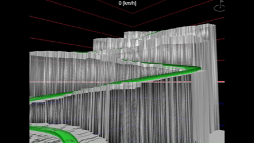
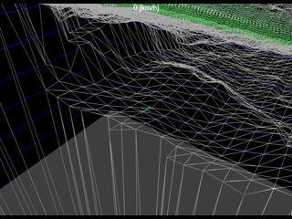
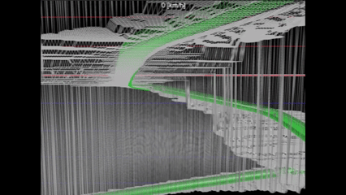
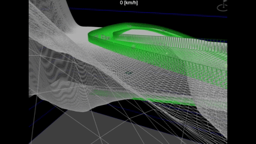
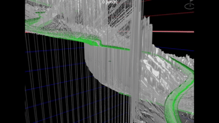
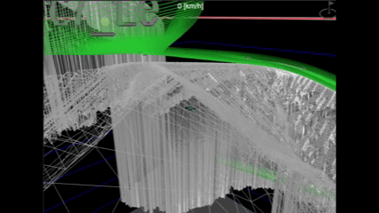
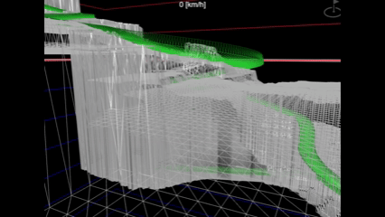
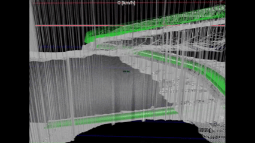
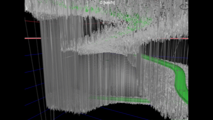
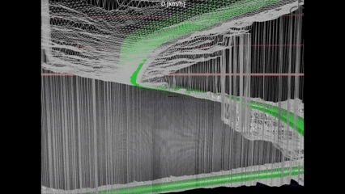

# Babylon.js で物理演算(havok)：ＡＩに頼りつつ「道路に合わせた地形」を作成する

## この記事のスナップショット

  
*道路に合わせた地形*

https://playground.babylonjs.com/?BabylonToolkit#A9IG1M#8

（上記のURLにおいて、ツールバーの歯車マークから「EDITOR」のチェックを外せばウィンドウいっぱいに、歯車マークから「FULLSCREEN」を選べば画面いっぱいになります。）

[ソース](126/)
- 126_makeLandWithRoad_dbg01 .. 造成１：制約データの高さのみ
- 126_makeLandWithRoad_dbg02 .. 造成２：平滑化
- 126_makeLandWithRoad_dbg31 .. 造成３：谷
- 126_makeLandWithRoad_dbg32 .. 造成３：尾根
- 126_makeLandWithRoad_dbg41 .. 造成４：全体的な勾配（Ｘ軸正で下がる）
- 126_makeLandWithRoad_dbg42 .. 造成４：全体的な勾配（Ｘ軸正で上がる）
- 126_makeLandWithRoad_dbg51 .. 造成５：均一な乱数
- 126_makeLandWithRoad_dbg61 .. 造成６：パーリンノイズ

ローカルで動かす場合、上記ソースに加え、別途 git 内の [104/js](https://github.com/fnamuoo/webgl/tree/main/104/js) を ./js として配置してください。

## 概要

以前の記事
[Babylon.js で物理演算(havok)：ボブスレー](123.md)
[Babylon.js で物理演算(havok)：ボブスレー](https://zenn.dev/fnamuoo/articles/948254e2c146a8)

や
[Babylon.js で物理演算(havok)：ダウンヒルにバンクをつける](125.md)
[Babylon.js で物理演算(havok)：ダウンヒルにバンクをつける](https://zenn.dev/fnamuoo/articles/7a24928baa4d55)

ではコースだけを作成して宙ぶらりんな状態でした。

今回は、これらのコース／道路に合わせた凹凸形状を作成してみました。

かなり前
[Babylon.js の基礎調査：perlinノイズを使ってみる](072.md)
[Babylon.js の基礎調査：perlinノイズを使ってみる](https://zenn.dev/fnamuoo/articles/535eac8879957a)
で、同じようなことはトライしてみましたが、
今回はＡＩで定石を確認しつつ作ってみました。結果、スマートに開発でき、まぁまぁのモノができたと思います。

  
*まぁまぁのモノ*

## やりたいこと

３次元の座標値(x,y,z)のリストを持った線分があります。これをコースに見立てて
[Extruding Shapes](https://doc.babylonjs.com/features/featuresDeepDive/mesh/creation/param/extrude_shape/)
でコースのメッシュを作成します。

このコースに合わせて、地形のメッシュ、凹凸のある面のメッシュを[Ribbon](https://doc.babylonjs.com/features/featuresDeepDive/mesh/creation/param/ribbon/)で作成します。必要なデータはグリッド位置(x,z)に対する高さ(y)の情報、３Ｄの座標(x,y,z)の集合になります。

欲しい地形の形状は、コースと交差せずに、またコースから離れすぎて浮き上がらないよう密着していることが望ましく、それ以外は不問とします。
つまり、谷底がコースになっている地形や山の尾根がコースになっている地形、片側が断崖絶壁になっているようなコースでかまわないし、逆に意図的にこれらが作れるなら望ましいということになります。

## やったこと

- ＡＩに聞いてみる
- 設計
  - 概要
  - 造成のアルゴリズム
- 造成
  - 造成１：制約データの高さのみ
  - 造成２：平滑化
  - 造成３：谷／尾根
  - 造成４：全体的な勾配
  - 造成５：均一な乱数
  - 造成６：パーリンノイズ

### ＡＩに聞いてみる

おぼろげながら「こうすれば出来るかな」というアイデアはあったのですが、車輪の再発明もばからしいので、まずはＡＩに投げてみました。

```prompt
３次元の経路（例えば道路）にあわせて、ランダムな凹凸を持った地形をhighfield（高さをもったxy平面）で作成するには？
```

一応２つのＡＩに確認（下記添付）して裏をとりつつ、思わず「( ･∀･)=b ｸﾞｯｼﾞｮﾌﾞ」と、なってしまったのは内緒。
数式の意味はよくわかりませんが、道路を制約条件として、凹凸を作ればよいのはわかりました。

#### ChatGPTの回答

> 質問を整理すると、
> 
> * **前提**：地形は *heightfield（高さを持つ XY 平面）*
> * **制約**：3 次元空間に定義された「経路（道路・川・レール等）」があり
> * **目的**：
> 
>   * 経路に沿って地形を「従属」させる（道路が地形に埋もれない／不自然にならない）
>   * それ以外の部分にはランダムだが自然な凹凸を持たせたい
> 
> という地形生成問題ですね。
> これは **「制約付き heightfield 生成」** の典型例です。
> 
> 以下、**考え方 → アルゴリズム → 実装レベル（Babylon.js 等）** の順で整理します。
> 
> ---
> 
> ## 1. 基本方針（全体像）
> 
> 重要なのは **「経路を先に固定し、そこから周囲へ影響を伝播させる」** ことです。
> 
> ### 基本構成
> 
> 1. **3D 経路 → XY 平面への射影**
> 2. **経路を heightfield 上の制約点として埋め込む**
> 3. **距離に応じた影響範囲（フォールオフ）を定義**
> 4. **ノイズ（凹凸）を「経路制約を壊さない形」で加算**
> 5. **最終的にスムージング or 再補正**
> 
> ---
> 
> ## 2. ステップ別アルゴリズム
> 
> ---
> 
> ### 2.1 経路の定義とサンプリング
> 
> 経路は通常：
> 
> * 3D スプライン（Catmull-Rom, Bezier 等）
> * 折れ線（polyline）
> 
> として与えられます。
> 
> #### 処理
> 
> * 経路を **一定間隔でサンプリング**
> * 各点を `(x, z)` → heightfield の `(i, j)` に対応付け
> * 高さ `y` を **「道路高さ」** として保存
> 
> ```text
> pathPoint[k] = {
>   x, z  → heightfield index
>   y     → 固定すべき高さ
> }
> ```
> 
> ---
> 
> ### 2.2 経路を「高さ制約」として埋め込む
> 
> heightfield `H(x, y)` に対して：
> 
> * 経路直下は **完全固定**
> * 周辺は **徐々に自由度を上げる**
> 
> #### 距離ベース制約
> 
> ```math
> d = distance((x, y), nearestPathPoint)
> 
> w(d) = clamp(1 - d / R, 0, 1)
> ```
> 
> * `R`：道路影響半径（道路幅 + 法面）
> * `w = 1`：道路中心
> * `w = 0`：完全に自由な地形
> 
> ---
> 
> ### 2.3 ランダム凹凸（ノイズ）の与え方
> 
> **ここが最重要ポイントです。**
> 
> 単純にノイズを足すと道路が壊れます。
> 
> #### 正しい加算方法
> 
> ```math
> H(x,y) =
>   H_path(x,y) * w(d)
> + H_noise(x,y) * (1 - w(d))
> ```
> 
> つまり：
> 
> * 道路付近：ノイズを抑制
> * 遠方：フルノイズ
> 
> ---
> 
> ### 2.4 使用するノイズの種類
> 
> 自然さを出すには **多層ノイズ** が必須です。
> 
> #### 推奨構成
> 
> | レイヤ       | ノイズ                     | 役割       |
> | --------- | ----------------------- | -------- |
> | Low freq  | Perlin / Simplex        | 大地形（丘・谷） |
> | Mid freq  | Fractal Brownian Motion | 地形のうねり   |
> | High freq | Worley / Value noise    | 細かい凹凸    |
> 
> ```math
> H_noise =
>   a * noise1(x * f1, y * f1)
> + b * noise2(x * f2, y * f2)
> + c * noise3(x * f3, y * f3)
> ```
> 
> ---
> 
> ### 2.5 道路断面（横断形状）の制御（重要）
> 
> 単に高さを固定すると **垂直な壁** になります。
> 
> #### 横断プロファイル
> 
> 道路中心からの距離 `d` に対して：
> 
> ```math
> profile(d) =
>   if d < w0      → 0          (舗装)
>   if w0 < d < w1 → smoothstep (法面)
>   else           → 1          (自然地形)
> ```
> 
> これを `w(d)` に組み込むと：
> 
> * 平坦な道路
> * なだらかな法面
> * 自然地形
> 
> が一体化します。
> 
> ---
> 
> ## 3. 3D 経路が「起伏を持つ」場合
> 
> 経路が 3D（上下する道路）の場合：
> 
> * heightfield 側では
>   **「経路高さ − 地形高さ」** を最小化する補正をかける
> 
> #### 方法
> 
> * 経路点を **地形に投影**
> * 必要に応じて地形を持ち上げ／削る
> 
> ```math
> Δh = y_path - H(x,y)
> H(x,y) += w(d) * Δh
> ```
> 
> これにより：
> 
> * 橋・トンネルを除き
> * 道路が自然に地形に「なじむ」
> 
> ---
> 
> ## 4. Babylon.js / Web 実装イメージ
> 
> ### 4.1 高さマップ生成
> 
> ```js
> const size = 512;
> const heights = new Float32Array(size * size);
> 
> // ノイズ初期化
> for (let z = 0; z < size; z++) {
>   for (let x = 0; x < size; x++) {
>     heights[z * size + x] = baseNoise(x, z);
>   }
> }
> 
> // 経路制約
> for (let z = 0; z < size; z++) {
>   for (let x = 0; x < size; x++) {
>     const d = distanceToPath(x, z);
>     const w = Math.max(0, 1 - d / R);
>     heights[z * size + x] =
>       w * pathHeight(x, z) +
>       (1 - w) * heights[z * size + x];
>   }
> }
> ```
> 
> ---
> 
> ### 4.2 地形メッシュ化
> 
> * `MeshBuilder.CreateGroundFromHeightMap`
> * または `VertexData` で直接生成
> 
> ---
> 
> ## 5. よくある失敗と対策
> 
> | 失敗      | 原因       | 対策                  |
> | ------- | -------- | ------------------- |
> | 道路が波打つ  | ノイズを直接加算 | 距離減衰を必ず入れる          |
> | 法面が急    | 線形補間     | smoothstep / ease   |
> | 不自然な段差  | 解像度不足    | heightfield 解像度を上げる |
> | ノイズが人工的 | 単一ノイズ    | 多層ノイズ               |
> 
> ---
> 
> ## 6. まとめ（設計原則）
> 
> ✔ **経路は「後から乗せる」のではなく「地形生成の制約」**
> ✔ **ノイズは常に「抑制マスク」とセットで扱う**
> ✔ **距離 × 横断プロファイルが自然さの鍵**
> 
> ---
> 
> もし次に進むなら：
> 
> * 「道路幅が変化する場合」
> * 「橋・トンネルを含む場合」
> * 「リアルタイム生成（LOD / チャンク）」
> * 「物理エンジン対応（heightfield collider）」
> 
> なども掘り下げられます。どこまで実装したいですか？

#### geminiの回答

> 道路のような**「特定の高さを持つ3Dパス」**と、**「ランダムな凹凸（ノイズ）」**を組み合わせて自然な地形を作るには、**「距離（SDF: Signed Distance Field）に基づいた重み付け」**という考え方が非常に有効です。
> 
> 単にノイズを生成するだけでは道路が埋まってしまうため、道路の近くでは地形を道路の高さに強制し、離れるにつれてノイズを強くしていくプロセスが必要になります。
> 
> 一般的なワークフローを４つのステップで解説します。
> 
> ---
> 
> ### 1. 道路パスの「影響範囲」を定義する
> 
> まず、XY平面上の各点から「道路までの距離」を計算します。
> 
> * **SDF（符号付き距離関数）:** 道路の中心線からの距離  を計算します。
> * **マスク（Mask）の作成:** 道路の幅を 、法面（のりめん）の幅を  としたとき、距離  に応じて  から  に変化するマスクを作成します。
> * （道路上）: マスク値 
> * （境界）:  へ滑らかに変化（Smoothstepなど）
> * （野外）: マスク値 
> 
> 
> 
> ### 2. ベースとなる標高をサンプリングする
> 
> 道路は3次元の高さ（値）を持っています。地形の各点において、**「その点から最も近い道路上の点の高さ」**を基準の高さ  として取得します。
> 
> ### 3. ランダムな凹凸（ノイズ）の生成
> 
> 地形全体の凹凸となるノイズ（Perlin NoiseやSimplex Noiseなど）を生成します。これを  とします。
> 
> ### 4. 高度の合成（ブレンディング）
> 
> ここが最も重要な工程です。ステップ1で作ったマスクを利用して、道路の高さとノイズの高さを混ぜ合わせます。
> 
> > **ポイント:** > 道路のすぐ横で急激に地形が変わると不自然です。マスクのグラデーション（法面）を調整することで、道路脇の「切り土」や「盛り土」を表現できます。
> 
> ---
> 
> ### 具体的なツール別の実装イメージ
> 
> | ツール | 実装方法 |
> | --- | --- |
> | **Houdini** | `Heightfield Project` ノードで道路を投影し、`Heightfield Mask by Object` で道路周辺をマスクして `Heightfield Noise` を乗算します。 |
> | **Blender** | **Geometry Nodes** を使用。「Sample Nearest Surface」で道路の  値を取得し、「Geometry Proximity」で距離に応じたノイズの強弱をコントロールします。 |
> | **Unity / Unreal** | スプライン（Spline）に沿って地形を盛り上げる「Landmass」機能や、ブラシによる「Road Tool」を使用します。 |
> 
> ---
> 
> ### さらにリアルにするためのテクニック
> 
> 1. **道路の下を平坦にする:** 道路直下のノイズを完全に  にするだけでなく、道路の勾配に合わせて周囲の地形を少しだけ平滑化（Blur）すると、より土木構造物らしくなります。
> 2. **ノイズのレイヤー化:** 大きなうねり（低周波ノイズ）と細かい岩の凹凸（高周波ノイズ）を分けると、単調さが消えます。
> 3. **水はけの考慮:** 道路より地形が高い場所（切り土）と低い場所（盛り土）で、ノイズの合成方法を変える（例えば低い場所には少し谷を作るなど）と説得力が増します。
> 
> どのツール（Houdini, Blender, あるいはプログラムなど）を使用して作成される予定ですか？それに応じた具体的なノード構成やコード例を提示することも可能です。


### 設計：概要

一旦下記の方針とします。

- 地形は道路（３Ｄパス）を包含する範囲とし、地形を生成するためのデータ『制約データ』を用意する。
- 制約データはグリッド（正方直行格子）に下記の属性を持たせる。つまり３次元の配列データ。
  - 高さ（＝最近傍の道路の高さ）
  - 道路からの距離
- 制約データに対する操作、補間処理、平滑化などは、２状態（処理前・処理後）を取らずに、１つのデータ内で処理する。
  この場合、処理済みの箇所が未処理の箇所に悪影響することが予期されるが、ループ順ではなく、ランダムな順番で処理することで、不整合を容認しつつ、省メモリと処理の簡略化を行います。
つまり、道路を含む近傍さえ整合性が取れていればよく、道路から離れた場所の地形は多少破綻していても問題ないという認識。
- 制約データの「高さ」を基準に「道路からの距離」でランダムな揺れ幅をつけて、最終的な凹凸形状とする。

### 設計：造成のアルゴリズム

- step1.道路の点列の位置を制約データに反映
  - step1.1.グリッド上の道路の点の近傍（±数点の範囲内≒道路幅）について同じ道路の高さを割り当て、道路からの距離を割り当てる
  - step1.2.「道路からの距離」にはマンハッタン距離（abs(dx)+abs(dz)）を割り当てる
  - step1.3.既に制約データに登録済みでも、「道路からの距離」が小さい方の「道路の高さ」を優先する（近接しているときに領域を均等に取り合う）
  - step1.4.既に制約データに登録済みでも、「道路の高さ」が小さい方を優先する（交差時に低位を優先）
- step2.制約データの未設定の箇所を充足
  - step2.1.未処理の地点をスタックに積む
  - step2.2.スタックの順序をシャッフルする
  - step2.3.スタックから１つ取り出し、４近傍に処理済みのデータがあれば、高さをコピーして、距離を＋１してコピーする。
  - step2.4.全ての地点が処理済みになるまで step2.1に戻って繰り返す
- step3.凹凸地形を造成する
  - step3.1.制約データを順にループさせ、グリッドを水平位置に割り当て、「高さ」を地形の高さに割り当てる。「道路からの距離」は地形の高さに対する揺らぎ幅とする。

オプション

- option1.平滑化
  - 地形をなめらか（平滑化）するには「step3.凹凸地形を造成する」の直前で実施します。
  - 「道路からの距離」が一定の高さ以上の地点について、近傍の高さで平均して自身割り当てます。

- option2.谷／尾根
  - 「道路からの距離」を高さにプラスすれば谷の形状に、マイナスに付与すれば尾根にできます。

- option3.全体的な勾配
  - 「step1.道路の点列の位置を制約データに反映」で制約データに割り当てる「高さ」に工夫することで方角に対しＵＰ／ＤＯＷＮさせることができます。
  - 「高さ」の補正値として次のような値を割り当てるとＸ軸正で下がります

```
高さ補正 = Math.abs(gridX-点x) < 6 ?  0 : -(gridX-点x)*0.6;
```

## 造成

パターンを変えていくつか作ってみました。

### 造成１：制約データの高さのみ

「道路からの距離」による乱数を付与しない版です。

  
*制約データの高さのみ*

https://playground.babylonjs.com/?BabylonToolkit#A9IG1M

### 造成２：平滑化

平滑化を100ループかけて凸凹間を滑らかにした版です。
段々畑な感じは解消できますが、崖や絶壁をなだらかにするにまでには至りません。
あと見た目、「溶けた」感じにはなりますが、自然に「浸食で削れた」感じではないです。

  
*平滑化100ループ*

https://playground.babylonjs.com/?BabylonToolkit#A9IG1M#1

### 造成３：谷／尾根

「道路からの距離」を高さに付与した版です。
プラスに付与して「谷」に、マイナスに付与して「尾根」にしています。

  
*谷*

https://playground.babylonjs.com/?BabylonToolkit#A9IG1M#2

  
*尾根*

https://playground.babylonjs.com/?BabylonToolkit#A9IG1M#3


### 造成４：全体的な勾配

制約データに割り当てる「高さ」に工夫をした版です。
全体的に傾斜をつけることでより自然な造形を目論んだものです。

１つはＸ軸正に対し下がるように、
もう一つは対比用に逆向き（Ｘ軸正に対し上がるよう）にしています。

適用したコースが全体的に「Ｘ軸正に下がっている」ので、前者だとより自然な感じに、
後者だと山側が削られ谷側が盛り土されたような不自然な感じになっていると思います。

なお、「高さ」のみを使用し、「道路からの距離」は使っていません。

  
*Ｘ軸正で下がる*

https://playground.babylonjs.com/?BabylonToolkit#A9IG1M#4

  
*Ｘ軸正で上がる*

https://playground.babylonjs.com/?BabylonToolkit#A9IG1M#5


### 造成５：均一な乱数

「道路からの距離」を最大値に乱数（均一な乱数）を付与した版です。

樹氷っぽくて「悪くないかも」という感想です。

  
*均一な乱数*

https://playground.babylonjs.com/?BabylonToolkit#A9IG1M#6

### 造成６：パーリンノイズ

「道路からの距離」を最大値に乱数（パーリンノイズ）を付与した版です。
高さによる制約が強い／効きすぎているのか、パーリンノイズの良さが出せてない感じがします。もうちょっと調整が必要な印象です。

  
*パーリンノイズ*

https://playground.babylonjs.com/?BabylonToolkit#A9IG1M#7

## まとめ・雑感

今回のコースはどれも折り返し（ヘアピン）があるので、「道路からの距離」による乱数の影響を控え目にしてます。
一本道とかだったらもっと大きく変化をつけても良かったかもしれません。

造成にかかる時間がちょっと重いかなと思いますが、自動生成させてこれならまぁまぁの出来でしょうか？

道路にバンクがついているので、地形に対し道路を少し浮き上がらせています。
あまり地形から上げ過ぎると浮いた感じになるので部分的に重なっているところがありますが目をつむってください。

ＡＩに設計を確認しておいて良かったです。おかげでスマートに開発が進みました。
バグについても
『下記コードについて考えられる不具合を指摘して』
とすることで原因をいち早く見つけることができました。

あと、ソースコードがごちゃごちゃと見にくくて申し訳ないです。まぁ解読しようとする奇特な方はいないかもしれませんが（ｗ

------------------------------

前の記事：[Babylon.js で物理演算(havok)：ダウンヒルにバンクをつける](125.md)

次の記事：..


目次：[目次](000.md)

この記事には次の関連記事があります。

- [Babylon.js の基礎調査：perlinノイズを使ってみる](072.md)
- [Babylon.js で物理演算(havok)：ボブスレー](123.md)
- [Babylon.js で物理演算(havok)：ダウンヒルにバンクをつける](125.md)


--
