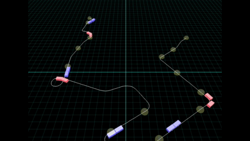
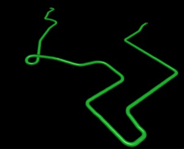
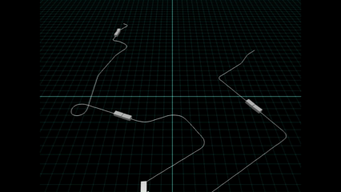
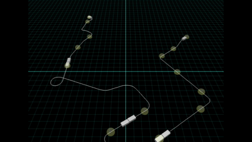

# Babylon.js ：簡易な鉄道シミュレーション（ゆりかもめ）

## この記事のスナップショット

  
*ゆりかもめ*

https://playground.babylonjs.com/full.html#3TDLC4

（上記のURLにおいて、ツールバーの歯車マークから「EDITOR」のチェックを外せばウィンドウいっぱいに、歯車マークから「FULLSCREEN」を選べば画面いっぱいになります。）

[ソース](128/)

ローカルで動かす場合、上記ソースに加え、別途 git 内の [104/js](https://github.com/fnamuoo/webgl/tree/main/104/js) を ./js として配置してください。

## 概要

東京臨海新交通臨海線「ゆりかもめ」を対象に路線図をおこし、車両を動かしてみました。
鉄道シミュレーションとしては素人な感じに仕上がってます。

## やったこと

- 地図から路線（ライン）をぬきだす
- 路線を描画・車両を走らせてみる
- 駅を配置してみる
- のぼり列車とくだり列車を走らせてみる

### 地図から路線（ライン）をぬきだす

地図からライン（点列）を抜き出す方法は既に何度か紹介していますが、
[Babylon.js：画像からコース作り（１／２）](090.md)
での手順を踏襲します。

出来上がったラインはこんな感じ。

  
*ゆりかもめのライン*

### 路線を描画・車両を走らせてみる

とりあえず、線分として描画して車両を動かしてみます。

前回の記事
[Babylon.js ：Path3D上で複数メッシュを動かす](127.md)
で車両に関する動作の試作を行いましたが、
車両が小さいこともあり、（台車を使わない）１点のみで車両を動かします。

  
*ゆりかもめ（片側）*

### 駅を配置してみる

駅に該当するメッシュとして球を配置してみます。

  
*駅の表示*

### のぼり列車とくだり列車を走らせてみる

同じラインをつかって、「のぼり」と「くだり」の列車を走らせてみます。
メッシュの中心位置にラインを合わせたままだと「のぼり」と「くだり」で正面衝突するので、
ラインからメッシュを横にずらして表示させます。

  
*のぼりとくだり*

## まとめ・雑感

すみません。途中でモチベが低下しました。

いや、当初の想定だと、このあと時刻表に合わせて列車を動かそうと考えていたのですが、
そもそもが「一定間隔で規則正しく運行している」ことを考えると、
時刻表に合わせた動きと、適当に動かしている現状のシミュレーションと大差ない気がしてきて、
モチベーションがだだ下がりになりました。

これなら、まだ鉄道模型のようにコントローラーで列車の速度を操れた方が楽しいかなと考え始めたら気持ちが離れてしまいました。

鉄道関連のシミュレーションとかゲームを見てしまうとなんかもうね。

何にしてもやる気／モチベを高めないと続けられそうもないので一旦ここまでとします。

------------------------------

前の記事：[Babylon.js ：Patg3D上で複数メッシュを動かす](127.md)

次の記事：[Babylon.js で物理演算(havok)：門松／ししおどし](129.md)

目次：[目次](000.md)

この記事には次の関連記事があります。

[Babylon.js：画像からコース作り（１／２）](090.md)
[Babylon.js ：Patg3D上で複数メッシュを動かす](127.md)

--
