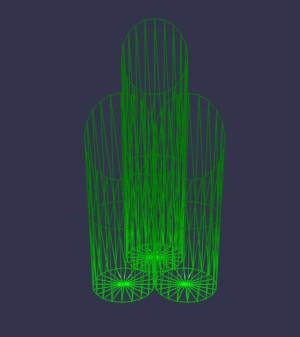
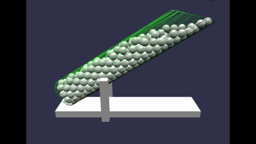

# Babylon.js で物理演算(havok)：門松／ししおどし

## この記事のスナップショット

  
*門松*

  
*ししおどし（８倍速）*

https://playground.babylonjs.com/?BabylonToolkit#KCA2EA

（上記のURLにおいて、ツールバーの歯車マークから「EDITOR」のチェックを外せばウィンドウいっぱいに、歯車マークから「FULLSCREEN」を選べば画面いっぱいになります。）

[ソース](129/)

ローカルで動かす場合、上記ソースに加え、別途 git 内の [104/js](https://github.com/fnamuoo/webgl/tree/main/104/js) を ./js として配置してください。

## 概要

ribbon を使い「門松」（円筒を斜めにカットした形状）を作ることができました。
ribbon は自由曲面を生成するメッシュですが、これを筒状にして門松にしています。

更にこの門松を利用して「ししおどし」を作成しました。
水の代わりにボールを落としています。

## やったこと

- ribbon で門松をつくる
- ＡＩにししおどしの作り方を聞いてみる
- ししおどしを作ってみる

### ribbon で門松をつくる

今まで
[ribbon](https://doc.babylonjs.com/features/featuresDeepDive/mesh/creation/param/ribbon/)
を凹凸のある平面（地形）に使っていました。
平面を丸めて筒状にすることで「円筒を斜めにカットした形状」を作ることができます。

```js
// 竹（垂直）のribbonデータ生成
    let crBumbV = function(r=2, length=10, rdiv=10) {
        // let r=2, length=10, rdiv=10;
        let rdiv2=2*rdiv, length_=length/2;
        let rad=0, rstep=Math.PI/rdiv, PI2 = Math.PI*2;
        let x=0, y=0, z=0;
        let pplist = [];
        {
            // 底の中心
            let plist = [];
            for (let irdiv = 0; irdiv <= rdiv2; ++irdiv) {
                x = 0;
                y = -length_;
                z = 0;
                plist.push(new BABYLON.Vector3(x, y, z ));
            }
            pplist.push(plist);
        }
        {
            // 底の外周
            let plist = [];
            for (let irdiv = 0; irdiv <= rdiv2; ++irdiv) {
                rad =irdiv*rstep;
                x = r*Math.sin(rad);
                y = -length_;
                z = r*Math.cos(rad);
                plist.push(new BABYLON.Vector3(x, y, z ));
            }
            pplist.push(plist);
        }
        {
            // 中央：外周
            let plist = [];
            for (let irdiv = 0; irdiv <= rdiv2; ++irdiv) {
                rad =irdiv*rstep;
                x = r*Math.sin(rad);
                y = 0;
                z = r*Math.cos(rad);
                plist.push(new BABYLON.Vector3(x, y, z ));
            }
            pplist.push(plist);
        }
        {
            // 上端：外周（そぎの部分）
            let plist = [];
            for (let irdiv = 0; irdiv <= rdiv2; ++irdiv) {
                rad =irdiv*rstep;
                x = r*Math.sin(rad);
                y = length_+Math.cos(rad)*2;
                z = r*Math.cos(rad);
                plist.push(new BABYLON.Vector3(x, y, z ));
            }
            pplist.push(plist);
        }
        return pplist;
    }
```

これを３つ合わせて門松をつくることができました。

  
*門松*


### ＡＩにししおどしの作り方を聞いてみる

ししおどしの動き、シーソーのようにきちんと動かすためのコツが知りたくて、ChatGPT に「ししおどしの作り方」を聞いてみました。

> **ししおどし（鹿威し）の基本的な作り方**を、家庭でも再現しやすい方法で説明します。
> ※本来は日本庭園の装置ですが、構造自体はとてもシンプルです。
> 
> ---
> 
> ## 仕組み（原理）
> 
> * **中が空洞の竹筒**に水が少しずつ溜まる
> * 重心が変わると**回転して水を排出**
> * 空になった瞬間に**竹が石（または木）に当たり「カーン」という音**が出る
> * 元の位置に戻り、これを繰り返す
> 
> ---
> 
> ## 用意するもの
> 
> * 竹筒（直径5～8cm、長さ60～90cm程度）
> * 支点用の丸棒・太めの釘・金属棒（竹を回転させる軸）
> * 支柱（木の杭2本など）
> * 水源（ホース・滴下装置・ペットボトル）
> * 受け石（平たい石、または硬い木材）
> * ノコギリ、ドリル、金槌など
> 
> ---
> 
> ## 作り方（手順）
> 
> ### ① 竹筒の加工
> 
> * 節を1つだけ残し、**片側を閉じた状態**にする
> * 閉じた側の**上部に小さな穴**をあける（給水用）
> * 重心調整のため、閉じた側が**やや短く**なるようにすると安定しやすい
> 
> ```
> [水が溜まる側]====O====[軽い側]
>                  ↑支点
> ```
> 
> ---
> 
> ### ② 支点を作る
> 
> * 竹筒の重心より少し軽い側に穴をあける
> * 丸棒や釘を通して**回転できるようにする**
> 
> ---
> 
> ### ③ 支柱を立てる
> 
> * 地面に支柱を2本立て、支点棒を渡す
> * 竹筒が**スムーズに回転**する高さに調整
> 
> ---
> 
> ### ④ 受け石を設置
> 
> * 竹筒が回転して落ちたときに
>   **先端が当たる位置**に石を置く
> * 音が出にくい場合は、角度や石の位置を微調整
> 
> ---
> 
> ### ⑤ 水を流す
> 
> * ホースやペットボトルで**少量ずつ連続供給**
> * 水量が多すぎるとリズムが崩れるので注意
> 
> ---
> 
> ## 調整のコツ
> 
> * **音が鳴らない** → 石の位置・角度を調整
> * **倒れたまま戻らない** → 支点を少し軽い側へ
> * **動かない** → 水量を増やす／穴を少し大きく
> * **リズムを遅くしたい** → 竹を長く、水量を減らす
> 
> ---
> 
> ## 室内・簡易版（おまけ）
> 
> * 竹の代わりに**塩ビパイプ**
> * 水は**点滴チューブやペットボトル**
> * 受けは木片
>   → ベランダや模型庭園でも再現可能
> 
> ---
> 
> ## 注意点
> 
> * 転倒防止のため支柱はしっかり固定
> * 近隣への**騒音配慮**（特に夜間）
> * 屋外では防腐・防虫対策をすると長持ち
> 
> ---
> 
> もし
> 
> * **設計図（寸法付き）が欲しい**
> * **Babylon.jsなどでシミュレーションしたい**
> * **音の周期を数式で設計したい**
> 
> などがあれば、そこまで踏み込んで解説できます。

上記より、ししおどしの動きを模倣するには以下の点に注意すればよさそうです。

- 筒が倒れた（切り口が下）になったままの場合
  - 支点を水が溜まる側にずらす（重心をこちらにもってくる）
  - 溜まる側を重くする
  - 水量を減らす
- 水が溜まっても排出しない（倒れない）場合
  - 支点を切り口の方にずらす
  - 溜まる側を軽くする

### ししおどしを作ってみる

ししおどしには、上述の「筒」と支点（アンカー／固定端）をヒンジでつなぎます。

```js
// メッシュ・ヒンジ
    // 筒のメッシュ
    let mesh = createMesh();
    let agg = new BABYLON.PhysicsAggregate(mesh, BABYLON.PhysicsShapeType.MESH, { mass: 10, friction: 0.01, restitution:0.01}, scene);
    mesh._agg = agg;
    // 固定端
    let mesh0 = BABYLON.MeshBuilder.CreateBox("anc", {width:0.1, height:1, depth:1});
    mesh0.position.set(-3,3,0);
    mesh0.visibility = 0; // 透明にする／隠しておく
    let agg = new BABYLON.PhysicsAggregate(mesh0, BABYLON.PhysicsShapeType.BOX, { mass: 0, friction: 0.01, restitution:0.01}, scene);
    mesh0._agg = agg;
    // ヒンジ
    let joint = new BABYLON.HingeConstraint(
        new BABYLON.Vector3(-3, 0, 0), // 筒の底側に -3ずらした地点
        new BABYLON.Vector3(0, -2, 0),
        new BABYLON.Vector3(0, 0, 1), // BABYLON.Vector3.Forward(), // undefined,
        new BABYLON.Vector3(0, 0, 1), // BABYLON.Vector3.Forward(), // undefined,
        scene
    );
    mesh._agg.body.addConstraint(mesh0._agg.body, joint);
```

「水のたまる（ボトム）」側を短くしています。
重心をボトム側に寄せるための「おもし」の代わりに回転モーメント(applyAngularImpulse)をかけます。

```js
// 「おもし」代わりの回転モーメント
    scene.onBeforeRenderObservable.add(() => {
        // mesh._agg.body.applyAngularImpulse(new BABYLON.Vector3(0, 0, 7.4)); // ok 下限
        mesh._agg.body.applyAngularImpulse(new BABYLON.Vector3(0, 0, 9.0)); // ok バランスよさげ
        // mesh._agg.body.applyAngularImpulse(new BABYLON.Vector3(0, 0, 10.0)); // x NG強すぎ／倒れない
    }
```

水の代わりにボールを落とします。

一定間隔でボールを落とすようにして、範囲外(ymin)に落ちたボールは再利用します。

```js
// 水流代わりのボール
    // 永遠にボールを落とす
    let balls=[], pool=[];
    let nBall = 300, popCool=0, popCoolDef=40; // ボールを落とす間隔
    let popBall = function() {
        let mesh = BABYLON.MeshBuilder.CreateSphere("ball", { diameter: 1 }, scene);
        mesh.position.copyFrom(pSrc); // 初期位置に移動
        mesh._agg = new BABYLON.PhysicsAggregate(mesh, BABYLON.PhysicsShapeType.SPHERE, { mass: 0.1, restitution:0.1}, scene);
        mesh.physicsBody.disablePreStep = false;
        mesh._valid=1;
        balls.push(mesh);
    }
    let resetPosiBall = function(mesh) {
        mesh.position.copyFrom(pSrc); // 初期位置に移動
        mesh.physicsBody.setLinearVelocity(new BABYLON.Vector3(0, 0, 0)); // 移動を止める
        mesh.physicsBody.setAngularVelocity(new BABYLON.Vector3(0, 0, 0)); // 回転を止める
    }

    scene.onBeforeRenderObservable.add(() => {
        {
            if (popCool > 0) {
                popCool = popCool-1;
            } else {
                popCool = popCoolDef;
                if (pool.length > 0) {
                    // pool から取り出して再利用
                    let mesh = pool.shift();
                    mesh._valid=1;
                    resetPosiBall(mesh);
                } else if (balls.length < nBall) {
                    // 新規作成
                    popBall();
                }
            }
        }
        balls.forEach((mesh) => {
            if (mesh.position.y < ymin && mesh._valid==1) {
                // ボールが下限を超えたら回収（pool に格納）
                mesh._valid=0;
                pool.push(mesh);
            }
        })
    })
```

こんな感じで動きます。

  
*ししおどし（８倍速）*

## まとめ・雑感

仕組みは簡単ですが、緻密なバランスで動いていると知れて勉強になりました。
実は最初に「ししおどし」を作った段階で上手く動かず、生成ＡＩに問い合わせて確認したことでコツがつかめました。

筒のバランス／重心のとり方はちょっと悩みました。ボトム側に重りのメッシュを追加してもよかったのですが、力を加えるという点においては回転モーメントでも同等の効果が得られるのでこちら（回転モーメント）を採用しました。

音は出ないですが、満足な出来です。

------------------------------

前の記事：[Babylon.js ：簡易な鉄道シミュレーション（ゆりかもめ）](128.md)

次の記事：[Babylon.js で物理演算(havok)：チューブの中で玉を転がす](130.md)


目次：[目次](000.md)

この記事には次の関連記事があります。


--
