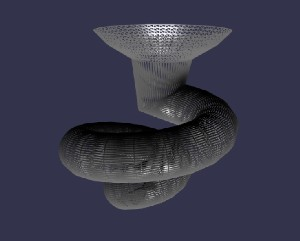
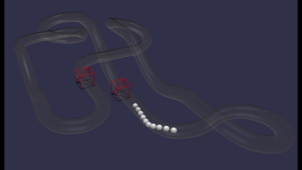
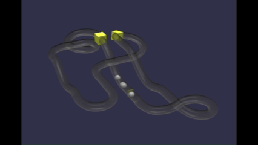
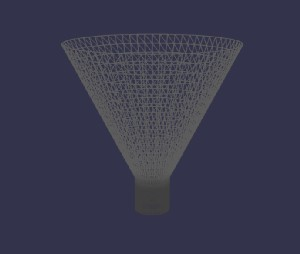
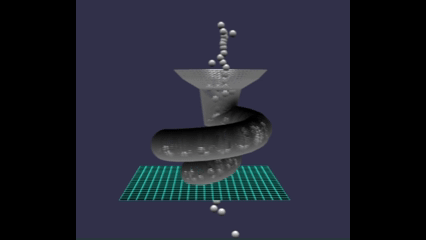
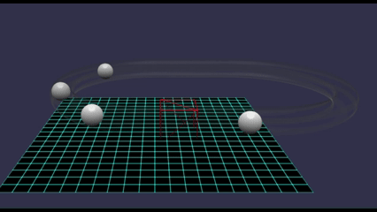
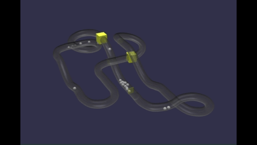

# Babylon.js で物理演算(havok)：チューブの中で玉を転がす

## この記事のスナップショット

  
*漏斗＋らせん/createScene_tube3*

  
*ローラーコースター（加速器）*

  
*ローラーコースター（アクチュエーター：大粒diameter=1.8）*

https://playground.babylonjs.com/?BabylonToolkit#L50M8X

（上記のURLにおいて、ツールバーの歯車マークから「EDITOR」のチェックを外せばウィンドウいっぱいに、歯車マークから「FULLSCREEN」を選べば画面いっぱいになります。）

[ソース](130/)

ローカルで動かす場合、上記ソースに加え、別途 git 内の [104/js](https://github.com/fnamuoo/webgl/tree/main/104/js) を ./js として配置してください。

## 概要

チューブの直径のサイズを部分的に変更する漏斗（ろうと）を作ってみたところ、興に乗って、チューブの中で玉を転がしてみました。

似たようなことは、以前にもやっていました。

- [スロープトイ：コース編](036.md)
- [車とスロープトイのコラボ](042.md)

上述は物理エンジンが cannon で、レール（直方体２本）や直方体で筒を作ってました。

こちら（次）は、Babylon.js 版で チューブがありますが、非常に短いサンプル形状でした。

- [Babylon.js で物理演算(havok)の基礎調査：いろいろな形状の衝突判定](059.md)


今回はやや長めのチューブ形状を作成し、その中に玉を転がします。

前半では自由落下／重力でチューブの中を転がせてみました。
後半では平面上のコース（運動場トラック）やアップダウンのあるコース（ローラーコースター）を作ってみました。
平面だったり、アップダウンがあると重力だけでは動きが鈍くなるので、加速器やアクチュエーター（ボールを押し出す機構）を作って試してみました。
「アクチュエーター」という呼称はわかりにくいとは思いますが、「動く壁」とか「押し出し機」とかだとしっくりこなかったので、このまま「アクチュエーター」の呼称を使います。

関連する話題としては

- [Babylon.js ：Line3D上で複数メッシュを動かす](127.md)

の物理モデル版だったりします。
上述では 3Dのライン上に沿ってメッシュを等速で機械的に動かしていましたが、ここでは物理エンジンに則ってメッシュ（ボール）を動かします。
物理エンジンを使う方が加速・減速があって、動きは面白くなりますが、「進行方向に動かす（坂を登らせる）」制御が難しいという面があります。

## やったこと

- 漏斗をつくる
- 漏斗に玉を落としてみる
- 運動場トラックで玉を転がしてみる（加速器をつくる）
- ローラーコースターで玉を転がしてみる
- ローラーコースターにアクチュエーターを作ってみる

### 漏斗をつくる

漏斗をチューブ(tube)でつくるには radiusFunction で index／距離に応じて半径を返す関数を用意します。

```js
    let plist = [];
    for (let i = 0; i < 20; ++i) {
        plist.push(new BABYLON.Vector3(i, 0, 0 ))
    }
    const radiusChange = (index, distance) => {
        const radius =  (index <5 ) ? 2 : distance / 2;
        return radius;
    };
    const mesh = BABYLON.MeshBuilder.CreateTube("tube", {path: plist, radiusFunction: radiusChange, sideOrientation: BABYLON.Mesh.DOUBLESIDE}, scene);
    mesh.rotation = new BABYLON.Vector3(0, 0,Math.PI/2);
```

  
*シンプルな漏斗/createScene_tube1*

煩雑にして、「らせん」と組み合わせてみるとこんな感じにもできます。

  
*漏斗＋らせん/createScene_tube3*

## 漏斗に玉を落としてみる

玉を落とすのは前回の

- [Babylon.js で物理演算(havok)：門松／ししおどし](129.md)

でやったルーチンをそのまま利用します。
正直ここまで厳密に流量を制御せずにドバドバと落としても問題ないのですが、まぁ一応。

  
*漏斗＋らせんに玉を落とした感じ/createScene_FalBall*

### 運動場トラックで玉を転がしてみる（加速器をつくる）

トラックはざっくりと下記感じで点列のデータを作ります。

```js
//トラックの3D座標データ
            let plist = [];
            for (let ix=0; ix < 10; ix+=2) {
                plist.push(new BABYLON.Vector3(ix, 1, 0 ));
            }
            let r=10, nr = 20;
            let rstep = R180/nr;
            for (let irad=0; irad < nr; ++irad) {
                let rad = irad*rstep;
                let x = 10+r*Math.sin(rad);
                let z = r*(1-Math.cos(rad));
                plist.push(new BABYLON.Vector3(x, 1, z));
            }
            for (let ix=0; ix < 10; ix+=2) {
                plist.push(new BABYLON.Vector3(10-ix, 1, 20 ));
            }
            for (let irad=0; irad < nr; ++irad) {
                let rad = irad*rstep;
                let x = -r*Math.sin(rad);
                let z = r*(1+Math.cos(rad));
                plist.push(new BABYLON.Vector3(x, 1, z));
            }
```

このままだと、ボールがpopしたその場から拡散するだけなので、運動に指向性を持たせるべく「加速器」を用意します。
といってもメッシュ（箱）とボールが交差したらボールに特定の方向に力を加えるだけです。

```js
// 加速器のメッシュと交差判定
            // 加速器
            let meshAcc = BABYLON.MeshBuilder.CreateBox("anc", {width:3, height:3, depth:3});
            meshAcc.position.copyFrom(pSrc);
            meshAcc.material = new BABYLON.StandardMaterial("");
            meshAcc.material.diffuseColor = BABYLON.Color3.Red();
            meshAcc.material.wireframe=1;

            scene.registerAfterRender(function() {
                // 自機とチェックポイントの交差チェック
                const vdir = new BABYLON.Vector3(1, 0, 0);
                balls.forEach((mesh) => {
                    if (mesh.intersectsMesh(meshAcc, true)) {
                        mesh._agg.body.applyImpulse(vdir, mesh.absolutePosition);
                    }
                });
            });

```

  
*運動場トラックで転がす/createScene_RunBall1*

粒子加速器みたいになりましたｗ。

### ローラーコースターで玉を転がしてみる

今度はもっと複雑な、アップダウンのあるコースを作成します。
適当に座標を指定して、スプラインで補完してスムーズにします。
（頭の中でコースを想像して、座標値を直接指定して作成する力技ｗ）

```js
// ローラーコースターのデータ
            let plist = [];
            plist.push(new BABYLON.Vector3(-6, 1, 0 ));
            plist.push(new BABYLON.Vector3(-3, 1, 0 ));
            plist.push(new BABYLON.Vector3(0, 1, 0 ));
            plist.push(new BABYLON.Vector3(3, 1, 0 ));
            （略）
```

運動場トラックと同様に、加速器を配置して、ボールを動かすとこんな感じに。

  
*ローラーコースター（加速器）*

### ローラーコースターにアクチュエーターを作ってみる

加速器も悪くないのですが、リアルっぽくボールを押し出すアクチュエーターを作って動作を確認してみました。

アクチュエーターの動きは
- [Babylon.js ：Path3D上で複数メッシュを動かす](127.md)
で実施した Path3D 上でメッシュを動かす方法を利用します。

動かしてみると、思ったようにボールを押し出してくれずに、チューブの内壁にぶつかりまくったり、チューブから飛び出したりします。


  
*ローラーコースター（アクチュエーター：小粒diameter=1.0）*

ゆっくり動かしても、ボールがチューブの内壁にぶつかりまくりです。
チューブから飛び出るだけでなく、アクチュエーターをすり抜けるボールも出てくる始末です。

摩擦（friction）は0.0001と小さく抑え、反発（restitution）はアクチュエーターは高めの200にしつつ、ボールとチューブは 0.01としました。
アクチュエーターとは反発しつつも、ボールとチューブではスムーズに滑ってくれることを期待したのですが、思うように動いてくれませんでした。

ボールが軽いせいかと思い 0.1 から 10と重くしてみると、チューブから飛び出るボールが増えたような...
質量が増えてエネルギーが増大したのかな？

そういえば、
[スロープトイ：部品編](037.md)
の cannonの物理エンジンで、垂直な風車を作ったときにも上手く運べなかったし。
でもエレベータだとそこそこスムーズに運べていたので、形状やサイズが問題だったのかな？
経路を湾曲せずに直線で、ボールも１つずつとかだったらスムーズに運べたかも。

ということで、ボールを大きく、質量を戻し、軽くしてみたらだいぶ良くなりました。
といってもぎこちなさは残ったままです。

  
*ローラーコースター（アクチュエーター：大粒diameter=1.8）*

## まとめ・雑感

スロープトイの Babylon.js 版を作っても良かったのですが、多くの方が似たようなことをしているので、ひとひねり入れたくアクチュエーターに着手しました。

仕掛け／からくり（ギミック）としてアクチュエーターでボールを動かせたら面白いと思ったのですが、ちょっと残念な結果になりました。
ここまで記事をまとめていてふと思ったのですが、ボールとアクチュエーターでクーロン力の引力／斥力を導入したら、もっとスムーズに動いたかもと思い始めた次第です。ただ、処理が重くなりそうで要検証ではありますが..

結局、加速器でコントロールするのが簡単で、楽なのは変わりないようです。


そういえば、最近は遊園地（ローラーコースター）を作るアプリもあるんですね。
なんかもう色々と時代遅れの感想ですみません。

------------------------------

前の記事：[Babylon.js で物理演算(havok)：門松／ししおどし](129.md)

次の記事：..


目次：[目次](000.md)

この記事には次の関連記事があります。

- [スロープトイ：コース編](036.md)
- [スロープトイ：部品編](037.md)
- [車とスロープトイのコラボ](042.md)
- [Babylon.js で物理演算(havok)の基礎調査：いろいろな形状の衝突判定](059.md)
- [Babylon.js ：Line3D上で複数メッシュを動かす](127.md)
- [Babylon.js で物理演算(havok)：門松／ししおどし](129.md)


--
