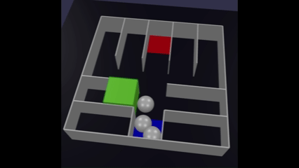
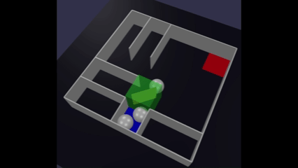
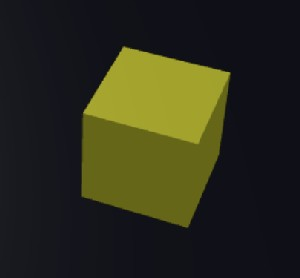
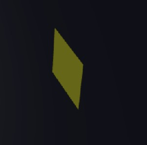
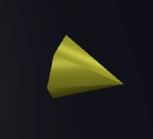
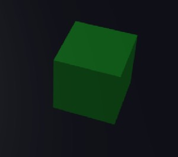

# Babylon.js で物理演算(havok)：迷路内に湧き出るボールをゴールに導くゲーム

## この記事のスナップショット

  
*プレイ画面１（２倍速）*

  
*プレイ画面２（２倍速）*

https://playground.babylonjs.com/?BabylonToolkit#AQUXAM

（上記のURLにおいて、ツールバーの歯車マークから「EDITOR」のチェックを外せばウィンドウいっぱいに、歯車マークから「FULLSCREEN」を選べば画面いっぱいになります。）

[ソース](131/)

ローカルで動かす場合、上記ソースに加え、別途 git 内の [104/js](https://github.com/fnamuoo/webgl/tree/main/104/js) を ./js として配置してください。

## 概要

マイクロマウスの迷路を使ってゲームを作ってみました。
迷路（薄い壁）のスタート位置からボールが一定時間ごとに湧き出るので、ユニット（ボックスや斜めの仕切り板、加速器）を配置して、ゴール（赤いパネル）まで導き、一定数のボールを運べればステージクリアです。

操作性（ユーザインタフェース）が悪い／最低限の機能しか設けてないので、実際にプレイすると操作性がよくありません。


ブロックや壁、加速器を駆使して、ボールをゴールへ導こう!!

  
*ブロック*

  
*壁*

  
*加速器*


ＡＩにレビューさせると、ゲームのジャンルとしては 'タワーディフェンス系の逆構造' に近いとの評価です。

| タワーディフェンス | 本ゲーム     |
| ------------------ | ------------ |
| 敵を破壊           | ボールを誘導 |
| タワー配置         | ユニット配置 |
| 経路固定           | 経路を作る   |

また、本記事は ゲーム制作の完成例ではなく 'ゲームメカニクス実験' な位置づけになるそうです。

## やったこと

- 迷路データを作る
- 迷路を作る
- ゲーム作り：ボールをポップ
- ゲーム作り：カーソルを配置
- ゲーム作り：ユニットを配置
- ゲーム作り：ゴール／クリア判定

### 迷路データを作る

2025年度の
[マイクロマウス](https://www.ntf.or.jp/entry/2025/RobotEnt01.php)
のサイトを訪問して、
全日本および地区大会の迷路情報を見てデータを作成します。といってもテキストで地図を作成するだけです。
テキストデータから地図を作成するライブラリは既に
[迷路作成モジュール（１）「通路と壁が同じサイズ」と「薄い壁」](046.md)
で作成済みなので、下記のような感じで地図をおこすだけになります。

```js
// 迷路データ
    // マイクロマウス2025  第46回全日本マイクロマウス大会  クラシック
    // 西回り　４５歩２８折
    // 南回り　４３歩３２折
    let sdatamm2025alljapanclassic = [
        //0  1  2  3  4  5  6  7  8  9  10 11 12 13 14 15
        '+--+--+--+--+--+--+--+--+--+--+--+--+--+--+--+--+',
        '|  |                                   |        |',
        '+  +--+  +  +--+--+  +  +  +--+--+  +--+--+  +  +',
        '|  |     |     |     |  |     |              |  |',
        '+  +  +--+--+  +  +--+  +--+  +  +--+--+  +--+  +',
        '|              |     |  |     |     |        |  |',
        '+  +  +--+--+  +--+  +  +  +--+--+  +--+  +  +  +',
        '|  |     |     |              |     |     |     |',
        '+  +--+  +  +  +  +--+--+  +  +  +  +  +--+--+  +',
        '|  |        |        |     |  |  |        |     |',
        '+  +  +  +--+--+  +  +--+--+--+  +--+  +  +  +  +',
        '|     |     |     |  |     |     |     |     |  |',
        '+  +--+--+  +  +--+  +--+  +  +  +  +--+  +--+  +',
        '|           |     |  |        |        |     |  |',
        '+  +  +  +--+--+  +  +  +--+  +--+  +  +  +  +  +',
        '|  |  |              |GG GG|  |     |     |     |',
        '+--+  +--+  +--+--+  +  +  +  +  +  +--+  +--+  +',
        '|  |  |        |  |  |GG GG|     |  |     |     |',
        '+  +  +  +--+--+  +--+--+--+  +--+--+--+--+  +  +',
        '|           |     |     |     |  |     |     |  |',
        '+  +--+--+  +  +--+--+  +--+--+  +  +  +  +--+--+',
        '|     |                    |  |     |           |',
        '+--+  +  +  +--+--+  +  +--+  +--+  +--+--+  +  +',
        '|  |     |     |     |     |  |     |  |     |  |',
        '+  +--+  +--+  +  +--+--+  +  +  +--+  +  +--+  +',
        '|  |     |           |              |        |  |',
        '+  +  +  +  +--+--+  +  +--+--+--+  +--+--+  +  +',
        '|     |        |           |     |              |',
        '+  +  +--+  +  +--+--+  +  +  +--+--+  +  +  +  +',
        '|  |  |     |     |     |              |  |  |  |',
        '+  +  +  +--+--+  +  +--+--+  +--+--+  +--+--+  +',
        '|SS|                             |              |',
        '+--+--+--+--+--+--+--+--+--+--+--+--+--+--+--+--+',
    ];
```

### 迷路を作る

薄い壁の迷路づくりは
[Babylon.js：合わせ鏡とミラーハウス](085.md)
をベースとします。
鏡の効果は余分なので削除するとして、迷路を作成するルーチンや、スタート位置／ゴール位置のメッシュの配置などはそのまま流用します。

### ゲーム作り：ボールをポップ

ゲームの要となるボールの湧き出し（ポップ）は
[Babylon.js で物理演算(havok)：門松／ししおどし](129.md)
でのルーチンを流用します。

```js
// ボールのポップとポップ判定
    // ボール
    let balls=[], pool=[], ymin=-10, ballEnable=true;
    let nBall=500, ballR=1.5, popCool=0, popCoolDef=30;
    let popBall = function() {
        let mesh = BABYLON.MeshBuilder.CreateSphere("ball", { diameter:ballR }, scene);
        mesh.position.copyFrom(pSrc);
        mesh.position.addInPlace(BABYLON.Vector3.Random(-0.01, 0.01));
        mesh._agg = new BABYLON.PhysicsAggregate(mesh, BABYLON.PhysicsShapeType.SPHERE, { mass:0.1, friction: 0.0001, restitution:0.01}, scene);
        mesh.physicsBody.disablePreStep = false;
        mesh._valid=1;
        balls.push(mesh);
    }
    scene.onBeforeRenderObservable.add(() => {
        if (ballEnable) {
            if (popCool > 0) {
                popCool = popCool-1;
            } else {
                popCool = popCoolDef;
                if (pool.length > 0) {
                    let mesh = pool.shift();
                    mesh._valid=1;
                    resetPosiBall(mesh);
                } else if (balls.length < nBall) {
                    popBall();
                }
            }
        }

```

### ゲーム作り：カーソルを配置

ユニットを配置するための目安として、カーソル（緑の四角いメッシュ）を配置します。
迷路のグリッド位置に合わせて動かします。

ゲームが動くことを優先し、操作性は後回しにして、キーボード(wasd)で操作します。

```js
// カーソル処理
    // カーソル
    let meshMy = BABYLON.MeshBuilder.CreateBox("cursor", { size:wL}, scene);
    meshMy.position.set(adjx, wL_, adjz);
    meshMy.material = new BABYLON.StandardMaterial("", scene);
    meshMy.material.diffuseColor = BABYLON.Color3.Green();
    meshMy.material.alpha = 0.5;
    let moveCursor = function(ix, iz) {
        // ix,izを周回させる
        if (ix < 0) { ix += nx; } else { ix = ix % nx; }
        if (iz < 0) { iz += nz; } else { iz = iz % nz; }
        meshMy.position.set(ix*wL+adjx, wL_, (nz-iz)*wL+adjz);
        meshMy._ix = ix;
        meshMy._iz = iz;
    }

    // キーボード入力
    scene.onKeyboardObservable.add((kbInfo) => {
        switch (kbInfo.type) {
        case BABYLON.KeyboardEventTypes.KEYDOWN:
            if (kbInfo.event.key == 'w' || kbInfo.event.key == 'ArrowUp') {
                moveCursor(meshMy._ix, meshMy._iz-1);
            } else if (kbInfo.event.key == 's' || kbInfo.event.key == 'ArrowDown') {
                moveCursor(meshMy._ix, meshMy._iz+1);
            } else if (kbInfo.event.key == 'a' || kbInfo.event.key == 'ArrowLeft') {
                moveCursor(meshMy._ix-1, meshMy._iz);
            } else if (kbInfo.event.key == 'd' || kbInfo.event.key == 'ArrowRight') {
                moveCursor(meshMy._ix+1, meshMy._iz);
```

### ゲーム作り：ユニットを配置

スペースキー押下でカーソル位置にユニットを配置させます。

最初のユニットは、ブロック1マス分を埋めるブロックとします。

```js
// ユニット（ブロック）配置処理
    let addUnit = function(iunit) {
        console.log("addUnit: iunit=", iunit);
        let [ix,iz] = [meshMy._ix, meshMy._iz]; // カーソル位置
        let p = new BABYLON.Vector3(ix*wL+adjx, wL_, (nz-iz)*wL+adjz);

        if (iunit == 1) {
            // ブロック（四角）
            let mesh = crUnitMesh(iunit);
            // let mesh = BABYLON.MeshBuilder.CreateBox("", {size:wL-0.1}, scene);
            mesh.position.copyFrom(p);
            mesh._agg = new BABYLON.PhysicsAggregate(mesh, BABYLON.PhysicsShapeType.BOX, { mass: 0, restitution:0.01}, scene);
            meshUnitList.push(mesh);
        }
```

思いのほかすんなり実装できたので、誤操作に対する「ユニットの削除」機能を追加します。
といっても、設置とは逆に、カーソル位置と交差するメッシュがあれば削除します。

```js
// ユニット削除処理
        if (iunit == 0) {
            // 消しゴム
            let dellist = [];
            meshUnitList.forEach((mesh) => {
                if (mesh.intersectsMesh(meshMy, false)) {
                    dellist.push(mesh);
                }
            });
            for (let mesh of dellist) {
                let i = meshUnitList.indexOf(mesh);
                meshUnitList.splice(i, 1);
                mesh._agg.dispose();
                mesh.dispose();
            }
        }
```

続けて、ユニットの種類を増やしていきます。
斜め面を追加する場合は以下のように。

```js
// ユニット（斜め面）配置処理
        if ((iunit == 2)||(iunit == 3)) {
            // 斜め面（平面）
            let mesh = crUnitMesh(iunit);
            // let mesh = BABYLON.MeshBuilder.CreatePlane("", {size:wL-0.1, sideOrientation: BABYLON.Mesh.DOUBLESIDE});
            // mesh.rotate(new BABYLON.Vector3(0, 1, 0), R45+R90*(iunit-2));
            mesh.position.copyFrom(p);

            mesh._agg = new BABYLON.PhysicsAggregate(mesh, BABYLON.PhysicsShapeType.MESH, { mass: 0, restitution:0.01}, scene);
            meshUnitList.push(mesh);
        }
```

さて、「ブロック」でも「斜め面」でも、メッシュの生成を別関数(crUnitMesh)にしておくと、説明用のユニット（メッシュ）として使えます。
ここでは、カーソルのメッシュと組み合わせて表示することで、配置するユニットをイメージしやすくしています。

  
*カーソル*

```js
// カーソル表示切り替え処理
    let chCursor = function(iunit) {
        if (meshMySub != null) {
            meshMySub.parent = null;
            meshMySub.dispose();
            meshMySub = null;
        }
        meshMySub = crUnitMesh(iunit);
        if (meshMySub != null) {
            // 配置するユニットのメッシュをカーソルに紐づける
            meshMySub.parent = meshMy;
        }
    }

    // キー操作の(z/x)or(,/.)でユニットの切り替え
    scene.onKeyboardObservable.add((kbInfo) => {
        switch (kbInfo.type) {
        case BABYLON.KeyboardEventTypes.KEYDOWN:
            if (kbInfo.event.key == 'z' || kbInfo.event.key == ',') {
                iunit = (iunit + nunit_) % nunit;
                chCursor(iunit);
            } else if (kbInfo.event.key == 'x' || kbInfo.event.key == '.') {
                iunit = (iunit + 1) % nunit;
                chCursor(iunit);

```

加速ユニットについては、PhysicsAggregate を作らずに、加速ユニットのメッシュリスト（配列）に追加しておき、ボールとの交差判定で加速させます。

```js
// 「加速ユニットの配置」と「ボールの加速処理」

// 加速ユニットの作成
    let addUnit = function(iunit) {
        let [ix,iz] = [meshMy._ix, meshMy._iz]; // カーソル位置
        let p = new BABYLON.Vector3(ix*wL+adjx, wL_, (nz-iz)*wL+adjz);

        if ((iunit >= 4)&&(iunit <= 7)) {
            // 加速器
            let mesh = crUnitMesh(iunit);
            // let mesh = BABYLON.MeshBuilder.CreatePlane("", {size:wL-0.1, sideOrientation: BABYLON.Mesh.DOUBLESIDE});
            // mesh.rotate(new BABYLON.Vector3(0, 1, 0), R45+R90*(iunit-2));
            mesh.position.copyFrom(p);
            mesh._adir = null;
            // 加速方向を設定
            let srate = 0.1;
            if (iunit == 4) {
                mesh._adir = BABYLON.Vector3.Forward().scale(srate);
            } else if (iunit == 5) {
                mesh._adir = BABYLON.Vector3.Right().scale(srate);
            } else if (iunit == 6) {
                mesh._adir = BABYLON.Vector3.Backward().scale(srate);
            } else if (iunit == 7) {
                mesh._adir = BABYLON.Vector3.Left().scale(srate);
            }
            //mesh._agg = new BABYLON.PhysicsAggregate(mesh, BABYLON.PhysicsShapeType.MESH, { mass: 0, restitution:0.01}, scene);
            // stageInfo.push([mesh, mesh._agg]);
            meshUnitList.push(mesh);
            meshUnitAccList.push(mesh);
        }

//ボールの加速
    scene.onBeforeRenderObservable.add(() => {
        balls.forEach((mesh) => {
            if (mesh._valid==1) {
                // 加速判定
                for (let meshAcc of meshUnitAccList) {
                    if (mesh.intersectsMesh(meshAcc, false)) {
                        mesh._agg.body.applyImpulse(meshAcc._adir, mesh.absolutePosition);
                    }
                }

```

### ゲーム作り：ゴール／クリア判定

ゴール判定は、ゴール位置のメッシュ（赤パネル）に接触したボールをカウントして、一定数に達したらステージクリアとします。

```js
// ゴール判定とステージ切り替え処理
    let clearCount = 0, needClearCount=10;
    scene.onBeforeRenderObservable.add(() => {
        balls.forEach((mesh) => {
            if (mesh._valid==1) {
                // ゴール判定
                for (let meshGoal of meshGoalList) {
                    if (mesh.intersectsMesh(meshGoal, true)) {
                        mesh._valid=0;
                        pool.push(mesh);
                        ++clearCount;
                        // console.log("\nclearCount=",clearCount);
                        if (clearCount >= needClearCount) {
                            nextStage(istage);
                        }
                    }
                }
            }
        });
    })

    function nextStage(istage_) {
        istage = istage_+1;
        if (istage == nstage) {
            // 最終面クリア後は、チュートリアルはskipしてループ
            istage = 5;
        }
        ballEnable = false;
        clearBall();
        meshes = createStage(istage);
    }
```

## まとめ・雑感

過去の資産を生かしつつ、迷路データを使ったゲームを作成しました。
ゲームとして仕上げることを第一優先（ユーザインタフェース／使い勝手は二の次）にしたために、
キーボードのみの入力で操作性はいまいちです。
楽しさも半減している気がします。
マウス操作で完結（ホイールでユニットを変更、マウスカーソル位置でレイキャストして、クリックで設置）できれば面白さが向上したと思いますが、実装が面倒なのでまたの機会に。

面白くなるかどうか、実現できるかはわかりませんが、拡張としてのアイデアだけは残しておきます。

- ボールの湧き出る量に緩急をつける（少量→大量）
- ユニットに設置コスト（要コイン）を導入／コインは自動で増えるように
- クリア判定を変更（ボール数個→湧き出るボールの７～８割）
- ユニットの種類増加
  - ジャンプ台
  - ワープ／ワームホール
  - 壁を乗り越えるような陸橋／チューブ
- COMと対戦
  - 相手の邪魔をしたり、邪魔されたり..

蛇足）  
ＡＩにレビューさせた際、総評で

> 実はこの仕組み、かなり良いゲームになるポテンシャルがあります。

な意見をいただきました。なにこのＡＩ。そっ、その手には乗らないんだからねっ!!

------------------------------

前の記事：[Babylon.js で物理演算(havok)：チューブの中で玉を転がす](130.md)

次の記事：[Babylon.js：マルチカメラとビューポート分割（銀河鉄道デモ）](132.md)


目次：[目次](000.md)

この記事には次の関連記事があります。

- [迷路作成モジュール（１）「通路と壁が同じサイズ」と「薄い壁」](046.md)
- [Babylon.js：合わせ鏡とミラーハウス](085.md)
- [Babylon.js で物理演算(havok)：門松／ししおどし](129.md)


--
