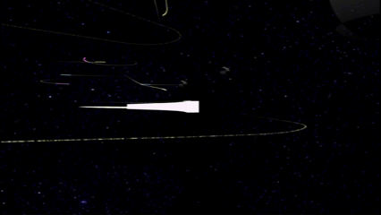
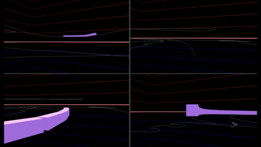
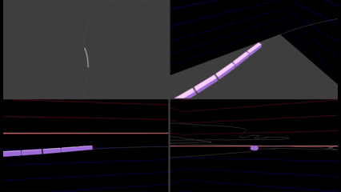
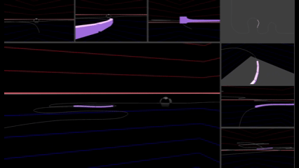
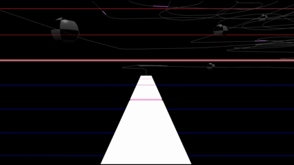
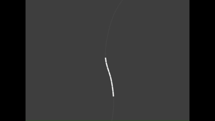
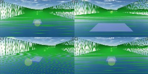
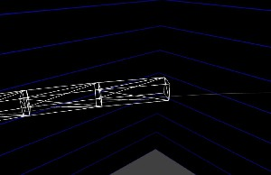
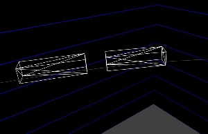
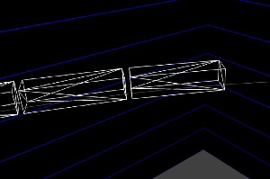

# Babylon.js：マルチカメラとビューポート分割（銀河鉄道デモ）

## この記事のスナップショット

  
*銀河鉄道*

https://playground.babylonjs.com/?BabylonToolkit#FTI4OC

（上記のURLにおいて、ツールバーの歯車マークから「EDITOR」のチェックを外せばウィンドウいっぱいに、歯車マークから「FULLSCREEN」を選べば画面いっぱいになります。）

[ソース](132/)

ローカルで動かす場合、上記ソースに加え、別途 git 内の [104/js](https://github.com/fnamuoo/webgl/tree/main/104/js) を ./js として配置してください。

## 概要

以前の記事で作成した列車表示
[Babylon.js ：Path3D上で複数メッシュを動かす](127.md)
を踏襲して、複数のラインを重ねた上で、凝ったカメラワークにチャレンジしてみました。

８種類のカメラワークとそれらを組み合わせた３種の計１１種のビューを作成してみました。

- CAM1: バードビュー（後方から遅いドローンで追跡）
- CAM2: ドライバーズビュー（運転席のビュー）
- CAM3: バードビュー（後方から固定位置で追跡）
- CAM4: 先行して前方から煽り見る
- CAM5: 上空からのトップビュー（方位固定）
- CAM6: バードビュー（並走）
- CAM7: バードビュー（一定速度で周回）
- CAM8: 定点カメラ
- ４画面：CAM1-CAM4を均等に４等分
- ４画面：CAM5-CAM8を均等に４等分
- ８画面：CAM1-CAM8をメイン（大）とサブ（小）×７に分割

ラインには 2025年度の 
[マイクロマウス](https://www.ntf.or.jp/entry/2025/RobotEnt01.php)
のロボトレース競技 のコースを使い、適当に高低差（アップダウン）を付けます。

被写体は列車っぽく、直方体を連続して配置し、ライン上を周回させます。

  
*４画面（CAM1-4）*

  
*４画面（CAM5-8）*

  
*８画面（CAM1-8）*

背景を天の川にして、軌跡をつけたら、銀河鉄道っぽくなりました。

  
*銀河鉄道*

ちなみに 
[Babylon.js Tips集](https://scrapbox.io/babylonjs/)
にも似たモノがあるので便乗して紹介だけしておきます。

- [列車を追随するカメラーワーク](https://scrapbox.io/babylonjs/%E5%88%97%E8%BB%8A%E3%82%92%E8%BF%BD%E9%9A%8F%E3%81%99%E3%82%8B%E3%82%AB%E3%83%A1%E3%83%A9%E3%83%BC%E3%83%AF%E3%83%BC%E3%82%AF)
- [水上都市（その２）](https://scrapbox.io/babylonjs/%E6%B0%B4%E4%B8%8A%E9%83%BD%E5%B8%82%EF%BC%88%E3%81%9D%E3%81%AE%EF%BC%92%EF%BC%89)
- [複数のカメラを同時に使ってみる](https://scrapbox.io/babylonjs/%E8%A4%87%E6%95%B0%E3%81%AE%E3%82%AB%E3%83%A1%E3%83%A9%E3%82%92%E5%90%8C%E6%99%82%E3%81%AB%E4%BD%BF%E3%81%A3%E3%81%A6%E3%81%BF%E3%82%8B)
- [コードでカメラワークを実現する例](https://scrapbox.io/babylonjs/%E3%82%B3%E3%83%BC%E3%83%89%E3%81%A7%E3%82%AB%E3%83%A1%E3%83%A9%E3%83%AF%E3%83%BC%E3%82%AF%E3%82%92%E5%AE%9F%E7%8F%BE%E3%81%99%E3%82%8B%E4%BE%8B)

## やったこと

- カメラをつくる
  - 速度に依存しないバードビュー（追跡カメラ）
  - 方向転換しないトップビュー
  - 定点カメラ
  - 画面分割（ビューポート分割）
- ラインをつくる
- 列車（メッシュ）を走らせる
  - ピッチ角を考慮した方向
  - 列車の調整
- 銀河鉄道にする

### カメラをつくる

カメラに関しては、過去にもいろいろ試作しています。

- 回転するメッシュを追跡するカメラ／ワイプ画面表示
  - [Babylon.js で物理演算(havok)：滑り台と複数カメラ](069.md)
- バードビューやドライバーズビュー、トップビュー／ワイプ画面表示
  - [Babylon.js で物理演算(havok)：カートレース](116.md)

ここでは、上記を踏襲しつつ、少し工夫を加えます。

#### 速度に依存しないバードビュー（追跡カメラ）

FollowCameraを使えば簡単にバードビュー／ドライバーズビュー／トップビューを実現できますが、
このカメラは、被写体の移動速度に依存するため、速かったり、遅かったりすると見え方が変わります。

今回、速い列車や遅い列車を追跡するため、速度に依存しないカメラにします。
そのため、被写体の位置および姿勢に対してカメラ位置を決定します。

回転する被写体に対して一定距離で追跡するカメラは
[Babylon.js で物理演算(havok)：滑り台と複数カメラ](069.md)
を作成していましたが、今回の被写体は回転しないので姿勢（クォータニオン）が利用できます。

姿勢と相対ベクトルからカメラ位置を決めることができますが、
後方に配置すれば追跡するバードビューにでき、
被写体のやや後ろに配置すればドライバーズビュー、
前方に配置すれば「先行して前から煽り見るビュー」になります。

使うカメラは FreeCamera です。render時に毎回計算して、カメラ位置を更新します。

```js
    let crCamera2 = function() {
        // バードビュー：対象(myMesh)との距離を一定に保つ（旋回する／短距離をすすむ） .. 速度非依存
        let _camera = new BABYLON.FreeCamera("Camera", new BABYLON.Vector3(0, 4, -10), scene);
        _camera.attachControl(canvas, true);
        _camera.inputs.clear(); // カーソルキーでカメラ操作させないようにする
        return _camera;
    }
    let renderCamera2 = function(camera_) {
        // 対象(myMesh)の姿勢／進行方向から固定位置 .. 後方から見下ろす
        let quat = myMesh.rotationQuaternion;
        let vdir = new BABYLON.Vector3(0, 0.8, 8);
        vdir = vdir.applyRotationQuaternion(quat);
        camera_.position = myMesh.position.add(vdir);
    }

    crCamera2();
    scene.onBeforeRenderObservable.add((scene) => {
            renderCamera2(camera);
    }
```

  
*バードビュー*


#### 方向転換しないトップビュー

方向転換するトップビュー（上空からのビュー）は
[Babylon.js で物理演算(havok)：カートレース](116.md)
で、作成しました。

このときは FollowCamera で上空から追跡するようにしました。

```js
            // トップビュー
            camera2 = new BABYLON.FollowCamera("FollowCam", new BABYLON.Vector3(0, 10, -10), scene);
            camera2.rotationOffset = 180;
            camera2.radius = 10;
            camera2.heightOffset = 130;
            camera2.cameraAcceleration = 0.05;
            camera2.maxCameraSpeed = 30;
```

今回は、方向転換せずに、方向を固定したままスライドさせます。

使うカメラは ArcRotateCamera で、
setTarget() に原点を指定、
lockedTarget に被写体を設定するだけです。

```js
    let crCamera5 = function() {
        // 上空から見下ろすトップビュー
        let _camera = new BABYLON.ArcRotateCamera("Camera", 0,0,0, new BABYLON.Vector3(0, 100,-0.01), scene);
        _camera.setTarget(BABYLON.Vector3.Zero());
        _camera.attachControl(canvas, true);
        return _camera;
    }
```

  
*方向固定のトップビュー*


#### 定点カメラ

定点カメラは、

> 特定の場所・角度を固定して24時間連続撮影を行うカメラで、防犯、河川水位・道路状況の監視、ライブ配信などに利用

されるものですが、

ここでは「定点カメラ」っぽい挙動になるよう、
被写体から一定距離にカメラ位置を配置（一定以上離れたら再配置）します。

使うカメラは FreeCamera です。

```js
    let crCamera8 = function() {
        // 定点カメラ / render でカメラ位置を再計算
        let _camera = new BABYLON.FreeCamera("Camera", new BABYLON.Vector3(0, 20, -10), scene);
        _camera.attachControl(canvas, true);
        _camera.inputs.clear(); // カーソルキーでカメラ操作させないようにする
        return _camera;
    }
```

render では毎回位置を確認し、離れすぎたときは再配置します。

カメラ位置は前もって「ベストなアングル」で座標値を決めて置いてもよいのですが、
手間がかかるし、ラインは多いし、お試し感覚なのでそこまで手間をかけたくないということで自動で算出させます。

位置を決める簡単な方法は、「被写体の前方に配置する」ですが、これは
カーブの外側（やたら離れた位置）に再配置される可能性が高いです。

臨場感あるカメラワークになるよう、被写体の前方位置を求めた後に、カメラをラインに寄せます。
具体的には、前方の位置からライン上の最近傍の点をもとめ、水平方向にずらした位置に再配置します。

```js
    let renderCamera8 = function(camera_) {
        const distSqMax = 11000;
        let distSq = BABYLON.Vector3.DistanceSquared(myMesh.position, camera_.position);
        if (distSq > distSqMax) {
            // 進行方向にカメラ位置を移動させる（カーブの外側に再配置される可能性が高い）
            let quat = myMesh.rotationQuaternion;
            let vdir = new BABYLON.Vector3(Math.random()*2-1, Math.random()*2+2, -100);
            vdir = vdir.applyRotationQuaternion(quat);
            // // camera_.position.copyFrom(myMesh.position.add(vdir));
            // 単純に（前方に一定距離）では、ラインから離れた位置になりがちなので、寄せるために近傍の点の周辺に再配置
            let p = myMesh.position.add(vdir);
            // 最近傍位置 ncp
            let rate = myMesh._path3d.getClosestPositionTo(p);
            let ncp = myMesh._path3d.getPointAt(rate);
            // ライン上から水平にずらすためのベクトル v2
            let v2 = vdir.normalize().cross(BABYLON.Vector3.Up());
            camera_.position.copyFrom(ncp.add(v2.scale(3)));
        }
    }
```

  
*定点カメラ*

#### 画面分割（ビューポート分割）

４画面は過去にも作り込んでました。特に紹介することはしていませんでしたが。
例えば、
[Babylon.js で物理演算(havok)：扇風機／UFOでレース](115.md)
の
[扇風機のデモ](https://playground.babylonjs.com/?inspectorv2=true?BabylonToolkit#8PB1WW)
で カメラ変更 "c" キー押下すれば確認できます。

  
*４分割例（昔の作品）*

同様に、今回も実装してみました。

  
*４分割例（１）*

  
*４分割例（２）*

４分割で複数のカメラを確認できるのは良いのですが、物足りなさもあります。

- 表示（１カメラあたり）が小さくなる
- せいぜい４つまで

そこで、ビデオ会議システムのように、メイン（大）とサブ（小）複数の配置で
８画面を作ってみます。


  
*８画面*

```js
//カメラ作成とビューポート分割
    var changeCamera = function(icamera) {
        if (icamera == 10) {
            for (let camera_ of cameralist) {
                camera_.dispose();
            }
            cameralist=[];
            cameralistView = [];
            cameralist.push(crCamera0())
            cameralist.push(crCamera1())
            cameralist.push(crCamera2())
            cameralist.push(crCamera3())
            cameralist.push(crCamera5())
            cameralist.push(crCamera6())
            cameralist.push(crCamera7())
            cameralist.push(crCamera8())
            // activeCameraをクリア
            while (scene.activeCameras.length > 0) {
                scene.activeCameras.pop();
            }
            // activeCameraを再設定
            for (let camera_ of cameralist) {
                scene.activeCameras.push(camera_);
            }
            changeViewportFor10(icamera10)
        }
    }

    // icamera=10時のviewport変更
    //   icamをメインに他をサブにする
    let changeViewportFor10 = function(icam) {
        cameralistView = [];
        cameralistView.push(cameralist[icam]);
        for (let i = 0; i < cameralist.length; ++i) {
            if (i == icam) {continue;}
            cameralistView.push(cameralist[i]);
        }
        // カメラ(大)
        cameralistView[0].viewport = new BABYLON.Viewport(0.0, 0.0, 0.745, 0.74); // 左下
        // カメラ(小)：左上から右上
        cameralistView[1].viewport = new BABYLON.Viewport(0.0, 0.75, 0.245, 0.25); // 左上
        cameralistView[2].viewport = new BABYLON.Viewport(0.25, 0.75, 0.245, 0.25);
        cameralistView[3].viewport = new BABYLON.Viewport(0.5 , 0.75, 0.245, 0.25);
        cameralistView[4].viewport = new BABYLON.Viewport(0.75, 0.75, 0.25, 0.25); // 右上
        // 右上から右下
        cameralistView[5].viewport = new BABYLON.Viewport(0.75, 0.50, 0.25, 0.24); // 右上
        cameralistView[6].viewport = new BABYLON.Viewport(0.75, 0.25, 0.25, 0.24);
        cameralistView[7].viewport = new BABYLON.Viewport(0.75, 0.0 , 0.25, 0.24); // 右下

```

上記コードではメイン・サブの切り替えを関数化（changeViewportFor10）しています。
メイン・サブ自体の切り替えも、カメラの viewport を書き換えるだけで簡単に表現できます。

また、viewport のサイズ指定では隙間なく並べるのではなく、やや隙間を設けてフレームがあるように配置しています。
ちなみにフレームの色は scene.clearColor で指定した色になっています。

```js
    scene.clearColor = BABYLON.Color4.FromColor3(BABYLON.Color3.FromHexString('#404040'))
```


### ラインをつくる

被写体を動かすための軌道、ラインを説明します。

画像からラインを作成するのですが、何度も紹介しているこちらの手法を使います。
[Babylon.js：画像からコース作り（１／２）](090.md)
ライン情報ができたら、適当に高さを付けます。
今回はラインを重ねる予定なので、ループや交差で重ならない程度にしておきます。
また、３次元の点列情報だけが必要でねじれは無視します。（ねじれに対する補正はしません）

### 列車（メッシュ）を走らせる

被写体に列車を使います。

ライン上で列車を動かすには
[Babylon.js ：Path3D上で複数メッシュを動かす](127.md)
で示した方法を踏襲します。
列車っぽくみせるために、上記中の台車を使った版を用います。

#### ピッチ角を考慮した方向

上記の方法の問題点として平面上での動作を前提としています。
今回実施する高低差のあるラインでは登りや下りで列車が水平なまま（ピッチ角が固定）で、
階段っぽくみえてしまいます。

そこで今回はピッチ角（仰角）を考慮した姿勢にします。
といっても前後の車両の位置ベクトルから方向ベクトルをつくり、さらにクォータニオンを作って設定するだけです。

原因はよくわかってないですが、lookAt を追加で設定しておくと
周回位置（スタートとエンドの切れ目）を通過する際の「姿勢のずれ（斜めに傾く現象）」が発生しなくなるので実施しておきます。

```js
                // 連続する2点の中間点を位置に、ベクトルから姿勢（方向）にする
                let p_ = dataTrainList[idx-1].p;
                let mesh = dataTrainList[idx-1].mesh;
                let pc = data.p.add(p_).scale(0.5);
                mesh.position.copyFrom(pc);
                let tangent = data.p.subtract(p_);
                // 進行方向に対する上方向を求める。外積を２回実施してtangentに垂直上向きのベクトルを求める
                let v1 = tangent.cross(BABYLON.Vector3.Up());
                let vU = v1.cross(tangent).normalize();
                // 方向ベクトルからクォータニオンを作成
                mesh.rotationQuaternion = BABYLON.Quaternion.FromLookDirectionLH(tangent, vU);
                mesh.lookAt(pc.add(tangent)); // 不要と思ったけど念のため（周回またぎで安定した!?）
```


#### 列車の調整

列車ぽくみせるために間隔調整が必要になります。

というのも Path3D上での位置指定は [0, 1]の範囲で行い、かつラインごとにPath3Dの全長が異なるので、
同じ長さで列車がつなげるには、目視による確認で調整する必要があると思ってましたが、
（この記事を書きながら）よくよく考えたら、関数で全長を取得できるので、そこからラインごとの補正を行えますね。

  
*調整前（車両が重なっているケース）*

  
*調整前（車両が空きすぎているケース）*

  
*調整後（程よく調整したケース）*

あと、ラインごとに車両の数や移動速度を指定できるように拡張しておきます。

### 銀河鉄道にする

もう少しだけ手を加ます。
現状が空中を動き回る感じなので、思い切って銀河鉄道っぽくします。

背景(skybox)を天の川にするだけでも雰囲気がでますが、更に列車の後ろに軌跡を付けます。
ラインが逆に邪魔／目立ってしまうので思い切って消すことにしました。

車両（メッシュ）にもこだわりたくなりますが、手間がかかりそうので一旦ここまでとします。

  
*銀河鉄道*

## まとめ・雑感

プラレール博覧会のCMを見たら、作ってみたくなりました。

個人的にはまずまずの出来と自負しています。
カメラワークが思いのほかよくできたので、逆に列車（四角メッシュ）の貧弱さが目立ってしまって残念な感じです。

カメラワークを操作できるだけでなく、追跡する列車を切り替えることもできます。
見るだけでなく操作もできるので、ちょっとは楽しめるかなと思います。

やっぱり「定点カメラ」はカメラ位置を自動計算するよりも、ベストショットな位置を求めておいて、
ハードコードで固定してしまった方がよかったかもです。
近くを通過する感じが思ったよりも迫力がある一方で、たまにズレた位置にあるのが残念に思います。

余談。  
ＡＩにレビューさせると「構成がよくない。カメラの説明から始めるべき」と言われ、構成を変えてみました。
ついつい作業順（「ライン作成」→「列車を動作」→「カメラ作成」→「銀河鉄道」）で説明したくなりますが、如何だったでしょうか。


------------------------------

前の記事：

次の記事：..


目次：[目次](000.md)

この記事には次の関連記事があります。

  - [Babylon.js で物理演算(havok)：滑り台と複数カメラ](069.md)
  - [Babylon.js：画像からコース作り（１／２）](090.md)
  - [Babylon.js で物理演算(havok)：扇風機／UFOでレース](115.md)
  - [Babylon.js で物理演算(havok)：カートレース](116.md)
  - [Babylon.js ：Path3D上で複数メッシュを動かす](127.md)


--
