# Babylon.js：ribbonメッシュで作る列車／車

## この記事のスナップショット

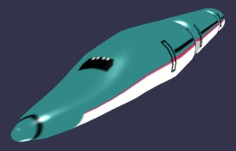  
*スナップショット*

https://playground.babylonjs.com/?BabylonToolkit#PZ1CBU

（上記のURLにおいて、ツールバーの歯車マークから「EDITOR」のチェックを外せばウィンドウいっぱいに、歯車マークから「FULLSCREEN」を選べば画面いっぱいになります。）

[ソース](133/)

ローカルで動かす場合、上記ソースに加え、別途 git 内の [104/js](https://github.com/fnamuoo/webgl/tree/main/104/js) を ./js として配置してください。

## 概要

過去、ribbon で
[Babylon.js で物理演算(havok)：門松／ししおどし](129.md)
を作った経験から、ＡＩに頼りながら列車や車を作ってみました。

ribbonは自由に整形できる平面ですが、筒のように丸めて、口を絞れば列車や車を作ることができます。
断面の位置情報を関数で作り、その断面をずらしながら立体を作ります。
例えるなら、１枚の鋼板を丸めたり、絞ったりすることで整形する「板金加工（ばんきんかこう）」や「塑性加工（そせいかこう）」に似た作り方をします。

おおざっぱに作っているので細かいディテールは無視し、テクスチャについても細かいデザインは求めないことにします。
プロが作るモデル／製品と比べるべくもありませんが、陳腐ながらそこそこのモノが出来たように思います。

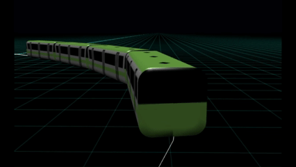  
*列車（丸角の四角柱）を動かす*

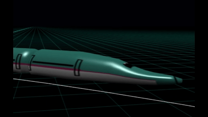  
*新幹線（その２）：試走*

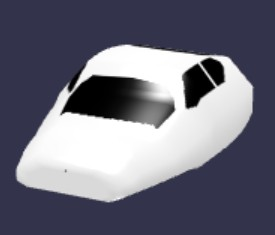  
*車メッシュ＋テクスチャ*

## やったこと

ＡＩに「 ribbonで〇〇な形状を作るには？」と尋ねると、好感触な答えが得られたので自信をもって進めてみました。
ただ得られるのはアイデア（数式）だったので、実際に作ってみて自分好みの調整を加えました。

そこから更にテクスチャを貼ることにもチャレンジしました。
思うように綺麗にできないとわかったので、割り切って、おおざっぱに色付けしました。

一方で、実際にメッシュ（列車）を動かして外観を確認しました。

ribbon で作る対象には、まず丸角の四角柱(RoundBox)から着手します。
新幹線についてＡＩに聞いてたら出来そうな感触だったので２番目に着手します。
その過程で車も作れると提案されたので、こちらも試しました。

- 列車（丸角の四角柱）
  - ＡＩに丸角の角柱のメッシュの作り方を聞いてみる
  - 丸角の四角柱を作ってみる
  - 丸角の四角柱にテクスチャを貼る
  - 列車（丸角の四角柱）を動かす
- 列車（新幹線）
  - ＡＩに新幹線のメッシュの作り方を聞いてみる
  - 新幹線を作ってみる
  - 新幹線にテクスチャを貼る
  - 新幹線を動かす
- 車
  - ＡＩに車のメッシュの作り方を聞いてみる
  - 車を作ってみる
  - 車にテクスチャを貼る

### 列車（丸角の角柱）

#### ＡＩに丸角の角柱のメッシュの作り方を聞いてみる

一回では回答にたどり着けなかったので、複数重ねてみました。

```prompt
- babylon.js で四角い円柱を作る方法は？
- 角の丸い柱状のメッシュを作る方法
```

ChatGPTの回答

> Babylon.js で **角の丸い柱状メッシュ（角丸柱 / rounded prism）**を作る方法はいくつかあります。用途によって適切な方法が変わります。
> 
> ---
> 
> # 方法1：`CreateCylinder` を多角形化（最も簡単）
> 
> 円柱の分割数を増やすことで、**角の丸い柱に近い形**を作れます。
> 
> ```javascript
> const pillar = BABYLON.MeshBuilder.CreateCylinder(
>     "pillar",
>     {
>         height: 5,
>         diameter: 2,
>         tessellation: 16
>     },
>     scene
> );
> ```
> 
> ### 特徴
> 
> * 計算が軽い
> * 角丸ではなく「円柱」
> 
> ```
> 上面
>    ○
> ```
> 
> ---
> 
> # 方法2：**角丸矩形を Extrude（実用的）**
> 
> 角丸四角形を作り、それを押し出します。
> 
> ```javascript
> function createRoundedRect(w, h, r, segments) {
>     const shape = [];
> 
>     const hw = w / 2 - r;
>     const hh = h / 2 - r;
> 
>     function arc(cx, cz, start, end) {
>         for (let i = 0; i <= segments; i++) {
>             const t = start + (end - start) * (i / segments);
>             shape.push(new BABYLON.Vector3(
>                 cx + r * Math.cos(t),
>                 0,
>                 cz + r * Math.sin(t)
>             ));
>         }
>     }
> 
>     arc(hw, hh, 0, Math.PI/2);
>     arc(-hw, hh, Math.PI/2, Math.PI);
>     arc(-hw, -hh, Math.PI, 3*Math.PI/2);
>     arc(hw, -hh, 3*Math.PI/2, 2*Math.PI);
> 
>     return shape;
> }
> 
> const shape = createRoundedRect(2,2,0.4,6);
> 
> const pillar = BABYLON.MeshBuilder.ExtrudePolygon(
>     "pillar",
>     {
>         shape: shape,
>         depth: 5
>     },
>     scene
> );
> ```
> 
> ### 特徴
> 
> * **本当の角丸柱**
> * 断面形状を自由に作れる
> * 建築物や柱に最適
> 
> ```
> 上面
> ╭───╮
> │   │
> ╰───╯
> ```
> 
> ---
> 
> # 方法3：`CreateBox` + `bevel`（角丸ボックス）
> 
> Babylon.js の `CreateBox` には **bevel（面取り）**があります。
> 
> ```javascript
> const pillar = BABYLON.MeshBuilder.CreateBox(
>     "pillar",
>     {
>         width:2,
>         depth:2,
>         height:5,
>         wrap:true
>     },
>     scene
> );
> ```
> 
> ただし **完全な角丸ではなく面取り**です。
> 
> ---
> 
> # 方法4：**Ribbonで作る（高度）**
> 
> 断面を作り、上下にコピーして Ribbon で接続します。
> 
> ```
> 断面
> ╭───╮
> │   │
> ╰───╯
>    ↓
> 押し出し
> ```
> 
> Ribbon は
> 
> * 新幹線
> * 車体
> * パイプ
> * 自由曲面
> 
> などでよく使われます。
> 
> ---
> 
> # 実務でよく使う方法
> 
> | 方法             | 用途            |
> | -------------- | ------------- |
> | Cylinder       | 円柱            |
> | ExtrudePolygon | **角丸柱（おすすめ）** |
> | Box + bevel    | 軽量            |
> | Ribbon         | 曲面・自由形状       |
> 
> ---
> 
> ## Babylon.jsで最もきれいに作れる方法
> 
> **角丸断面 + Extrude**
> 
> これが
> 
> * メッシュが綺麗
> * UV展開しやすい
> * 建物・柱・新幹線にも応用可能
> 
> ---
> 
> 希望があれば、さらに踏み込んで
> 
> * **Babylon.jsで「完全に滑らかな角丸柱」を作るアルゴリズム**
> * **GPU負荷を抑えた角丸柱生成**
> * **1行で作れるユーティリティ関数**
> 
> も解説できます。これはBabylon.jsでもかなり実用的なテクニックです。

ChatGPT の答えを見ながら納得しました。
確かに簡単に作るなら Extrude で十分ですね。

方法２の関数を使って、追試します。

```js
// サンプルの追試（ChatGPTの例）
// export var createScene = createScene_roundBox_0_ChatGPT; // サンプルの追試（ChatGPTの例）
    function createRoundedRect(w, h, r, segments) {
        const shape = [];
        const hw = w / 2 - r;
        const hh = h / 2 - r;
        function arc(cx, cz, start, end) {
            for (let i = 0; i <= segments; i++) {
                const t = start + (end - start) * (i / segments);
                shape.push(new BABYLON.Vector3(
                    cx + r * Math.cos(t),
                    0,
                    cz + r * Math.sin(t)
                ));
            }
        }
        arc(hw, hh, 0, Math.PI/2);
        arc(-hw, hh, Math.PI/2, Math.PI);
        arc(-hw, -hh, Math.PI, 3*Math.PI/2);
        arc(hw, -hh, 3*Math.PI/2, 2*Math.PI);
        return shape;
    }

    const shape = createRoundedRect(2,2,0.4,6);
    const mesh = BABYLON.MeshBuilder.ExtrudePolygon(
        "pillar",
        {
            shape: shape,
            depth: 5
        },
        scene
    );
```

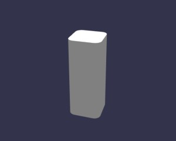  
*サンプルの追試（ChatGPTの例）*


上記は ExtrudePolygon の例でしたが、断面を任意の経路に沿ってつくるには ExtrudeShape を使います。

```js
// 断面をZ軸方向に動かす例
// export var createScene = createScene_roundBox_1; // ExtrudeShape
    function createRoundedRect(width, height, r, arcdiv) {
        // 角丸の四角
        // (円弧部分の除く) 直線部分の長さ
        const hw = width / 2 - r;
        const hh = height / 2 - r;
        let plist = [];

        let drawArc = function(cx, cy, r, rads, rade, arcdiv) {
            // 1/4の円弧作成
            let pplist = [];
            let radstep = (rade - rads) / arcdiv
            for (let i = 0; i <= arcdiv; i++) {
                let rad = rads + radstep*i;
                let p = new BABYLON.Vector3(cx + r * Math.cos(rad), cy + r * Math.sin(rad), 0);
                pplist.push(p);
            }
            return pplist;
        }

        plist = plist.concat(drawArc(hw, hh, r, R0, R90, arcdiv));
        plist = plist.concat(drawArc(-hw, hh, r, R90, R180, arcdiv));
        plist = plist.concat(drawArc(-hw, -hh, r, R180, R270, arcdiv));
        plist = plist.concat(drawArc(hw, -hh, r, R270, R360, arcdiv));
        // 先頭を末尾に追加して閉じる
        plist.push(plist[0]);
        return plist;
    }

    let sizew=2, sizeh=2, arcR=0.4, arcDiv=6, sizel=5;

    let plist = createRoundedRect(sizew, sizeh, arcR, arcDiv);
    let zpath = [
	new BABYLON.Vector3(0, 0, sizel/2),
	new BABYLON.Vector3(0, 0, -sizel/2),
    ];

    let mesh = BABYLON.MeshBuilder.ExtrudeShape("", {
        shape:plist, path:zpath,
        cap: BABYLON.Mesh.CAP_ALL,
        sideOrientation: BABYLON.Mesh.DOUBLESIDE,
    }, scene);
```

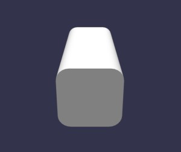  
*サンプルの改修(ExtrudeShapeの例)*

#### 丸角の四角柱を作ってみる

上述の断面の関数を応用し、ribbon で丸角の四角柱を作ってみます。

```js
// ribbon で角の丸い柱状のメッシュを作る方法
    function createRoundedRect(width, height, r, arcdiv, z) {
        // 角丸の四角
        // (円弧部分の除く) 直線部分の長さ
        const hw = width / 2 - r;
        const hh = height / 2 - r;
        let plist = [];

        let drawArc = function(cx, cy, r, rads, rade, arcdiv, z) {
            // 1/4の円弧作成
            let pplist = [];
            let radstep = (rade - rads) / arcdiv
            for (let i = 0; i <= arcdiv; i++) {
                let rad = rads + radstep*i;
                let p = new BABYLON.Vector3(cx + r * Math.cos(rad), cy + r * Math.sin(rad), z);
                pplist.push(p);
            }
            return pplist;
        }

        plist = plist.concat(drawArc(hw, hh, r, R0, R90, arcdiv, z));
        plist = plist.concat(drawArc(-hw, hh, r, R90, R180, arcdiv, z));
        plist = plist.concat(drawArc(-hw, -hh, r, R180, R270, arcdiv, z));
        plist = plist.concat(drawArc(hw, -hh, r, R270, R360, arcdiv, z));
        // 先頭を末尾に追加して閉じる
        plist.push(plist[0]);
        return plist;
    }

    let sizew=2, sizeh=2, arcR=0.4, arcDiv=6, sizel=5;
    let pplist = [], z;
    z = -sizel/2;
    pplist.push(createRoundedRect(sizew, sizeh, arcR, arcDiv, z));
    z = sizel/2;
    pplist.push(createRoundedRect(sizew, sizeh, arcR, arcDiv, z));

    let mesh = BABYLON.MeshBuilder.CreateRibbon("",{
        pathArray: pplist,
    },scene);
```

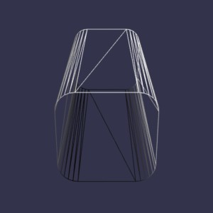  
*ribbonで作る丸角の四角柱*


#### 余談：全ての角・辺が丸い直方体

前述は、断面が垂直（平面）になっていますが、ここも丸くするには、Z軸方向に応じて丸みの半径を変更すれば可能です。
「全ての角・辺が丸い直方体」のことを、ここでは「ラウンド長方形」と呼称しておきます。

```js
// ribbonで作るラウンド長方形
    function createRoundedRect(width, height, r, arcdiv, z) {
        // 角丸の一面の点情報
        // (円弧部分の除く) 矩形部分の長さ/2
        const hw = width / 2 - r;
        const hh = height / 2 - r;
        let plist = [];
        let drawArc = function(cx, cy, r, rads, rade, arcdiv, z) {
            // 1/4の円弧作成
            let pplist = [];
            let radstep = (rade - rads) / arcdiv
            for (let i = 0; i <= arcdiv; i++) {
                let rad = rads + radstep*i;
                let p = new BABYLON.Vector3(cx + r * Math.cos(rad), cy + r * Math.sin(rad), z);
                pplist.push(p);
            }
            return pplist;
        }
        plist = plist.concat(drawArc(hw, hh, r, R0, R90, arcdiv, z));
        plist = plist.concat(drawArc(-hw, hh, r, R90, R180, arcdiv, z));
        plist = plist.concat(drawArc(-hw, -hh, r, R180, R270, arcdiv, z));
        plist = plist.concat(drawArc(hw, -hh, r, R270, R360, arcdiv, z));
        // 先頭を末尾に追加して閉じる
        plist.push(plist[0]);
        return plist;
    }

    let sizew=2, sizeh=2, arcR=0.4, arcDiv=6, sizel=5;

    let pplist = [];

    {
        let plist = [], z, n=(arcDiv+1)*4+1;
        z = -sizel/2-arcR;
        for (let i = 0; i < n; ++i) {
            plist.push(new BABYLON.Vector3(0, 0, z));
        }
        pplist.push(plist);
    }
    {
        let sizeBw=sizew-arcR*2, sizeBh=sizeh-arcR*2;
        let radstep = R90 / arcDiv;
        for (let i = 0; i <= arcDiv; ++i) {
            let rad = radstep*i;
            let vsin = Math.sin(rad);
            let vcos = Math.cos(rad);
            let arcR_ = arcR*vsin;
            let sizew_ = sizeBw+arcR_*2;
            let sizeh_ = sizeBw+arcR_*2;
            let z = -sizel/2-arcR*vcos;
            pplist.push(createRoundedRect(sizew_, sizeh_, arcR_, arcDiv, z));
        }
        for (let i = 0; i <= arcDiv; ++i) {
            let rad = radstep*i;
            let vsin = Math.sin(rad);
            let vcos = Math.cos(rad);
            let arcR_ = arcR*vcos;
            let sizew_ = sizeBw+arcR_*2;
            let sizeh_ = sizeBw+arcR_*2;
            let z = sizel/2+arcR*vsin;
            pplist.push(createRoundedRect(sizew_, sizeh_, arcR_, arcDiv, z));
        }
    }
    {
        let plist = [], z, n=(arcDiv+1)*4+1;
        z = sizel/2+arcR;
        for (let i = 0; i < n; ++i) {
            plist.push(new BABYLON.Vector3(0, 0, z));
        }
        pplist.push(plist);
    }

    let mesh = BABYLON.MeshBuilder.CreateRibbon("",{ pathArray: pplist, },scene);
```

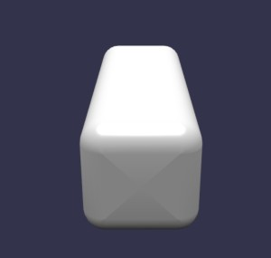  
*ribbonで作るラウンド長方形*

ちなみに同じような「ラウンド長方形」はフォーラムに記事があり、作成のアプローチが違うのですが紹介だけしておきます。

- [Texture Rounded Box](https://forum.babylonjs.com/t/texture-rounded-box/41264/9)
  - WillemCramer 氏
    -  https://playground.babylonjs.com/#XTNTF1#13
      - 球を変形して四角っぽくする手法
  - 作者不明
    - https://www.babylonjs-playground.com/#VKIXD8#136
      - 複数のメッシュを組み合わせ、結合するアプローチ

#### 丸角の四角柱にテクスチャを貼る

直方体(box)にテクスチャを貼るのはそう難しくありません。

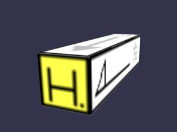  
*boxのテクスチャ確認/createScene_box_1*

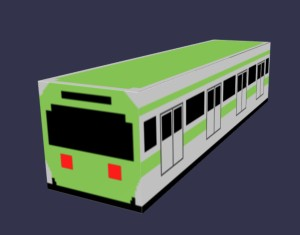  
*boxでのテクスチャ確認（山の手風）/createScene_box_2*

ところが「丸角の四角柱」にテクスチャを貼って、同じように列車ぽくするのは簡単ではありませんでした。

最初のつまづきは、テクスチャを貼る面の裏表が入れ替わったり、画像の上下左右が入れ替わったりすることでした。
原因は ribbon に渡す座標の並びに寄るものです。
この対応には座標の並びを逆順にするなどで回避できますが、
メッシュ作成時の裏表（sideOrientation）の指定や テクスチャの向き（uScale = -1）などを使っても回避できました。

次のつまづきは、一枚絵を立体に貼り付けることによる部分的な伸び・縮み・湾曲といった変化で、想定した位置に画像が張り付かないことでした。

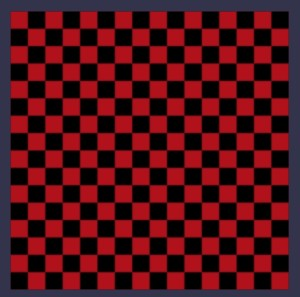  
*貼り付けた画像（市松模様）/createScene_roundBox_4_0*

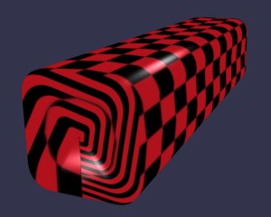  
*渦巻いてしまった模様/createScene_roundBox_4_1*

原因はよくわかってないですが extrude のメッシュでも同様な現象が起きていました。
試行錯誤の結果、
ribbon の筒状を「閉じた形状」にするために開始／終了を(0,0,z)位置を指定していましたが、
その点(0,0,z)位置を使わずに、(0,0,z)位置に寄せて細かく分割／刻むことで「渦巻く」ことはなくなりました。

```js
// 始点と終点付近の分割
    { // ４回に分割して、CAP(start側）を追加
        let pplist0 = pplist[0];
        z = sizel/2;
        for (let r of [0.75, 0.5, 0.25, 0.001]) {
            let plist = []
            for (let p of pplist0) {
                plist.push(new BABYLON.Vector3(p.x*r, p.y*r, z));
            }
            pplist.unshift(plist);
        }
    }
    { // ４回に分割して、CAP(end側)を追加
        let pplistE = pplist[pplist.length-1];
        z = -sizel/2;
        for (let r of [0.75, 0.5, 0.25, 0.001]) {
            let plist = []
            for (let p of pplistE) {
                plist.push(new BABYLON.Vector3(p.x*r, p.y*r, z));
            }
            pplist.push(plist);
        }
    }
```

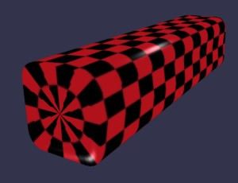  
*渦巻の対応：始点と終点付近の分割/createScene_roundBox_4_2*

また、どうしても直線になってほしいところで模様が歪んだり、ねじれたりすることがありました。
（上記の例で、長軸の中央部分を横断するラインがうねっていることが見て取れます。）
メッシュの分解能（刻み値）を増やしてメッシュ点を増やしたり、テクスチャの画像を大きくすることで歪みはだいぶ収まりましたが、それでも局所的に歪みが残っています。

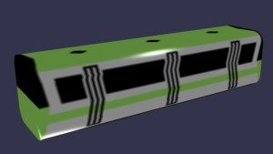  
*歪んだ模様/平底の RoundBox 筒を分割しないとき*

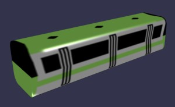  
*歪みが幾分改善した模様/平底の RoundBox 筒を10分割したとき*

一目瞭然ですが、中央の出入口はまっすぐですが、両脇の出入口は「＞」や「＜」に曲がってしまっています。

この辺が ribbon でつくっている限界かなと思います。
綺麗なテクスチャにしたいなら、メッシュを筒と蓋にわけた上でテクスチャを貼り付けた方がはるかに楽そうです。


#### 列車（丸角の四角柱）を動かす

せっかくなので、動かしてみます。

[Babylon.js ：Path3D上で複数メッシュを動かす](127.md)
の例を使って、周回させます。

  
*列車（丸角の四角柱）を動かす*

調子に乗って作った、ラッピング列車も紹介しちゃいます。
版権の都合で、大丈夫なやつ（[いらすとや](https://www.irasutoya.com/)さんから拝借）を紹介します。

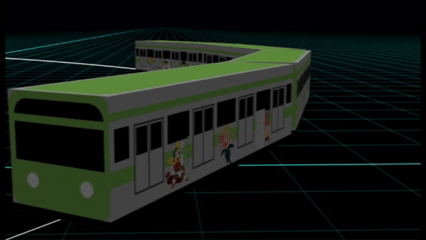  
*ラッピング列車*

https://playground.babylonjs.com/?BabylonToolkit#PZ1CBU#1

ちなみにラッピング列車は Box のみになります。
「丸角の四角柱」でラッピングさせようとすると、イラストが歪むので今回は見送りました。

### 列車（新幹線）

今回の本丸です。ちょっと難しいかもと予想して、先に「丸角の四角柱」（上述）で練習して問題点を洗い出しておきました。
結果、一番の課題であるテクスチャについて、複雑な模様は避け、簡素なデザインに終始し、多少おかしな点があっても目をつぶることにします。

#### ＡＩに新幹線のメッシュの作り方を聞いてみる

質問を重ねているので、少々長いです。

```prompt
babylon.js ribbon で新幹線の形状を表現するには？
```

ChatGPTの回答

> **Babylon.js の `Ribbon`** は「断面形状を**経路に沿って並べた点列**」からメッシュを生成するため、**新幹線のような流線形ボディ**を作る場合は次の構成にすると実装しやすいです。
> 
> ---
> 
> # 1. 基本方針（新幹線形状）
> 
> 新幹線は概ね次の構造になります。
> 
> ```
> [断面0]  →  [断面1]  →  [断面2]  →  ... → [断面N]
>   nose       nose        body          tail
> ```
> 
> Ribbonの `pathArray` に
> 
> ```
> pathArray = [
>   section0,
>   section1,
>   section2,
>   ...
> ]
> ```
> 
> を渡します。
> 
> 各 `section` は **同じ頂点数の輪郭**にします。
> 
> ---
> 
> # 2. 断面の設計
> 
> まず車体断面（楕円）を定義します。
> 
> ```javascript
> function createSection(radiusX, radiusY, z, n=16) {
>     let pts = [];
>     for (let i = 0; i < n; i++) {
>         let t = Math.PI * 2 * i / n;
>         let x = Math.cos(t) * radiusX;
>         let y = Math.sin(t) * radiusY;
>         pts.push(new BABYLON.Vector3(x, y, z));
>     }
>     return pts;
> }
> ```
> 
> ---
> 
> # 3. 新幹線のノーズ形状
> 
> ノーズは **断面半径を徐々に小さくする**ことで表現できます。
> 
> ```
> 半径
>   ^
>   |     body
>   |      ______
>   |     /
>   |    /
>   |   /
>   |  /
>   +-------------> z
>       nose
> ```
> 
> 例：
> 
> ```javascript
> let pathArray = [];
> 
> let length = 20;
> let sections = 40;
> 
> for (let i=0;i<sections;i++){
> 
>     let t = i/(sections-1);
>     let z = t * length;
> 
>     let r;
> 
>     if (t < 0.3) {
>         // ノーズ
>         r = 0.2 + 0.8 * Math.pow(t/0.3, 2);
>     }
>     else if (t < 0.9) {
>         // 車体
>         r = 1.0;
>     }
>     else {
>         // テール
>         let u = (t-0.9)/0.1;
>         r = 1.0*(1-u);
>     }
> 
>     pathArray.push(createSection(r*1.2, r*0.9, z));
> }
> ```
> 
> ---
> 
> # 4. Ribbon生成
> 
> ```javascript
> let mesh = BABYLON.MeshBuilder.CreateRibbon(
>     "shinkansen",
>     {
>         pathArray: pathArray,
>         closeArray: false,
>         closePath: true
>     },
>     scene
> );
> ```
> 
> `closePath:true`
> → 断面を閉じる
> 
> ---
> 
> # 5. より新幹線らしくする工夫
> 
> ## (1) ノーズを長くする
> 
> E5系などは **指数関数カーブ**が良いです。
> 
> ```
> r = pow(t,3)
> ```
> 
> ---
> 
> ## (2) 上下非対称
> 
> 実際の新幹線は
> 
> * 下側は平たい
> * 上側は丸い
> 
> なので
> 
> ```javascript
> y = Math.sin(t) * radiusY * (y>0 ? 1.2 : 0.6);
> ```
> 
> ---
> 
> ## (3) 側面のエッジ
> 
> 断面を楕円ではなく
> 
> ```
>    _____
>  /       \
> |         |
>  \_______/
> ```
> 
> のような **角付き断面**にする。
> 
> ---
> 
> # 6. 完成イメージ（断面）
> 
> ```
>      ○
>    ○   ○
>   ○     ○
>  ○       ○
>   ○     ○
>    ○   ○
>      ○
> ```
> 
> これを **z方向に40～80枚並べる**と綺麗になります。
> 
> ---
> 
> # 7. Ribbonの利点（新幹線モデル）
> 
> Ribbonは
> 
> * NURBS的な滑らかな形状
> * 頂点数制御
> * 動的生成
> 
> が可能なので
> 
> * 車両生成
> * LOD
> * procedural train
> 
> に向いています。
> 
> ---
> 
> # 8. 実務レベルの作り方（おすすめ）
> 
> 新幹線を最も綺麗に作る方法は
> 
> ```
> 断面曲線 × 中心Spline
> ```
> 
> です。
> 
> 手順
> 
> ```
> 1 車両中心Spline作成
> 2 Frenet frame作成
> 3 断面をSweep
> 4 Ribbon生成
> ```
> 
> これは **Sweep Surface** になります。
> 
> ---
> 
> もし希望があれば、
> **Babylon.jsで「リアルな新幹線ノーズ」を作るアルゴリズム（E5系レベル）**も解説できます。
> 
> これは実は **航空機のNURBSノーズと同じ数式**を使います。


```prompt
航空機のNURBSノーズの数式とは？
```

> 航空機のノーズ（機首）は、実務の形状設計では **NURBS 曲面（Non-Uniform Rational B-Spline surface）** あるいはそれに近い **スプライン回転体／スイープ曲面**で表現されます。
> 基本は **「軸方向プロファイル曲線」＋「断面曲線」**の2つで定義されます。
> 
> ---
> 
> # 1. NURBS曲線の基本式
> 
> NURBS曲線は次式です。
> 
> [
> C(u)=\frac{\sum_{i=0}^{n} N_{i,p}(u), w_i, P_i}
> {\sum_{i=0}^{n} N_{i,p}(u), w_i}
> ]
> 
> **意味**
> 
> | 記号           | 意味           |
> | ------------ | ------------ |
> | (P_i)        | 制御点          |
> | (w_i)        | 重み           |
> | (N_{i,p}(u)) | B-spline基底関数 |
> | (p)          | 次数           |
> | (u)          | パラメータ        |
> 
> ---
> 
> # 2. B-spline基底関数
> 
> 基底関数は再帰式です。
> 
> [
> N_{i,0}(u)=
> \begin{cases}
> 1 & t_i \le u < t_{i+1}\
> 0 & otherwise
> \end{cases}
> ]
> 
> [
> N_{i,p}(u)=
> \frac{u-t_i}{t_{i+p}-t_i}N_{i,p-1}(u)
> +
> \frac{t_{i+p+1}-u}{t_{i+p+1}-t_{i+1}}N_{i+1,p-1}(u)
> ]
> 
> ---
> 
> # 3. NURBS曲面（航空機ノーズ）
> 
> 機首は **曲面**なので
> 
> [
> S(u,v)=
> \frac{
> \sum_{i=0}^{n}\sum_{j=0}^{m}
> N_{i,p}(u)M_{j,q}(v)
> w_{ij}P_{ij}
> }{
> \sum_{i=0}^{n}\sum_{j=0}^{m}
> N_{i,p}(u)M_{j,q}(v)
> w_{ij}
> }
> ]
> 
> になります。
> 
> | 変数       | 意味    |
> | -------- | ----- |
> | (u)      | 機体軸方向 |
> | (v)      | 周方向   |
> | (P_{ij}) | 制御点格子 |
> 
> ---
> 
> # 4. 航空機ノーズの実用モデル
> 
> 航空機の機首は実際には **回転体に近い**ので
> 多くの場合
> 
> ```
> 半径 r(x)
> を定義して
> 回転体
> ```
> 
> にします。
> 
> つまり
> 
> [
> x = x
> ]
> 
> [
> y = r(x)\cos\theta
> ]
> 
> [
> z = r(x)\sin\theta
> ]
> 
> ---
> 
> # 5. ノーズ半径関数 r(x)
> 
> 航空機・新幹線・魚雷などのノーズは
> **von Kármán ogive** や **Haack series** がよく使われます。
> 
> ## Haack series（抗力最小）
> 
> [
> r(x) =
> R\sqrt{\frac{\theta - \sin(2\theta)/2}{\pi}}
> ]
> 
> [
> \theta = \cos^{-1}(1 - 2x/L)
> ]
> 
> | 変数  | 意味   |
> | --- | ---- |
> | (L) | ノーズ長 |
> | (R) | 最大半径 |
> | (x) | 軸位置  |
> 
> これは
> 
> * ロケット
> * 航空機レドーム
> * 弾体
> 
> でよく使われます。
> 
> ---
> 
> # 6. Von Kármán nose
> 
> より一般的なのはこちら。
> 
> [
> r(x)=R\sqrt{\frac{\theta - \sin\theta\cos\theta}{\pi/2}}
> ]
> 
> [
> \theta = \cos^{-1}(1-2x/L)
> ]
> 
> 特徴
> 
> * 抗力が小さい
> * 滑らかなノーズ
> 
> ---
> 
> # 7. 新幹線（E5系など）
> 
> 実際は
> 
> ```
> Haack nose
> +
> Bezier補正
> ```
> 
> のハイブリッドです。
> 
> 理由
> 
> * トンネル微気圧波
> * 車体接続
> 
> のため。
> 
> ---
> 
> # 8. Babylon.jsでの実装式
> 
> 半径関数だけ使えば良いです。
> 
> ```javascript
> function noseRadius(x, L, R){
> 
>     let theta = Math.acos(1 - 2*x/L);
> 
>     return R*Math.sqrt(
>         (theta - Math.sin(2*theta)/2) / Math.PI
>     );
> }
> ```
> 
> 断面生成
> 
> ```javascript
> for(let i=0;i<=n;i++){
> 
>     let x = L*i/n;
> 
>     let r = noseRadius(x,L,R);
> 
>     for(let j=0;j<m;j++){
> 
>         let t = 2*Math.PI*j/m;
> 
>         let y = r*Math.cos(t);
>         let z = r*Math.sin(t);
> 
>         pts.push(new BABYLON.Vector3(x,y,z));
>     }
> }
> ```
> 
> これを **Ribbon** に渡します。
> 
> ---
> 
> # 9. まとめ（設計階層）
> 
> 航空機ノーズは通常
> 
> ```
> Haack / Karman nose
>       ↓
> NURBS曲線近似
>       ↓
> NURBS surface
> ```
> 
> です。
> 
> ---
> 
> もし希望があれば、次の内容も説明できます。
> 
> * **新幹線E5/E7ノーズの数学モデル（かなり面白い）**
> * **Ribbonで作るリアルな新幹線アルゴリズム**
> * **3Dスイープ曲面（Frenet frame）実装**
> 
> 特に **新幹線ノーズは航空機より数学が面白い形状**になっています。


```prompt
Ribbonで作るリアルな新幹線アルゴリズムとは？
```

> Babylon.js の **Ribbon でリアルな新幹線形状**を作る場合、単純に「断面半径を縮小する」だけでは不十分です。実物の新幹線は次の特徴があります。
> 
> **形状特性**
> 
> 1. ノーズは **長い流線形（Haack / Kármán系）**
> 2. 断面は **楕円＋側面のフラット**
> 3. **上下非対称**
> 4. ノーズ途中で **断面形状が変化**
> 5. 車体は **ほぼ一定断面**
> 6. 先端は **C¹連続（曲率が滑らか）**
> 
> そのため Ribbon では次の **3段階アルゴリズム**で作るとリアルになります。
> 
> ---
> 
> # 1 アルゴリズム全体
> 
> ```
> 中心軸 x
>       │
>       │
>       └─→ nose radius function
>                │
>                └─→ cross section generator
>                          │
>                          └─→ Ribbon
> ```
> 
> 処理フロー
> 
> ```
> for x in nose_length
> 
>    r(x) = ノーズ半径関数
> 
>    section = 断面生成
> 
> pathArray.push(section)
> ```
> 
> ---
> 
> # 2 ノーズ半径関数（重要）
> 
> 最もリアルに見えるのは **Haack nose** です。
> 
> [
> r(x)=R\sqrt{\frac{\theta - \sin(2\theta)/2}{\pi}}
> ]
> 
> [
> \theta = \cos^{-1}(1-2x/L)
> ]
> 
> JS
> 
> ```javascript
> function haackRadius(x, L, R){
> 
>     let theta = Math.acos(1 - 2*x/L);
> 
>     return R*Math.sqrt(
>         (theta - Math.sin(2*theta)/2)/Math.PI
>     );
> }
> ```
> 
> ---
> 
> # 3 新幹線断面
> 
> 新幹線断面は単純な楕円ではありません。
> 
> 概形
> 
> ```
>       roof
>    _________
>  /           \
> |             |
> |             |
>  \___________/
>       floor
> ```
> 
> 特徴
> 
> * 上側丸い
> * 側面やや垂直
> * 底平たい
> 
> 断面生成
> 
> ```javascript
> function trainSection(r, x, n=24){
> 
>     let pts=[];
> 
>     for(let i=0;i<n;i++){
> 
>         let t = i/(n-1)*Math.PI*2;
> 
>         let cos = Math.cos(t);
>         let sin = Math.sin(t);
> 
>         let y = r * cos * 1.3;
>         let z = r * sin * 0.9;
> 
>         // 底を平らに
>         if(z < -0.4*r) z = -0.4*r;
> 
>         pts.push(new BABYLON.Vector3(x,y,z));
>     }
> 
>     return pts;
> }
> ```
> 
> ---
> 
> # 4 ノーズ断面変形
> 
> 実際の新幹線は **先端ほど断面が丸くなる**。
> 
> そのため断面スケールを変えます。
> 
> ```
> nose
>  ↓
> 丸い
>  ↓
> 楕円
>  ↓
> 車体断面
> ```
> 
> 係数
> 
> ```
> s(x) = (x/L)^0.7
> ```
> 
> ```javascript
> let scale = Math.pow(x/L,0.7);
> 
> let y = r * cos * (1.0 + 0.3*scale);
> let z = r * sin * (0.7 + 0.3*scale);
> ```
> 
> ---
> 
> # 5 Ribbon生成
> 
> ```javascript
> let pathArray = [];
> 
> let L = 15;      // ノーズ長
> let R = 1.6;     // 車体半径
> 
> let sections = 80;
> 
> for(let i=0;i<sections;i++){
> 
>     let x = L * i/(sections-1);
> 
>     let r = haackRadius(x,L,R);
> 
>     pathArray.push(trainSection(r,x));
> }
> 
> let mesh = BABYLON.MeshBuilder.CreateRibbon(
>     "train",
>     {
>         pathArray:pathArray,
>         closePath:true
>     },
>     scene
> );
> ```
> 
> ---
> 
> # 6 車体部分
> 
> ノーズの後ろは断面固定。
> 
> ```
> nose
>  ↓
> constant body
> ```
> 
> ```javascript
> for(let i=0;i<50;i++){
> 
>     let x = L + i*0.5;
> 
>     pathArray.push(trainSection(R,x));
> }
> ```
> 
> ---
> 
> # 7 テール
> 
> テールは単純な taper
> 
> ```
> r(x)=R(1-t)^2
> ```
> 
> ---
> 
> # 8 完成構造
> 
> ```
>         nose
>          │
>          │
>         body
>          │
>          │
>         tail
> ```
> 
> pathArray
> 
> ```
> [
>  nose sections
>  body sections
>  tail sections
> ]
> ```
> 
> ---
> 
> # 9 見た目を大きく改善する3つ
> 
> ### ① ノーズ長
> 
> ```
> L ≈ 車体高さ × 6～8
> ```
> 
> E5系
> 約 **15m**
> 
> ---
> 
> ### ② section数
> 
> ```
> nose 80
> body 20
> ```
> 
> ---
> 
> ### ③ 頂点数
> 
> ```
> cross section
> 24～32
> ```
> 
> ---
> 
> # 10 Ribbonで作るメリット
> 
> Ribbonは次が簡単です。
> 
> * プロシージャル生成
> * LOD生成
> * カーブ線路に追従
> * 車体長変更
> 
> 特に **Spline線路に沿った新幹線**が作りやすいです。
> 
> ---
> 
> もし興味があれば、さらに面白いテーマとして
> 
> **「RibbonでE5系の15mロングノーズをかなりリアルに再現するアルゴリズム」**
> 
> があります。
> 実はこれは **3つの数式を組み合わせる特殊モデル**で、かなり本物に近い形になります。


```prompt
「RibbonでE5系の15mロングノーズをかなりリアルに再現するアルゴリズム」とは？
```

> E5系の「15 mロングノーズ」は、単純な回転体ではなく **3つの異なる形状関数を組み合わせた複合スイープ面**として考えると、`Ribbon`でもかなりリアルに再現できます。
> 設計思想は以下です。
> 
> ```
> 先端 → Haack nose（流体抵抗最小）
> 中間 → spline blend（断面変形）
> 後半 → 車体断面へ遷移
> ```
> 
> つまり
> 
> ```
> r(x) + crossSection(x) + flatten(x)
> ```
> 
> の **3関数モデル**になります。
> 
> ---
> 
> # 1 アルゴリズム構造
> 
> ノーズ長
> 
> ```
> L = 15m
> ```
> 
> 軸方向パラメータ
> 
> ```
> u = x/L
> ```
> 
> 全体アルゴリズム
> 
> ```
> for each u
> 
>    r = noseRadius(u)
>    shape = crossSectionShape(u)
>    flat = bottomFlatten(u)
> 
>    section = buildSection(r,shape,flat)
> 
> Ribbon(pathArray)
> ```
> 
> ---
> 
> # 2 ノーズ半径（基本形）
> 
> E5系のベースは **Haack series** に近い形です。
> 
> [
> r(u)=R\sqrt{\frac{\theta-\sin(2\theta)/2}{\pi}}
> ]
> 
> [
> \theta=\cos^{-1}(1-2u)
> ]
> 
> JS
> 
> ```javascript
> function noseRadius(u,R){
> 
>     let theta = Math.acos(1-2*u);
> 
>     return R*Math.sqrt(
>         (theta - Math.sin(2*theta)/2)/Math.PI
>     );
> }
> ```
> 
> 特徴
> 
> ```
> 先端：細い
> 途中：急速に太くなる
> 後半：ゆるやか
> ```
> 
> ---
> 
> # 3 断面形状変形
> 
> E5は **先端ほど円形、後半ほど横長**です。
> 
> 断面楕円率
> 
> [
> e(u)=0.8 + 0.6u^{0.7}
> ]
> 
> ```
> u=0      円
> u=1      横長
> ```
> 
> JS
> 
> ```javascript
> function ellipseScale(u){
> 
>     return 0.8 + 0.6*Math.pow(u,0.7);
> 
> }
> ```
> 
> 断面
> 
> ```
> y = r * cos(t) * e(u)
> z = r * sin(t)
> ```
> 
> ---
> 
> # 4 底面フラット化
> 
> 新幹線は **下側が平ら**です。
> 
> フラット量
> 
> [
> f(u)=0.3u^2
> ]
> 
> ```
> 先端：丸い
> 後半：平面
> ```
> 
> JS
> 
> ```javascript
> function flatten(z,r,u){
> 
>     let limit = -r*(0.3*u*u);
> 
>     return Math.max(z,limit);
> 
> }
> ```
> 
> ---
> 
> # 5 断面生成
> 
> ```javascript
> function buildSection(x,u,R){
> 
>     let r = noseRadius(u,R);
> 
>     let e = ellipseScale(u);
> 
>     let n = 32;
> 
>     let pts=[];
> 
>     for(let i=0;i<n;i++){
> 
>         let t = 2*Math.PI*i/n;
> 
>         let y = r*Math.cos(t)*e;
>         let z = r*Math.sin(t);
> 
>         z = flatten(z,r,u);
> 
>         pts.push(new BABYLON.Vector3(x,y,z));
>     }
> 
>     return pts;
> }
> ```
> 
> ---
> 
> # 6 Ribbon生成
> 
> ```javascript
> let pathArray=[];
> 
> let L = 15;
> let R = 1.7;
> 
> let sections = 120;
> 
> for(let i=0;i<sections;i++){
> 
>     let u = i/(sections-1);
> 
>     let x = L*u;
> 
>     pathArray.push(
>         buildSection(x,u,R)
>     );
> 
> }
> 
> BABYLON.MeshBuilder.CreateRibbon(
>     "nose",
>     {
>         pathArray:pathArray,
>         closePath:true
>     },
>     scene
> );
> ```
> 
> ---
> 
> # 7 実際の見た目
> 
> 断面変化
> 
> ```
> 先端
>   ○
> 
> 途中
>   ◔
> 
> 後半
>  ______
> /      \
> ```
> 
> ---
> 
> # 8 E5っぽくする重要パラメータ
> 
> ### ノーズ長
> 
> ```
> L ≈ 15m
> ```
> 
> ### 車体半径
> 
> ```
> R ≈ 1.7
> ```
> 
> ### section数
> 
> ```
> 100～140
> ```
> 
> ---
> 
> # 9 さらにリアルにする方法
> 
> 実は E5 ノーズにはもう一つ特徴があります。
> 
> **中心線が微妙に下がる**
> 
> ```
> 横
> ───────
>     ＼
>      ＼
> ```
> 
> 式
> 
> [
> z_{offset}(u)=-0.4u^2
> ]
> 
> これを加えるとかなりE5っぽくなります。
> 
> ---
> 
> # 10 Ribbonモデルの構造
> 
> 最終的なモデル
> 
> ```
> Ribbon
>  ├ nose (15m)
>  ├ body
>  └ tail
> ```
> 
> ---
> 
> ## 補足（重要）
> 
> 実はE5ノーズは
> 
> ```
> 航空機ノーズ
> ＋
> イルカの頭部形状
> ```
> 
> に近い数理形状です。
> 
> そのため **流体最適化形状（CFD）** にかなり近い曲面になっています。
> 
> ---
> 
> 希望があれば次も説明できます。
> 
> **① Ribbonだけで「E5ノーズをかなりリアルにする完全アルゴリズム」
> （実際かなり本物に近くなる方法）**
> 
> **② 新幹線の線路カーブに沿って車体を生成する Ribbon スイープアルゴリズム**
> 
> これは **Babylon.jsで鉄道シミュレーションを作るときのコア技術**です。

上記を参考に、追試するとまったく印象の違う形状ができます。

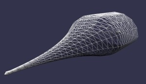  
*ChatGPTの例：その１*

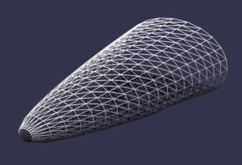  
*ChatGPTの例：その２*

#### 新幹線を作ってみる

前述で興味深い形状が出来たので、これら２つを改修しつつそれっぽく仕上げてみます。

まず最初の形状の「鋭いノーズ」の方は厚みを持たせます。
また、ノーズ後半の「筒状の絞り」を両端に配置した客室（中間に配置する車両）も作ります。

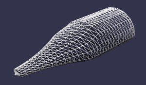  
*新幹線（その１の改造：先頭車両）*

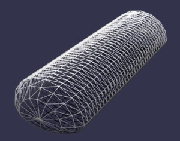  
*新幹線（その１の改造：客室車両）*


次の形状の「幅広な」形状の方は、両端をしぼりつつ、更にノーズを平たく、押し下げる感じにして、客室部分をつなげます。
また「その１」と同様に客室も作ります。


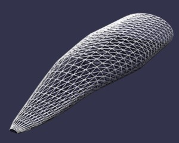  
*新幹線（その２の改造：先頭車両）*

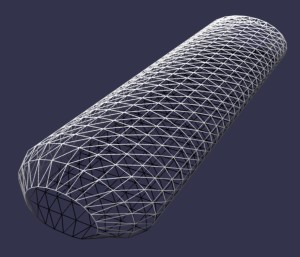  
*新幹線（その２の改造：客室車両）*

#### 新幹線にテクスチャを貼る

「新幹線 500系」「新幹線の E5系」を参考に色付けして、テクスチャを貼ってみましたが、新幹線とは別物です。
まぁメッシュ形状が違うから似てないのですがｗ。雰囲気だけでも出てたら御の字です。

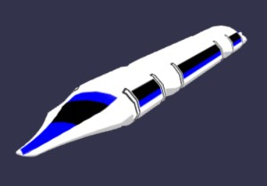  
*新幹線（その１）＋テクスチャ*

  
*新幹線（その２）＋テクスチャ*


#### 新幹線を動かす

例のごとく、こちらも動かしてみます。
「動く」というだけでよいですね。

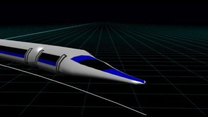  
*新幹線（その１）：試走*

  
*新幹線（その２）：試走*

### 車

質問の履歴のせいか、生成ＡＩが「車の作りかた」を提案してきたので、聞いてました。

#### ＡＩに車のメッシュの作り方を聞いてみる

```prompt
babylon.js の ribbon で車のメッシュを作る方法は？
```

> Babylon.js の **Ribbon メッシュ**は「断面ラインの集合」をつなぐことで自由曲面を作る仕組みです。
> 車のような形状は **「車体中心線 + 断面形状」** から生成すると作りやすくなります。
> 
> 以下では **Ribbonで車体を作る基本アルゴリズム**を整理します。
> 
> ---
> 
> # 1. Ribbonの基本構造
> 
> Ribbonは **pathArray（複数のパス）** を渡して作ります。
> 
> ```javascript
> BABYLON.MeshBuilder.CreateRibbon("ribbon", {
>     pathArray: paths,
>     closeArray: false,
>     closePath: false
> }, scene);
> ```
> 
> ```
> paths = [
>   path0,
>   path1,
>   path2,
>   ...
> ]
> ```
> 
> 各 path は
> 
> ```
> [x,y,z] の点列
> ```
> 
> です。
> 
> Ribbonは
> 
> ```
> path0[i]  ───── path1[i]
>   │            │
> path0[i+1] ─ path1[i+1]
> ```
> 
> という四角形を並べて面を作ります。
> 
> ---
> 
> # 2. 車メッシュの基本発想
> 
> 車を Ribbon で作る場合は
> 
> **車の前→後ろ方向の断面を並べる**
> 
> のが最も自然です。
> 
> ```
> 車の長さ方向
> ↓
> 
> path0  フロント
> path1
> path2
> path3
> path4
> path5  リア
> ```
> 
> 各 path は
> 
> ```
> 左 → 屋根 → 右
> ```
> 
> の断面になります。
> 
> 例
> 
> ```
>       roof
>        ▲
> left ◀─┼─▶ right
>        ▼
>      bottom
> ```
> 
> ---
> 
> # 3. 車の断面の作り方
> 
> 断面は例えば6点程度で十分です。
> 
> ```
>     roof
>      ●
>    ●   ●
>   ●     ●
>    ●   ●
>      ●
> ```
> 
> コード例
> 
> ```javascript
> function createSection(z, width, height) {
> 
>     return [
>         new BABYLON.Vector3(-width, 0, z),
>         new BABYLON.Vector3(-width, height*0.5, z),
>         new BABYLON.Vector3(-width*0.6, height, z),
>         new BABYLON.Vector3(width*0.6, height, z),
>         new BABYLON.Vector3(width, height*0.5, z),
>         new BABYLON.Vector3(width, 0, z)
>     ];
> }
> ```
> 
> ---
> 
> # 4. 車の形状（長さ方向）
> 
> 車は
> 
> ```
> フロント  → 膨らむ → キャビン → 絞る → リア
> ```
> 
> なので
> 
> ```
> width(z)
> height(z)
> ```
> 
> を変化させます。
> 
> 例
> 
> ```javascript
> let paths = [];
> let length = 6;
> 
> for (let i=0;i<=20;i++) {
> 
>     let t = i/20;
>     let z = length*(t-0.5);
> 
>     let width =
>         0.8 + 0.5*Math.sin(Math.PI*t);
> 
>     let height =
>         0.6 + 0.7*Math.sin(Math.PI*t);
> 
>     paths.push(createSection(z,width,height));
> }
> ```
> 
> ---
> 
> # 5. Ribbon生成
> 
> ```javascript
> let car = BABYLON.MeshBuilder.CreateRibbon("car",{
>     pathArray: paths,
>     closePath:false,
>     closeArray:false
> },scene);
> ```
> 
> ---
> 
> # 6. 車の形状をリアルにするテクニック
> 
> ### ① ノーズを尖らせる
> 
> ```
> width *= sin(πt)
> ```
> 
> ### ② キャビンを作る
> 
> ```
> height += cabin(t)
> ```
> 
> ### ③ テールを絞る
> 
> ```
> width *= (1 - t^2)
> ```
> 
> ---
> 
> # 7. 車メッシュの構造（おすすめ）
> 
> 実際の車は **3つのRibbonに分けると綺麗**です。
> 
> ```
> ① 左ボディ
> ② 右ボディ
> ③ 屋根
> ```
> 
> 理由
> 
> * 法線が安定
> * UVが作りやすい
> * 窓を作りやすい
> 
> ---
> 
> # 8. Ribbonで作る車の典型構造
> 
> ```
>          roof ribbon
>       ┌─────────────┐
>      /               \
>  left ribbon     right ribbon
>      |               |
>      └─────────────┘
>            bottom
> ```
> 
> ---
> 
> # 9. Ribbon車メッシュ生成アルゴリズム
> 
> 実務的には次の手順です。
> 
> ```
> 1 車の中心パス作成
> 2 各位置で断面を計算
> 3 断面点列を paths に追加
> 4 Ribbon生成
> 5 ミラー
> 6 ホイール追加
> ```
> 
> ---
> 
> # 10. Ribbonで車を作るメリット
> 
> メリット
> 
> * 頂点数が少ない
> * プロシージャル生成できる
> * パラメータ車生成が可能
> 
> 用途
> 
> ```
> ゲーム
> 交通シミュレーション
> AI生成車
> ```
> 
> ---
> 
> # もし希望があれば
> 
> 次も解説できます。
> 
> * **Ribbonでリアルな車を作る完全コード（300行程度）**
> * **Ribbonでスポーツカーを作る数式**
> * **Ribbonで新幹線・航空機ノーズを作る方法**（実は同じアルゴリズム）
> 
> 特に **「Ribbonで車を作るプロ向けアルゴリズム」** は
> かなり面白いので必要なら解説します。

調子のよいことを言ってますが、サンプルコードを追試してみると、個性的な車でした。

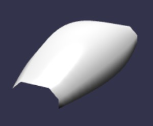  
*生成ＡＩの車*

６つの断面の点で作るアイデアは非常に面白いのですが、
出来上がったメッシュを見て、車と呼ぶセンスは自分にはないです。

#### 車を作ってみる

せっかくなので前述の例をいじってより車っぽくします。

- 「前後で対称な形」を「後方に山がある」ようにずらす
- ボンネット部分に該当する箇所を凹ませる

これだけでより車っぽくなりました。

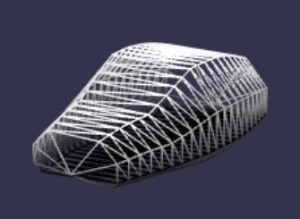  
*車っぽくしたribbonメッシュ*

#### 車にテクスチャを貼る

難産でした。
正直、窓の部分も無視して単色で色を塗りたいところですが、出来る限りの感じでやってみました。

  
*車メッシュ＋テクスチャ*

## まとめ・雑感

モチベのコントロールに苦心しました。
メッシュの作成は比較的苦心しながら進みましたが、テクスチャを貼る段階では何度諦めようかと思ったことか。
一旦リセットして、確実にクリアできるはずの直方体にテクスチャからやり直したはずが思ったより手間取りました。
ちょっと面白くなってラッピング電車を作ったら思いのほか盛り上がってしまって、最後までやりとおせました。
大切ですね、脱線というか気持ちの切り替え。
そして深く突き詰めたいところと見切りをつけて諦めるところの見極め、バランスが難しいですね。

今回 ribbonの可能性を示せたかもしれませんが、
間違っても ribbon にこだわって、関数をガリガリいじったり、テクスチャを手動で頑張ることはお勧めしません。
沼にハマります。ここに時間をかけるくらいなら、専用のツール・アプリを使ってデザインするのが良いです。

上記メッシュの売りは軽量ってことですかね。頂点数と画像ファイルのサイズは以下の通りです。

mesh                        | 頂点数（座標値の数）| 画像ファイルのサイズ
----------------------------|---------------------|---------------------
丸角の列車                  | 627                 | 583 [byte]
新幹線（その１）・先頭車両  | 476                 | 431 [byte]
新幹線（その１）・客車車両  | 493                 | 413 [byte]
新幹線（その２）・先頭車両  | 700                 | 473 [byte]
新幹線（その２）・客車車両  | 700                 | 441 [byte]
車                          | 348                 | 1.30 [KB]


ちなみにプロフェッショナルなモデルだとこんな感じ。もっとも、こちらは内装なども含まれる場合があるので一概に比較するのは良くないと思いますが、まぁ目安として。

- [高速鉄道新幹線500 3Dモデル](https://free3d.com/ja/3d-model/high-speed-train-shinkansen-500-4199.html)
  - 585,093 node
  - 39 MB (.obj)

- [高速列車新幹線E5系 3Dモデル](https://free3d.com/ja/3d-model/high-speed-train-shinkansen-e5-series-7685.html)
  - 189,401 node
  - 4 MB (.obj)

またこの記事をＡＩにレビューさせたら、

- RibbonのUV問題の説明が不足
  - テクスチャの歪みは UV座標系と断面距離（ユークリッド座標系？）がズレるときに発生する
  - mesh.setVerticesData() で解決できる
- Ribbonの本質は 'Sweep Surface' なので下記を説明するとよい
  - "center curve" + "Frenet frame" + "cross section"

なんて言われますが、気になる方は上記キーワードで調べてみてください。
正直そこまで理解していないし、説明する気もないです。
プロフェッショナルなら気にすべきところかもしれませんが、趣味やっている範疇なので勘弁してください。

最後に１つ、プロがつくる場合の過程はこんな感じです。
[モデリング the 新幹線　E7系/W7系編#1](https://note.com/asncreate/n/n61001f3d43e2)
なんか、熱量というか意気込みが段違いですｗ


------------------------------

前の記事：[Babylon.js：マルチカメラとビューポート分割（銀河鉄道デモ）](132.md)

次の記事：[Babylon.js：ミー散乱と奇岩で山霞をつくる](134.md)


目次：[目次](000.md)

この記事には次の関連記事があります。

- [Babylon.js で物理演算(havok)：門松／ししおどし](129.md)
- [Babylon.js ：Path3D上で複数メッシュを動かす](127.md)

--
