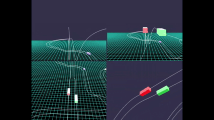
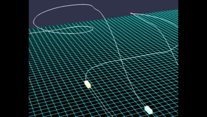
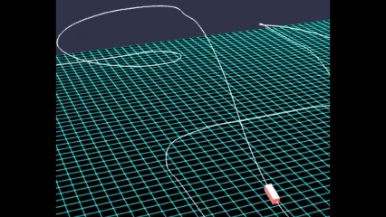
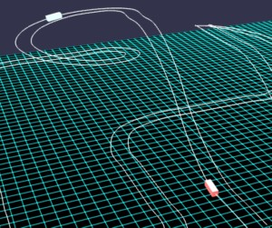
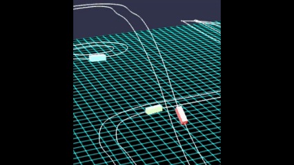
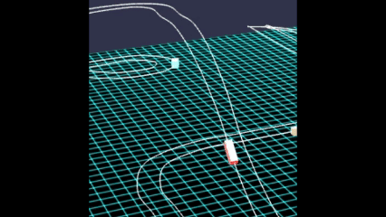

# Babylon.js：Path3D 上のメッシュの動きに変化をつける試作

## この記事のスナップショット

  
*スクリーンショット*

https://playground.babylonjs.com/?BabylonToolkit#TMQHIU

（上記のURLにおいて、ツールバーの歯車マークから「EDITOR」のチェックを外せばウィンドウいっぱいに、歯車マークから「FULLSCREEN」を選べば画面いっぱいになります。）

[ソース](135/)

ローカルで動かす場合、上記ソースに加え、別途 git 内の [104/js](https://github.com/fnamuoo/webgl/tree/main/104/js) を ./js として配置してください。

## 概要

過去、

[Babylon.js ：Path3D上で複数メッシュを動かす](127.md)

では、等速で動かしていました。

[Babylon.js：マルチカメラとビューポート分割（銀河鉄道デモ）](132.md)

でも、アップダウンあるにもかかわらず、等速でした。

そこで、

[Babylon.js で物理演算(havok)：チューブの中で玉を転がす](130.md)

で使ったローラーコースターのコースを使い、坂の傾斜に合わせてメッシュを加速・減速させてみたり、キー操作で変更できるようにしたり、
ラインを２つにして追い越し車線を設けてみました。

坂の傾斜に応じて加速・減速するようになって、物理モデルを使わずにより自然な挙動になりました。
また対象のメッシュの加速・減速やラインの変更をキー操作で出来るようになって、
「車線変更で追い越し」するゲームっぽくなりました。

もうちょっと作り込めばゲームとしての体裁が整うと思いますが、一旦ここまでとしておきます。

## やったこと
減
- 坂の傾斜に合わせて加速・減速させる
- キー操作で加速・減速
- ラインを複数にしてみる
- ライン変更をさせてみる
- カメラ・ビューを切り替える

### 坂の傾斜に合わせて加速・減速させる

render時のmeshの姿勢から勾配（ピッチ角／仰角・伏角）を取得できます。
この角度に応じて移動速度を変化させることで、「登りで減速、下りで加速」といった物理現象を再現できます。
実際にやってみるとリアルっぽくなったので、より深掘りしていきます。

```js
// render時に加速・減速する仕組み
scene.onBeforeRenderObservable.add(() => {
    dataMesh.forEach((data) => {
        let idx = data.idx;
        // path3d 上を移動
        data.r += data.v;
        if (data.r >= 1) data.r -= 1; // 周回したら、引き戻す
        data.pold.copyFrom(data.p);
        data.mesh.position.copyFrom(path3d.getPointAt(data.r));
        data.p.copyFrom(data.mesh.position);
        let vec = data.p.subtract(data.pold).normalize();
        // 進行方向(接線方向)に対する上方向(主法線)を求める
        let vB = vec.cross(BABYLON.Vector3.Up()); // 従法線
        let vN = vB.cross(vec).normalize(); // 主法線
        // 方向ベクトルからクォータニオンを作成
        data.mesh.rotationQuaternion = BABYLON.Quaternion.FromLookDirectionLH(vec, vN);
        data.mesh.lookAt(data.p.add(vec));
        // vecの仰角に応じて v を変化させる：疑似重力モデル
        let vecXZ = Math.sqrt((vec.x)**2 + (vec.z)**2);
        let rad = Math.atan(vec.y/vecXZ);
        const a = 0.00003;
        data.v += a*Math.sin(-rad);
        if (vec.y >= 0) {
            data.v = Math.max(data.v, data.vmin);
        } else {
            data.v = Math.min(data.v, data.vmax);
        }
    });
})
```

  
*等速の場合（２倍速）*

  
*坂の傾斜で加速・減速する場合（２倍速）*

### キー操作で加速・減速

見ているだけだと少々物足りない。操作できる方が楽しいので、特定のメッシュについてキー操作で加速・減速できるようにします。
キー操作をトリガーにしてメッシュの速度を変更します。
ちょっとだけゲームっぽくなり楽しくなりました。

```js
//キー処理
scene.onKeyboardObservable.add((kbInfo) => {
    switch (kbInfo.type) {
    case BABYLON.KeyboardEventTypes.KEYDOWN:
        if (kbInfo.event.key === 'w') {
            dataMesh[0].v += 0.0001;
            dataMesh[0].v = Math.min(dataMesh[0].v, dataMesh[0].vmax);
        }
        if (kbInfo.event.key === 's') {
            dataMesh[0].v -= 0.0001;
            dataMesh[0].v = Math.max(dataMesh[0].v, dataMesh[0].vmin);
        }
    }
});
```

### ラインを複数にしてみる

１本ラインだと追い越し時にメッシュが重なるのでいまいちな感じです。
そこでラインを複数（２本）にします。

新規にラインを作るのは面倒なので、既存のライン情報（３次元の点列）を使い、複数ラインにします。
隣接する２点から進行方向がわかるので、垂直方向と外積から従法線（外向き・内向き）のベクトルが計算できます。
ラインに沿って少し内側、少し外側の点列を抜き出してラインを作ります。

複数ラインなので、片方（右側）を追い越し車線として、すこし速めに移動させます。

```js
//複数ラインの作り方
// 複数ラインを作る
let path3dlist = [];
let dlist = [0.7, -0.7];
let nline = dlist.length;
{
    let plist = getCourseData(0);
    const catmullRom = BABYLON.Curve3.CreateCatmullRomSpline(plist, 10, true);//closed
    const plist2 = catmullRom.getPoints();
    let n_ = plist2.length-1;
    for (let d of dlist) {
        let plist3 = [], p1, p2;
        for (let i = 0; i < n_; ++i) {
            p1 = plist2[i];
            p2 = plist2[i+1];
            let vec = p2.subtract(p1).normalize(); // 法線方向
            let vB = vec.cross(BABYLON.Vector3.Up()); // 従法線
            let p = p1.add(vB.scale(d));
            plist3.push(p);
        }
        // plist2 の 始点と終点が同じ座標なので、plist3で終点を再度追加する
        plist3.push(plist3[plist3.length-1]);
        let meshC = BABYLON.MeshBuilder.CreateLines("lines", {points: plist3}, scene);
        let path3d = new BABYLON.Path3D(plist3);
        path3dlist.push(path3d);
    }
}
```

  
*複数ライン*


### ライン変更をさせてみる

せっかく複数のラインがあるので、メッシュでラインを変更／隣のラインに移れるようにします。
今は単純にラインフラグだけを切り替え、瞬間移動させます。

試作した結果、ライン切り替え時に位置が前後することがわかりました。
２つのラインにおいて、同じパーセンテージの位置をみると必ずしも真横に位置しているとは限らない為です。
なので、ライン切り替え時に、移動前ラインの現在位置から、移動先ラインの最近傍のパーセンテージを取り直して、
ライン切り替え時の違和感（移動時のズレ）をなくします。

```js
//ライン切り替え時の処理(パーセンテージの再取得)
scene.onKeyboardObservable.add((kbInfo) => {
    switch (kbInfo.type) {
    case BABYLON.KeyboardEventTypes.KEYDOWN:
        // ライン変更
        if (kbInfo.event.key === 'd') {
            let iline_ = dataMesh[0].iline;
            dataMesh[0].iline = Math.min(dataMesh[0].iline+1, nline-1);
            if (iline_ != dataMesh[0].iline) {
                // ライン変更時に位置がズレるので最近傍の点で位置を再取得する
                let p = path3dlist[iline_].getPointAt(dataMesh[0].r);
                let rate = path3dlist[dataMesh[0].iline].getClosestPositionTo(p);
                dataMesh[0].r = rate;
                // console.log("dataMesh[0].iline=",dataMesh[0].iline);
            }
        }
        if (kbInfo.event.key === 'a') {
            let iline_ = dataMesh[0].iline;
            dataMesh[0].iline = Math.max(dataMesh[0].iline-1, 0);
            if (iline_ != dataMesh[0].iline) {
                // ライン変更時に位置がズレるので最近傍の点で位置を再取得する
                let p = path3dlist[iline_].getPointAt(dataMesh[0].r);
                let rate = path3dlist[dataMesh[0].iline].getClosestPositionTo(p);
                dataMesh[0].r = rate;
                // console.log("dataMesh[0].v=",dataMesh[0].v);
            }
        }
    }
});
```

  
*ライン切り替え（修正前：違和感／移動時のズレあり）*

  
*ライン切り替え（修正後：移動時のズレ調整）*

### カメラ・ビューを切り替える

- [Babylon.js：マルチカメラとビューポート分割（銀河鉄道デモ）](132.md)

での経験を生かし、ここでのカメラワークを流用して下記カメラを設けました。

- ドライバーズビュー
- バードビュー（後ろから）
- バードビュー（並走）
- 定点カメラ

  
*４カメ*

## まとめ・雑感

Path3Dでの動きを「等速」ではなく「坂の傾斜で加速・減速で変化」させたらどうなるかとの思い付きから試作してみたら、
思いのほかリアルっぽくなったので深掘りしてみました。
ただロールは無視しているので、垂直なままです。
なので、ローラーコースターのコースなのに、動きがそれっぽくない（傾いていない）のが難点でしょうか。

また、ラインを２本にして、移動可能にした試みはレースゲームっぽくなり面白い出来でした。
簡単操作（ライン変更）で「追い抜き」が楽しめるのはよい感じです。


------------------------------

前の記事：[Babylon.js：ミー散乱と奇岩で山霞をつくる](134.md)

次の記事：[Babylon.js：鉄道模型のレイアウト作成にチャレンジ](136.md)


目次：[目次](000.md)

この記事には次の関連記事があります。

- [Babylon.js ：Path3D上で複数メッシュを動かす](127.md)
- [Babylon.js で物理演算(havok)：チューブの中で玉を転がす](130.md)
- [Babylon.js：マルチカメラとビューポート分割（銀河鉄道デモ）](132.md)

--
