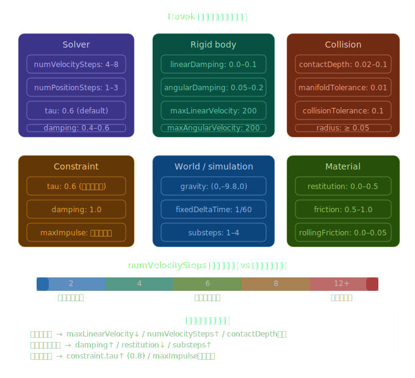

# Babylon.js で物理演算(havok)：テオ・ヤンセン機構で歩かせてみる

## この記事のスナップショット


*メッシュで再現した様子*


*歩行する様子（１６倍速）*

https://playground.babylonjs.com/?BabylonToolkit#01UY0Y

:::message
上記のURLにおいて、ツールバーの歯車マークから「EDITOR」のチェックを外せばウィンドウいっぱいに、歯車マークから「FULLSCREEN」を選べば画面いっぱいになります。
:::

## ソース

https://github.com/fnamuoo/webgl/blob/main/137

:::message
ローカルで動かす場合、上記ソースに加え、別途 git 内の [104/js](https://github.com/fnamuoo/webgl/tree/main/136/js) を ./js として配置してください。
:::

## 概要

テオ・ヤンセン機構(Theo Jansen mechanism)を Babylon.js の物理演算モデル(havok)で再現し、歩かせてみました。

失敗談をはさみながら、どのように作り上げていったかを説明します。
なお、歩行実験では上手くいったケース・条件をお見せしますが、非常にゆっくり動かしています。
素早く動かすことには成功していません。

題材はちょっと古いですが、「リンク機構シミュレーション」にチャレンジするお題として面白そうだったので選んだ次第です。ソースコードが公開されているし、検索すれば「作ってみた」系の動画もごろごろ見つかります。博物館に展示され、学校の教材にもなっている代物なので、いまさら詳細を説明する必要もないと思います。

機械工学は知らないけど、物理学ならまぁそこそこ知識がある人間がチャレンジしているので、細かい点は目をつぶっていただけると幸いです。内容的に薄い感じもしますが、着手して１週間ほど経過しました。振り返りつつ記事にすることで、課題を整理、解決策を見出すことを目論んでいます。少々お付き合いいただければと存じます。

参考資料

- [テオヤンセン機構](https://opeo.jp/library/onepoint/others/applied_calculation/theo_jansen/)
- [テオ・ヤンセン機構をHTML5 Canvasでアニメーションに](https://roomba.hatenablog.com/entry/2015/02/25/133951)

## やったこと

- メッシュのみで動きを再現
- 物理演算で動きを再現（１脚のみ）
- 物理演算で動きを再現（多脚）
- 歩かせてみる

### メッシュのみで動きを再現

最初に試行したことは、
「フレームを適当な位置に配置して、物理的制約constraintで接続させて動かす」
ことを行いました。実際に動かしてみると暴れまわるような動きになりました。


*フレームが暴れまわる様子*

初心者みたいで恥ずかしい限りですが、厳密に座標計算して配置せずに、適当に配置してしまうとこのような動きになるのは当然のことでした。
改めて、参考資料 [テオ・ヤンセン機構をHTML5 Canvasでアニメーションに](https://roomba.hatenablog.com/entry/2015/02/25/133951) にあるソースコードを参考に、数学的に、厳密な位置を計算することからやりなおします。

まずはメッシュ（座標位置）だけで再現してみます。


*メッシュで再現した様子*

ちなみに位置計算を関数化してしまえば、位相をずらして重ねたり、Y軸対象で反対側に配置するのはそう難しくありません。


*メッシュ（複数位相とY軸対称*

### 物理演算で動きを再現（１脚のみ）

上述で初期位置を厳密に求める方法が確立できました。これをもとにフレームを配置して、ヒンジ(HingeConstraint)で接続します。ヒンジは「ドアの開閉」のように回転軸で固定して動く機構ですが、ここでは画面に対して垂直、フレームを配置している面に対して垂直な軸を回転軸とします。

またこの時点で厚みや衝突は考えたくないので、フレーム同士の衝突は考えない／無視するようにしておきます。なのでフレームは薄く板状にしておきます。

ちなみに力点／駆動点（赤のメッシュ）となるフレームを動かす際、座標値を直接指定して動かすと、表示メッシュと物理形状とズレが生じるようです。


*メッシュと物理形状がズレている様子*

「力」でフレームを動かせば、表示メッシュと物理形状のズレは解消され、一致・同期した動きになります。


*メッシュと物理形状が一致している様子*

構造的に３点で結合している箇所は「動かない」固定されたフレーム（トラス構造）になるので、三角のメッシュに置き換えて１つにまとめます。これにより構造を簡単に／処理を軽くします。


*三角メッシュを使った版*

しばらく動きを見ていると気づくのですが、力点が等速の回転運動になっていない、足先の動きがぎこちない、ことがわかります。このときは「まぁこんな動きなのかな。まぁなんとかなるかな」程度の認識でした。
今なら、他のフレーム（足先）の動きが影響して、力点に作用して動きを阻害していたのだろうと予想できます。簡単な対処法としては、力点側の質量を大きくすればよいと思われます。あと、動きに対する摩擦(friction, damping)が無いために慣性が強く働いている気もします。

### 物理演算で動きを再現（多脚）

メッシュで「複数位相とY軸対称」を表示したときと同じように、物理形状＋ヒンジで構成します。
固定点となる位置には各位相（奥行方向の層）をつなぐ１つの直方体（基盤メッシュ）を用意しておきます。力点のメッシュ（回転メッシュ）は最終的に円筒形に変更するとして、今は直方体で代用しておきます。

念のため、無重力で、力点を動かさない状態で、フレームを配置し、無駄に動かないこと（座標値を間違えたり、接続がおかしかったらこの時点で動いてしまう）を確認して、さらに力点を動かして脚が動くことを確認します。このとき固定点となるメッシュは(mass=0)として空中に固定しておきます。


*物理演算で多脚*

ところが、更に脚を増やしてみると動きがぎこちなくなります。


*脚が多くてぎこちない様子（２倍速）*

バランスが悪く、対称性が崩れているせいかとも思い、奥行方向に対称になるように位相を調整してみましたが、改善されませんでした。


*対称にしてみた様子*


*対称にしたけどぎこちない様子（２倍速）*

いずれの場合も、基盤メッシュ上で安定して回転するはずの回転メッシュが、相対位置および回転軸がずれてしまっています。基盤メッシュと回転メッシュのヒンジが１か所のみのせいかと思って、複数設置しても改善しません。

そして気づいたのが、上記で示した「足先からの作用」です。
回転メッシュの質量を大きくし、回転dampingを大きく（念のため線形dampingも設定）することで、回転メッシュが安定して回転するようになりました。


*安定して動く様子*

脚のフレームの摩擦(damping)も設定した方が（慣性を打ち消す意味で）よいのかもしれませんが、今は設定していません。

#### 生成ＡＩレビュー

後日生成ＡＩにレビューさせたところ、興味深い知見が得られたので共有しておきます。

この問題は「Havok特有の挙動」であるらしく、下記理由から多リンクでは誤差が累積しやすいみたいです。

- iterative solver（逐次解法）
- constraint誤差を許容

つまり、今回の問題は

「モデルの問題」ではなく「ソルバの限界」

の可能性が高いとのことでした。
そして、直感的に「質量を増やす」ことで安定しましたが、安定した理由も下記だからと説明してくれました。

- 慣性モーメント増大
- 外乱トルクの影響低減
- solver収束改善

物理エンジンの中身を知らないので、上記解説がどれくらい的を得ているかわかりませんがご参考までに。

### 歩かせてみる

重力を軽減(1/5)したうえで、基盤メッシュを固定状態(mass=0)から、移動可能(mass=1)にします。落下したはずみで転倒しないよう、できるだけ足先ぎりぎりの位置に床を配置します。

回転メッシュを止めた状態で、上手く起立してくれました。


*起立した様子*

回転メッシュを動かしてみると、滑っているのか前に進まない様子だったので、床と足先に摩擦(friction)や、回転速度（回転にかかる力）を調整しました。
回転が速いと前脚が持ち上がってしまうので、そうならない程度に抑えたら、のんびりした動きになりました（まるで深海生物のように）

時間がかかりますが、前に進むことは確認できたので、一旦ここまでとします。


*歩行する様子（１６倍速）*

もっと素早く動かすとなると、下記項目を再考し、それらに関するパラメータを調整する必要がありそうです。実際に触るともっと他の面も見えてくるかもしれませんが、まずはここまで。

- 質量（浮き上がらないように、回転メッシュを安定させるよう）
- 摩擦（床をもっと効率的にとらえるよう、慣性の動きを抑えるよう）
- 前後の脚の距離、対称な動き（動きを安定させるため）

## まとめ・雑感

「テオ・ヤンセン機構」を使ってダイオウグソクムシのような模型に発展できればと夢見ていましたが、少々骨がありすぎました。

リンク機構の物理シミュレーションを行う場合、次のことに気を付けなくてはならないようです。
素人が何講釈しているんだって感じではありますが（汗）

- 機構を構成するメッシュの配置は正確に
  - 適当に不正確な位置に配置して、制約条件(constraint)をつけると破綻します（予期せぬ動き、暴れたように動きます）
- 質量は軽ければよいというものではない
  - 力を加えているのに動かないときは、質量を軽くして様子をみるということをよくやりますが、力点が含まれている場合はその質量にも配慮すべきです。
  - 力点の質量が軽いと、作用点からのフィードバックが悪影響して、力点が予期しない動きをすることがあります。
- 動きを制限する機構は必要かも
  - 機構が大きく動きすぎないよう、可動する範囲・角度に制限を付けるなり、摩擦で減衰させるなりの処理は考えるべきかもです。ただし、摩擦が大きいと動きが鈍く緩慢になるので塩梅が難しくなりますが。

ちょっと、 [507 Mechanical Movements](http://507movements.com/) を参考に追試して知見を深めようかと思ったり思わなかったりｗ

## おまけ：Havokで安定させる具体パラメータ設計

生成ＡＩが「Havokで安定させる具体パラメータ設計」を提案してきたので、その回答を添付しておきます。真偽のほどが確認できないので、複数の生成ＡＩで確認しました。参考になれば幸いです。

```text
#prompt
Havokで安定させる具体パラメータ設計
```

::::details ChatGPTの回答
> 「Havokで安定させる具体パラメータ設計」は、単なる“値調整”ではなく、**拘束解法（constraint solver）と力学モデルの両方を前提にした設計問題**です。
> テオヤンセン機構のような**多リンク＋閉ループ＋接触あり系**では、次の4層で整理すると精度良く詰められます。
> 
> ---
> 
> # 1. 前提：なぜ不安定になるのか（設計視点）
> 
> Havok Physics の内部は：
> 
> * 逐次反復型ソルバ（iterative solver）
> * 拘束を“近似的に満たす”
> * 時間離散（Δt依存）
> 
> そのため不安定化の原因はほぼこの3つに集約されます：
> 
> ### (A) 拘束過多・閉ループ誤差
> 
> → 誤差が蓄積して振動・発散
> 
> ### (B) インピーダンス不整合
> 
> → 軽いリンクが重いリンクに振り回される
> 
> ### (C) 接触＋摩擦の非線形性
> 
> → スティックスリップ（ガタつき）
> 
> ---
> 
> # 2. 設計の基本戦略（結論）
> 
> 重要なのはこの3つです：
> 
> ### ① 駆動系を「強く」する（高インピーダンス化）
> 
> * 回転軸（クランク）を重く
> * 高damping
> 
> ### ② 従動系を「軽く」する
> 
> * 脚・リンクは軽量
> 
> ### ③ 接触系は「滑らないが暴れない」
> 
> * 摩擦は中程度＋減衰
> 
> ---
> 
> # 3. 具体パラメータ設計（実用値レンジ）
> 
> 以下は**Babylon.js + Havok想定の実戦値**です。
> 
> ---
> 
> ## (1) 質量設計（最重要）
> 
> ### 推奨比率
> 
> ```
> クランク（駆動） : 1.0
> 主要フレーム     : 0.3 ～ 0.5
> 脚リンク         : 0.05 ～ 0.2
> 足先             : 0.05
> ```
> 
> ### 意図
> 
> * 駆動側を重く → 外乱（脚）に負けない
> * 末端を軽く → 数値振動を減らす
> 
> ---
> 
> ## (2) 慣性テンソル（見落とされがち）
> 
> **ポイント：回転軸方向の慣性を大きく**
> 
> * 細長いbox → 不安定になりやすい
> * → cylinder or inertia override推奨
> 
> 効果：
> 
> * 回転軸のブレ防止
> * solver収束安定化
> 
> ---
> 
> ## (3) damping（減衰）
> 
> ### 推奨値
> 
> | 部位   | linear damping | angular damping |
> | ---- | -------------- | --------------- |
> | クランク | 0.05～0.2       | **0.3～1.0（重要）** |
> | フレーム | 0.05～0.2       | 0.1～0.3         |
> | 脚    | 0.1～0.3        | 0.2～0.5         |
> 
> ### 解釈
> 
> * angular damping = 擬似摩擦トルク
> * 高すぎる → 動かない
> * 低すぎる → 発散
> 
> ---
> 
> ## (4) Constraint設定（Hinge）
> 
> ### 必須調整項目
> 
> * pivot位置：**厳密一致（誤差NG）**
> * axis：正規化＆一致
> 
> ### 推奨
> 
> * motor使用（角速度制御）
> * max impulse制限
> 
> ```
> motor speed: 0.5 ～ 2.0 rad/s
> max impulse: 中程度（暴れ防止）
> ```
> 
> ---
> 
> ## (5) 摩擦（Friction）
> 
> ### 推奨値
> 
> | 接触      | friction      |
> | ------- | ------------- |
> | 足先 - 地面 | **0.8 ～ 1.5** |
> | その他     | 0.2 ～ 0.5     |
> 
> ### 注意
> 
> * 高すぎ → 引っかかる
> * 低すぎ → 滑る
> 
> ---
> 
> ## (6) 重力スケール
> 
> 記事でも使われている重要テクニック：
> 
> ```
> gravity scale: 0.2 ～ 0.5
> ```
> 
> 効果：
> 
> * 接触安定
> * 転倒防止
> * solver負荷軽減
> 
> ---
> 
> ## (7) タイムステップ（超重要）
> 
> ```
> dt = 1/60 → 不安定になりやすい
> dt = 1/120 or 1/240 推奨
> ```
> 
> または：
> 
> * substep増加（Babylon設定）
> 
> ---
> 
> # 4. 実践チューニング手順（重要）
> 
> 順序を間違えると収束しません。
> 
> ---
> 
> ## STEP 1：無重力で拘束確認
> 
> * 何も動かないことを確認
> * → これで90%決まる
> 
> ---
> 
> ## STEP 2：1脚のみ駆動
> 
> * クランク回転が安定するか
> 
> ---
> 
> ## STEP 3：質量調整
> 
> * クランクを重く
> * 脚を軽く
> 
> ---
> 
> ## STEP 4：damping調整
> 
> * まずクランクのangular damping
> * 次に脚
> 
> ---
> 
> ## STEP 5：摩擦追加
> 
> * 足先のみ強く
> 
> ---
> 
> ## STEP 6：重力ON
> 
> * 徐々に増やす
> 
> ---
> 
> # 5. よくあるNGパターン
> 
> ### ❌ 座標で動かす
> 
> → 物理破綻
> 
> ---
> 
> ### ❌ 全部同じ質量
> 
> → フィードバックで崩壊
> 
> ---
> 
> ### ❌ dampingゼロ
> 
> → 永遠に振動
> 
> ---
> 
> ### ❌ ヒンジ軸が微妙にズレている
> 
> → 爆発的発散
> 
> ---
> 
> ### ❌ 脚が重すぎる
> 
> → クランクが負ける
> 
> ---
> 
> # 6. 本質まとめ
> 
> Havokで安定させるとは：
> 
> > **「拘束誤差を増幅させない力学構造を設計すること」**
> 
> 数式的には：
> 
> * 誤差 ε を
> * 次ステップで増幅しないようにする
> 
> そのための手段が：
> 
> * 質量分布（インピーダンス設計）
> * 減衰（エネルギー散逸）
> * 摩擦（接触安定）
> * 時間刻み（数値安定）
> 
> です。
> 
> ---
> 
> # 7. 一段上の最適化（発展）
> 
> さらに詰めるなら：
> 
> * Baumgarte stabilization調整
> * ERP/CFM的パラメータ（エンジン依存）
> * constraint iteration数増加
> * inverse kinematics併用
> 
> ---
> 
> 必要なら、
> Babylon.jsコードレベルで「安定するテンプレ構成」も提示できます。
::::

::::details Geminiの回答
> Havokをはじめとする物理エンジンで、オブジェクトがガタガタ震えたり（ジッター）、突然吹き飛んだりする現象（爆発）を抑え、挙動を安定させるのはゲーム開発の永遠の課題ですよね。オブジェクトが亜空間に吸い込まれていく切なさは、開発者なら誰しも通る道です。
> 
> Havokで物理シミュレーションを安定させるための、**具体的かつ実践的なパラメータ設計**を整理しました。
> 
> -----
> 
> ## 💡 安定化のための「3大原則」パラメータ
> 
> Havokの安定化において、最も効果が高く、まず調整すべき基本パラメータです。
> 
> ### 1\. タイムステップ（Time Step）
> 
> 物理演算の更新頻度です。ここをケチるとすべてが破綻します。
> 
>   * **推奨値:** `1/60s` (0.0166s) 以下。格闘ゲームや高速なレーシング、複雑なラグドールを扱う場合は `1/120s` (0.0083s) やサブステップ（内部での細分化実行）の検討を強く推奨します。
> 
> ### 2\. ソルバー・イテレーション（Solver Iterations）
> 
> 拘束（Constraint）や衝突の解決のために、1フレーム内で何回計算を反復するかという値です。
> 
>   * **推奨値:** デフォルト（4～8程度）から、不安定な場合は **15～25** に引き上げます。
>   * **効果:** ジョイントの伸びや、積み上げられたオブジェクトの崩壊を防ぎます。
> 
> ### 3\. 質量比（Mass Ratio）の制限
> 
> これはパラメータというより「設計ルール」ですが、**親子関係や拘束関係にあるオブジェクト同士の質量比を 1:10（最大でも1:20）以内に収めてください。**
> 
>   * **NG例:** 質量1000の巨大な親オブジェクトに、質量1の小物を固定する ➔ 計算の丸め誤差でジョイントが荒ぶり、吹き飛びます。
> 
> -----
> 
> ## 🛠️ 具体的なパラメータ設計シート
> 
> Havokの代表的なコンポーネントにおける、安定化のためのパラメータ設定例です。
> 
> | パラメータ名 (概念) | デフォルト / 一般値 | 安定化のための推奨設定 | 役割と注意点 |
> | :--- | :--- | :--- | :--- |
> | **Linear Damping**<br>(移動減衰) | `0.0` | **`0.05` ～ `0.1`** | 空気抵抗のようなもの。微小な振動（ジッター）を吸収してピタッと止めます。 |
> | **Angular Damping**<br>(回転減衰) | `0.05` | **`0.1` ～ `0.5`** | 回転に対するブレーキ。これが `0` だと、オブジェクトが永遠に回り続け、挙動が破綻しやすくなります。 |
> | **Deactivation / Sleep Threshold**<br>(スリープ閾値) | 低め | **高めに設定** | 速度がこの値を下回ったら物理演算をオフにする。止まっているはずの床の上の箱がガタガタ動くのを防ぐ最強の味方。 |
> | **Constraint Tau**<br>(拘束の硬さ) | `0.6` 前後 | **`0.3` ～ `0.8`** | 拘束（ジョイント）が引き離された時、どれだけ強く引き戻すか。値を上げすぎると逆にバネのように振動して爆発します。 |
> | **Constraint Damping**<br>(拘束の減衰) | `1.0` | **高めに調整** | ジョイントの振動を抑え、滑らかに動かします。Tauとのバランスが重要です。 |
> | **Collision Tolerance**<br>(衝突の許容めり込み量) | 極小 | **適切に広げる** | オブジェクト同士の「めり込み」をどこまで許すか。小さすぎると、毎フレーム激しい反発が起きてガタつきます。 |
> 
> -----
> 
> ## ⚠️ 見落としがちなチェックポイント
> 
> パラメータをいくらいじっても直らない場合、以下の「物理の法則」を無視していないか確認してみてください。
> 
> 1.  **慣性テンソル（Inertia Tensor）の不正:**
>     オブジェクトの形状に対して、慣性テンソル（回転のしにくさ）が極端に小さく設定されていると、ほんの少しの力で超高速回転して消し飛びます。Havokの自動計算（形状から算出）を利用するか、手動で設定する場合は安全のために少し大きめの値に「水増し」するのがコツです。
> 2.  **メッシュの薄さ:**
>     ペラペラの壁や床は、高速で動くオブジェクトに簡単に貫通されます。貫通した瞬間、Havokは「押し戻さなきゃ！」と巨大な力を発生させるため、爆発の原因になります。コリジョン（当たり判定）には、ある程度の**厚み**を持たせてください。
> 3.  **スケールの極端な違い:**
>     1cmの極小オブジェクトと、100mの超巨大オブジェクトを同じ物理空間でリアルタイムに干渉させると、浮動小数点の精度問題でガタつきやすくなります。
> 
> -----
> 
> Havokの調整は、CPU負荷と安定性のトレードオフのバランス取りです。
> 
> 今回は一般的な安定化のアプローチをご紹介しましたが、**現在どのようなシチュエーション（例：キャラクターのラグドール、車のサスペンション、大量のオブジェクトの破壊など）で不安定になっていますか？**
> 
> 状況を教えていただければ、さらにそのケースに特化したピンポイントなパラメータ調整のアドバイスができます！
::::

::::details Claudeの回答
> Havokの安定化に関わる具体的なパラメータ設計について説明します。Havokにおける安定化パラメータについて、主要なカテゴリと具体的な数値設計を解説します。
>
> 
>
> ## 各カテゴリの解説
> 
> ### Solver（ソルバー）
> 反復回数が安定性の根幹です。`numVelocitySteps` を 4～8 に設定するのが実用的な出発点で、スタック・ラグドールなど物体が密集する場面では 8 以上に上げます。`numPositionSteps` は 1～2 で十分なことが多く、増やしすぎると慣性感が損なわれます。
> 
> ```cpp
> hkpWorldCinfo worldInfo;
> worldInfo.m_solverIterations = 8;        // numVelocitySteps
> worldInfo.m_solverMicrosteps = 1;        // substep内反復
> worldInfo.m_gravity.set(0.f, -9.8f, 0.f);
> ```
> 
> ### Rigid body（剛体）
> `linearDamping` は 0.0～0.1 の小さい値を維持します。大きくすると動きが不自然になります。速度上限 (`maxLinearVelocity`) はデフォルト 200 m/s ですが、小スケールのシミュレーションでは 50～100 に絞ると爆発を防げます。
> 
> ### Collision（衝突）
> `contactDepth`（侵入深度の許容量）は 0.02～0.05 が安定域です。小さすぎると接触点が不安定になり、大きすぎるとめり込みが目立ちます。凸形状の `convexRadius` を 0.05 以上確保することで接触点の揺らぎを抑制できます。
> 
> ### Constraint（ジョイント）
> `tau` は制約の復元力で、0.6 がデフォルト。ラグドールでは 0.3～0.5 に下げることで柔らかい挙動に、剛体的な関節は 0.8～1.0 にします。`maxImpulse` を適切に制限することでジョイント破綻を防ぎます。
> 
> ### 安定化の優先順位
> 
> 1. `fixedDeltaTime` を固定（可変ステップは不安定の元凶）
> 2. `numVelocitySteps` を最初に調整
> 3. `contactDepth` と `convexRadius` を形状サイズに合わせてスケール
> 4. `damping` で余振を吸収
> 5. `restitution` を 0.5 以下に抑える（1.0 は原則禁止）
> 
> 特定のシーン（ラグドール・車両・布・大量オブジェクト）に合わせた具体的な数値が必要であれば、教えてください。
::::

::::details perplexityの回答
> Havokで安定させるなら、まず **固定タイムステップ、十分なソルバー反復、線形/角速度ダンピング、CCD、過度な質量比の回避** を軸に設計するのが基本です。ソルバー反復は「多ければ常に良い」ではなく、収束が足りない箇所にだけ効かせる考え方が有効です 。 [youtube](https://www.youtube.com/watch?v=EGv3u8GgUlI)
> ## まず触るパラメータ
> - **タイムステップ**: 変動させず固定にする。大きく揺らすとソルバーの予測が崩れて不安定化しやすいです 。 [github](https://github.com/bambloo/BepuPhysicsv2int/blob/master/Documentation/Substepping.md)
> - **Velocity iterations**: まずは 4 前後を起点にするのが実用的です。Havok系の解説でも、反復は増やしても収穫逓減があり、概ねこの辺で打ち切る考え方が示されています 。 [youtube](https://www.youtube.com/watch?v=EGv3u8GgUlI)
> - **Substeps**: 1 回の更新で難しい接触や高剛性ジョイントが多いなら、反復数を闇雲に増やすよりサブステップ化の方が効くことがあります 。 [obi.virtualmethodstudio](https://obi.virtualmethodstudio.com/manual/7.0/convergence.html)
> - **Linear / Angular damping**: 余剰エネルギーや微小振動を減らすのに有効です。特にスタックやジョイントで残る細かい揺れに効きます 。 [dalyup.wordpress](https://dalyup.wordpress.com/2014/07/04/havok-tutorial-02-simple-rigid-bodies/)
> - **CCD**: 高速移動体は必須寄りです。これを入れないと、見た目は安定でも高速時に貫通由来の破綻が起きやすいです 。 [cgl.ethz](https://cgl.ethz.ch/Downloads/Seminar_Arbeiten/2002_03/Havok_Overview.pdf)
> ## 実用の初期値
> | 項目 | 初期値の目安 | 狙い |
> |---|---:|---|
> | Fixed dt | 1/60 秒 | 予測の一貫性を保つ  [github](https://github.com/bambloo/BepuPhysicsv2int/blob/master/Documentation/Substepping.md) |
> | Velocity iterations | 4 | 接触と摩擦の収束を確保  [youtube](https://www.youtube.com/watch?v=EGv3u8GgUlI) |
> | Substeps | 2～4 | 高剛性・高質量比・積み上げの安定化  [github](https://github.com/bambloo/BepuPhysicsv2int/blob/master/Documentation/Substepping.md) |
> | Linear damping | 0.01～0.1 | 微小な横ブレ抑制  [dalyup.wordpress](https://dalyup.wordpress.com/2014/07/04/havok-tutorial-02-simple-rigid-bodies/) |
> | Angular damping | 0.05～0.2 | 回転暴れの抑制  [dalyup.wordpress](https://dalyup.wordpress.com/2014/07/04/havok-tutorial-02-simple-rigid-bodies/) |
> | Restitution | 低め | 跳ね返りすぎを防ぐ  [cgl.ethz](https://cgl.ethz.ch/Downloads/Seminar_Arbeiten/2002_03/Havok_Overview.pdf) |
> ## 安定化の設計順
> 1. **タイムステップを固定**する。可変 dt は最初に疑うべき要因です 。 [github](https://github.com/bambloo/BepuPhysicsv2int/blob/master/Documentation/Substepping.md)
> 2. **質量比を抑える**。重い物体に軽い物体をぶら下げる構成は不安定化しやすいです 。 [github](https://github.com/bambloo/BepuPhysicsv2int/blob/master/Documentation/Substepping.md)
> 3. **反復数を 4 前後から増減**する。スタックや摩擦が崩れるなら 6～8 を試します 。 [youtube](https://www.youtube.com/watch?v=EGv3u8GgUlI)
> 4. **サブステップを増やす**。反復だけで粘るより、1 ステップを細かく切る方が効くケースがあります 。 [obi.virtualmethodstudio](https://obi.virtualmethodstudio.com/manual/7.0/convergence.html)
> 5. **ダンピングを少量入れる**。ただし入れすぎると「重い・鈍い」挙動になります 。 [dalyup.wordpress](https://dalyup.wordpress.com/2014/07/04/havok-tutorial-02-simple-rigid-bodies/)
> 6. **高速体だけ CCD**にする。全物体に入れるとコストが増えやすいです 。 [cgl.ethz](https://cgl.ethz.ch/Downloads/Seminar_Arbeiten/2002_03/Havok_Overview.pdf)
> ## 目的別の調整
> - **積み木が崩れる**: velocity iterations を上げる、substeps を増やす、摩擦を見直す 。 [youtube](https://www.youtube.com/watch?v=EGv3u8GgUlI)
> - **ジョイントがフニャつく**: stiffness を上げるより、まず dt と substeps を見直す。必要なら反復を増やします 。 [forum.babylonjs](https://forum.babylonjs.com/t/making-havok-joints-more-rigid/53879)
> - **回転が暴れる**: angular damping を少し上げ、質量分布と慣性テンソルを確認します 。 [dalyup.wordpress](https://dalyup.wordpress.com/2014/07/04/havok-tutorial-02-simple-rigid-bodies/)
> - **高速弾が抜ける**: CCD を有効化し、必要なら dt を下げます 。 [cgl.ethz](https://cgl.ethz.ch/Downloads/Seminar_Arbeiten/2002_03/Havok_Overview.pdf)
> ## そのまま使える指針
> - まずは **dt = 1/60、iterations = 4、substeps = 2** で開始する。  
> - スタックや拘束が怪しければ **substeps を 4** にする。  
> - まだ揺れるなら **angular damping を少し上げる**。  
> - それでも崩れるなら **質量比と接触形状** を疑う。  
> - 高速物体だけは **CCD を個別に有効化**する 。 [youtube](https://www.youtube.com/watch?v=EGv3u8GgUlI)
> 
> 必要なら次に、**「Havokの具体的な設定項目名に合わせたチューニング表」** か **「剛体・ジョイント・キャラコン別の推奨値」** に落として整理できます。
::::

