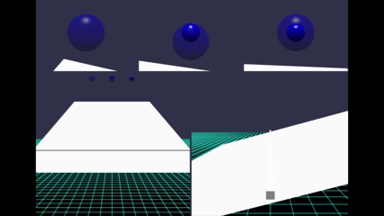
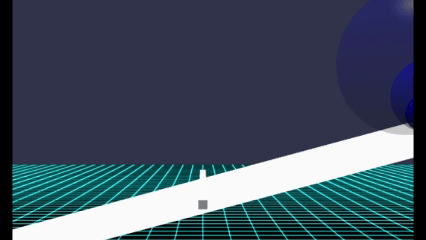
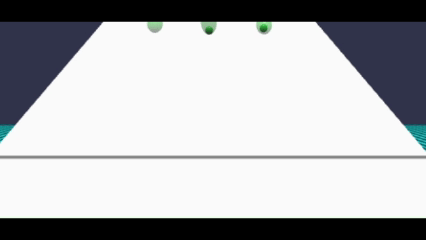
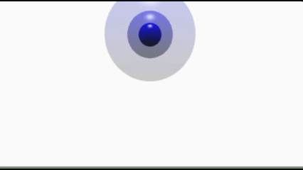
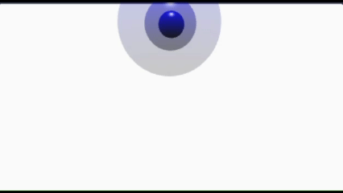
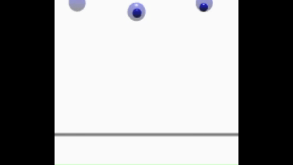
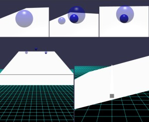
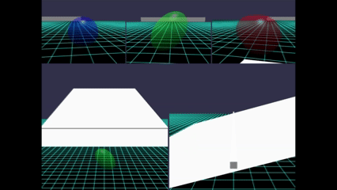

# Babylon.js で物理演算(havok)：中に重りのある球形を転がしてみる

## この記事のスナップショット

  
*スナップショット（２倍速）*

https://playground.babylonjs.com/?BabylonToolkit#63Q1F2

（上記のURLにおいて、ツールバーの歯車マークから「EDITOR」のチェックを外せばウィンドウいっぱいに、歯車マークから「FULLSCREEN」を選べば画面いっぱいになります。）

[ソース](139/)

ローカルで動かす場合、上記ソースに加え、別途 git 内の [136/js](https://github.com/fnamuoo/webgl/tree/main/136/js) を ./js として配置してください。

## 概要

「メッシュの中に別のメッシュを入れることって出来るの？」という疑問から、
球（大）の中に球（小）を入れて坂を転がしたところ、出来てしまったので深掘りしてみました。

  
*球を転がす様子*

カプセルケース／俵型のケースにビー玉が入ったおもちゃがあったよなぁと思いながら、
球のほかに楕円やカプセルといった形状でも転がしてみました。

どうせなら、中に球が入ってない「中身なし」と
中に入れた球を固定した「固定モデル」、固定していない「自由モデル」で転がり具合を比べてみても面白いかもと思い、
下記表の組み合わせを作ってみました。

| ステージ | 内容
|:--------:|---------------
| 1        | 球（中身なし／固定モデル／自由モデル）
| 2        | 楕円（中身なし／固定モデル／自由モデル）
| 3        | カプセル（中身なし単体／固定モデル／自由モデル）
| 4        | 球・楕円・カプセル（中身なし）
| 5        | 球・楕円・カプセル（固定モデル）
| 6        | 球・楕円・カプセル（自由モデル）

  
*楕円を転がす様子（４倍速）*

  
*カプセルを転がす様子（４倍速）*

尚、物理シミュレーション的な厳密さは求めずに、挙動の違いの面白さが見て取れれば良い程度の軽い気持ちなので
実際の物理実験と乖離があっても気にしないことにします。

なのでよくよく見ていると坂を転がらずに滑っているようで、もう少し摩擦係数を大きくした方がよい気がしますが、それも一興とそのままにしています。

## やったこと

- 球の中に球を配置する
- 球の中に球を固定する
- カメラで動きを追跡する
- 自動的にステージを更新する

### 球の中に球を配置する

球（大）の中に球（小）を入れるには、外側の球（大）の PhysicsAggregate を作成するときに PhysicsShapeType.MESH を指定します。
条件反射的に、PhysicsShapeType.SPHERE を指定したくなりますが、SPHEREだと中身の詰まった球になるので、球（大）の中に球（小）を埋め込むことができずに個別に分かれてしまいます。

```js
// 球の中に球をいれる（自由）
let mesh2 = BABYLON.MeshBuilder.CreateSphere("", { diameter: 2 }, scene);
mesh2.material = new BABYLON.StandardMaterial("");
mesh2.material.diffuseColor = BABYLON.Color3.Blue();
mesh2.material.alpha=0.4;
mesh2._agg = new BABYLON.PhysicsAggregate(mesh2, BABYLON.PhysicsShapeType.MESH, { mass: 0.5, restitution:0.1, friction:0.4}, scene);
mesh2.physicsBody.disablePreStep = false;
mesh2.position.copyFrom(pSrc); // 初期位置に移動
let mesh22 = BABYLON.MeshBuilder.CreateSphere("", { diameter: 1 }, scene);
mesh22.material = new BABYLON.StandardMaterial("");
mesh22.material.diffuseColor = BABYLON.Color3.Blue();
mesh22.material.alpha=0.8;
mesh22._agg = new BABYLON.PhysicsAggregate(mesh22, BABYLON.PhysicsShapeType.SPHERE, { mass: 2.0, restitution:0.1, friction:0.3}, scene);
mesh22.physicsBody.disablePreStep = false;
mesh22.position.copyFrom(pSrc); // 初期位置に移動
```

下記は、坂道の下り側から見た様子、手前に転がす様子になります。

  
*球が入れ子になっている様子*

  
*入れ子にできず、個別に分かれた様子*

### 球の中に球を固定する

上述の『球の中に球を配置する』では、内部に配置しただけで自由に動き回ってしまいます。
内部の球を固定するには LockConstraint で球（大）と球（小）の相対位置で固定させます。

```js
// 球の中に球をいれる（固定）
let mesh2 = BABYLON.MeshBuilder.CreateSphere("", { diameter: 2 }, scene);
mesh2.material = new BABYLON.StandardMaterial("");
mesh2.material.diffuseColor = BABYLON.Color3.Blue();
mesh2.material.alpha=0.4;
mesh2._agg = new BABYLON.PhysicsAggregate(mesh2, BABYLON.PhysicsShapeType.MESH, { mass: 0.5, restitution:0.1, friction:0.4}, scene);
mesh2.physicsBody.disablePreStep = false;
mesh2.position.copyFrom(pSrc); // 初期位置に移動
let mesh22 = BABYLON.MeshBuilder.CreateSphere("", { diameter: 1 }, scene);
mesh22.material = new BABYLON.StandardMaterial("");
mesh22.material.diffuseColor = BABYLON.Color3.Blue();
mesh22.material.alpha=0.8;
mesh22._agg = new BABYLON.PhysicsAggregate(mesh22, BABYLON.PhysicsShapeType.SPHERE, { mass: 2.0, restitution:0.1, friction:0.3}, scene);
mesh22.physicsBody.disablePreStep = false;
mesh22.position.copyFrom(pSrc); // 初期位置に移動
mesh22.position.y += 0.5;
let joint = new BABYLON.LockConstraint(
    new BABYLON.Vector3(0, 0.5, 0),
    new BABYLON.Vector3(0, 0, 0),
    new BABYLON.Vector3(0, 1, 0),
    new BABYLON.Vector3(0, 1, 0),
    scene
);
mesh2._agg.body.addConstraint(mesh22._agg.body, joint);
```

  
*内部の球を固定した様子（２倍速）*

### カメラで動きを追跡する

形状や形態（内部無し／固定／自由）の違いを比較できるよう３つ転がしますが、これらを後方からまたは俯瞰的に見れるように５つのカメラでモニタリングします。

  
*画面分割：５カメラの様子*

画面を上段と下段にわけ、上段を更に３等分してそれぞれのメッシュを追記するカメラを設け、下段は２等分して正面・側面から俯瞰して見れるようにしています。

上段のカメラ、回転するメッシュを追跡するカメラは
[Babylon.js で物理演算(havok)：移動体とカメラ](106.md)
で使った手法を流用します。

下段のカメラは ArcRotateCamera を作成するだけになってます。

画面分割については
[Babylon.js：マルチカメラとビューポート分割（銀河鉄道デモ）](132.md)
の知見を流用しています。

### 自動的にステージを更新する

モノが転がり落ちる単純なものなのですぐに飽きてしまいます。
そこでメッシュが転がり落ちた頃合いを見計らって、次のステージに自動で切り替えます。

ステージの切り替えはキーボード操作でも可能としています。

```js
//ゴール判定とステージ切り替え
// ゴール判定
let bCallNextStage = false;
scene.registerAfterRender(function() {
    if (bCallNextStage == false) {
        let mesh = camTrgMeshList[camTrgMeshList.length-1];
        // 転がり落ちた頃合いを判定
        if (mesh.position.x < -10 || (mesh.position.x < 0 && mesh.position.y < 1)) {
            setNextStage();
            bCallNextStage = true;
        }
    }
})

// 次のステージに自動で変更
let nextStage = function() {
    istage = (istage+1)%nstage;
    createStage(istage);
    changeCamera(icamera);
    bCallNextStage = false;
}
// 5 秒後にステージ変更を呼び出す
let setNextStage = function() {
    setTimeout(nextStage, 5000);
}
```

  
*自動で切り替わる様子*

## まとめ・雑感

「落とす／転がす」といったありがちな題材ですが、そこそこ楽しめていただけたのなら幸いです。

余談  
コーディングに注力しすぎて力尽き、この記事を興す気力がわかない、全く頭が働かない状態でした。
結果、生成ＡＩにコードレビューさせつつアピールポイントを抽出してもらい、やっと書き上げました。
内容を再度ＡＩでレビューさせたらダメ出しされて、落ち込む今日この頃です。


------------------------------

前の記事：[Babylon.js で物理演算(havok)：水汲み水車](138.md)

次の記事：[Babylon.js で物理演算(havok)：SLのクランク動作で三輪車を動かす](140.md)


目次：[目次](000.md)

この記事には関連記事がありません。

--
