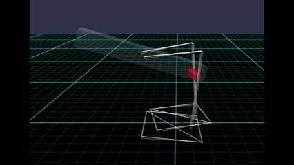
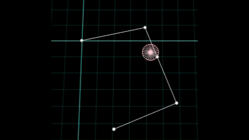
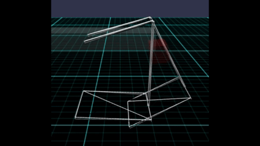

# Babylon.js + Havokで二足歩行を安定させる：クランク機構を「壊れない形で作る3ステップ」

## この記事で分かること

Babylon.js + Havokでリンク機構を使うと、

- 動かない（質量と力のバランスが悪い）
- 爆発する（正確に配置、接続できていない）
- 暴れる（ソルバが安定して解けていない、物理拘束（[Constraints](https://doc.babylonjs.com/features/featuresDeepDive/physics/constraints/)）が足りない）

といった問題にほぼ確実にぶつかります。

この記事では、クランク機構による2足歩行モデル
（TAMIYAの[メカ・ダチョウ （2足歩行タイプ）](https://www.tamiya.com/japan/products/71104/index.html)）
を題材に、

👉 **「壊れない物理モデルの作り方」**

を、次の3ステップで解説します。

1. 幾何モデルで「完璧な設計図」を書く
2. 無重力で拘束の正しさを検証する
3. 重力下で安定化させる

この手順で、複雑なリンク機構でも問題を局所化できました。

## デモ

よちよちですが、安定して歩行します。

  
*歩行の様子（２倍速）*

https://playground.babylonjs.com/?BabylonToolkit#ZYUVP1

（上記のURLにおいて、ツールバーの歯車マークから「EDITOR」のチェックを外せばウィンドウいっぱいに、歯車マークから「FULLSCREEN」を選べば画面いっぱいになります。）

## なぜ二足歩行は難しいのか

Havokでリンク機構を扱うと、

- 多リンクで誤差が累積する
- 拘束がわずかにズレると崩壊する
- 重力が入ると一気に破綻する

特に「いきなり重力あり」で作ると、原因が分からないまま調整地獄に入ります。

## 解決アプローチ：3段階分離

ポイントはこれです：

👉 **「動き」と「物理」を分離する**

- Step1：幾何モデルで「完璧な設計図」を書く  
  → 正しい動き／理想的な動きをつくる

- Step2：無重力で物理モデルをつくる  
  → 余計な影響を排除した状態を用意する

- Step3：重力下での「現実とのすり合わせ」  
  → 安定化に向けたパラメータ調整

## Step1：幾何モデルで「完璧な設計図」を書く（ここが土台）

まずやるべきは「正しい動きの定義」です。

### ポイント

- ノードの正確な位置を計算する

👉 「正しい答えを先に作る」

### なぜ必要か？

メッシュを正確な位置に、正しい向きに配置することが物理演算では必須になります。
ここが狂っていれば、物理エンジンを導入しても100%失敗します。

またノードとエッジをメッシュ表示することで、動きがわかり易くなります。

  
*メッシュでの動作*

#### 座標位置の導出

固定点は座標値が固定であり、リンクの長さは決まっているので、
**可動点の角度が決まればおのずと他の点の座標値が導出** されます。
（三角形の３点において、2点の位置が確定した上で辺の長さが決まっているので残りの１点の座標値は余弦定理から求められます）

今回だと以下のような関数になります。

```js
//角度から各点の座標値を求める関数
//         P2
//P0    _-~(o)
// (s)-~    |
//          |
//   P1(s)-(a)P3
//          |
//          |
//  P5(o)--(o)P4
// (s): 固定点
// (a): 可動点
// (o): 連結点／端点
let calcPosi = function(rad_, v2list_, pplen, ppr) {
    // 角度(rad_)から点の座標値(v2list_)を求める。この時の制約（距離・角度）はpplen,pprから参照
    // P3の座標値
    v2list_[3].x = v2list_[1].x + pplen[13]*Math.cos(rad_);
    v2list_[3].y = v2list_[1].y + pplen[13]*Math.sin(rad_);
    // P2の座標値
    // 三角形P0-P3-P2//ABCにおいて、P0-P3/ABを底面とした場合の頂点P2/Cの位置を求める
    // まず辺P0-P3/ABの長さを確定させる
    let L03sq = v2list_[3].subtract(v2list_[0]).lengthSquared();
    let L03 = Math.sqrt(L03sq);
    // ローカル座標系（三角形P3-P0-P2//ABCにおいて、P3-P0/ABを底面とした場合）の頂点P2の座標(cx,cy)を求める
    let xc = (L03sq + pplensq[2] - pplensq[23]) / (2.0*L03);
    let yc = Math.sqrt(pplensq[2] - xc*xc );
    // 底辺(P0-P3)とx軸の角度（三角形の傾き）をもとめ、..
    let rx03 = Math.atan2(v2list_[3].y-v2list_[0].y, v2list_[3].x-v2list_[0].x);
    // 頂点(cx,cy)を回転→平行移動させ、ローカル座標系からworld座標系へ射影する
    v2list_[2] = v2list_[0].add(new BABYLON.Vector2(xc,yc).rotate(rx03));
    // P4  P2P3の延長上に P4を配置
    v2list_[4] = v2list_[2].add(v2list_[3].subtract(v2list_[2]).scale(pplen[24]/pplen[23]));
    // P5
    //   まず x軸とP4-P3の角度を求める
    let rx43 = Math.atan2(v2list_[3].y-v2list_[4].y, v2list_[3].x-v2list_[4].x);
    //   角P3P4P5を足し合わせて P4を原点とした角度で P5をもとめる
    let r5 = rx43 + ppr[345];
    v2list_[5].x = v2list_[4].x + pplen[45]*Math.cos(r5);
    v2list_[5].y = v2list_[4].y + pplen[45]*Math.sin(r5);
    return v2list_;
}
```

👉 チェックポイント：

- 点は想定した動きですか？
- リンクが伸び縮みしていないですか？
  - 想定外の動きなら、計算が間違っています

## Step2：無重力で物理モデルをつくる（超重要）

ここがこの記事のキモです。

### なぜ無重力？

- 重力があると原因が分からなくなる
- 拘束ミスと物理挙動（慣性、衝突）が混ざる

👉 結果、デバッグ不能に陥ります。

### やること

- 無重力にする
- ボディメッシュを固定（mass = 0）
- 駆動輪を他より重く（クランクからの反作用を抑える：ソルバを安定して解くために必須）

### 成功条件

- 初期状態で静止
  - 駆動輪を停止させた状態で静止していること
- 駆動輪を回したときにスムーズに動く
  - step1と同じ動きになっていること

👉 チェックポイント：

- step1で計算した座標値どおりにメッシュを配置していますか？
  - 重なっていると反発力が働いて「爆発」します
  - メッシュ同士の衝突を無視するよう filterCollideMask を設定するのも手です
- 物理拘束した座標値や軸の向きはあっていますか？
  - 駆動輪を円柱で扱うと座標の扱いが複雑になるので、最初は直方体で扱うことをお勧め

  
*step2の完成時*

## Step3：重力下での「現実とのすり合わせ」

ここからが「調整フェーズ」です。

重力加速度を -9.8[m/s^2]に、ボディメッシュの質量を有効に（固定を解除）したうえで、地面を歩行させます。

よくあるパターンではありませんが、今回遭遇したケースで「崩壊パターンと対処」を説明します。

### 今回の崩壊パターンと対処

#### ケース1：すぐ倒れる

- 足を短く
- 左右の足の幅を広げる
- 接地面を大きく（足の甲のメッシュを大きくする）

#### ケース2：後ろに倒れる

- ボディを重く（重心が前になるように）
- かかと部分が後ろにはみでるように結合位置を修正（構造的に倒れにくくする）

#### ケース3：動かない

- 加える力を大きくする＋dampingで回転速度を調整

👉 ポイント：

**パラメータ変更 → Step1, Step2に戻って検証**

- サイズや質量を変えたときは、一度前の工程(Step1, Step2)に戻って動作確認を行うと問題の分離、原因の究明がしやすいです。

## まとめ

👉 物理をいきなり使うな

- 幾何で決める
- 無重力で検証
- 重力で調整

## 今後の改善

一方で、もし読者の中に、素早く歩くことを期待していた方がいたら申し訳ございません。
よちよち歩きで満足してしまったためにこれ以上の深掘りはしていません。
アイデアのみですが改善案のみを提示しておきます。

- 足を増やす
  - 地面への接地を多くすることで姿勢を安定させる（次回紹介します）
- 物理拘束を増やして安定させる
  - 予期しない動作を防止するための物理拘束を追加させて安定して動くようにさせる（次々回紹介します）
- 高速走行の検討
  - 対象とする物理モデルは未定ですが近日中を予定

## 雑感

TAMIYAさんの技術はスゴイですね。
リアルとシミュレーションという違いがあるにしても、不安定な二足歩行しかもダチョウという足の長いモデルでも、
しっかりとスタスタ歩くのですから。技術力の高さに脱帽です。

「お前の記事は作業報告だ」と生成AIからダメ出しをくらい、これで６度目の書き直し（涙  
絵文字とか普段使わないのに、アドバイスをできるだけ取り入れるようにしました。
だいぶ盛られている感じがしますが。

## ソース

[git](141/)

ローカルで動かす場合、上記ソースに加え、別途 git 内の [136/js](https://github.com/fnamuoo/webgl/tree/main/136/js) を ./js として配置してください。


------------------------------

前の記事：

次の記事：..


目次：[目次](000.md)

この記事には次の関連記事があります。

- [Babylon.js で物理演算(havok)：水汲み水車](138.md)
- [Babylon.js で物理演算(havok)：テオ・ヤンセン機構で歩かせてみる](137.md)
- [Babylon.js で物理演算(havok)：SLのクランク動作で三輪車を動かす](140.md)

--
