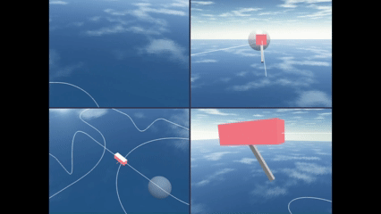
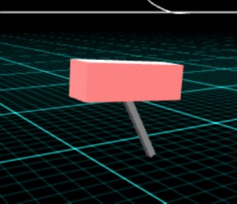
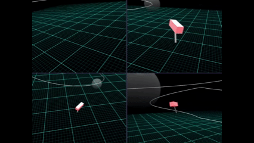
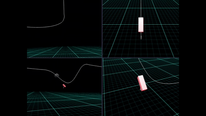
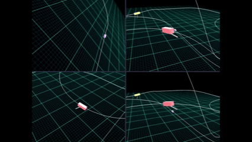

# Babylon.js で物理演算(havok)：ローラーコースターと振り子の試作

## この記事のスナップショット

  
*スナップショット*

https://playground.babylonjs.com/?BabylonToolkit#O1VVJK

（上記のURLにおいて、ツールバーの歯車マークから「EDITOR」のチェックを外せばウィンドウいっぱいに、歯車マークから「FULLSCREEN」を選べば画面いっぱいになります。）

[ソース](144/)

ローカルで動かす場合、上記ソースに加え、別途 git 内の [136/js](https://github.com/fnamuoo/webgl/tree/main/136/js) を ./js として配置してください。

## 概要

[Babylon.js で物理演算(havok)：チューブの中で玉を転がす](130.md)
や
[Babylon.js：Path3D 上のメッシュの動きに変化をつける試作](135.md)
でローラーコースターを作って、転がしたり動かしたりしていますが、遠心力で傾いた感じを表現してみたくて試作してみました。

Path3Dのコースに従ってメッシュを動かしてみるとどうしてもカメラがガクガクする感じがとれません。
そこで物理系の動きでコース上の目標を追跡するようにしたところ、滑らかに且つ遠心力で傾きつつ移動する感じが再現できました。

## やったこと

- 物理系で動かしてみる
- メッシュに重りをつけてみる（失敗）

### 物理系で動かしてみる

移動体は２つの要素から構成し、移動させるメッシュとそこにぶら下がるメッシュとしています。

  
*移動体*

上部のメッシュ（厚みのあるBox）は重力の効果を少なくし進行方向への移動に注力しやすくします。
下部のメッシュ（細長い棒）は6DoFで角度を制限した物理拘束として上部と結合させています。結果、前後（ピッチ）や左右（ロール）では傾きますが、方位角（ヨー）は固定しており上部と同じ方向を向くようにしています。
また下部のメッシュにのみ damping を設定し、揺り戻しがないように傾いた姿勢をできるだけ保つようにします。
これはカメラを下部のメッシュにとりつけるためです。揺れる映像だと見にくい上に乗り物酔いになりかねないためです。

移動に関して、Path3D のラインは進行方向の目安・目標地点として利用します。
ライン上に沿って厳密に動くのではなく、移動体より少し先行したライン上の座標値をもとめ、目標地点とします。
目標地点は移動体の位置に応じて逐次前進させ、移動体がスムーズに動くように配慮しています。

この時のカメラの映像の様子は以下のようになります。
ドライバーズビュー（左上）でスムーズな映像が確認できます。

  
*物理系動作のカメラ*

また、ラインから大きく外れた場合、目標地点を再設定します。
ライン上のより近接した点が目標地点の近くにあれば、その地点を新たな目標地点とします。
例えばヘアピンカーブのような場所で大きくコースから外れても、外れた地点に戻るのではなく、より近くの場所から戻ることができます。

  
*目標地点が切り替わる様子（直上に戻るのではなく、そこより前方を目指すことでスムーズに復帰）*

### メッシュに重りをつけてみる（失敗）

こちらはカメラがガクガクして失敗した話です。

こちらは上部のメッシュを質量０のアンカーとして、その下に下部のメッシュを物理拘束でつなぎます。
つなぎかたは上記の「物理系」と同じです。

上部のメッシュの動きは
[Babylon.js：Path3D 上のメッシュの動きに変化をつける試作](135.md)
でやった時と同じように、Path3D 上を疑似重力で移動の加速・減速をおこないます。

つまり、上部メッシュはライン上に沿って強制的な動きをしますが、下部メッシュは上部メッシュに引きずられるかたちで動くことになります。

何度か試走させて動きを確認してみると、酷く揺れた動きになることがあります。

  
*酷く揺れたカメラ（左上）*

我流の推測を述べることは、読者を惑わせるだけなので好ましくはないのですが、一応持論を展開します。
上部のメッシュだけの移動だった場合、

[Babylon.js：マルチカメラとビューポート分割（銀河鉄道デモ）](132.md)
や
[Babylon.js：鉄道模型のレイアウト作成にチャレンジ](136.md)

では、このような動きにはならなかったことを鑑みると、
上部メッシュを固定しているために、下部メッシュの動きが上部メッシュに制限されて、
逃げ場のなくなったエネルギー・力によって振動してしまったのではないかと推測します。

間に緩衝材、バネなどを入れる手もありそうですが、系が複雑になるのは好ましくないので、
上部メッシュを強制的に動かすこの案は止めて、物理系（前節）で動かしてみました。

## まとめ・雑感

一応、「遠心力で傾く」といった想定した動きをすることが確認できたので及第点ではありますが、
なにか物足りなさも感じます。スピード感が出せていないせいかな。
コーナーで「フックに引っ掛けて強引に曲がる」ようなことができれば理想な気がしますが、
今は恐る恐る「コースを外れないように」動いている感が抜けないです。

もう少し工夫が必要です。といっても何も思いつかないですが。

------------------------------

前の記事：[Babylon.js で物理演算(havok)：クランクの高速動作](143.md)

次の記事：[Babylon.js：いなずまのエフェクト](145.md)

目次：[目次](000.md)

この記事には次の関連記事があります。

[Babylon.js で物理演算(havok)：チューブの中で玉を転がす](130.md)
[Babylon.js：Path3D 上のメッシュの動きに変化をつける試作](135.md)
[Babylon.js：マルチカメラとビューポート分割（銀河鉄道デモ）](132.md)
[Babylon.js：鉄道模型のレイアウト作成にチャレンジ](136.md)

--
