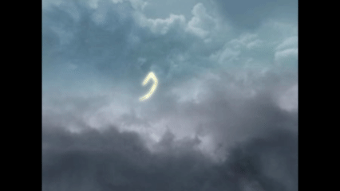
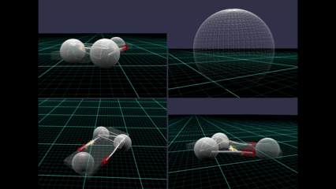
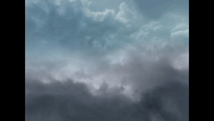
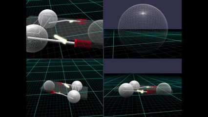

# Babylon.js：いなずまのエフェクト

## この記事のスナップショット

  
*スナップショット：かみなり*

  
*スナップショット：いなずまのエフェクト*

https://playground.babylonjs.com/?BabylonToolkit#LAXYWK

（上記のURLにおいて、ツールバーの歯車マークから「EDITOR」のチェックを外せばウィンドウいっぱいに、歯車マークから「FULLSCREEN」を選べば画面いっぱいになります。）

[ソース](145/)

ローカルで動かす場合、上記ソースに加え、別途 git 内の [136/js](https://github.com/fnamuoo/webgl/tree/main/136/js) を ./js として配置してください。

## 概要

公式のドキュメント
[GreasedLine advanced examples](https://doc.babylonjs.com/features/featuresDeepDive/mesh/creation/param/greased_line/greased_line_advanced/)
には
雷のサンプル
[Lighting bolts](https://playground.babylonjs.com/#P5GH2C#13)
があります。
これを改造して、より「かみなり」っぽくしました。


これを利用して、中二病っぽく「いなずま」のエフェクトとして使えないかと、
[Babylon.js で物理演算(havok)：SLのクランク動作で三輪車を動かす](140.md)
に適用してみたところ、COOL!! な感じになりました。

記事を書いた後で気が付きましたが、Babylon.js TIPS 集にも似たものがありました。紹介だけしておきます。

- [落雷表現](https://scrapbox.io/babylonjs/%E8%90%BD%E9%9B%B7%E8%A1%A8%E7%8F%BE)
- [プラズマボールっぽいものを作ってみる](https://scrapbox.io/babylonjs/%E3%83%97%E3%83%A9%E3%82%BA%E3%83%9E%E3%83%9C%E3%83%BC%E3%83%AB%E3%81%A3%E3%81%BD%E3%81%84%E3%82%82%E3%81%AE%E3%82%92%E4%BD%9C%E3%81%A3%E3%81%A6%E3%81%BF%E3%82%8B)
- [レイマーチングをシーンになじませる方法（その９）](https://scrapbox.io/babylonjs/%E3%83%AC%E3%82%A4%E3%83%9E%E3%83%BC%E3%83%81%E3%83%B3%E3%82%B0%E3%82%92%E3%82%B7%E3%83%BC%E3%83%B3%E3%81%AB%E3%81%AA%E3%81%98%E3%81%BE%E3%81%9B%E3%82%8B%E6%96%B9%E6%B3%95%EF%BC%88%E3%81%9D%E3%81%AE%EF%BC%99%EF%BC%89)
- [ハーモノグラフ + Trail](https://scrapbox.io/babylonjs/%E3%83%8F%E3%83%BC%E3%83%A2%E3%83%8E%E3%82%B0%E3%83%A9%E3%83%95_+_Trail)

## やったこと

- サンプルを改造する（遅延させて表示）
- クランク動作に適用

### サンプルを改造する

サンプル
[Lighting bolts](https://playground.babylonjs.com/#P5GH2C#13)
では、描画対象の線分を計算してから、全線分を描画という手順を踏んでいます。

そこで、線分ごとの描画情報をスタックに積んで、レンダリング時にスタックから取り出して描画、更に遅延処理で削除を行います。
結果、かみなりが走っているかのように見えます。

```js
//かみなりのデータ作成と描画
// 線分（描画情報）の追加
function getLightingLines(sx, sy, width, len) {
    let points = [];
    let colors = [];
    let widths = [];
    // 終点
    var cx = sx + (Math.random() * len) - len / 2;
    var cy = sy - (Math.random() * len / 2);
    // 色／太さ／点（始点・終点）を格納
    colors.push(color1)
    colors.push(color1)
    widths.push(width, width, width, width)
    points.push([sx, sy, sz, cx, cy, sz])
    ...
    // 線分の描画情報をスタック
    pointslist.push(points);
    colorslist.push(colors);
    widthslist.push(widths);
}

// レンダリング時の処理
scene.onBeforeRenderObservable.add((scene) => {
    if (pointslist.length > 0) {
        let icount = 0, ncount = Math.max(Math.floor(pointslist.length/4), 10);
        while (pointslist.length > 0) {
            // スタック情報から取り出して描画
            let points = pointslist.pop();
            let colors = colorslist.pop();
            let widths = widthslist.pop();
            let mesh = BABYLON.CreateGreasedLine('', {points, widths}, {width: 0.6, colors, useColors: true});
            glow.referenceMeshToUseItsOwnMaterial(mesh)
            mesh._lifetime = 5; // ライフタイムを付与(=0時に削除させる）
            meshlist.push(mesh);
            if (++icount >= ncount) { break;}
        }
    }
    let meshlist_ = [];
    for (let mesh of meshlist) {
        if (mesh._lifetime > 0) {
            // ライフタイムを減らす
            mesh._lifetime -= 1;
            meshlist_.push(mesh);
        } else {
            // 削除
            mesh.material.dispose();
            mesh.dispose();
        }
    }
    meshlist = meshlist_;
});
```

曇りのskyboxを配置すると更にそれっぽくなります。
添付画像だとわかりにくいですが、微妙に時間差で明滅しています。

  
*かみなり*

ちなみに上記のコードで ncount = 1 にすると明滅がよりハッキリして、かみなりが走るようになります。

  
*かみなりが走る様子*

### クランク動作に適用

[Babylon.js で物理演算(havok)：SLのクランク動作で三輪車を動かす](140.md)
で作った三輪車に対してクランク部分にいなずまを走らせてみたいと思います。
いなずまの方向に指向性を持たせ、ピストンからクランク側に向かうようにします。
始点はピストン位置ですが、移動速度に応じて前方にずらしておきます。
また、いなずまが長くなり過ぎないように長さを調整しておきます。

いなずまの描画トリガーは setInterval() で 5[ミリ秒]ごとに、左右交互に描画させています。

レンダリング時に描画するメッシュ数(ncount)ですが、スタート時は小さく、スピードに応じて大きくするようにしています。

```js
// スピードに応じてメッシュ数(ncount)を増やす
let icount = 0, ncount = 2;
// スピードに応じて ncount を増やす
let vLenSQ = meshbody._agg.body.getLinearVelocity().lengthSquared();
ncount = Math.max(ncount, Math.floor(Math.log(vLenSQ)));
```

  
*いなずまの効果*

ちなみに ncount = 1 の固定値だと、点火プラグの火花っぽくなってしまいますｗ

  
*点火プラグの火花っぽい様子*

## まとめ・雑感

記事を書いて生成AI(gemini)にレビューさせたとき、

> 遅延させて表示させるようにしてから、なぜか枝分かれする表示よりも１本だけの表示に偏った表示になってしまいました。
> このためエフェクトがいまいちな感じになってしまいました。
> もう少し枝ぶりを大きく、もっと枝分かれ出来ればよかったのですが何故でしょうか。
> 処理のタイミングの問題ですかね？

なことを書いていたら、記事内のコードから「レンダリング時の描画が原因」と指摘してくれました。
結果、かみなり／いなずま表現の幅がひろがりました。
gemini やりおる。

------------------------------

前の記事：

次の記事：..


目次：[目次](000.md)

この記事には次の関連記事があります。

[Babylon.js で物理演算(havok)：SLのクランク動作で三輪車を動かす](140.md)

--
