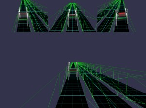
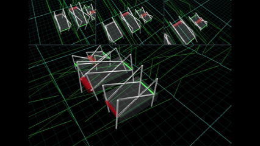

# Babylon.js で物理演算(havok)：歩行おもちゃでレース

## この記事のスナップショット

  
*スナップショット*

https://playground.babylonjs.com/?BabylonToolkit#Z5FZB3

（上記のURLにおいて、ツールバーの歯車マークから「EDITOR」のチェックを外せばウィンドウいっぱいに、歯車マークから「FULLSCREEN」を選べば画面いっぱいになります。）

[ソース](146/)

ローカルで動かす場合、上記ソースに加え、別途 git 内の [136/js](https://github.com/fnamuoo/webgl/tree/main/136/js) を ./js として配置してください。

## 概要

過去に作成した４足／６足の「歩くおもちゃ」の中で一番速いものはどれか？

TAMIYAの[メカ・ダービー](https://www.tamiya.com/japan/products/71112/index.html)
のデモムービーを見ていたら、レースモノを作りたくなりました。
[Babylon.js で物理演算(Havok)：4足・6足タイプの物理モデル作成](142.md)
で作成した、４足歩行および６足歩行のものを使い、
[Babylon.js で物理演算(havok)：クランクの高速動作](143.md)
での知見を利用して高速動作でも安定するように物理拘束を追加します。

同じ４足・６足でも、フレームの長さ、回転速度、質量、dampingなどのパラメータを変更して、いくつかの種類を用意しました。
結果、「速いけどこけやすい」、「遅いけど安定している」、「初動は遅いけど、後半伸びてくる」
といった様々な挙動をもった物理モデルが出来上がりました。

一方で コースは自由に走らせるのではなく、専用レーンを走る形式とします。
ランナーごとに追跡カメラをつけて、同時に表示させる都合上、走者は３つ、３レーンにしています。

また、コースレイアウトは直線のみですが、のぼりやくだりといったアレンジをつけてみました。

  
*レースの様子（７倍速）*

走者をランダムで選び、コースをランダムで選んで、自動で開始、ゴールしたら次を自動でスタートします。

ゲーム要素は少ないです。大まかに体裁が整ったので公開します。

## やったこと

- 物理モデルを修正
- コース作り
- カメラワークと転倒補正

### 物理モデルを修正

以前に作ったものは単品で動かすだけ、動けば良しというだけの作り込みで、開始位置も固定だったので色々と不備があります。
これらを改修して、高速回転しても安定するように、スタート位置に配置できるようにします。

#### 物理拘束を追加して安定化

[Babylon.js で物理演算(havok)：クランクの高速動作](143.md)
でのテクニックを使って、ヒンジで固定しているだけの箇所を平面上で動作するように物理拘束を追加します。

#### parent をつけて一体化

ベース（メッシュ）の position だけで移動させるには、全てのパーツの親子関係を設定しておく必要があります。
試作した際は固定の位置（原点）に配置していたので特に親子指定しなくても問題なかったので失念していました。

ちなみに親子指定していないと、パーツが置き去りになったり、移動させたときに置き去りにされたパーツが定位置に戻ろうと飛んできて姿勢がくずれる、酷いときは回転するといった挙動になります。

#### パラメータ化

せっかくなら一番速い組み合わせを見つけてみようかと、
物理モデルのフレーム長や質量、動輪に加える力をパラメータ化して様々な物理モデルを用意して走り比べしてみました。

「足が長いもの」、「パワーの強い・動きの速いもの」など試してみましたが、なかなか速い組み合わせが見つからず苦心しました。

### コース作り

最初にイメージしたものが競馬場だったので、後半にのぼりがあるコースや、途中で山を超えるようなコースを含めて以下のコースを作成しました。

- フラット
- 後半のぼり
- 途中山あり
- のぼり
- くだり

当初は床も壁も一体でコースづくりしていましたが、壁との摩擦でひっくりかえっているような挙動を示すことがあったので、床（やや摩擦高め）と壁（摩擦低め）で構成しています。

### カメラワークと転倒補正

画面構成をメインとサブの4画面構成にしています。
サブでは各走者を追跡しつつ、メインでは各走者を順にフォーカスします。
（一位にフォーカスさせていたのですが、カメラワークが単調になりがち且つコースが直線の場合しか通用しないので止めました）

```fig
+------+------+------+
| Sub1 | Sub2 | Sub3 |
+------+------+------+
|                    |
|       Main1        |
|                    |
+--------------------+
```

何度か試走させているとコケてしまったりコースアウトする走者がでてきたので、
コース復帰させる処理を入れておきます。

毎回確認するには少々処理が重いので、クールタイムを入れて、一定ごとに確認します。

```js
// 一定ごとに位置・姿勢を確認
if (mesh._checkCT > 0) {
    mesh._checkCT -= 1;
} else {
    mesh._checkCT = mesh._checkCTmax;
    // 上方ベクトルの内積から向きを確認（負ならひっくり返っていると判断）
    let vdot = 0;
    let vup = BABYLON.Vector3.Up().applyRotationQuaternion(mesh.rotationQuaternion);
    vdot = vup.dot(BABYLON.Vector3.Up());
    if (mesh.position.y < -300 || vdot < 0) {
        // 絶対位置（高さ）が低い(-300未満)か、上向きとの内積がマイナス（姿勢が下向き）
        // 姿勢をリセットする
        console.log("reset course posi y=", mesh.position.y, " , dot=",vdot);
        // 動きを止める
        mesh._run = false;
        let r = path3d.getClosestPositionTo(new BABYLON.Vector3(mesh.position.x, 0, mesh._courseZ));
        let p = path3d.getPointAt(r);
        p.y += 3;
        p.z = mesh._courseZ; // 予め設定していたコース位置
        // 位置を復帰
        mesh.position.copyFrom(p);
        // スピードを０に
        mesh.physicsBody.setLinearVelocity(new BABYLON.Vector3(0, 0, 0)); // 移動を止める
        mesh.physicsBody.setAngularVelocity(new BABYLON.Vector3(0, 0, 0)); // 回転を止める
        // 姿勢を戻す
        mesh.rotationQuaternion = new BABYLON.Quaternion();
        // 動きを再開
        mesh._run = true;
    }
}
```

## まとめ・雑感

パドック的なモノ（出走者の紹介）がなく、いきなり始まるので面白さが全然伝わらないと思います。

正直パラメータをいろいろいじっていたら思った以上に時間がかかりすぎました。
初動が速くても不安定でコケてしまったり、後半の追い込みで抜いてきたりとか、「これだ！」と思ったものが遅かったりと、ちょっと楽しんでしまいました。

ミニ四駆のように、自分でカスタマイズして走らせる楽しさをゲーム化出来ていないので残念の極みですが、
設定画面のインターフェースを作り込むのって地味すぎて、すみません、モチベがだだ下がりです。


------------------------------

前の記事：[Babylon.js：いなずまのエフェクト](145.md)

次の記事：..


目次：[目次](000.md)

この記事には次の関連記事があります。

- [Babylon.js で物理演算(havok)：4足・6足タイプのおもちゃにチャレンジ](142.md)
- [Babylon.js で物理演算(havok)：クランクの高速動作](143.md)

--
