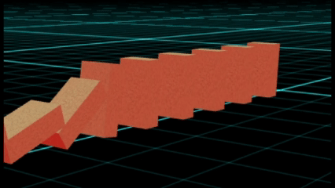
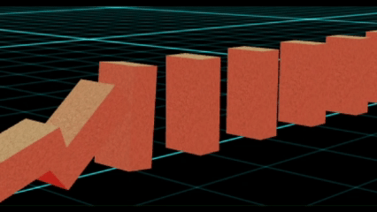
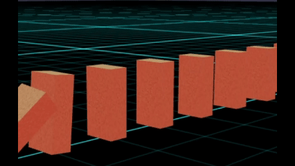

# Babylon.js で物理演算(Havok)：レンガでドミノ倒し

## この記事のスナップショット

  
*スナップショット*

https://playground.babylonjs.com/?BabylonToolkit#T3WW2N#1

（上記のURLにおいて、ツールバーの歯車マークから「EDITOR」のチェックを外せばウィンドウいっぱいに、歯車マークから「FULLSCREEN」を選べば画面いっぱいになります。）

[ソース](148/)

ローカルで動かす場合、上記ソースに加え、別途 git 内の [136/js](https://github.com/fnamuoo/webgl/tree/main/136/js) を ./js として配置してください。

## 概要

今回は Babylon.js + Havok で、 **「2段階で崩れるレンガドミノ」** を再現してみました。

普通のドミノのように即座に倒れるのではなく、

- 奥のブロックに寄りかかった状態で倒れていく（1度目）
- 最奥のブロックが倒れるとき、位置関係の工夫で一つ手前の倒れていたブロックが更に倒れる。これが逆方向に伝播（2度目）
- 結果、前後に動く波のように倒れる

という独特な崩れ方をします。

元ネタはこちらの動画です。

[50 ブリック ダブルドミノエフェクト](https://www.youtube.com/watch?v=EI_V16TZmII)

正直、Havok でここまで再現できるとは思っていませんでした。

## 課題：このドミノの難しいところ

普通のドミノなら、「ならべるだけ」「倒れておしまい」で完結してしまいます。

しかし今回のレンガドミノでは、

- 最初は倒れきらずに、途中でひっかかる
- 途中でひっかかったブロックが倒れきることで手前に連鎖して、最終的にすべて倒れきる

というギリギリのバランスが必要になります。

つまり、

- 間隔
- 厚み
- 摩擦

をかなり繊細に調整する必要がありました。

更に軽快に倒していくために重力の設定も変えてみました。

## やったこと

- ブロックをならべる
- 小気味よくブロックを倒す

### ブロックをならべる

2段階で倒すには次のことに注意する必要がありました。

- ブロック同士の間隔に注意する
  - 最初に倒れたときに倒れきらずにギリギリひっかかる位置に調整します
- ブロックの厚みを持たせる
  - 厚みが十分にないと、倒れきった時との差ができずに2段階になりません。レンガのように厚くしましょう。
- 床とブロックの摩擦係数を高めにして、倒れてもずれないように
  - 最初にブロックが倒れたときに位置がずれないようにします

### 小気味よくブロックを倒す

重力が小さいとゆっくり倒れます。
地球の重力(9.8[m/s^2])だと倒れ方がゆっくりなので、ここでは 10G(98[m/s^2]) と強めにしています。
これにより、テンポよく小気味よい感じで倒れてくれます。

  
*重力1Gのとき*

  
*重力10Gのとき*

今回は重力を強くしても問題ありません。
最初のブロックを押すときの、力を強くしないといけない程度の影響です。

ブロック崩しでは4段5段と積み上げることがよくあると思いますが、重力を強くしてしまうと勝手に自壊(演算の不安定による崩壊)してしまいます。
積み上げたブロックが勝手に動きだしてしまうためです。
摩擦係数を高く、反発係数を小さくするとある程度緩和できます。
それでも8段9段と高くなると同じように自壊してしまいます。

なので「重力を強くして軽快にブロックを倒す」テクニックは適用できるシーンを選びます。

## まとめ・雑感

生成AIに『babylon.js の 物理エンジン(Havok)を使って作成可能なモチーフを最低３つ、最大１０個列挙して』
と問い合わせたら、どの生成AIでも共通してドミノ倒しを挙げてきたのでこれを機に改めて作ってみました。

ドミノ倒しに関する情報を収集していたら偶然見つけた動画（上記「50 ブリック ダブルドミノエフェクト」）で思わず唸ってしまいました。
Havok で再現できるかどうか心配だったのですが、できるものなんですね。

次回はドミノ倒しのトリックを再現したものを紹介します。

------------------------------

前の記事：[Babylon.js：クラスター照明を使ってみる](147.md)

次の記事：[Babylon.js で物理演算(havok)：ドミノ倒しのトリックを再現](149.md)

目次：[目次](000.md)

この記事には次の関連記事があります。

- [Babylon.js で物理演算(havok)：ドミノ倒しのトリックを再現](149.md)

--
