# Babylon.js で物理演算(Havok)：ドミノ倒しのトリックを再現

## この記事のスナップショット

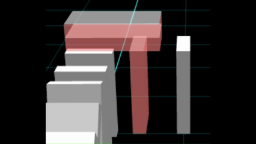  
*方向転換トリック31*

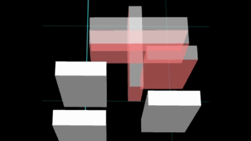  
*方向転換トリック16*

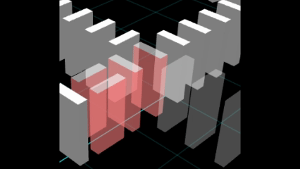  
*交差トリック37*

https://playground.babylonjs.com/?BabylonToolkit#VPKBS8

（上記のURLにおいて、ツールバーの歯車マークから「EDITOR」のチェックを外せばウィンドウいっぱいに、歯車マークから「FULLSCREEN」を選べば画面いっぱいになります。）

[ソース](149/)

ローカルで動かす場合、上記ソースに加え、別途 git 内の [136/js](https://github.com/fnamuoo/webgl/tree/main/136/js) を ./js として配置してください。

## 概要

ドミノ倒しの第二弾です。（全 3回予定）

YouTube にはドミノ倒しの動画がたくさんあります。
ここではドミノ倒しのトリック、
Viele Dominoes氏の
[50 Domino Tricks](https://www.youtube.com/watch?v=o6tTgjoRxWw)、
[100 Domino Tricks](https://www.youtube.com/watch?v=kHQRLo5OMgs)
から幾つかを抜粋して Havok で再現してみました。

高く積み上げるトリックは物理演算には不向きなので、今回は対象外としました。
摩擦係数や反発係数がデフォルト値のままだと 4層程度が限界です。係数を調整しても 8層程度しかならない上に逆に崩れにくくなります。
このあたりがリアルとシミュレーションの違いです。

また、斜めに傾けるトリックは配置（位置や角度の調整）に時間がかかるのでパスしました。 1つ 2つならなんとか作れますが数多くなると作業コストが高すぎます。
しかし「見せるトリック」ではあるので数個のトリックに限定しました。

今回の記事のもう一つの目的として、ブロックを並べる際の方向転換やドミノ列の交差の `簡単なやり方を知ること` です。
なので深入りはしません。

## やったこと

- トリックの見せ方
- 再現したトリック

### トリックの見せ方

トリックごとに小さなステージ（ブロックを並べたもの）を用意しました。

マウス操作で回転、ズームができるので、色々な方向からブロックの配置を確認できます。

またトリックのキーとなるブロックを色付けしてわかりやすくしてみました。

一時停止やスロー再生はできませんが、何度でも繰り返して再生する（ブロックを倒す）ことはできます。
（[Space]キーで開始、[Enter]キーでリセット）

ステージの変更は[n]/[b]キーで行えます。

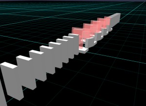  
*ステージの例*

### 再現したトリック

再現しているトリックは下記の通りです。
最後の「塔・かべ・やま」は上手く崩れない場合があります。
なお、トリックのNoは開発上のもので意味はありません。（当初は動画のNoと同期させていましたが途中からずれて無意味になってます）

- 直線
  - 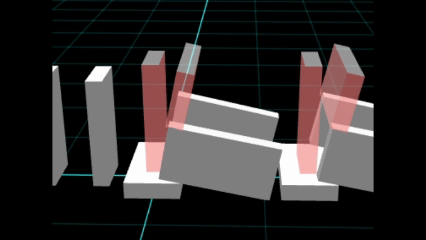  
    *トリック1（時間がたつと滑ってずれてきます）*
  - 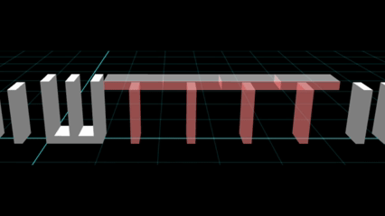  
    *トリック5*
  - 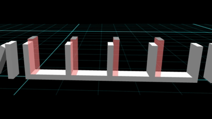  
    *トリック6*
  - 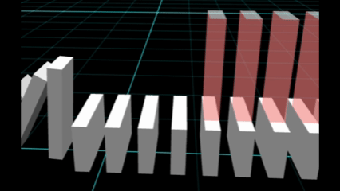  
    *トリック10*
  - 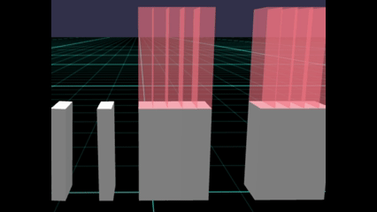  
    *トリック12*
  - 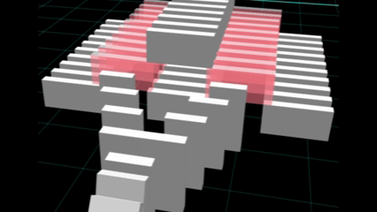  
    *トリック13*
  - 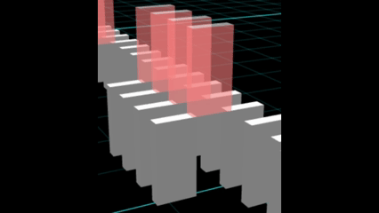  
    *トリック14*
  - 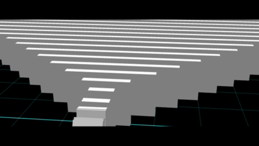  
    *トリック302*

- 直線ずれ
  - 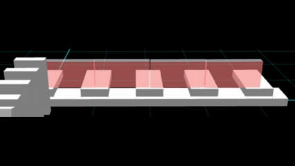  
    *トリック2*
  - 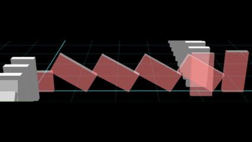  
    *トリック7（右のブロックは奥に立てかける感じに配置）*
  - 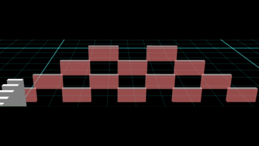  
    *トリック203*

- 方向転換 (90度)
  - 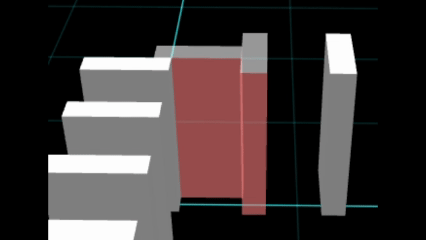  
    *トリック3*
  - 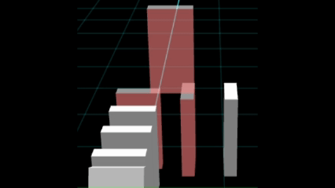  
    *トリック242*
  -   
    *トリック31*
  - 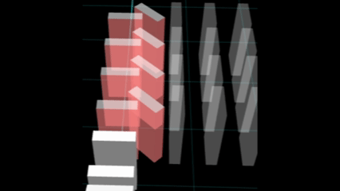  
    *トリック216*

- 方向転換 (180度)
  -   
    *トリック16（押されるブロックは倒れやすいよう斜めに配置）*
  - 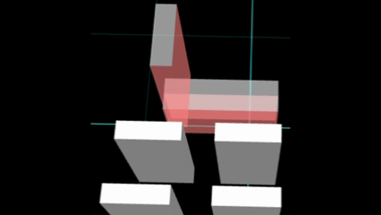  
    *トリック18*
  - 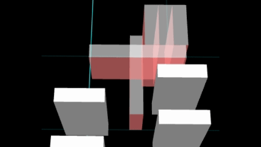  
    *トリック22*
  - 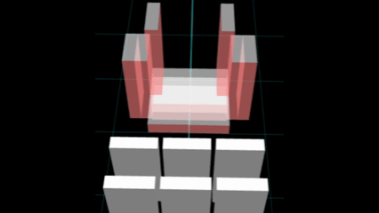  
    *トリック23*
  - 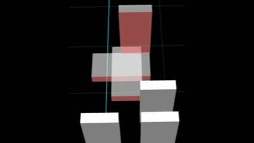  
    *トリック27*
  - 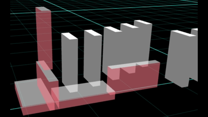  
    *トリック30（最後のブロックは倒れやすいようやや手前にずらす）*
  - 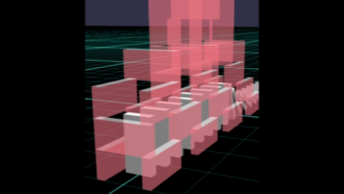  
    *トリック209*

- 交差
  - 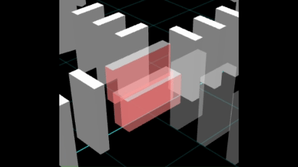  
    *トリック35*
  - 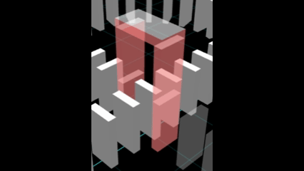  
    *トリック36*
  -   
    *トリック37*
  - 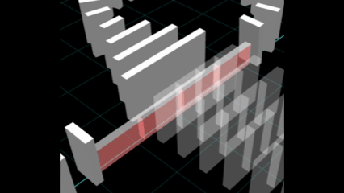  
    *トリック39*
  - 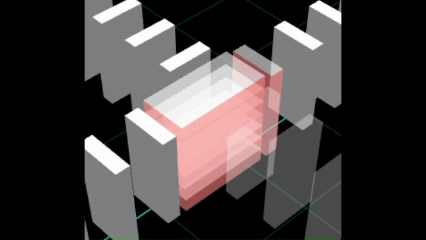  
    *トリック207*
  - 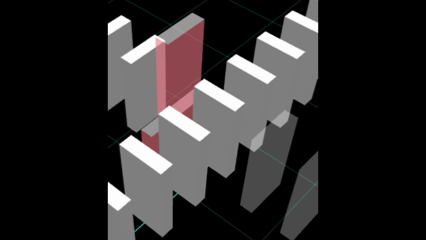  
    *トリック211*
  - 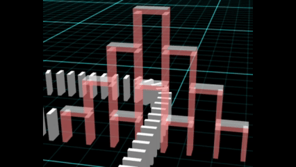  
    *トリック210*

- 分岐
  - 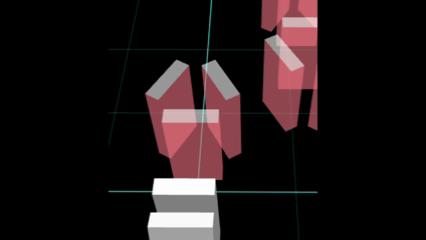  
    *トリック4*
  - 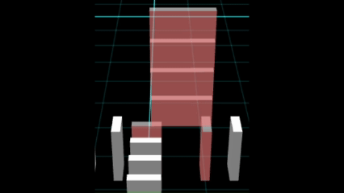  
    *トリック202*
  - 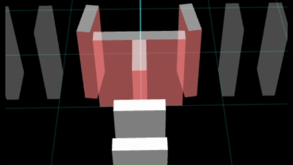  
    *トリック218（T字の両端に隣接するブロックはやや斜めに配置）*

- 塔・かべ・やま
  - 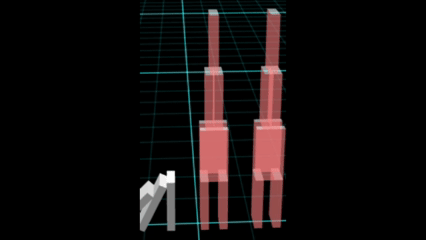  
    *トリック8*
  -   
    *トリック15*
  - 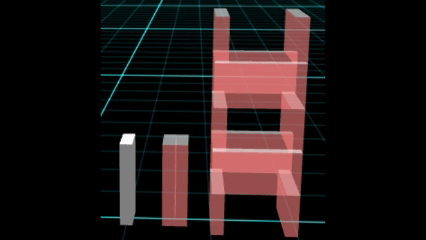  
    *トリック33（時間がたつと自壊します）*
  - 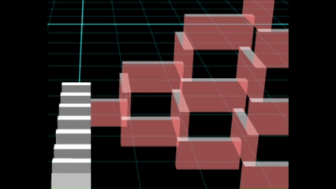  
    *トリック205（摩擦を高くしており倒れにくい）*
  - 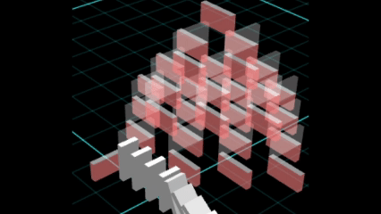  
    *トリック214（摩擦を高くしており倒れにくい）*
  - 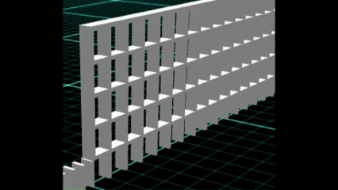  
    *トリック301*

## まとめ・雑感

ドミノ倒しの方向転換やドミノ列の交差のやり方を調べていたら色々な方法があることを知り、
お試しがてら再現デモを作ってみました。
動画と違って、違う角度から眺めたり、拡大縮小ができるのが利点ですね。

一応、紹介サイト風にまとめはしたものの、次につなげるための個人メモ的なものです。
少々雑な点は勘弁してください。

これらのトリックを使って、次回、ドミノ倒しでラインアートに挑戦です。

------------------------------

前の記事：[Babylon.js で物理演算(havok)：レンガでドミノ倒し](148.md)

次の記事：[Babylon.js で物理演算(havok)：ドミノ倒しで一筆書き](150.md)

目次：[目次](000.md)

この記事には次の関連記事があります。

- [Babylon.js で物理演算(havok)：レンガでドミノ倒し](148.md)
- [Babylon.js で物理演算(havok)：ドミノ倒しで一筆書き](150.md)
